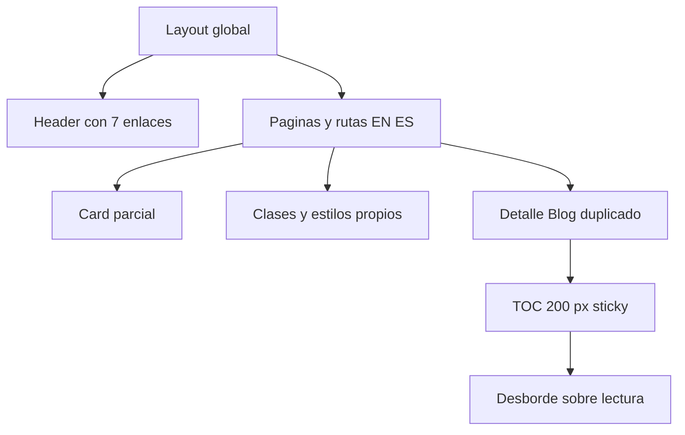
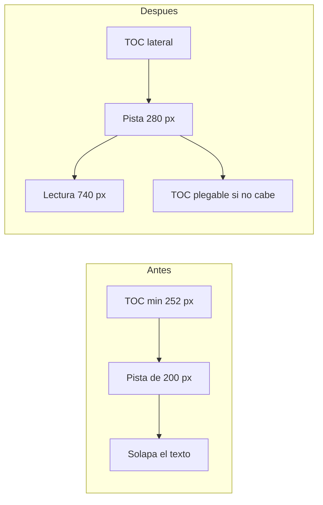

# specai — Auditoría arquitectónica del rediseño

> [!TIP]
> Ábrelo con la vista previa de Markdown para ver los diagramas Mermaid.

## Estado actual

La base técnica está preparada para un buen rediseño: Astro estático, Tailwind, contenido separado y componentes compartidos. El problema es de coherencia y localidad visual, no de falta de herramientas. El anterior rediseño creó algunas primitivas útiles, pero dejó demasiadas composiciones independientes y una geometría de artículo defectuosa.

## Fricciones prioritarias

### 1. Lectura editorial con una pista lateral insuficiente

- **Componentes:** `src/pages/blog/[...slug].astro`, `src/pages/es/blog/[...slug].astro`, `src/styles/global.css`.
- **Severidad:** Crítica.
- **Evidencia:** a 1280 px, `grid-template-columns` es `200px 760px`; la tarjeta del índice ocupa `252,18px` y se superpone `4,18px` con la columna de texto.
- **Antes:** la pista lateral representa una intención, pero no el ancho real de su contenido.
- **Después:** la geometría se declara desde el espacio disponible: contenedor amplio, lateral de 264–288 px, lectura de 720–760 px y cambio a TOC plegable antes de cualquier colisión.

### 2. Composición visual repartida y bilingüe duplicada

- **Componentes:** pares de rutas Blog y Apps en `src/pages/` y `src/pages/es/`.
- **Severidad:** Alta.
- **Problema:** la misma jerarquía visual se mantiene en dos archivos extensos; una corrección como el TOC requiere duplicar cada cambio.
- **Después:** rutas finas para datos y una composición compartida con `lang`, enlaces y datos localizados.

### 3. Primitiva de tarjeta incompleta

- **Componentes:** `Card.astro`, `BlogCard.astro`, `ProjectCard.astro`, `AppCard.astro`, `pages/projects.astro`, `pages/about-me.astro`.
- **Severidad:** Alta.
- **Problema:** `Card` existe, pero diferentes páginas siguen definiendo su propio radio, sombra, hover, gradiente y CTA.
- **Después:** superficie, media, metadatos y acción comparten contrato; las variantes solo resuelven el contenido.

### 4. Navegación sin estado tablet

- **Componentes:** `Header.astro`.
- **Severidad:** Alta.
- **Problema:** la navegación completa aparece desde 768 px; con logo, siete enlaces y acciones queda sin margen de diseño entre tablet y escritorio.
- **Después:** tres estados deliberados: móvil, tablet condensada y escritorio completo.

## Recomendación arquitectónica

No conviene añadir un framework visual, otra biblioteca de componentes ni más efectos. El plan debe sustituir el lenguaje actual por pocas primitives profundas y aplicarlas en oleadas, con la lectura del Blog como criterio de calidad obligatorio.

