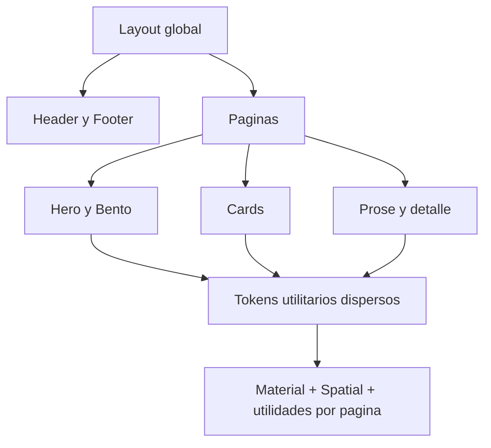
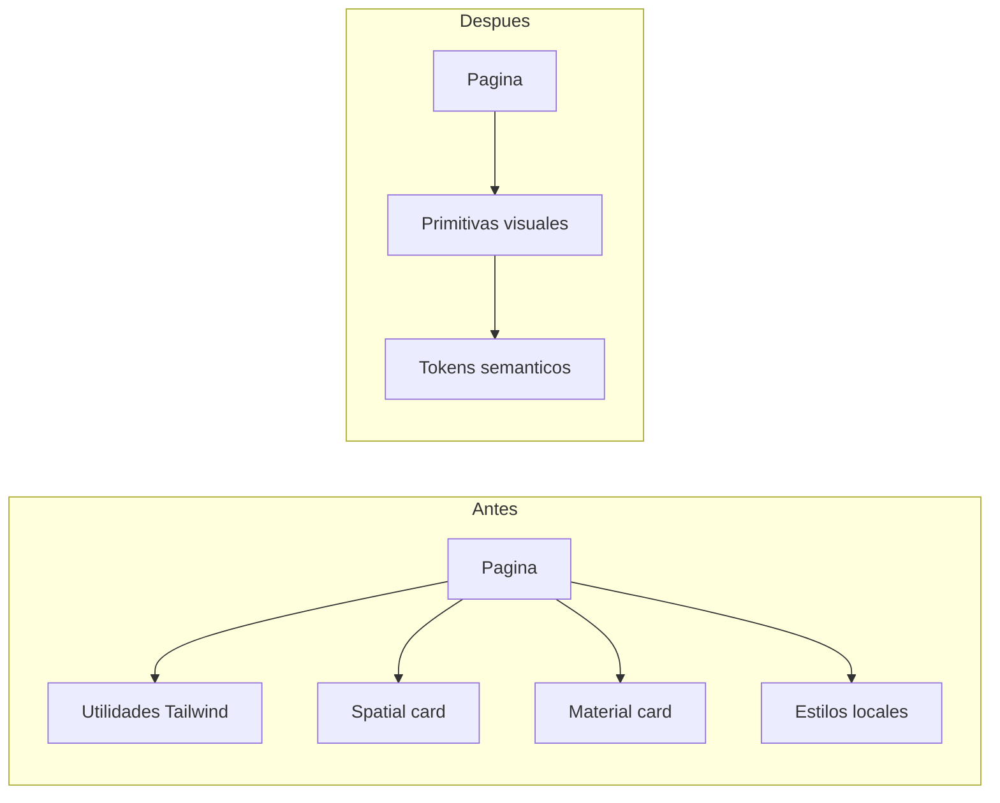
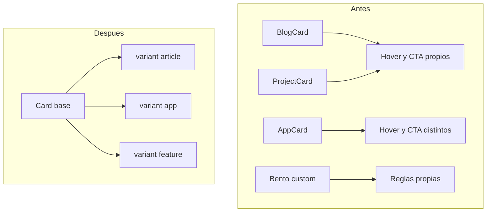
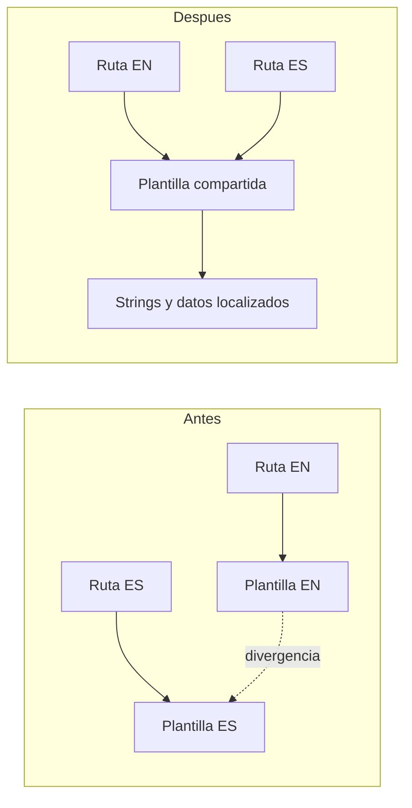
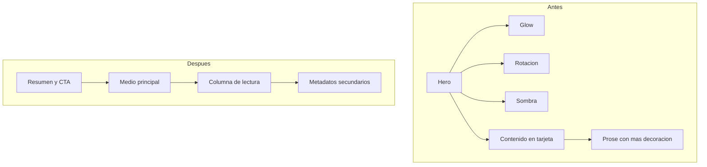
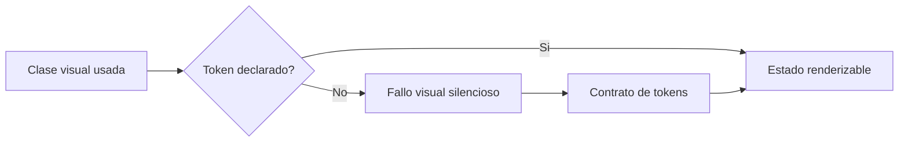

# specai — Reporte de arquitectura visual

> Generado el 2026-07-23. Este documento es una auditoría; no aplica cambios de código.

## Salud general

La web está organizada en Astro con layout global, componentes reutilizables y colecciones de contenido. La fricción principal está en la capa de presentación: la lógica de composición visual está repartida entre componentes, páginas duplicadas por idioma y utilidades CSS que se solapan.

## Fricciones y propuestas

### 1. Sistema visual solapado

- **Componentes:** `src/styles/global.css`, `src/components/Hero.astro`, `src/components/pages/HomePage.astro`, `src/components/BlogCard.astro`, `src/components/ProjectCard.astro`.
- **Severidad:** Alta.
- **Antes:** Material Design, `.material-card`, `.spatial-card`, gradientes, blur y utilidades específicas compiten como fuentes de verdad.
- **Después:** un pequeño sistema de tokens semánticos y tres variantes de superficie compartidas.

### 2. Tarjetas superficiales y divergentes

- **Componentes:** `BlogCard`, `ProjectCard`, `AppCard` y el Bento de `HomePage`.
- **Severidad:** Alta.
- **Problema:** la misma acción de “ver más” tiene varias estructuras y estados; cambiar radio, sombra o foco requiere editar varios lugares.
- **Propuesta:** una tarjeta base con variantes de contenido y un CTA común.

### 3. Falta de localidad entre idiomas

- **Componentes:** pares en `src/pages` y `src/pages/es`.
- **Severidad:** Media.
- **Problema:** las rutas inglesas y españolas duplican composición y pueden divergir en strings, metadatos y estilos.
- **Propuesta:** mantener rutas bilingües, pero delegar la composición a una única página parametrizada por idioma.

### 4. Detalles con demasiadas capas visuales

- **Componentes:** `src/pages/apps/[...slug].astro`, `src/pages/blog/[...slug].astro`, `src/styles/global.css`.
- **Severidad:** Media.
- **Problema:** hero, caja de contenido, sombras, inclinaciones, glows, galería y prose forman una secuencia pesada, especialmente en móvil.
- **Propuesta:** separar claramente la tarea de descubrimiento, lectura y conversión; cada pantalla debe tener una superficie dominante y un solo acento visual.

### 5. Estados y tokens rotos

- **Componentes:** `src/components/pages/HomePage.astro`, `src/layouts/Layout.astro`, `src/styles/global.css`.
- **Severidad:** Alta.
- **Problema:** `primary-dark` y `elevation-4` aparecen en clases de la UI, pero no están declarados ni aparecen en el CSS compilado.
- **Propuesta:** establecer tokens semánticos existentes como contrato y añadir una comprobación automatizada de clases de marca críticas.

## Recomendación arquitectónica

La mejora de mayor impacto no es añadir otra capa de componentes, sino reducir la cantidad de fuentes de verdad. El futuro plan debería crear primero tokens y primitivas pequeñas; después migrar portada, listados y detalles. La migración debe mantener el contenido y los slugs, y verificar cada idioma en escritorio, móvil, tema claro, tema oscuro, teclado y movimiento reducido.
