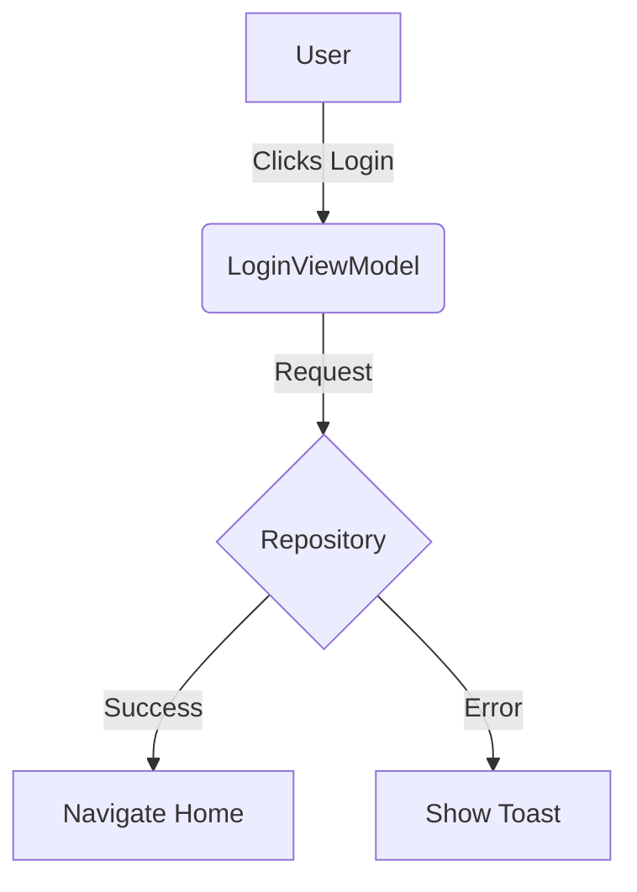

## 📝 Why Documentation Matters in Android

In the fast-paced world of Android development, documentation often takes a back seat. We prioritize shipping features over writing docs. However, as projects grow and teams scale, the lack of proper documentation becomes a bottleneck.

Documentation is not just about writing comments; it's about creating a knowledge base that empowers your team (and your future self) to understand the **why** and **how** behind the code.

## 📚 Types of Documentation

### 1. Code Documentation (KDoc)
This lives right in your code. It explains classes, functions, and parameters.
- **Tools**: KDoc (Kotlin's Javadoc equivalent).
- **Best Practice**: Document public APIs, complex logic, and edge cases. Don't document trivial getters/setters.

```kotlin
/**
 * Repository for managing user data.
 *
 * @param localDataSource Source for local database operations.
 * @param remoteDataSource Source for network API calls.
 */
class UserRepository(
    private val localDataSource: UserLocalDataSource,
    private val remoteDataSource: UserRemoteDataSource
) { ... }
```

### 2. Architecture Documentation (ADRs)
Architecture Decision Records (ADRs) capture significant architectural decisions.
- **Format**: Markdown files in the repo (e.g., `docs/adr/001-use-hilt.md`).
- **Content**: Status, Context, Decision, Consequences.

### 3. Project Documentation (README & Wiki)
The entry point for any developer.
- **README.md**: Setup instructions, architecture overview, contribution guidelines.
- **Wiki/MkDocs**: Detailed guides, onboarding, style guides.

## 🛠️ Tools of the Trade

### Dokka
The official documentation engine for Kotlin. It generates static sites (HTML) from your KDoc comments.
- **Integration**: Gradle plugin.
- **Output**: Beautiful, searchable API reference.

### MkDocs & Material for MkDocs
For creating project websites. It takes Markdown files and builds a static site.
- **Theme**: Material for MkDocs is the gold standard.
- **Features**: Search, dark mode, versioning.

### Mermaid.js
For diagrams as code. Embed flowcharts, sequence diagrams, and class diagrams directly in your Markdown.



## 🚀 Automating Documentation with GitHub Actions

Manual documentation gets outdated. Automate it!

### Workflow: Build & Deploy Docs
Create a GitHub Action that runs on every push to `main`:
1.  **Build Code Docs**: Run `./gradlew dokkaHtml`.
2.  **Build Project Docs**: Run `mkdocs build`.
3.  **Deploy**: Push the generated static files to `gh-pages` branch.

```yaml
name: Deploy Docs
on:
  push:
    branches: [ main ]
jobs:
  deploy:
    runs-on: ubuntu-latest
    steps:
      - uses: actions/checkout@v3
      - name: Set up JDK 17
        uses: actions/setup-java@v3
        with:
          java-version: '17'
          distribution: 'temurin'
      - name: Build Dokka
        run: ./gradlew dokkaHtml
      - name: Deploy to GitHub Pages
        uses: peaceiris/actions-gh-pages@v3
        with:
          github_token: ${{ secrets.GITHUB_TOKEN }}
          publish_dir: ./build/dokka/html
```

## 🧠 Conclusion

Good documentation is a superpower. It reduces onboarding time, prevents knowledge silos, and improves code quality. Start small: add meaningful KDoc, write a solid README, and automate the rest. Your team will thank you.
