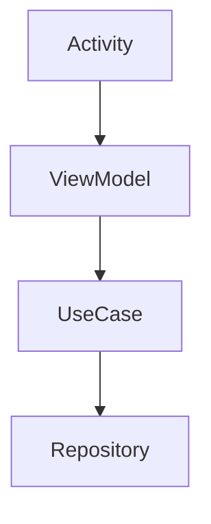

Documentation is the most neglected part of software development, yet it's the one thing that separates a maintainable project from legacy spaghetti code. In the Android ecosystem, we often stop at Javadoc/KDoc, but that's just the tip of the iceberg.

## 📜 KDoc: The Foundation

Every public class, function, and property should have KDoc. Not just "what" it does, but "why" and "how".

```kotlin
/**
 * Calculates the total price of the cart.
 *
 * @param items List of products in the cart.
 * @return Total price including tax.
 * @throws IllegalArgumentException if the cart is empty.
 */
fun calculateTotal(items: List<Product>): BigDecimal
```

This is good for IDE support, but it's not enough for architecture overview.

## 📚 Dokka: Generating API References

**Dokka** is the documentation engine for Kotlin, performing the same function as Javadoc for Java. It generates HTML pages from your KDoc comments.

To set it up in your `build.gradle.kts`:

```kotlin
plugins {
    id("org.jetbrains.dokka") version "1.9.20"
}

tasks.dokkaHtml {
    outputDirectory.set(buildDir.resolve("dokka"))
}
```

Running `./gradlew dokkaHtml` gives you a browsable site of your entire API surface.

## 📖 MkDocs: The "Human" Documentation

API references are great for looking up specific methods, but they don't explain **concepts**. For guides, tutorials, and architecture diagrams, you need a static site generator.

**MkDocs** (specifically with the `Material for MkDocs` theme) is the gold standard. It allows you to write Markdown files and turn them into a beautiful website.

### Structure
```
docs/
  architecture/
    mvvm.md
    clean-architecture.md
  guides/
    setup.md
    coding-standards.md
mkdocs.yml
```

### Integration with Code
You can even embed code snippets directly from your source files using plugins like `pymdownx.snippets`, ensuring your examples never go out of date.

## 🚀 Diagrams as Code (Mermaid)

Stop using Visio or Lucidchart for architecture diagrams that rot in Confluence. Use **Mermaid.js** inside your Markdown.



This renders a flowchart directly in your documentation site. If the architecture changes, you update the text file, not a PNG.

## 🏁 Conclusion

Good documentation is a force multiplier. By combining KDoc for API reference (generated by Dokka) and Markdown for conceptual guides (rendered by MkDocs), you create a **Knowledge Base** that lives with your code and evolves with it.
