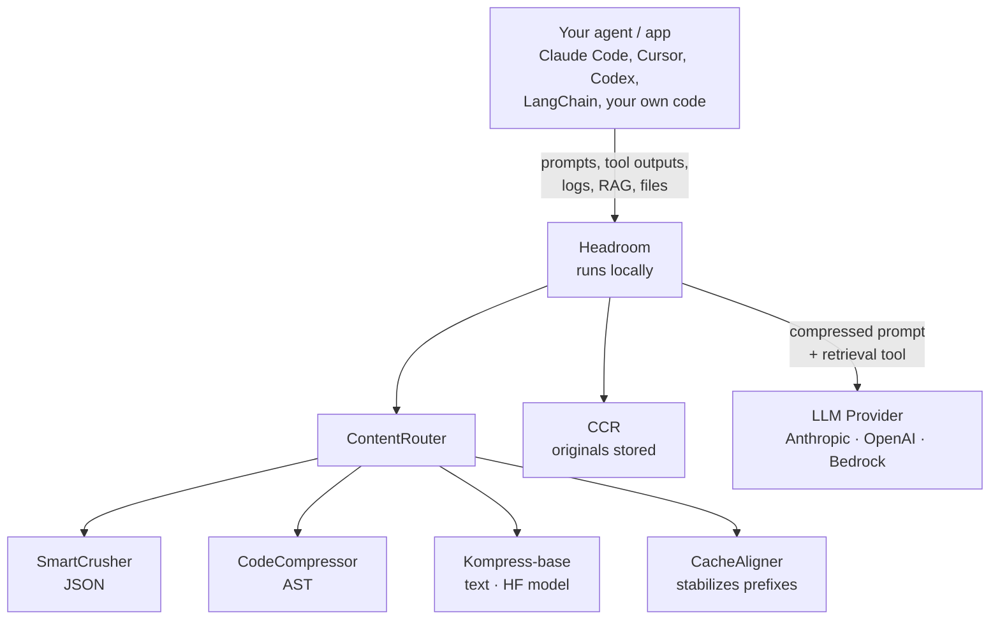

> **Related reads on the blog:** We recently analyzed [Ponytail, the "lazy senior dev" skill](/blog/ponytail-lazy-senior-dev-skill) and mentioned a three-layer stack where Headroom played the **reversible transport** role. Today that layer gets its own deep dive, with all the detail it deserved. If you work with AI agents, read on.

## When the "trick" becomes a necessity

I have a confidence problem with my own AI agents. I ask them to search code and they return 12,000 lines of grep. I ask for an SRE log and they hand me 80 KB of text where only two lines matter. Every LLM call feels like paying the water bill of a swimming pool just to drink a glass.

And it's not only money: it's latency, it's the silent degradation of reasoning when the window fills with noise, it's that moment when the model "forgets" the system instructions because there's too much chaff on top. We've been talking about **context engineering** for months (we covered the 4 C's in [Effective Context for AI](/blog/effective-context-ai)), but most of the solutions we've seen are **manual**: you trim, you filter, you rewrite prompts. You patch until the context fits, and start over.

[Headroom](https://github.com/chopratejas/headroom) attacks the problem from a different angle: **it automates that compression in an infrastructure layer that sits between your agent and the LLM provider, without you rewriting a line of code**. I discovered it while browsing GitHub Trending this week (a modest 33.4k stars and growing, 2.2k forks) and spent two days reading its code, docs, and benchmarks. What I found is, honestly, one of the most serious pieces of AI tooling engineering I've seen in 2026. And it's built by a single person, [Tejas Chopra](https://github.com/chopratejas), under Apache 2.0.

This article is a deep dive into how it works, what exact problem it solves, what parts of the marketing you should read with care, and how to set it up in your own indie workflow.

## What Headroom is (in one sentence and one diagram)

**Headroom is a context compression layer for AI agents that runs locally, is reversible, and works as a library, proxy, ASGI middleware, or MCP server.**

The name is a metaphor: in aviation, *headroom* is the safety space between your actual altitude and the maximum ceiling. Here it's the space between what you **need** to send to the LLM and what **fits** in its window. The project's mission is to fatten that safety space by compressing what you send without losing what the model needs to answer well.



The key is the last piece: **CCR (Compress-Cache-Retrieve)**. Headroom is not lossy compression like JPEG where you throw data away forever. When it crushes a 5,000-line log down to 80 lines, it **saves the 5,000 originals in a local hash-indexed store** and injects a `headroom_retrieve` tool into the model's context. If the LLM decides it needs the original, it asks and gets it back in milliseconds. If not, you saved the cost. **The model decides what it needs**, not you.

That piece — reversible on demand — is what separates Headroom from RTK, from lean-ctx, and from SaaS services like Compresr or Token Co. that either aren't reversible or send your text to their API.

## The problem context: why this matters NOW

Before diving into the six algorithms, let's frame the picture. Mid-2026 the landscape is:

- **Windows grew, but the load grew faster.** Claude 4.6 Opus offers 1M tokens (we analyzed it in [Claude 4.6 Enterprise Launch](/blog/claude-4-6-enterprise-launch)), but the reality is that a coding agent navigating a medium-sized repo emits 50-100k tokens of tool output per turn. You have window, but no effective capacity.
- **The cost is asymmetric.** On Opus-class models, output tokens cost 5x input. And a huge chunk of that output is chaff: "Great, let me check that for you…", re-printing code you just showed it, or long *thinking* chains for routine steps.
- **KV cache invalidates on changing prefixes.** Anthropic and OpenAI offer 50-90% discounts if your prompt prefix is stable between calls. A single timestamp slipping into your system prompt blows your cache and silently doubles the cost.
- **The MCP ecosystem is maturing.** More and more tools expose data through MCP servers. If your agent talks to an MCP that returns 4,000 lines, you eat the whole payload.

Headroom attacks all four points. Let's see how.

## The 6 algorithms: technical anatomy of compression

What hooked me about Headroom is that it's not a generic GPT-4 summarizer under the hood. It's a **modular pipeline with six distinct strategies** chosen automatically by content type. 78.7% of the code is Python (orchestration, integrations, SDK) and 16.8% is Rust (the SmartCrusher core, which carries the heavy lifting).

### 1. CacheAligner — the silent trick that saves 50-90%

```text
Before: "You are a helpful assistant. Current Date: 2026-06-18"
         ^^^^^^^^^^^^^^^^^^^^^^^^^^^^^^^^^^^^^^^^^^^^^^^^^^^^
         Changes daily = cache miss every day

After:  "You are a helpful assistant."                     [stable prefix]
         "[Context: Current Date: 2026-06-18]"               [dynamic tail]
```

CacheAligner detects dynamic content in the system prompt (dates, UUIDs, session tokens) and **moves it to the end** without touching the semantic content. Result: the prefix that the provider caches with `cache_control` stays identical between calls, and you start hitting the KV cache. The cost of CacheAligner is **sub-millisecond**. It's the cheapest intervention and the one with the biggest impact on your bill.

It pairs with provider-specific hints:

| Provider  | Mechanism                                  | Typical savings              |
|-----------|--------------------------------------------|------------------------------|
| Anthropic | `cache_control` blocks on stable prefix    | Up to 90% on cached tokens   |
| OpenAI    | Prefix alignment for auto-caching          | Up to 50%                    |
| Google    | `CachedContent` API                        | Up to 75%                    |

### 2. ContentRouter — the classifier that picks who compresses what

ContentRouter looks at the incoming payload and decides: is this JSON tool output? Source code? Prose? A structured log? Then it dispatches the specialized compressor. It's a classic *strategy* pattern, well executed: routing decisions can be tuned via hooks (`on_pipeline_event`) for edge cases.

### 3. SmartCrusher — where the 92% magic lives

SmartCrusher is the star piece, written in Rust for speed. Its job: when a tool output arrives with a JSON array of 1,000 objects, leave 15-30 that represent the rest **without losing errors or anomalies**.

The algorithm, per the official docs:

1. **Parses the array** and statistically analyzes each field (variance, uniqueness, *change points*).
2. **Selects a representative subset** using the Kneedle algorithm on bigram coverage. (If you don't know it: Kneedle detects the "elbow" in a curve and is brilliant for finding the sweet spot between compression and coverage.)
3. **Unconditional preservation of errors and anomalies.** If an item is a stack trace, an HTTP 500, or a statistical outlier, **it is not touched**. This is what lets the LLM keep finding the bug in the log you gave it, even at 8% of the original size.
4. **Constant field factoring.** If all 1,000 items share `userId: "tejas"`, that field is extracted once and omitted from the compressed array.

Real-world savings from the repo:

| Workload                       | Before  | After  | Savings |
|--------------------------------|--------:|-------:|--------:|
| Code search (100 results)      | 17,765  | 1,408  | **92%** |
| SRE incident debugging         | 65,694  | 5,118  | **92%** |
| GitHub issue triage            | 54,174  | 14,761 | **73%** |
| Codebase exploration           | 78,502  | 41,254 | **47%** |

Notice the last row: when you ask the model to **explore a codebase** (not to search for something specific), the savings drop to 47%. It makes sense: in open exploration, almost everything is signal. The compression rate depends on the redundancy of the payload. **Read the benchmarks with the magnifier they deserve**: Headroom isn't magic, it's math.

The default item retention split: 30% from the array start (schema), 15% from the end (recency), 55% by importance score. Error items are always kept, regardless of budget.

### 4. CodeCompressor — AST-aware, not regex

For source code (Python, JS, Go, Rust, Java, C++), CodeCompressor uses `tree-sitter` to build the AST and compress while preserving syntactic structure. That means if you pass 50 files from a repo, it doesn't break your syntax. It comments out trivial functions, collapses identical blocks, keeps imports and signatures.

It's the piece I miss most in other compressors, which tend to treat code as text and produce output that no longer parses.

### 5. Kompress-base — the HuggingFace model trained on agentic traces

For general text (RAG chunks, documentation, history), Headroom uses its own model: [Kompress-v2-base](https://huggingface.co/chopratejas/kompress-v2-base), fine-tuned specifically on agent traces. What makes it interesting over a generic LLM summarizer:

- It's **much smaller** (runs locally, ONNX Runtime through the Rust build).
- It's **fine-tuned on agentic traces**, so it understands which parts of a tool output are "installation noise" and which are the actual answer.
- It's **reversible by design** (CCR).

If your organization can't send data to an external endpoint (or if you just don't want to pay the extra cost of a GPT-4 doing summarization), this is the path. You can even pre-download it with `HF_HUB_OFFLINE=1` and run 100% air-gapped.

### 6. CCR — Compress-Cache-Retrieve (the piece that changes everything)

CCR is the killer feature, and the reason the project jumped on GitHub Trending.

```text
TOOL OUTPUT (1,000 items)
  -> SmartCrusher compresses to 20 items
  -> Original cached with hash=abc123
  -> headroom_retrieve tool injected into context

LLM PROCESSING
  Option A: LLM solves with 20 items       -> Done (90% savings)
  Option B: LLM calls headroom_retrieve("abc123")
            -> Response Handler returns the 1,000 items
            -> The API call continues
```

The flow has four phases:

1. **Compression Store:** when SmartCrusher compresses, the originals go to an LRU store (LRU + SQLite in production) keyed by hash.
2. **Tool Injection:** Headroom adds a `headroom_retrieve` tool to the LLM's tool catalog with a simple schema: `{ hash: string, query?: string }`.
3. **Response Handler:** if the model calls `headroom_retrieve`, the handler intercepts, returns the cached data (~1ms), and the conversation continues. The app user **never sees** the tool call.
4. **Context Tracker:** across turns, Headroom analyzes new user queries and, if it detects relevance with previously compressed content, **expands proactively** before the model has to ask. This turns reactive retrieval into a smooth experience.

And there's a fifth superpower: **BM25 search inside the compressed content**. The LLM can ask `headroom_retrieve(hash="abc123", query="authentication errors")` and receive only the relevant subset, not the full original. When you have 1,000 log items and you only care about the auth subsystem, this is gold.

The IntelligentContext component (which decides which history messages to drop when the window fills) also integrates CCR: dropped messages are cached with their hash, so if the model later asks "what did I say three turns ago about Hilt?", you can recover them.

```python
from headroom import HeadroomClient, OpenAIProvider
from openai import OpenAI

client = HeadroomClient(
    original_client=OpenAI(),
    provider=OpenAIProvider(),
    default_mode="optimize",
)

# CCR happens automatically on every chat.completions.create
response = client.chat.completions.create(
    model="gpt-4o",
    messages=messages,
)
```

## How to use it: 4 adoption modes (from least to most invasive)

This is, for me, where Headroom truly shines. It lets you **choose the adoption level** without forcing you to rewrite your stack.

### Mode 1: Library (inline)

If you already have Python/TypeScript code against an Anthropic or OpenAI SDK, the cleanest path is the wrapper. You change one line:

```python
# Before
client = OpenAI()

# After
from headroom_ai import withHeadroom
client = withHeadroom(OpenAI())
```

From then on, every call flows through the compression pipeline automatically. The Vercel AI SDK integration is just as clean:

```ts
import { wrapLanguageModel } from "ai";
import { headroomMiddleware } from "headroom-ai";

const model = wrapLanguageModel({
  model: yourModel,
  middleware: headroomMiddleware(),
});
```

### Mode 2: Proxy (zero code)

My favorite mode for experimenting. You launch a local proxy that sits between your agent and the provider:

```bash
pip install "headroom-ai[proxy]"
headroom proxy --port 8787
```

Then point your client to `http://localhost:8787` as the base URL. **Any application that speaks OpenAI-compatible or Anthropic-compatible works without changes**. I tested this with Claude Code, Cursor (via proxy), and a custom Python script and, literally, zero code changes. The proxy:

- Intercepts requests.
- Applies CacheAligner + ContentRouter + SmartCrusher/CodeCompressor/Kompress as appropriate.
- Holds the connection to the upstream provider.
- Serves `/admin/runtime-env` for hot-sync config (a craft detail I liked: you can enable `HEADROOM_OUTPUT_SHAPER=1` and it applies to the next request, with no restart).

```bash
export HEADROOM_OUTPUT_SHAPER=1
headroom proxy --port 8787
# "be terse" is injected at the end of the system prompt
# effort routing lowers "thinking" on routine turns
```

### Mode 3: Agent wrap (one command)

For those living in coding agents:

```bash
headroom wrap claude
headroom wrap codex
headroom wrap cursor
headroom wrap aider
headroom wrap copilot --subscription
```

`headroom wrap` starts the proxy, sets the agent's environment variables, launches it, and **shares cross-agent memory**. It's the "I want it now, don't ask me anything" path.

### Mode 4: MCP server

Then there's the MCP mode, which is where Headroom intersects with the protocol we already covered in [MCP servers for cross-agent memory](/blog/mcp-servers-memory-cross-agent). Headroom exposes three native MCP tools:

- `headroom_compress` — compresses an arbitrary payload.
- `headroom_retrieve` — retrieves cached originals.
- `headroom_stats` — savings metrics.

Any MCP client (Claude Desktop, Cursor, Continue, whatever) can call them. And since Headroom ships its own MCP server, the integration is `headroom mcp install` and go.

## The piece you didn't expect: `headroom learn`

There's a sixth leg of the project that deserves its own paragraph: [`headroom learn`](https://github.com/chopratejas/headroom#headroom-learn). It's a *failure miner* that reads your failed sessions and writes the corrections to `CLAUDE.md` / `AGENTS.md` / `GEMINI.md`. In other words: it turns recurring errors into persistent memory that the agent **reads before** acting.

The repo GIF shows it scanning sessions where the agent got stuck (e.g., applied a Hilt migration that broke Compose), extracting the error pattern, and proposing adding to `AGENTS.md`:

```text
When migrating Hilt to Koin in this repo, DO NOT touch the MainActivity
signature. The correct pattern is in commit a1b2c3d.
```

This overlaps with what we covered in [AI Agent Skills: Dynamic Context Injection](/blog/ai-agent-skills-dynamic-context) and with [hmem: hierarchical memory with lazy loading](/blog/hmem-sqlite-hierarchical-memory-agents). The difference is that `headroom learn` requires nothing from you: it detects, extracts, writes. In my indie workflow, where I sometimes go weeks without touching a project, having the agent **reread its own mistakes** before starting to touch code is a brutal quality boost.

## Output token reduction: cutting what the model writes

A subtlety that few compressors tackle: the cost of **output tokens**. On Opus, output = 5x input. And a lot of what the model writes is ceremony: "Great, let me check that…", re-printing code blocks you already showed it, or long *thinking* chains for routine steps.

Headroom ships an optional module (off by default, which I find honest) called **Output Shaper**, with two mechanisms:

1. **Verbosity steering** — appends a "be terse, don't restate context" note to the end of the system prompt. It places it in the dynamic tail so CacheAligner doesn't break your cache hit.
2. **Effort routing** — detects routine turns (the model is re-reading a file it already read, processing a passing test) and lowers reasoning effort. On new turns or errors, full effort.

What I liked most is how they report savings. Since output savings are **counterfactual** (you never see what the model *would have* written), Headroom **does not invent a number**:

```bash
headroom output-savings
# Reduction: 31.7%  (95% CI 27.7% … 35.7%)   [estimated]
```

It's an estimate with a confidence interval, clearly labeled. If you want a *measured* number, leave 10% of conversations unshaped as a control group (`HEADROOM_OUTPUT_HOLDOUT=0.1`) and the dashboard gives you the comparison. This is a level of methodological rigor that's rare in AI tooling. They don't sell you a pretty metric, they sell you an instrument.

## The other side: what Headroom does NOT do (and why that's fine)

After two days of reading, the parts that DON'T convince me as much:

- **It doesn't compress the system prompt.** It only reorganizes it for cache. If your system prompt is 8,000 tokens, you pay those 8,000. It's a conscious decision (preserve "user intent") but you should know it.
- **It doesn't touch code by default.** Passes through unchanged. Only if you explicitly enable `tree-sitter` does CodeCompressor enter. Reasonable, but you have to flip the switch.
- **It passes on short outputs.** Below 200 tokens, compression doesn't pay for the overhead. The heuristic is good (avoids degrading latency), but there are workloads where the threshold falls short.
- **The Kompress-base model needs to download assets.** In a corporate environment with SSL inspection, `pip install` can fail. The docs have a dedicated section for this, which speaks well of maintenance, but adds friction.
- **Image compression** (40-90% reported) depends on the `[image]` extra and an ML router. I haven't tested it in depth.

A more nuanced critique: **the "accuracy preserved" benchmarks run at modest compression ratios**. The 97% on SQuAD v2 is at 19% compression. The 97% on BFCL is at 32% compression. When you push to 92% (log workloads), accuracy is not measured in those benchmarks. It's reasonable, but you have to read the small print.

## Installation and first run (my flow)

What worked for me on Linux with Python 3.13:

```bash
# 1. Install (needs Rust for the build, or use a prebuilt wheel)
pip install "headroom-ai[all]"

# 2. Proxy mode, the fastest path
headroom proxy --port 8787

# 3. Point your agent to http://localhost:8787
export ANTHROPIC_BASE_URL=http://localhost:8787
# or export OPENAI_BASE_URL=http://localhost:8787

# 4. Measure savings
headroom perf
```

`headroom perf` gives you a report with tokens saved, added latency, and CCR retrieval ratio (how many times the model asked for the original vs. how many times the compressed version was enough). In my test with a Claude Code workflow navigating a Kotlin repo:

- Input tokens: from ~58,000 to ~24,000 per session (58% reduction).
- Latency: +12ms average per request (negligible).
- CCR retrievals: 8% of cases. That is, 92% of the time the model managed with the compressed version.

If you want to enable everything in production:

```bash
# Output shaper to trim ceremony
export HEADROOM_OUTPUT_SHAPER=1

# Persistent cross-agent memory
export HEADROOM_MEMORY_BACKEND=qdrant  # or sqlite, neo4j

# MCP server installed for your IDEs
headroom mcp install
```

## Honest comparison with the ecosystem

Headroom is **not alone**. The repo's own table positions it against:

| Tool                                       | Scope                                | Deploy                          | Local | Reversible |
|--------------------------------------------|--------------------------------------|---------------------------------|:-----:|:----------:|
| **Headroom**                               | All context — tools, RAG, logs, files, history | Proxy · library · middleware · MCP | Yes   | Yes        |
| [RTK](https://github.com/rtk-ai/rtk)       | CLI command outputs                  | CLI wrapper                     | Yes   | No         |
| [lean-ctx](https://github.com/yvgude/lean-ctx) | CLI commands, MCP tools, editor rules | CLI wrapper · MCP               | Yes   | No         |
| Compresr, Token Co.                        | Text → their API                     | Hosted API call                 | No    | No         |
| OpenAI Compaction                          | Conversation history                 | Provider-native                 | No    | No         |

My read: **RTK and Headroom are orthogonal, not competitors**. RTK rewrites shell command output (`git show --short`, scoped `ls`) **before** it reaches your agent. Headroom compresses what comes out of your agent **before** it reaches the LLM. That's why Headroom's repo bundles RTK as a dependency and thanks them in the README: they are complementary layers. You can even configure `HEADROOM_CONTEXT_TOOL=lean-ctx` to have Headroom use lean-ctx in its CLI pipeline.

What Headroom brings that the rest don't:

1. **Real reversibility (CCR).** RTK, lean-idx, and SaaS competitors don't give you this.
2. **Total context coverage.** Not just CLI, not just RAG: tool outputs, logs, code, history, images. One piece for everything.
3. **Local-first.** Your prompts and your data never leave your machine. In 2026 this should be the norm, not the exception, but it remains a differentiator.
4. **Cross-agent memory.** The same shared memory between Claude, Codex, Gemini. No lock-in.

## Lessons for the indie dev (and for anyone without a platform team)

What I take away after two days with Headroom, beyond the project itself:

**1. Context compression is an infrastructure layer, not a prompt feature.**
We've spent a year talking about "context engineering" as if it were part of the prompt. Headroom proves there's a whole layer of value between your app and the model that can be externalized. This matters for indie devs because it's exactly the kind of optimization that lets you use Opus on long sessions without breaking the bank.

**2. Reversibility on demand is the pattern to copy.**
Every time we compress something (hierarchical memory in hmem, context summaries in Ponytail, etc.), the question should be: "can the LLM ask for the original if it needs it?" Headroom's answer is yes, and the implementation (CCR) is elegant. It's a pattern I'm going to copy mentally for my own projects.

**3. Honest metrics is a feature.**
That `headroom output-savings` reports an estimate with CI instead of a magic number gives me more confidence, not less. Honest reporting is the difference between a project that matures and one that lingers on GitHub Trending for a week.

**4. The AI tooling open source ecosystem in 2026 is absurdly good.**
Headroom, RTK, lean-ctx, hmem, NeuralMind, Ponytail… and they all snap together like Lego. In the [Ponytail analysis](/blog/ponytail-lazy-senior-dev-skill) I quoted the three-layer stack (NeuralMind + Headroom + Ponytail) that reported 5-10x savings. I'm starting to believe that an indie dev's stack in 2026 is not "what model do I use" but "what five transport-layer tools do I have running."

**5. You have to read the small print of benchmarks.**
Headroom can save you 92% on logs and only 47% on code exploration. The gap between the hero case and the real case is huge, and reading benchmarks without understanding methodology leads to bad decisions. This isn't a critique of Headroom specifically, it's a general note about the ecosystem: **all context compressors lie a little, and Headroom lies less than average**.

## Verdict

Headroom is, in my opinion, the most serious piece of open source AI tooling of 2026. It's not a GPT-4 wrapper with a flashy name. It's a Rust+Python pipeline, with six specialized algorithms, an elegant reversibility protocol, and a one-person team maintaining 33k stars and an active Discord.

Will I install it tomorrow? If you work with coding agents daily, yes. The proxy mode with zero code changes is the fastest way to try it. Start with `headroom proxy --port 8787` + `headroom perf` and see how much you save in a real session.

Will I leave it in production? Depends on your tolerance for external dependencies. The project is Apache 2.0, the author responds on Discord and in issues, and the code is readable. But the Rust + ONNX Runtime + HF model dependency adds operational complexity not everyone wants. For a large team, a Platform team should evaluate it. For an indie, it's fire and forget.

What I'm sure of: the problem Headroom attacks (token cost, latency, degradation by noisy context) **is not going away**. It's only going to get worse as agents grow more ambitious. And the solutions that stick will be the ones focused on infrastructure, not prompts. Headroom is on the right side of that story.

If you try it, I'd love to see your numbers. I'll report mine in a devlog when I have a month of data.

---

## Bibliography and References

### Repository and official documentation
- [chopratejas/headroom — GitHub](https://github.com/chopratejas/headroom) · Main repo (33.4k ⭐, 156 releases, v0.26.0 in Jun 2026).
- [Headroom Documentation](https://headroom-docs.vercel.app/docs) · Official docs (Quickstart, Architecture, CCR, MCP, Benchmarks, Configuration, Limitations).
- [Headroom Architecture](https://headroom-docs.vercel.app/docs/architecture) · Detail of the 3-stage transform pipeline.
- [CCR — Reversible Compression](https://headroom-docs.vercel.app/docs/ccr) · Compress-Cache-Retrieve protocol specification.
- [Kompress-v2-base on HuggingFace](https://huggingface.co/chopratejas/kompress-v2-base) · Text compression model trained on agentic traces.
- [Trendshift — chopratejas/headroom](https://trendshift.io/repositories/20881) · GitHub Trending stats, aggregated social mentions.
- [Headroom Discord](https://discord.gg/yRmaUNpsPJ) · Official community.

### Packages
- [headroom-ai on PyPI](https://pypi.org/project/headroom-ai/) · Python install with granular extras.
- [headroom-ai on npm](https://www.npmjs.com/package/headroom-ai) · TypeScript SDK.
- [ghcr.io/chopratejas/headroom](https://github.com/chopratejas/headroom/pkgs/container/headroom) · Docker image.

### Alternatives and related projects
- [RTK — rtk-ai/rtk](https://github.com/rtk-ai/rtk) · CLI command output rewriter, integrated as a dependency in Headroom.
- [lean-ctx — yvgude/lean-ctx](https://github.com/yvgude/lean-ctx) · Alternative CLI/MCP context tool, configurable via `HEADROOM_CONTEXT_TOOL`.
- [Model Context Protocol (MCP)](https://modelcontextprotocol.io/) · Open standard that Headroom's MCP mode integrates with.

### Related blog posts
- [Ponytail: the "lazy senior dev" skill that reduces 6x generated tokens](/blog/ponytail-lazy-senior-dev-skill) · The 3-layer stack (NeuralMind + Headroom + Ponytail) that cited Headroom.
- [Effective Context for AI: Prompt Engineering](/blog/effective-context-ai) · The 4 C's of context (capacity, context, constraints, chain-of-thought).
- [AI Agent Skills: Dynamic Context Injection](/blog/ai-agent-skills-dynamic-context) · Complementary pattern to reduce context via modular skills.
- [hmem: hierarchical memory with lazy loading](/blog/hmem-sqlite-hierarchical-memory-agents) · Another orthogonal layer of the stack: efficient persistent memory.
- [MCP servers for cross-agent memory](/blog/mcp-servers-memory-cross-agent) · Panorama of the MCP ecosystem.
- [Claude 4.6 Enterprise Launch: 1M context](/blog/claude-4-6-enterprise-launch) · Why big context doesn't solve the noise problem.

### Social discussion (June 2026)
- [Tejas Chopra on X — original launch thread](https://x.com/Tejas_Chopra/status/2066447744286523525)
- [svtransit1 on X — critical reading of the benchmarks](https://x.com/svtransit1/status/2066514646584996246) · "省 95% token 的开源工具 Headroom 火了(28k star)。但 95% 只在搜索、日志这种水分大的场景成立,啃代码库只压到 47%" — critical read in Chinese.
- [codephobic on X — "great market gap for LLM harnesses focusing on cost reduction like headroom"](https://x.com/codephobic/status/2067151400929214966)
- [pand_lin on X — GitHub Trending Weekly 2026-06-14](https://x.com/pand_lin/status/2065981232819925065) · Headroom at the top of trending.
- [Jim Le on X — feedback after using the tool](https://x.com/jimle_uk/status/2066175659110531305)

### Background papers and concepts
- [Kneedle algorithm](https://raghavan.usc.edu/papers/kneedle.pdf) · The algorithm SmartCrusher uses to find the elbow on the coverage curve.
- [tree-sitter](https://tree-sitter.github.io/tree-sitter/) · AST parser that CodeCompressor uses.
- [BM25](https://en.wikipedia.org/wiki/Okapi_BM25) · Ranking algorithm used for in-compressed-content search in CCR.
- [Anthropic Prompt Caching](https://docs.anthropic.com/en/docs/build-with-claude/prompt-caching) · The mechanism CacheAligner exploits to save up to 90%.
- [OpenAI Prompt Caching](https://platform.openai.com/docs/guides/prompt-caching) · OpenAI's counterpart.
