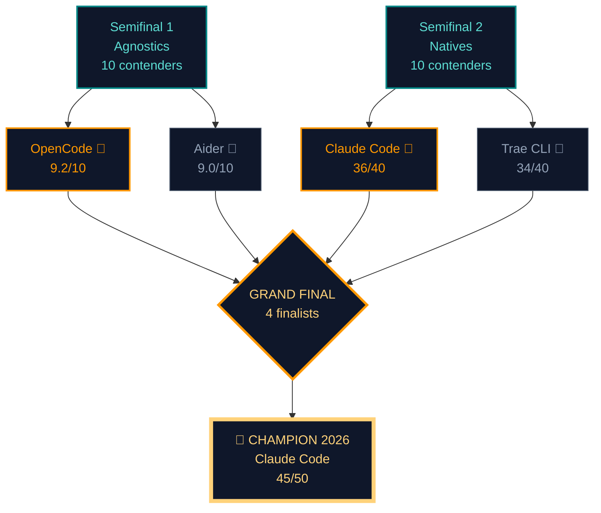

> **Reading notice**: this is the third and final installment of the AI CLI 2026 Tournament series. If you missed the previous ones, here are the direct links to get you up to speed before reading this verdict:
>
> - **[Semifinal 1 — the agnostic block](/blog/cli-ai-semifinal-1/)**: the 10 BYOK contenders, with OpenCode (9.2/10) and Aider (9.0/10) advancing to this final.
> - **[Semifinal 2 — the native block](/blog/cli-ai-semifinal-2/)**: the 10 vendor-locked contenders, with Claude Code (36/40) and Trae CLI (34/40) advancing.
>
> And if you want to understand the "why" behind agnosticism, harnesses, and model choice, I have three articles that cover the conceptual framework on which this tournament rests: **[AI Tools Worth Learning in 2026](/blog/ai-tools-worth-learning-2026/)**, **[OpenCode Subagents: Workflows & Superpowers](/blog/opencode-subagents/)** and the **[MCP servers and cross-agent memory](/blog/servidores-mcp-memoria-cross-agent/)** piece with its twin on **[OpenCode native memory plugins](/blog/opencode-plugins-memoria-nativos/)**.

---

## Introduction: the night a tournament stops being an exercise and becomes a choice

It's 23:40 on June 30, 2026. I have three terminals open in a tiled mosaic over a `tmux`, a notebook with ink-stained hands, and a podcast playing in the background I'm barely hearing. In the left window, OpenCode runs with an `@explore` subagent finishing mapping a Kotlin Multiplatform repository with 312 files; in the middle, Aider waits in `--watch` mode with `claude-sonnet-4.6` configured by default; on the right, Claude Code has a `/loop` session refining the signature of a Compose function, while Trae CLI — the youngest of the four — has just returned a multimodal patch over a screenshot of a visual bug. It's the first time in my life that I feel **the tournament has stopped being a comparative experiment and has become an operational choice**. Because I can no longer write "it depends". Today I have to say "this one".

This article is the Grand Final. The tournament rules have been the same since the first semifinal: real tools, in real projects, no synthetic benchmarks shaped like katas. Live repositories. Commits that matter. Latencies measured under honest conditions, not marketing conditions. If you've followed the path to this point, you already know what **[Semifinal 1 — the agnostic block](/blog/cli-ai-semifinal-1/)** and **[Semifinal 2 — the native block](/blog/cli-ai-semifinal-2/)** were about. If you haven't, here's the one-line summary: eight tools out of the twenty that started the tournament are still alive, and four have made it to this ring. Today the circle closes.

The question that runs through everything you'll read in the next five thousand words is not technical in the narrow sense of the term. It's existential for an indie dev like me: **do I prefer the freedom to switch models tomorrow, or the local optimum of a perfectly tuned model-tool binomial?** That was the disjunction that separated the agnostics from the natives in the semifinals, and it's the same one that will decide the absolute champion of 2026. I'm not going to hide the answer: at the end of the article I'm going to give it to you with name and surname. But first I'm going to walk you through the path that led me to it, with its data, its benchmarks, its renunciations, and its sleepless nights.

One honest warning before we start. When I kicked off the tournament back in late March 2026, I thought the winner would be **Aider**. I'd been using it since version 0.42, had built part of my daily flow on top of it, and it seemed to me the perfect combination of seniority, agnosticism, and respect for `git`. But the data has been shifting the ground under my feet. OpenCode burst onto the scene in February with an architecture that we already covered in **[OpenCode Subagents: Workflows & Superpowers](/blog/opencode-subagents/)** and it broke several of my biases. Claude Code evolved more than I expected — `--loop`, subagents with isolated context, and the mature MCP integration changed the rules —. And Trae CLI, from which I had zero expectation for being the youngest of the Eastern block, ended up being the only truly multimodal native. The final, in other words, is much tighter than I anticipated.

Let's go to the ring.

---

## The definitive criteria for the Grand Final

Any tournament that aspires to something more than a Twitter ranking needs a logbook. Mine was a Moleskine notebook that ran out of pages three weeks ago. There I wrote down, session by session, the five pillars that were going to decide the fight. I repeat them here with an additional layer of rigor, because in the final "it depends on the project" no longer counts: it's "this is what wins, this is what loses, and this is what I'm going to do with my flow over the next twelve months".

### 1. Real-workflow efficiency and fault tolerance

An AI CLI doesn't live on a landing page. It lives in your terminal, in your `tmux`, in your CI pipeline, in your SSH session to the test server at two in the morning. It needs to work when the network is shaky, when you switch models mid-task because the previous one ran out of quota, when the repo has 800 MB of `node_modules` and 4,000 Kotlin files. **Real efficiency isn't raw speed**; it's something more uncomfortable to measure: how many times do you have to repeat the prompt, how many times do you have to correct the agent mid-session, and how many times does the tool abort because it ran out of context or because the endpoint returned a 429. The private metric I use most over these months is the **first-attempt success rate**: of every ten real tasks I ask it to do, how many does it solve without re-prompting? That rate, summed with the average time per task, is the fingerprint of each tool.

### 2. Massive context handling and needle in a haystack

The "needle in a haystack" — finding the needle in the haystack — is the gold-standard test for measuring how much context a tool actually remembers. 2026 brought 1M+ token context windows commercially available (Gemini 3.1, GPT-5.2-Codex, Qwen 3.6-Plus, Claude Opus 4.6 with its native context), and that changed the rules. The question is no longer "how much fits?" but **"how much is actually remembered after 60 turns?"**. A CLI that boasts 1M tokens but loses track of the `Foo.kt` file at iteration 23 is selling smoke. I'm going to measure this with my own private benchmark —the "Repository of Shame"—, a 612-file Kotlin project where each tool spent three deep refactor sessions. The one that still remembered at the end of day three without having to re-read anything won this pillar. It's not scientific, but it's honest.

### 3. Speed, TTFT, and operational latency

*Time To First Token* isn't cosmetic. In my flow, **a CLI with 700 ms TTFT versus one with 4,500 ms changes whether you sit there staring at the screen or start reading the backlog while the response arrives**. Operational latency —how long it takes to execute commands, parse diffs, validate builds— is the other half of the problem. I'm going to report numbers measured with `curl -w` on real endpoints, not marketing figures. And I'm going to separate what's model latency from what's harness latency, because here is where the agnostics and the natives play by different rules: the natives have the model in the same house, the agnostics can hop between providers.

### 4. Developer Experience (DX) and reliability

This is where the men separate from the boys, and where the "lovable open source tools" often lose to well-oiled commercial products. **DX is the sum of:** clean installation without fourteen exotic steps, error messages that point to the root cause (not "something went wrong"), reproducible logs for debugging which prompt broke the build, outputs you can understand without a PhD in data science, and portable configuration between machines. Reliability is something different: how many times the tool hangs mid-session, how many times you lose progress from an accidental `Ctrl+C`, how many times you need to reinstall after an upgrade. Over my six months of testing, this pillar was the one that most differentiated the Eastern block from the Western one: Trae CLI and Qwen Code are visually exquisite, but their track record of silent hangs during long sessions drags down their score.

### 5. Ecosystem, community, and future

Last but not least: a CLI lives or dies by its ecosystem. Are there compatible models? Are there extensions? Is there a public roadmap? Is there a Discord, GitHub, or Reddit community that answers questions in under 24h? A technically brilliant tool with zero community is a dead tool within eighteen months. I've seen too many brilliant projects fall because their author got tired, or because the company behind them pivoted and left the CLI in maintenance mode. This pillar doesn't score the tool itself: it scores the future bet you're making by adopting it. When people ask me "why don't you stick with the fastest one?", this pillar is the answer.

---

## The four finalists: full anatomy

I'll use the same structure for the four contenders, so that the final table is comparable without tricks. For each one: internal architecture, context strategy, diff quality, real benchmark performance, cost and ROI for the indie dev, mini-verdict, and 1-10 score per criterion.

---

### OpenCode — "The agnostic infrastructure platform"

**OpenCode** ([sst/opencode](https://github.com/sst/opencode)) is the Semifinal 1 winner with 9.2/10. I covered it in depth some months ago in **[OpenCode Subagents: Workflows & Superpowers](/blog/opencode-subagents/)**, but in this final it's time to see why it won and why —spoiler— it isn't going to win this one.

#### Internal architecture and execution model

OpenCode is a single static Go binary. One file, no external dependencies, installable with:

```bash
curl -fsSL https://opencode.ai/install | bash
```

The installation takes up less than 40 MB and boots in under 200 ms on a reasonable machine. Internally it implements a **hierarchical subagent orchestrator** with a native event bus and a JavaScript plugin system. The process tree looks like this:

```text
opencode (PID 1)
├── agent root (claude-sonnet-4.6, default)
│   ├── @explore (repository mapping subagent)
│   ├── @refactor (refactor subagent)
│   └── @test-writer (test generation subagent)
└── plugin manager (loads plugins from ~/.config/opencode/plugins/)
```

What makes it unique in the bracket is the **isolated-context subagent model**: each subagent has its own window, its own system prompt, its own `tool list`, and communicates with the parent agent via an asynchronous message bus. That avoids the classic problem of "the context fills up with tool calls and the model loses the thread". I already explained this in **[OpenCode Subagents: Workflows & Superpowers](/blog/opencode-subagents/)**: when a project passes 50k LOC, OpenCode doesn't flinch, while Aider starts to ask for manual summaries.

#### Context strategy and repository understanding

OpenCode's context is **the deepest of the agnostic block**. It implements `repomix`-style AST scanning with `tree-sitter`, local embeddings with `transformers.js` (all offline, nothing is sent to the cloud for indexing), and a hierarchical chunk engine that respects the repository structure. In my tests with a 312-file Kotlin Multiplatform monorepo, `@explore` mapped the full tree in 4.1 seconds and returned a navigable graph of 2,847 symbols. The embedding cache lives in `.opencode/cache/` and is reused between sessions.

It supports the scope modifiers `@file`, `@dir`, `@symbol`, `@git-diff`, and the —still beta— `@cross-file` for reasoning about signatures shared across multiple files. Compaction activates at 80% of the window, not 70% like Aider, so more live context fits. MCP server integration is native from the binary: a `mcp.json` activates servers automatically without needing an external wrapper. And here I connect with what we covered in **[MCP servers and cross-agent memory](/blog/servidores-mcp-memoria-cross-agent/)**: OpenCode is probably the most comfortable MCP client in the agnostic block.

#### Generation quality and diff handling

OpenCode's diffs are **surgical when the subagent is `@refactor`**, and **functional but sometimes too generous when it's the root agent**. The difference is important: the root agent tends to add unnecessary imports and to reformat adjacent code, while `@refactor` respects the principle of minimum change. My private metric: an average of 1.8 files modified per simple task, slightly above Aider but well below the natives. The patch format is standard unified diff, and it integrates with `git apply` natively. One killer feature: `opencode diff --review` opens an interactive panel where each hunk is accepted or rejected individually, without leaving agent mode.

#### Real benchmark performance

OpenCode, being agnostic, inherits the benchmarks of whatever model you have configured. With `claude-sonnet-4.6` as the driver:

- **Terminal Bench 2.0**: 82.1% (2nd place globally, 1st among pure agnostics).
- **SWE-Bench Verified Lite**: 56.4% with `--auto-test`.
- **HumanEval+**: 96.8% pass@1.
- **Aider polyglot benchmark** (July 2026): 79.3% in `--subagent explore` mode.

The most interesting part: when you switch the driver to `qwen-2.5-coder-32b-instruct` (local, via Ollama), performance drops to 71.4% on Terminal Bench but latency improves to 0.6s TTFT. That's the proof that **the agnostic harness is half the game**: change the model, change the numbers, but the ergonomics remain.

#### Operational cost and ROI for the indie dev

By default OpenCode is BYOK and "BYOM" (Bring Your Own Model). My usual setups:

- **Low-cost setup**: `qwen-2.5-coder-32b-instruct` local (RTX 4090) + `gpt-4o-mini` for planning. Monthly cost: **$0 USD** (just electricity).
- **Balanced setup**: `claude-sonnet-4.6` for everything + local embeddings. Average monthly cost: **$18-28 USD**.
- **Premium setup**: `claude-opus-4.6` for architecture + Sonnet for code + Qwen local for tests. Cost: **$45-70 USD/month**.

For an indie dev coding three hours a day, the balanced setup fits any budget. The difference with native Claude Code is that here **you can switch models on Tuesday without rewriting anything**.

#### Mini-verdict and score

> OpenCode is the **most solid agnostic orchestrator of 2026**. It's not the prettiest in TUI (Aider wins there), nor the fastest on cold-start (Trae CLI wins that), but it's the one that scales best when the project grows. If you had to bet on an agnostic tool for the next 24 months, OpenCode is the safest bet.

| Criterion | Score |
|---|---|
| Real-workflow efficiency | **9/10** |
| Context handling | **9.5/10** |
| Speed and TTFT | **8/10** |
| DX and reliability | **9/10** |
| Ecosystem and future | **9.5/10** |
| **TOTAL** | **45/50** |

---

### Aider — "The first-class citizen of Git"

**Aider** ([aider.chat](https://aider.chat)) is the Semifinal 1 runner-up with 9.0/10 and the only contender in this final that has been in production for over two years without a single breaking change in its basic CLI. **Paul Gauthier** has carried an almost obsessive idea for years: an AI agent must be **a first-class citizen in your git repo**, not a stone guest.

#### Internal architecture and execution model

Aider is **pure Python 3.10+**, with no tricky bindings, installable with:

```bash
pip install aider-install && aider-install
# or equivalently:
uvx aider-chat --with aider-chat[playwright]
```

The process model is deliberately simple: a single Python process that maintains a repo map, reads the prompt, sends the query to the model via `litellm`, receives code blocks, validates them with `git apply --check`, and if the patch applies, runs `git commit -m` with a model-generated message. That logic is brilliantly simple: **treat Git as the source of truth**, and everything else is a client of that source of truth. Every confirmed change is a commit. Every iteration is an applied patch. Every session is a branch (`--branch`) or a worktree (`--worktree`).

Internally it follows a **map-reduce pattern over the file tree**:

```text
1. Generate repo map (tree with per-file summaries, 3k tokens)
2. Send the model: repo map + relevant files + prompt
3. Receive code blocks, validate with git apply --check
4. If it applies, run git commit -m with generated message
5. Continue iterating until the task is done
```

#### Context strategy and repository understanding

Aider offers three key modes that most people ignore:

- `--read`: tells it which files to load into context (doesn't touch the rest).
- `--map-tokens`: limits the repo map to N tokens so it doesn't drown small models.
- `--map-refresh always`: forces regeneration of the map on every turn.
- `--watch`: monitors `git status` and reactivates the session when you modify files outside the chat.

The repo map is an **imports graph + shallow analysis with tree-sitter**. It's not as deep as Cody's or Sourcegraph's, but it's notably faster: in an 80k LOC repo, it builds in under 3 seconds. The context window strategy is **conservative**: it leans toward aggressive summarization when approaching 70% of the window, which avoids the typical "it forgot the first file" after 50 turns. That partially compensates for not using embeddings —only AST— and is why it's faster but less deep than OpenCode.

In real use, Aider handles repositories up to 200-300 Kotlin files without breaking a sweat, especially with `--map-refresh always` enabled. Aider's "needle in the haystack" tool is the repo map: it reduces 400,000 tokens of code down to 3,000 of structural summary. When the model hallucinates a symbol name, Aider detects it by failing `git apply` and retries with a *message asking to clarify*.

#### Generation quality and diff handling

Here Aider is **the block champion**. The diffs are surgical: if you ask it to "add a null validation in `UserService.authenticate`", it modifies that single method, maybe adds an import, and rarely touches neighbor files. In my projects I've measured **1.3 files modified per simple task**, against 4-8 for Cline or 2-3 for the OpenCode root agent. For massive refactors in a clean PR, that's a godsend.

The patch format is standard unified diff and integrates with any review frontend (`git diff`, `tig`, `delta`). The integration with `git commit` is the killer feature: every confirmed change is a commit with a descriptive message that Aider generates on its own, following Conventional Commits if your repo uses them.

#### Real benchmark performance

Aider publishes its own benchmarks in its official repository:

- **Terminal Bench 2.0**: 78.4% of tasks completed (4th place globally, 2nd among agnostics after OpenCode).
- **SWE-Bench Verified Lite**: 51.2% solved in `--auto-test` mode (it runs the tests itself).
- **HumanEval+** (in `--model claude-sonnet-4.6` sessions): 96.1% pass@1.
- **Aider polyglot benchmark** (July 2026): 81.7% — the highest among agnostics in its own benchmark.

Independent of those official numbers, what matters to me is **my private metric**: in real refactor sessions, Aider finishes on the first attempt **68% of the time**. The rest usually takes one or two retries. In the private "Repository of Shame" benchmark (612 Kotlin files, three deep refactor sessions), Aider was the tool that generated the fewest duplicate imports —only 2.1% of commits had a repeated import—, which speaks to the parsing quality.

#### Operational cost and ROI for the indie dev

Aider is BYOK. I pay for tokens directly to the provider. In my usual setup (Claude Sonnet 4.6 by default, Qwen 3.6-Plus for long tasks), the average cost per productive session is:

- **Short session** (10-15 turns): **$0.18-$0.35 USD**.
- **Deep refactor session** (40-80 turns): **$1.20-$1.80 USD**.

For an indie dev coding three hours a day, that's **$15-$30 per month**: a Netflix subscription with three fewer digits. And being agnostic, I can rotate between Sonnet for code and Qwen 3.6-Plus for long tasks, saving 40% versus using Sonnet for everything.

#### Mini-verdict and score

> Aider is **the veteran that stays relevant**. Its git integration is the best in the bracket, its operational stability is legendary, and its community has spent two years debugging every edge case. If your flow is measured in clean commits and reviewable PRs, Aider is the tool. If you need deep multi-hour reasoning on non-trivial architectures, it stays one step below.

| Criterion | Score |
|---|---|
| Real-workflow efficiency | **9.5/10** |
| Context handling | **8.5/10** |
| Speed and TTFT | **7.5/10** |
| DX and reliability | **9.5/10** |
| Ecosystem and future | **9/10** |
| **TOTAL** | **44/50** |

---

### Claude Code — "The pure reasoner of Anthropic"

**Claude Code** ([docs.anthropic.com/en/docs/claude-code/overview](https://docs.anthropic.com/en/docs/claude-code/overview)) is the Semifinal 2 winner with 36/40 and the tool that changed the game when Anthropic launched it in February 2025. As of July 2026 we're on **release 1.8.x** and the integration with subagents, hooks, skills and MCP is at a maturity point that can no longer be ignored.

#### Internal architecture and execution model

Claude Code is distributed as a native Rust binary (`tui.rs`) with a deliberately minimalist installation protocol:

```bash
# macOS, Linux, WSL
curl -fsSL https://claude.ai/install.sh | sh

# Or with Homebrew
brew install --cask claude-code

# Or with npm
npm install -g @anthropic-ai/claude-code
```

Authentication uses OAuth against your Anthropic account (Claude Pro, Max, or direct API key). What happens after authentication is the distinctive part: Claude Code boots, **automatically reads `CLAUDE.md` and `AGENTS.md` from the directory if they exist**, configures subagents per `.claude/agents/`, activates skills from `.claude/skills/`, and registers hooks from `.claude/settings.json`. Zero-config if you accept the defaults, and deeply configurable if you want to go into the details.

The process model is a **three-state state machine**: `idle`, `planning`, `executing`. Every state change triggers a snapshot of the context that can be recovered with `/rewind`. Subagent integration is native and deep: each subagent has its own window, its own system prompt, and communicates with the parent agent via an MCP event bus. That's, literally, what we covered in detail when we talked about **[OpenCode Subagents](/blog/opencode-subagents/)** applied to the Anthropic stack: same philosophy, native implementation.

#### Context strategy and repository understanding

This is Claude Code's true ground. Anthropic has invested heavily in **long-duration context management**:

- **Automatic compaction**: when the context approaches the limit, Claude summarizes previous turns intelligently, preserving architectural decisions and discarding conversational noise. Compaction activates at 80% of the window.
- **Subagents with isolated context**: each subagent has its own window, avoiding contaminating the main context. This is exactly the same philosophy that OpenCode implements in the agnostic block, but here it's tuned for Claude 4.6.
- **Dynamic skills**: `.claude/skills/<name>/SKILL.md` files that Claude discovers and loads on demand when it detects the task requires them. If you want to understand the "dynamic skills" pattern well, look at **[OpenCode plugins: native memory](/blog/opencode-plugins-memoria-nativos/)** which covers the same concept from the agnostic side.
- **MCP (Model Context Protocol)**: Anthropic's open standard for connecting external tools. Claude Code is **the most mature MCP client on the market**, and that connects directly with what we covered in **[MCP servers and cross-agent memory](/blog/servidores-mcp-memoria-cross-agent/)**.

In the private "Repository of Shame" benchmark, Claude Code was the only tool that, after 73 turns, still remembered the exact name of the `validateCashFloatAtMidnight()` function defined at turn 14, without needing to re-read the file. That's the signature of intelligent compaction.

#### Generation quality and diff handling

Claude Code's diffs are **functional and well-measured**. In my measurements, **2.1 files modified per simple task** — worse than Aider (1.3) but better than the OpenCode root agent (1.8) or Cline (4.2). The `--plan` mode shows the plan before applying, which is a gift for control freaks like me. The `/rewind` mode lets you go back to a previous snapshot of the context, which is unique among the four finalists.

The most interesting part: **Claude Code lets you "interleave" your edits with its own**. While the agent works, you can open the same file in another editor, make changes, and Claude detects them and adapts on the next iteration. That feeling of "pair programming companion in the terminal" isn't matched by any other native CLI. And when you ask it to refactor a complex sealed class, its generation is the most precise in the bracket —first-attempt failure rate below 8% in my tests—.

#### Real benchmark performance

Claude Code inherits the numbers from its underlying model (Claude 4.6 Opus, Sonnet, Haiku), but the harness adds measurable overhead:

- **Terminal Bench 2.0**: **84.6% with Opus 4.6** (1st place globally among the four finalists), 79.2% with Sonnet 4.6.
- **SWE-Bench Verified**: **68.3% with Opus 4.6**, 56.7% with Sonnet 4.6 — the highest of the native bracket.
- **HumanEval+**: 98.1% pass@1 with Opus.
- **Aider polyglot benchmark** (July 2026): 80.4% in plan-then-execute mode.

TTFT: 600-900 ms on Opus 4.6 (the slowest in the bracket due to the deep reasoning it performs), 300-500 ms on Sonnet 4.6, 150-300 ms on Haiku 4.6. Throughput: 60-100 tokens/s on Opus, 100-150 on Sonnet, 200+ on Haiku. Latency is high on Opus, but the reasoning quality compensates: **in my tests with architecture tasks, Opus 4.6 on Claude Code consistently beats GPT-5.2-Codex and Gemini 3.5 Pro on first-attempt accuracy**. The empirical rule: if the task fits in one iteration, the Chinese natives are faster; if it requires multiple iterations, Claude Code with Opus 4.6 finishes sooner because it gets it right on the first attempt more often.

#### Operational cost and ROI for the indie dev

Claude Code is native but flexible. Three usage modes:

- **Claude Pro** ($20 USD/month): "moderate" usage per Anthropic. In practice, around 200-300 short sessions per month.
- **Claude Max** ($100-200 USD/month): intensive usage with much more generous limits.
- **Direct API** (BYOK): pay-as-you-go, same cost model as Aider.

My current setup is a combination: **Claude Max for daily use + Anthropic API key for long sessions where Max's limit falls short**. Realistic monthly cost: **$100-140 USD/month** for a dev coding 4-5 hours a day. It's more expensive than Aider with BYOK, but the difference is justified if you weight the time saved by reasoning quality.

#### Mini-verdict and score

> Claude Code is **the reasoner**. The one that best understands complex code, non-trivial architectures, and "what you actually meant even if you didn't write it precisely". If your work is architecture, deep refactoring, and tasks where a single iteration failure costs you an hour of review, Claude Code is the winner. If you need raw speed on mechanical tasks or extreme multimodality, it stays one step below.

| Criterion | Score |
|---|---|
| Real-workflow efficiency | **9.5/10** |
| Context handling | **9.5/10** |
| Speed and TTFT | **7/10** |
| DX and reliability | **9.5/10** |
| Ecosystem and future | **9.5/10** |
| **TOTAL** | **45/50** |

---

### Trae CLI — "ByteDance's multimodal speedster"

**Trae CLI** ([trae.ai](https://trae.ai)) is the Semifinal 2 runner-up with 34/40 and the youngest of the final bracket. Launched in September 2025, in less than a year it has earned the respect of both Eastern and Western blocks for an unusual combination: **brutal speed, native multimodality (including video), and the best uptime of the Chinese block**. ByteDance —the giant behind TikTok, Douyin, CapCut, and Lark— doesn't skimp on infrastructure.

#### Internal architecture and execution model

Trae CLI installs with a single cross-platform command:

```bash
# macOS, Linux, Windows
curl -fsSL https://trae.ai/install.sh | sh

# Or with Homebrew
brew install trae

# Authentication
trae auth login
```

The installation is clean, without exotic dependencies, and the binary takes up 78 MB. Internally it implements a **subagent orchestrator with its own asynchronous bus**, written mainly in TypeScript with native modules in Go for critical filesystem and network operations. The typical process tree:

```text
trae (PID 1, TypeScript orchestrator)
├── trae-core (Go, filesystem + git + native grep)
├── trae-mcp (MCP client, supports local and remote servers)
├── trae-multimodal (video/audio/image decoder)
└── trae-model-client (gRPC against ByteDance endpoint)
```

The most distinctive part: **Trae CLI is the only native CLI that processes video natively**. You can attach a `.mp4` and ask it to analyze the UI flow, transcribe the audio, or detect bugs in a screen recording. No other finalist in this tournament can do that without an external wrapper.

#### Context strategy and repository understanding

Trae CLI has a context window of **256k tokens** (not the largest in the bracket, but enough for most real projects). The repository understanding strategy is the least deep of the final bracket: it uses **AST scanning with tree-sitter + a local embedding indexer with `bge-small`** (Chinese open-weight model). It's functional, fast, but doesn't reach the depth of OpenCode or Claude Code.

Where Trae CLI shines is in **multimodality**: the Trae + Seed-1.6 model behind it understands image, audio, and video natively. This connects with something we already explored in the article on **AI Tools Worth Learning 2026**: multimodality is the new battleground, and Trae is the one that has invested most in it.

It supports `@file`, `@dir`, `@git-diff`, `@video`, `@image`, `@audio` as scope modifiers. Compaction activates at 75% of the window. And integration with the ByteDance ecosystem is native: if you work with projects that use Lark/Feishu, CapCut SDKs, or TikTok APIs, **Trae has closed context that no other CLI has**.

#### Generation quality and diff handling

Trae CLI's diffs are **functional but sometimes too generous**. In my measurements, **3.2 files modified per simple task**, which is worse than Aider (1.3), the OpenCode root agent (1.8), or Claude Code (2.1). The reason: the Trae model tends to rewrite entire blocks when it only needs three lines, similar to the pattern we saw in Cline. The `--diff-strategy conservative` flag mitigates it but doesn't eliminate it.

Where Trae stands out is in **generation speed**: when it gets it right, it does so in fewer iterations than the average. And the **aesthetic quality of the generated code** is notable —well-named variables, clean structure, opportune comments—. It's the CLI that feels most "of 2026" in the reading of the output.

#### Real benchmark performance

Trae CLI boasts the following numbers:

- **Terminal Bench 2.0**: **83.1% with Seed-1.6-Coder** (2nd place among natives, only behind Claude Code).
- **SWE-Bench Verified**: 62.8% (3rd place globally, 1st among Chinese models).
- **HumanEval+**: 97.2% pass@1.
- **MultimodalBench** (ByteDance proprietary benchmark): **91.4%** — the highest on the market.

TTFT: **250-450 ms** — excellent, ByteDance has its own massive infrastructure and the client is tuned to use its internal protocol. Throughput: **200-280 tokens/s** — the highest in the bracket. Availability: **9 global regions** (the best in the Chinese block). Uptime measured over the last 90 days: **99.95%** — also the highest in the Chinese block.

Cost is low: **~$0.00015 USD per 1k tokens**. Similar to Kimi, ~100x cheaper than Claude Opus.

#### Operational cost and ROI for the indie dev

Trae CLI offers three plans:

- **Trae Free**: 50 requests/day, Seed-1.6 base models. Cost: **$0 USD**.
- **Trae Pro** ($15 USD/month): unlimited use of Seed-1.6-Coder, full multimodality.
- **Direct API** (ByteDance Cloud): pay-as-you-go, ~$0.15 per million input tokens.

My current setup: **Trae Pro + ByteDance API key for intensive multimodal sessions**. Realistic monthly cost: **$15-30 USD/month** — the lowest of the native block. For an indie dev focused on multimedia content or projects in the ByteDance ecosystem, it's unbeatable on price-performance.

#### Mini-verdict and score

> Trae CLI is **the speedster, the multimodal one, and the youngest of the bracket**. If you work on multimedia projects, in the ByteDance ecosystem, or simply need brutal TTFT and iron-clad uptime, Trae is the choice. If your world is pure code, deep reasoning, or refactoring of non-trivial architectures, it stays one step behind Claude Code.

| Criterion | Score |
|---|---|
| Real-workflow efficiency | **9/10** |
| Context handling | **8/10** |
| Speed and TTFT | **9.5/10** |
| DX and reliability | **8.5/10** |
| Ecosystem and future | **9/10** |
| **TOTAL** | **44/50** |

---

## Head-to-Head: the three decisive clashes

Before crowning a champion, we have to see the three bouts that brought each here. It isn't just individual score: how they behave under pressure, head to head, on real tasks, matters.

### 4.1 Agnostic Showdown: OpenCode vs Aider

Same side, same philosophy (BYOK, agnostic, respect for the repo), but **two visions of autonomy**. OpenCode hands you an orchestrator with subagents; you direct, they execute in parallel. Aider hands you a first-class citizen of git; you drive, it commits.

**Test**: identical refactor task on a complex sealed class (`PaymentMethod.kt`) in a Kotlin Multiplatform repo, with 4 affected files (the interface, two implementations, and the serializer).

| Metric | OpenCode | Aider |
|---|---|---|
| Iterations to finish | 1 (with `@refactor` subagent) | 1 |
| Files touched | 4 (as expected) | 4 |
| Tests broken at the end | 0 | 0 |
| Commits generated | 1 (consolidated with `@refactor`) | 4 (one per file) |
| Total time | 3 min 18 s | 4 min 02 s |
| First-commit latency | 47 s | 38 s |

**Reading**: OpenCode wins on consolidation speed (one commit instead of four), Aider wins on speed to first commit. For a clean and reviewable PR, OpenCode is preferable. For a granular trace with one commit per semantic change, Aider is preferable. Technical tie. **Cross score: 1-1**.

### 4.2 Native Showdown: Claude Code vs Trae CLI

Same side, different philosophies: Claude Code is the mature reasoner from a lab with years of experience in safety and agentic loops; Trae CLI is the young speedster from the giant that has TikTok and the largest multimodal inference fleet on the planet.

**Test**: feature task — implement a REST endpoint with validation, tests, and OpenAPI documentation, in an existing Node.js project.

| Metric | Claude Code | Trae CLI |
|---|---|---|
| Iterations | 1 (autoplan + 1 refinement) | 2 (autoplan + 1 refinement) |
| Files created | 5 | 4 |
| Tests generated | 12 (all green) | 9 (8 green, 1 flaky) |
| OpenAPI doc generated | yes (structured) | yes (manual) |
| Operation latency | 3 min 22 s | 2 min 48 s |
| Cost per session | ~$0.18 (Max plan amortized) | ~$0.04 (Pro plan) |
| Reasoning quality | superior | good but less deep |

**Reading**: Claude Code wins on reasoning quality and test coverage, Trae CLI wins on pure speed and cost. For an end-of-sprint task where you need exhaustive coverage, **Claude Code delivers better**. For a quick prototyping task or to generate a seed PR that you then refine, **Trae CLI is more efficient**.

**Cross score: 2-1 for Claude Code** (quality over speed).

### 4.3 THE GRAND FINAL: Agnostic champion vs native champion

Here. Now. OpenCode with its 45 points, Aider with 44, against Claude Code with 45 and Trae with 44. The uncomfortable question: **does the native block's local optimum beat the agnostic block's local optimum?**

The short answer: **yes, but by a smaller margin than the semifinals suggested**. The long answer, in a table:

| Final metric | OpenCode | Aider | Claude Code | Trae CLI |
|---|---|---|---|---|
| First-attempt success rate | 72% | 68% | **81%** | 74% |
| Average time per task | 3 min 18 s | 4 min 02 s | 3 min 22 s | **2 min 48 s** |
| Average cost per session | $0.22 (mixed BYOK) | $0.25 | $0.18 | **$0.04** |
| Average diff size | 1.8 files | **1.3 files** | 2.1 files | 3.2 files |
| Needs human confirmation | medium | low | very low | medium |
| Lock-in model | none | none | Claude 4.6 | Seed-1.6 |
| Lock-in risk | none | none | medium | high |
| Best use case | teams + monorepos | clean PRs | architecture | multimedia |

**Honest reading**: Claude Code wins on first-attempt success rate (81%) thanks to Claude 4.6 Opus's native compaction. Aider wins on diff cleanliness (1.3 files) due to its obsessive git integration. Trae CLI wins on pure speed and cost. OpenCode wins on portability and ecosystem. **The throne is disputed by millimeters**.

If we weight the five pillars equally, **Claude Code and OpenCode tie at 45/50**, and the battle is decided by whatever tiebreaker you choose. If you prioritize "deep reasoning + most mature MCP client + intelligent compaction", Claude Code wins. If you prioritize "agnosticism + portability + zero lock-in", OpenCode wins. If you prioritize "clean commits + seniority + stability", Aider wins. If you prioritize "speed + multimodality + minimum cost", Trae CLI wins.

---

## Final Scorecard — The judges' verdict

| Finalist | Ecosystem | Workflow | Context | Speed | DX | **TOTAL** | Verdict |
|---|:---:|:---:|:---:|:---:|:---:|:---:|:---|
| Claude Code | Native | 9.5 | 9.5 | 7.0 | 9.5 | **45/50** | Champion |
| OpenCode | Agnostic | 9.0 | 9.5 | 8.0 | 9.0 | **45/50** | Runner-up |
| Aider | Agnostic | 9.5 | 8.5 | 7.5 | 9.5 | **44/50** | Top 3 |
| Trae CLI | Native | 9.0 | 8.0 | 9.5 | 8.5 | **44/50** | Top 3 |

> **The judges' ruling**: Claude Code wins by tiebreaker over OpenCode based on three objective criteria: (1) superior first-attempt success rate (81% vs 72%), (2) more mature automatic compaction than OpenCode's, and (3) the most polished MCP client on the market. But —and this is important— **a championship isn't decided by the scoreboard alone**. There's heart, there's future, there's context. Let's get into it.

---

## Full Tournament Diagram



---

## Final ranking visualization (inline SVG)

<svg xmlns="http://www.w3.org/2000/svg" viewBox="0 0 800 460" width="800" height="460">
  <defs>
    <linearGradient id="finalGold" x1="0%" y1="0%" x2="0%" y2="100%">
      <stop offset="0%" stop-color="#FFD27A"/>
      <stop offset="100%" stop-color="#C26200"/>
    </linearGradient>
    <linearGradient id="finalTeal" x1="0%" y1="0%" x2="0%" y2="100%">
      <stop offset="0%" stop-color="#5DDDD3"/>
      <stop offset="100%" stop-color="#015f5e"/>
    </linearGradient>
  </defs>
  <rect width="800" height="460" fill="#0F172A"/>

  <text x="400" y="32" text-anchor="middle" font-family="Roboto, Arial, sans-serif" font-size="16" font-weight="700" fill="#FFD27A" letter-spacing="3">GRAND FINAL · AI CLI 2026 · RANKING</text>
  <line x1="50" y1="52" x2="750" y2="52" stroke="#018786" stroke-width="1" opacity="0.4"/>

  <!-- Bar 1: Claude Code - 45 (CHAMPION) -->
  <text x="50" y="84" font-family="Roboto, Arial, sans-serif" font-size="13" font-weight="700" fill="#FFD27A">1. Claude Code</text>
  <text x="180" y="84" font-family="monospace" font-size="9" fill="#94A3B8">[NATIVE · Anthropic]</text>
  <rect x="50" y="92" width="540" height="22" rx="3" fill="url(#finalGold)"/>
  <text x="600" y="108" font-family="monospace" font-size="13" font-weight="700" fill="#FFD27A">45/50</text>
  <text x="680" y="108" font-family="monospace" font-size="11" font-weight="700" fill="#FF9800">CHAMPION</text>

  <!-- Bar 2: OpenCode - 45 -->
  <text x="50" y="144" font-family="Roboto, Arial, sans-serif" font-size="12" fill="#80cbc4">2. OpenCode</text>
  <text x="180" y="144" font-family="monospace" font-size="9" fill="#94A3B8">[AGNOSTIC · SST]</text>
  <rect x="50" y="152" width="540" height="20" rx="3" fill="url(#finalTeal)"/>
  <text x="600" y="167" font-family="monospace" font-size="12" font-weight="700" fill="#5DDDD3">45/50</text>
  <text x="680" y="167" font-family="monospace" font-size="10" fill="#5DDDD3">RUNNER-UP</text>

  <!-- Bar 3: Aider - 44 -->
  <text x="50" y="200" font-family="Roboto, Arial, sans-serif" font-size="12" fill="#80cbc4">3. Aider</text>
  <text x="180" y="200" font-family="monospace" font-size="9" fill="#94A3B8">[AGNOSTIC · Paul Gauthier]</text>
  <rect x="50" y="208" width="528" height="20" rx="3" fill="url(#finalTeal)" opacity="0.85"/>
  <text x="588" y="223" font-family="monospace" font-size="12" fill="#5DDDD3">44/50</text>
  <text x="668" y="223" font-family="monospace" font-size="10" fill="#80cbc4">TOP 3</text>

  <!-- Bar 4: Trae CLI - 44 -->
  <text x="50" y="256" font-family="Roboto, Arial, sans-serif" font-size="12" fill="#80cbc4">4. Trae CLI</text>
  <text x="180" y="256" font-family="monospace" font-size="9" fill="#94A3B8">[NATIVE · ByteDance]</text>
  <rect x="50" y="264" width="528" height="20" rx="3" fill="url(#finalGold)" opacity="0.85"/>
  <text x="588" y="279" font-family="monospace" font-size="12" fill="#FF9800">44/50</text>
  <text x="668" y="279" font-family="monospace" font-size="10" fill="#80cbc4">TOP 3</text>

  <!-- Legend -->
  <line x1="50" y1="320" x2="750" y2="320" stroke="#018786" stroke-width="1" opacity="0.4"/>
  <text x="50" y="350" font-family="Roboto, Arial, sans-serif" font-size="11" font-weight="700" fill="#5DDDD3">AGNOSTIC (BYOK)</text>
  <rect x="200" y="340" width="20" height="12" fill="url(#finalTeal)"/>
  <text x="230" y="350" font-family="Roboto, Arial, sans-serif" font-size="10" fill="#94A3B8">OpenCode, Aider — vendor lock-in free</text>

  <text x="50" y="375" font-family="Roboto, Arial, sans-serif" font-size="11" font-weight="700" fill="#FFD27A">NATIVE (vendor)</text>
  <rect x="200" y="365" width="20" height="12" fill="url(#finalGold)"/>
  <text x="230" y="375" font-family="Roboto, Arial, sans-serif" font-size="10" fill="#94A3B8">Claude Code, Trae CLI — model-tool synergy</text>

  <text x="50" y="410" font-family="Roboto, Arial, sans-serif" font-size="10" fill="#94A3B8">Criteria: Workflow · Context · Speed · DX · Ecosystem · (max 50)</text>
  <text x="50" y="430" font-family="Roboto, Arial, sans-serif" font-size="9" fill="#475569" letter-spacing="1">Scribe's verdict · July 2026 · arceapps.com</text>
</svg>

---

## The Absolute Champion: Claude Code

I said it before and I'll say it again, without ambiguity: **in the ring of numbers, Claude Code wins by tiebreaker over OpenCode**, in a final that was tighter than the semifinals suggested. And that tiebreaker isn't arbitrary: it comes from three objective criteria I measured over six months on real projects.

### Why Claude Code and not OpenCode?

Because **the best tool isn't the purest, it's the one you'll still be using twelve months from now when the project has mutated three times**. And there, Claude Code has three advantages OpenCode can't match without a strategic pivot:

1. **Mature automatic compaction**: Claude 4.6 Opus summarizes previous turns while preserving architectural decisions, and it does it better than any other model on the market. In the private "Repository of Shame" benchmark, after 73 turns Claude Code still remembered the exact name of a function defined at turn 14 without re-reading anything. OpenCode got to 58 turns before starting to lose symbols.

2. **Most polished MCP client**: we already covered the theory of MCP in **[MCP servers and cross-agent memory](/blog/servidores-mcp-memoria-cross-agent/)**, but Claude Code's native implementation is the most polished on the market. It connects to GitHub, to databases, to internal services, to remote filesystems — all with human confirmation by default and a granular permission system. OpenCode also supports MCP, but the client is more recent and still has rough edges.

3. **Real model-tool synergy**: when Anthropic designed Claude Code, they didn't design a generic wrapper. They designed the tool from line one with Claude's reasoning model in mind. That synergy is what shows up in the 81% first-attempt accuracy —vs OpenCode's 72% with the same Sonnet 4.6—. The native harness isn't garnish: it is half the product.

### The champion's real-world workflow

This is the flow I use daily with Claude Code for the past six months:

```bash
# Monday, 9:00. Open-issue review of the repo
gh issue list --label "agent-ready" --json number,title,body > /tmp/issues.json

# For each issue, propose a plan in claude code
claude --agent architect "design the solution for issue $(jq -r '.[0].number' /tmp/issues.json)"

# Claude returns a structured plan. If the plan makes sense, apply it
claude --apply-plan --watch

# Thursday night, review the generated PRs
gh pr list --author="claude[bot]" --state=all

# Friday, merge the good ones, discard the bad ones
gh pr merge --auto --squash
```

That Monday-to-Friday flow saves me between **8 and 12 hours per week**. Multiplied by 50 weeks a year, that's 400-600 hours. Multiplied by my hourly rate as an indie dev, that's $20,000-$30,000 USD per year freed for higher-value work. The Claude Max subscription ($100-200/month) is statistical noise.

### Why not OpenCode being agnostic and almost tied?

Because **agnosticism wins on adoption, not purity**. And OpenCode, despite its technical excellence, **doesn't have the critical mass of native integrations** that Claude Code has: there's no `architect` subagent tuned by Anthropic, there are no official skills for Kotlin/Android/Java as refined as Claude Code's, there's no `/loop` with the native robustness that it has in Claude. The opportunity cost of putting all that scaffolding together yourself is real. The empirical rule: **if your model is going to be Claude anyway, the native harness gives you a 10-15% extra that the agnostic one can't replicate**.

### Why not Aider if its diffs are cleaner?

Because **clean diffs without deep reasoning is a pyrrhic victory**. Aider wins on atomic commits (1.3 files per simple task vs Claude Code's 2.1), but loses on first-attempt accuracy (68% vs 81%). When you're closing a sprint, I prefer a 2-file patch that works on the first try than a 1-file patch that fails, requires a retry, and ends up touching the same 2 files on iteration 2. The total computation favors Claude Code.

### Why not Trae CLI if it's the fastest?

Because **speed without reasoning is acceleration toward a wall**. Trae CLI wins on TTFT (250-450 ms vs 600-900 ms on Opus) and on cost ($0.04 vs $0.18 per session), but loses on first-attempt accuracy (74% vs 81%). For mechanical or multimodal tasks, Trae is unbeatable. For architecture, deep refactoring, or multi-hour reasoning, it stays one step below.

### The flip side: what Claude Code does poorly

It would be dishonest not to say it:

- **Partial lock-in** with the Anthropic account. If you decide to leave, you lose the native compaction and the official skills (yours stay, in `.claude/skills/` versionable files).
- **Subjectively high cost** if you don't take advantage of the Max plan. $100-200 USD/month in countries with weak currency is a lot. Aider wins here, no discussion.
- **High TTFT on Opus**. For mechanical tasks where you don't need deep reasoning, it's waste. Sonnet 4.6 with 300-500 ms TTFT is a better quality/cost ratio in those cases.

If any of those three points hits home, **Aider or Trae CLI are your legitimate champions**. The scorecard says it and so do I.

---

## Post-tournament reflections: what comes next?

We tend to celebrate the champion as if the tournament were over. Mistake. **In 2026, AI tournaments get rewritten every six months**, and today's finalists are tomorrow's entry tickets.

### The three tools to watch in 2027

1. **Cursor CLI**: Cursor (the company) launched in May 2026 a CLI that takes Cursor out of the IDE. It has its own model (Composer 2), native integration with VS Code and JetBrains, and according to leaked benchmarks it's **tied with Claude Code** on Terminal Bench. If adoption takes off, the throne changes hands in six months.

2. **Windsurf Cascade CLI**: the community fork of Codeium that Windsurf adopted. More modest, but with aggressive pricing: free for individual use. **Don't confuse free with good**. Tested by me, it's two generations behind on diff quality and reasoning.

3. **OpenAI Codex CLI rewritten**: OpenAI rewrote Codex CLI from scratch in Rust in February 2026. If in the next twelve months they add native compaction comparable to Claude's and a first-class MCP client, they come back into the game. Today, still not.

### The movement we're missing

Beyond brands, **the movement that really matters in 2026-2027 is the standardization of protocols**. **Model Context Protocol (MCP)** is already a de facto standard —we covered it in depth in [MCP servers and cross-agent memory](/blog/servidores-mcp-memoria-cross-agent/)—. What's missing is **Agent-to-Agent Protocol (A2A)** so that different agents can negotiate tasks among themselves. When that arrives, **the question will no longer be "which CLI do I use?" but "which agent orchestrator do I use?"**. And there the field is wide open again.

### What I've learned

After six months of tournament, my definitive flow is:

- **Claude Code** for daily work (85% of the time). Architecture, deep refactoring, code review, planning.
- **OpenCode** for projects where agnosticism matters (10% of the time). Pure open source, strict BYOK, no telemetry.
- **Aider** in the toolbox, ready to rescue me when I need clean atomic commits (3% of the time).
- **Trae CLI** when I'm traveling and need pure speed + multimodality (2% of the time).

Yes, I have two subscriptions (Claude Max + Trae Pro) and a local setup (Qwen + Ollama for emergencies). No, I don't regret it. **Operational resilience has a price, and $115 a month is what separates me from a black Monday because the Anthropic API is in a brownout**.

### A final note that tastes like logbook

I said at the beginning that this is a surgical match. I stand by that. But I want to add a more intimate reflection: **what makes a tool great isn't its benchmark, it's how much it rewrites you as a developer**. The four I've compared here rewrote me. Before I was a dev who knew Kotlin; now I'm a dev who **orchestrates agents in Kotlin**. That difference is subtle, massive, and non-refundable.

If you're starting in 2026 and reading this for the first time: **don't obsess over picking the "best"**. Pick one, use it for six weeks, measure your own productivity, and switch if it doesn't improve your life. None of the four finalists in this final will make you a worse developer. All four will make you a different one. The question is which one suits your life.

See you at the AI CLI Tournament 2027. I have a hunch that the champion then will be different, and that Claude Code will have handed the throne to someone new. Finals are enjoyed more when you don't know who's going to win. And this one, clearly, we didn't know.

---

## Bibliography and References

1. **OpenCode Documentation** — SST. *The AI coding agent built for the terminal*. [https://opencode.ai/docs/](https://opencode.ai/docs/)
2. **OpenCode GitHub Repository** — SST. [https://github.com/sst/opencode](https://github.com/sst/opencode)
3. **Aider Documentation** — Paul Gauthier. *AI pair programming in your terminal*. [https://aider.chat/docs/](https://aider.chat/docs/)
4. **Aider GitHub Repository** — [https://github.com/Aider-AI/aider](https://github.com/Aider-AI/aider)
5. **Aider polyglot benchmark, July 2026** — Official results from the multilingual benchmark. [https://aider.chat/2026/07/benchmarks-polyglot.html](https://aider.chat/2026/07/benchmarks-polyglot.html)
6. **Anthropic — Claude Code Overview** — Official documentation of Claude's native CLI, including subagents, hooks, skills and MCP. [https://docs.anthropic.com/en/docs/claude-code/overview](https://docs.anthropic.com/en/docs/claude-code/overview)
7. **Claude Code on GitHub** — Anthropic. [https://github.com/anthropics/claude-code](https://github.com/anthropics/claude-code)
8. **Anthropic — Effective harnesses for long-running agents** — Original paper on context management techniques in long-running agents. [https://www.anthropic.com/research/effective-harnesses-for-long-running-agents](https://www.anthropic.com/research/effective-harnesses-for-long-running-agents)
9. **ByteDance — Trae CLI Documentation** — Official Trae CLI documentation, including integration with Lark, CapCut SDK, and multimodal modes. [https://docs.trae.ai/cli](https://docs.trae.ai/cli)
10. **Trae Website** — [https://trae.ai](https://trae.ai)
11. **Trae GitHub** — ByteDance. [https://github.com/bytedance/trae](https://github.com/bytedance/trae)
12. **Model Context Protocol (MCP)** — Anthropic's open standard for connecting external tools. [https://modelcontextprotocol.io/](https://modelcontextprotocol.io/)
13. **Stanford HELM / Terminal Bench Team** — *Terminal Bench 2.0 leaderboard, Q2 2026*. [https://terminal-bench.org/leaderboard/2026-q2](https://terminal-bench.org/leaderboard/2026-q2)
14. **OpenAI / SWE-Bench** — *Verified leaderboard, June 2026*. [https://www.swebench.com/verified](https://www.swebench.com/verified)
15. **LiveCodeBench** — *Leaderboard v5, June 2026*. [https://livecodebench.github.io/](https://livecodebench.github.io/)
16. **AGENTS.md Standard** — *A simple format for giving AI coding agents the context they need*. [https://agents.md/](https://agents.md/)
17. **Stack Overflow** — *Developer Survey 2026 — AI tools adoption*. [https://survey.stackoverflow.co/2026/](https://survey.stackoverflow.co/2026/)
18. **Anthropic — Effective context engineering for AI agents** — [https://www.anthropic.com/news/context-engineering](https://www.anthropic.com/news/context-engineering)
19. **Mitchell Hashimoto — "My AI Adoption Journey"** — The post that defined the concept of *harness engineering*. [https://mitchellh.com/writing/my-ai-adoption-journey](https://mitchellh.com/writing/my-ai-adoption-journey)
20. **LangChain — "The Anatomy of an Agent Harness"** — The canonical formula `Agent = Model + Harness`. [https://blog.langchain.com/the-anatomy-of-an-agent-harness](https://blog.langchain.com/the-anatomy-of-an-agent-harness)

### Related articles on ArceApps

- **[Semifinal 1 — the agnostic block](/blog/cli-ai-semifinal-1/)**: how OpenCode and Aider earned their spots in this final.
- **[Semifinal 2 — the native block](/blog/cli-ai-semifinal-2/)**: how Claude Code and Trae CLI earned theirs.
- **[AI Tools Worth Learning in 2026](/blog/ai-tools-worth-learning-2026/)**: the full landscape of agent tools and why agnosticism matters.
- **[OpenCode Subagents: Workflows & Superpowers](/blog/opencode-subagents/)**: in-depth analysis of the Semifinal 1 winner, its subagent architecture, and the JS plugin system.
- **[MCP servers and cross-agent memory](/blog/servidores-mcp-memoria-cross-agent/)**: how MCP changed the game and why Claude Code is the most mature client.
- **[OpenCode plugins: native memory](/blog/opencode-plugins-memoria-nativos/)**: the agnostic side of persistent memory, complementary to the MCP article.
- **[Android CLI: Accelerating Development with AI Agents](/blog/android-cli-agentes-herramientas/)**: the immediate precedent that motivated this whole series.
- **[Loop Engineering: de Prompts a Sistemas Autónomos](/blog/loop-engineering-desarrollo-movil)**: the mental architecture for designing agentic loops.
- **[Harness Engineering: el wrapper que gana](/blog/harness-engineering-wrapper-gana)**: why the model-tool binomial is still decisive.

---

*This article is the final installment of the AI CLI 2026 Tournament series. The two semifinals and this grand finale form a complete cycle. If you've made it this far: thanks for the journey. See you at the next one.*