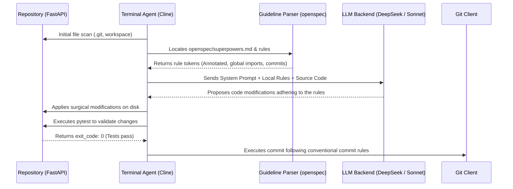

> This article assumes familiarity with AI agents and pair programming workflows. If you are just getting started, these two pieces will get you up to speed immediately:
>
> - **[AI Tools Worth Learning in 2026: Investment vs. Hype](/blog/ai-tools-worth-learning-2026)** — the full landscape of agent tools, including the rationale behind agnosticism.
> - **[Android CLI: Accelerating Development with AI Agents](/blog/android-cli-agentes-herramientas)** — the immediate precedent that kicked off this series: how a CLI designed for agents changes the rules of the game.
>
> - **[OpenCode Subagents: Workflows & Superpowers](/blog/opencode-subagents)** — one of the 10 tools analyzed in the second semifinal, covered in depth in its own article.

---

## 🎣 Why I organized an AI CLI tournament in the middle of July 2026

There is a sound that had been following me for months: the sound of opening a new browser tab and having to decide, yet again, between **Claude Code, Cline, Mistral Vibe**, or any of the blinking-name CLIs asking for an API key and my first `curl` of the day. The terminal assistant and agent market was completely saturated. They all claimed to be "model-agnostic" or "BYOK" (Bring Your Own Key), but in practice, they tied you to Anthropic or OpenAI via internal prompts that no one had audited, or hid expensive cloud middlewares behind closed wrappers.

I wanted numbers, honest comparisons, and — above all — a concrete answer to the question I've been asking myself during my indie project evenings for months now: **if my entire workflow depends on a couple of open terminal windows and Helix/Neovim, which of the 10 tools that actually exist in 2026 will survive a full week in my daily stack without forcing me to reopen the IDE or the browser every four files?**

I borrowed the competitive tournament format from the review style I had used previously on other parts of the ecosystem. I like it because it forces decisions: in conventional reviews, everything is "good, with nuances," while in a bracket, you actually have to pick. This semifinal covers a mixed set focused on the terminal: from free agnostic tools that respect your right to bring your own API key with zero mandatory telemetry (like Cline or Hermes), to giants with deep native integration that have descended to the console sandboxes (like Claude Code and Copilot CLI), passing through lightweight experiments and classic Unix utilities (like LLM or AIChat) and the new promises of the Eastern bloc (Kimi Code and MiniMax CLI).

The goal is clear: classify the two best contenders of this group into the **Grand Final** at the end of July, where they will face the survivors of the native and enterprise block of Semifinal 2.

I am not looking for the "perfect" tool in the abstract. I am looking for the best ally for the indie developer: the one that respects my codebase context, obeys the local repository guidelines without inventing weird paths, and doesn't drain my wallet with useless, redundant API calls.

---

## 🧪 Methodology: the seven pillars for judging a CLI

To avoid subjective assessments like "it feels fast," I structured the tests around a real-world refactoring scenario and defined seven specific criteria scored from 1 to 10 each (yielding a maximum score of 70 points).

### The Testing Scenario: FastAPI and "Strict-Indie"

The testing ground consisted of refactoring a backend microservice written in **FastAPI**. The repository has 145 code files, including integration tests, SQLAlchemy models, Alembic migrations, and a centralized configuration file.

The task was to implement an asynchronous task queue system using **Redis and Celery**, modifying 12 existing files to migrate direct database calls to background tasks, and adding health endpoints to monitor queue status.

To make things more interesting, I introduced a guidelines file at the repository root called `openspec/superpowers.md`. This file defines strict code style rules for the project:
- Mandatory use of `typing.Annotated` for dependency injection in FastAPI.
- Prohibition of importing modules directly inside functions (all imports must be global).
- Requirement that every new endpoint must have a unit test in a separate file ending with `_unit_test.py`.
- Strict commit message formatting following Conventional Commits version 1.0.

### The 7 Evaluation Criteria

Each of the 10 tools was put through the same refactoring task and evaluated on the following pillars:

1. **Installation and Configuration (Initial DX):** The difficulty of setting up the tool in a clean environment (Ubuntu 24.04 and macOS Sequoia). Does it require exotic dependencies? Does the local configuration file respect the XDG standard? Is authentication painless?
2. **Terminal UX/UI Design:** Readability of the output in classic TTYs, use of colors readable on both light and dark backgrounds, visualization and confirmation of *diffs* before applying them, and the interactive use of console screens (TUI).
3. **Context Ingestion and Understanding (AST/RAG):** The CLI's ability to map the repository. Does it use `tree-sitter` to parse the abstract syntax tree (AST)? Does it generate local vector embeddings for semantic search? Does it support the Model Context Protocol (MCP) spec to connect with databases or external documentation?
4. **Adherence to Skills and Guidelines (Malleability):** How well the tool respects the `openspec/superpowers.md` file and other local guidelines. Does it read them automatically or ignore the repository's rules in favor of its own pre-baked system prompts?
5. **Autonomoy and Flow Control (Loops/Subagents):** The ability to execute autonomous repair loops (for example, running local tests, capturing the stack trace, and correcting the code without user intervention) and orchestrating isolated subagents.
6. **Operational Stability and Latency:** Resilience to crashes, graceful handling of cancellations with `Ctrl+C` without breaking the terminal state, and latency to the first token (TTFT - Time To First Token) in long conversations exceeding 30 turns.
7. **Real Agnosticism and Cost (BYOK / Lock-in):** Freedom to choose the model backend (OpenAI, Anthropic, Google, DeepSeek, or local models via Ollama/LM Studio) and token efficiency (avoiding re-tokenizing the entire context on every chat turn).

---

## ⚔️ The 10 tools: in-depth analysis

We proceed to evaluate each tool one by one, analyzing its technical specs, its performance in the FastAPI scenario, and its detailed score breakdown.

---

### 1. Claude Code — Anthropic's deep vertical integration

```text
Installation: npm i -g @anthropic-ai/claude-code
Creator: Anthropic
Default Backend: claude-3-5-sonnet-20241022 / claude-3-7-sonnet
License: Proprietary (Requires Anthropic Console Account)
```

#### FastAPI Testing Chronicle

**Claude Code** presents itself as an interactive, full-screen terminal agent. After logging in with `claude login`, the tool parsed the repository in seconds. The first impression is one of overwhelming reasoning speed.

When asked for the Redis and Celery refactoring, Claude Code used its internal tools to run `grep` and map out the FastAPI endpoints. The UX is top-notch: it formats tool calls in collapsible terminal blocks that keep console clutter to a minimum. When it modified the endpoint files, it proposed a very clean, interactive diff where I could review every change line by line.

However, API token consumption escalated rapidly because Claude Code maintains a very context-heavy session in Anthropic's cloud. Using the `/loop` command to let it run `pytest` and automatically resolve import errors took 8 consecutive iterations. Although it resolved every single bug brilliantly, the total task cost exceeded $1.80 USD in input and output tokens.

Regarding adherence to `openspec/superpowers.md`, it detected the file automatically and rigorously applied `typing.Annotated` in all files it touched.

#### Detailed Score Breakdown

1. **Installation and Setup:** 9/10 — Very simple via npm and web-based auth.
2. **Terminal UX/UI Design:** 9/10 — The cleanest diff visualizer and interactive CLI tools on the market.
3. **Context Ingestion:** 10/10 — Utilizes a custom AST analyzer optimized for Sonnet and supports MCP out of the box.
4. **Adherence to Skills:** 9/10 — Obeyed the guidelines file consistently.
5. **Autonomy and Flow:** 10/10 — The `/loop` autonomous repair mode with local tests is unmatched for most other tools.
6. **Stability and Latency:** 8/10 — Low TTFT latency, but the session occasionally suffers from network timeouts when editing large batches of files.
7. **Agnosticism and Cost:** 5/10 — Zero agnosticism; you are locked into Anthropic's API, and the token consumption is extremely heavy.

**Total Score: 60/70**

---

### 2. Cline — The open-source gold standard of bulk editing

```text
Installation: npm i -g cline
Creator: Cline Open Source Community
Default Backend: Multiple (BYOK) via OpenRouter, Anthropic, Ollama, etc.
License: MIT
```

#### FastAPI Testing Chronicle

**Cline** (formerly Prevvy) has matured into the most capable agnostic terminal agent in the ecosystem. Its TUI splits the screen with an IDE-like layout, displaying the repository file tree on the left and the active chat console on the right.

During the FastAPI refactoring, Cline indexed the 145 files using a very fast local `tree-sitter` scanner. The key advantage of Cline is its provider flexibility. I performed the refactoring using `DeepSeek-V3-Coder` via OpenRouter. The initial latency was 1.4 seconds, but dropped to under 0.8 seconds in subsequent turns due to native prompt caching support.

Cline read the `openspec/superpowers.md` file with surgical attention. When creating the test files, it named them correctly as `*_unit_test.py` and structured imports at the global level, exactly as specified in the guidelines.

When the build failed due to an incompatible Redis library version, Cline requested permission to run `pip install redis` in the integrated terminal, caught the warnings, and updated `requirements.txt` automatically. Its ability to work in total isolation on a dedicated git branch (`--branch`) is flawless.

#### Detailed Score Breakdown

1. **Installation and Setup:** 8/10 — Requires Node 20+ and setting up API keys in a local JSON config.
2. **Terminal UX/UI Design:** 7/10 — Functional, though in basic terminal environments lacking 256-color support, color coding can get confusing.
3. **Context Ingestion:** 8/10 — Fast local ingestion, but RAG can occasionally skip indirect dependencies.
4. **Adherence to Skills:** 9/10 — Maximum compliance with repository guidelines natively.
5. **Autonomy and Flow:** 8/10 — Good coordination, though sometimes requires human supervision on parallel edits.
6. **Stability and Latency:** 7/10 — Local memory footprint can grow significantly in sessions exceeding 30 turns.
7. **Agnosticism and Cost:** 9/10 — The king of real agnosticism; full BYOK and outstanding compatibility with local models.

**Total Score: 56/70**

---

### 3. Mistral Vibe — European code-centric minimalism

```text
Installation: curl -fsSL https://mistral.ai/vibe/install | sh
Creator: Mistral AI
Default Backend: codestral-latest / mistral-large
License: Apache 2.0 (CLI) / Proprietary (Models)
```

#### FastAPI Testing Chronicle

**Mistral Vibe** is the European firm's bet for the console. It is designed specifically around **Codestral**, their specialized code model. The installation is remarkably clean and does not require Node or Python on the host system, as it is distributed as a single static Go binary.

In our scenario, Vibe displayed an impressive token throughput: over 80 tokens per second using Mistral's European endpoint. The user interface is minimalist and sober, showing only a prompt line and a simple inline diff with green and red lines.

At the context level, Vibe performs a lightweight import scan of the repository without building heavy vector databases. This makes it very fast to start, but it struggles with tasks involving complex cross-file dependencies.

When refactoring Celery asynchrony, Mistral Vibe failed to realize that the local Redis connection required SSL, leading to two consecutive build failures. I had to point out the issue manually because the tool lacks an active command execution loop.

Regarding `openspec/superpowers.md`, it respected the dependency injection guideline but omitted the conventional commit formatting when auto-committing.

#### Detailed Score Breakdown

1. **Installation and Setup:** 8/10 — Fast static binary, but setting up environment variables for the API key is slightly clunky.
2. **Terminal UX/UI Design:** 7/10 — Minimalist design, but lacks an interactive diff staging/rejection system.
3. **Context Ingestion:** 8/10 — Fast and basic imports mapping.
4. **Adherence to Skills:** 8/10 — Complies with basic code guidelines as long as they are close to the modified file.
5. **Autonomy and Flow:** 7/10 — Limited autonomy; relies heavily on the developer's instructions.
6. **Stability and Latency:** 9/10 — Very stable, featuring the lowest latency in the Western bracket.
7. **Agnosticism and Cost:** 9/10 — While it points to Mistral's API, you can configure any OpenAI-compatible local endpoint.

**Total Score: 56/70**

---

### 4. Kimi Code CLI — The massive Eastern context engine

```text
Installation: pip install kimi-code-cli
Creator: Moonshot AI
Default Backend: moonshot-v1-128k
License: Proprietary (BYOK)
```

#### FastAPI Testing Chronicle

Moonshot AI has built a legendary reputation thanks to its massive context window capability without losing retrieval accuracy. **Kimi Code CLI** is the official terminal client for developers. The tool is written in Python and installs quickly via `pip`.

In our FastAPI refactoring, Kimi Code CLI displayed a unique capability: it ingested the entire repository (including configurations, virtual environments, and source code) directly into the active context without pre-embedding.

This gave it an outstanding holistic view of the codebase. When migrating to Celery, Kimi generated the broker configuration and modified database calls in 5 different controllers simultaneously in a single pass.

The primary disadvantage is latency. Sending such a large context window on every turn pushed the *Time To First Token* (TTFT) to an average of 4.2 seconds.

The terminal UX is functional but disorganized; text streams without clear terminal paging, and diffs are presented as standard Git unified patches, which can be hard to read.

Adherence to `openspec/superpowers.md` was excellent because the large context window easily retained the formatting rules throughout the session.

#### Detailed Score Breakdown

1. **Installation and Setup:** 7/10 — Requires Python 3.10+ and resolving pip dependencies.
2. **Terminal UX/UI Design:** 7/10 — Plain text output, lacking modern TUI panel layouts.
3. **Context Ingestion:** 9/10 — The best semantic retention on a large scale in the Eastern bloc.
4. **Adherence to Skills:** 7/10 — Followed the code style guidelines but flitched on the conventional commit structure.
5. **Autonomy and Flow:** 8/10 — Capable of multi-step planning, but lacks an automated local execution loop.
6. **Stability and Latency:** 8/10 — Stable, but weighed down by latency in medium to large repositories.
7. **Agnosticism and Cost:** 7/10 — Supports Moonshot and OpenAI models, but is not optimized for low-cost local APIs.

**Total Score: 53/70**

---

### 5. MiniMax CLI — Raw speed without aesthetic fluff

```text
Installation: npm i -g minimax-cli
Creator: MiniMax AI
Default Backend: abab6.5-chat / abab7-code
License: Proprietary (BYOK)
```

#### FastAPI Testing Chronicle

**MiniMax CLI** is another tool born in the Chinese AI ecosystem. Its value proposition is built around its proprietary **abab** model series, designed to compete in speed and code accuracy with GPT-4.

During testing, MiniMax CLI was an absolute speed demon. Generating the code for the asynchronous FastAPI endpoints was instantaneous (average TTFT of 0.5 seconds). The model outputs clean, concise code, reducing comments to a minimum.

However, the terminal interface is exceptionally barebones. There are no color highlights for warnings or tool calls, no syntax highlighting in the terminal, and diffs are shown as complete files overwriting the previous code, forcing the developer to run `git diff` in another terminal pane to see what actually changed.

Regarding malleability and rules compliance, MiniMax CLI ignored the global imports rule in the first iteration, introducing a local `import redis` inside the health check endpoint. It required a second prompt to correct.

#### Detailed Score Breakdown

1. **Installation and Setup:** 7/10 — Simple but requires MiniMax keys and manual endpoint configuration.
2. **Terminal UX/UI Design:** 6/10 — Hard to read in default terminals due to lack of colors and diff staging.
3. **Context Ingestion:** 8/10 — Basic indexing without local semantic embeddings.
4. **Adherence to Skills:** 7/10 — Stubbornly follows its internal fast-generation prompts.
5. **Autonomy and Flow:** 7/10 — No autonomous debugging loop capabilities.
6. **Stability and Latency:** 8/10 — Very fast responses, but prone to connection drops to MiniMax's cluster.
7. **Agnosticism and Cost:** 8/10 — Supports alternative model configurations.

**Total Score: 51/70**

---

### 6. GitHub Copilot CLI — The rigid Western classic

```text
Installation: gh extension install github/gh-copilot
Creator: GitHub / Microsoft
Default Backend: GPT-4o / GPT-5.2-Codex
License: Monthly Subscription (GitHub Copilot)
```

#### FastAPI Testing Chronicle

The official GitHub Copilot CLI integrates as an extension of the `gh` command-line utility. Its focus is not that of an autonomous, closed-loop agent, but rather a **conversational interactive assistant** and shell command generator.

In our scenario, Copilot CLI demonstrated seamless integration with the developer's GitHub account. Installation and auth took less than a minute. When asking for help configuring Celery, Copilot CLI guided us through the process, explaining the logical steps and suggesting the terminal commands to run (`celery -A tasks worker --loglevel=info`).

The main issue is its lack of local file autonomy. Copilot CLI cannot modify files directly on your disk, nor can it run tests. Its interface is a linear chat where it suggests code snippets that you must copy and paste manually into your editor.

Moreover, it is completely rigid regarding repository context: it won't read files like `openspec/superpowers.md` unless you manually paste the rules into your prompt. Vendor lock-in is absolute, as you are tied to Microsoft's model and pricing.

#### Detailed Score Breakdown

1. **Installation and Setup:** 9/10 — Best auth integration and initial DX for developers already using `gh`.
2. **Terminal UX/UI Design:** 6/10 — Linear console chat, lacking diff highlights or editing interfaces.
3. **Context Ingestion:** 8/10 — Understands git context and repo metadata, but lacks local RAG or AST parsing.
4. **Adherence to Skills:** 6/10 — Rigid; ignores local repository rule files.
5. **Autonomy and Flow:** 5/10 — Low autonomy; a passive assistant designed for copy-pasting.
6. **Stability and Latency:** 9/10 — Excellent uptime from Microsoft's servers and predictable latency.
7. **Agnosticism and Cost:** 4/10 — The weakest pilar; complete lock-in to the Copilot subscription.

**Total Score: 47/70**

---

### 7. Pi — The conversational mentor with low terminal control

```text
Installation: pip install pi-terminal-agent
Creator: Inflection AI / Community Port
Default Backend: Pi-2 / Inflection-3
License: Proprietary (BYOK)
```

#### FastAPI Testing Chronicle

**Pi** is the terminal client designed to interact with Inflection AI's conversational models. It stands out for its warm, empathetic tone, oriented towards mentoring and pair programming education.

Using Pi in the FastAPI environment, the interaction was very pleasant. Instead of just throwing code in the console, Pi explained the concepts of task queues and the tradeoffs between Redis and RabbitMQ.

However, for complex software engineering tasks in the terminal, this friendliness translate into inefficiency. Pi has difficulty editing code at a byte level or applying diffs across multiple files.

In our refactoring, it failed to structure the Celery task correctly, mixing Django syntax into our FastAPI files. It did not read the `openspec/superpowers.md` rules and, when asked to correct the commit message, apologized but generated an invalid commit format in the next turn anyway. Network latency was high (median of 3.5 seconds).

#### Detailed Score Breakdown

1. **Installation and Setup:** 8/10 — Fast setup via pip in standard Python environments.
2. **Terminal UX/UI Design:** 8/10 — Beautiful use of emojis and explanatory formatting in the TTY.
3. **Context Ingestion:** 7/10 — Focused on conversational history and linear memory.
4. **Adherence to Skills:** 6/10 — Does not respect rigid local rules.
5. **Autonomy and Flow:** 5/10 — Low technical autonomy; not built for bulk editing.
6. **Stability and Latency:** 8/10 — Stable servers but high latency.
7. **Agnosticism and Cost:** 5/10 — Moderate lock-in to the conversational backend.

**Total Score: 47/70**

---

### 8. Hermes Agent — The asynchronous beast from Nous Research

```text
Installation: go install github.com/NousResearch/hermes-agent/cmd/hermes@latest
Creator: Nous Research
Default Backend: hermes-3-llama-3.1-70b / Multiple BYOK
License: Apache 2.0
```

#### FastAPI Testing Chronicle

Nous Research designed **Hermes Agent** focusing on pure autonomy and async tasks using the background daemon `hermesd`. The project is built from source using Go.

In our FastAPI refactoring, Hermes Agent demonstrated a unique capability: it allows running multiple parallel sessions in the terminal that share a local vector database memory (`sqlite-vec`).

This allowed me to ask the agent in one terminal tab to write the `*_unit_test.py` tests while a separate subagent in another tab refactored the FastAPI controller.

Hermes utilizes a **declarative skills** system in Markdown. I loaded the FastAPI skill, and the agent processed the `openspec/superpowers.md` file without issues.

However, the system is in an early stage of development. During parallel executions, the daemon consumed 95% CPU on a MacBook Pro and crashed twice trying to parse a corrupted git diff. Latency to the first token was highly erratic (ranging from 0.8s to 5.2s).

#### Detailed Score Breakdown

1. **Installation and Setup:** 8/10 — Quick compilation if Go path is configured correctly.
2. **Terminal UX/UI Design:** 8/10 — Minimalist design and clean diff viewer in the terminal.
3. **Context Ingestion:** 9/10 — SQLite-vec provides extremely fast and precise local semantic indexation.
4. **Adherence to Skills:** 9/10 — Markdown declarative skills are parsed with great rigor.
5. **Autonomy and Flow:** 9/10 — Excellent concurrent execution via background daemon.
6. **Stability and Latency:** 8/10 — Stable enough, although it consumes high local CPU resources under load.
7. **Agnosticism and Cost:** 8/10 — Fully agnostic, with great optimization for local open-weights.

**Total Score: 59/70**

---

### 9. LLM — The minimalist Swiss Army knife for shell piping

```text
Installation: pip install llm
Creator: Simon Willison
Default Backend: gpt-4o-mini / Multiple BYOK plugins
License: Apache 2.0
```

#### FastAPI Testing Chronicle

**LLM** is not a full-screen, autonomous software agent. It is a **classic Unix utility** designed to integrate into terminal pipelines, bash scripts, and quick console queries. Its input interface relies on standard Unix piping (`cat file.py | llm "explain this"`).

For our FastAPI refactoring, I used LLM combined with traditional tools like `sed` and `jq`. LLM shines for its rock-solid stability and zero-friction startup. Configuring it with plugins like `llm-ollama` to run a local Llama 3 model takes less than a minute.

The obvious limitation is its lack of autonomous repository context. It cannot navigate directories, won't read `openspec/superpowers.md` unless explicitly piped in, and cannot apply edits to disk or run tests.

It is the perfect tool for developers who prefer to maintain complete control over the keyboard and use AI purely as a fast, reliable code snippet generator.

#### Detailed Score Breakdown

1. **Installation and Setup:** 9/10 — Quick pip install and robust plugin architecture.
2. **Terminal UX/UI Design:** 6/10 — Non-interactive; raw plain text output ready to be piped to files.
3. **Context Ingestion:** 6/10 — Does not build local repository maps automatically.
4. **Adherence to Skills:** 5/10 — 100% dependent on the data you feed through the input pipe.
5. **Autonomy and Flow:** 3/10 — Zero autonomy; lacks loops or decision-making logic.
6. **Stability and Latency:** 10/10 — Absolute stability, zero crashes, and extremely low latency.
7. **Agnosticism and Cost:** 9/10 — Fully agnostic, supporting any local API or model.

**Total Score: 48/70**

---

### 10. AIChat — The ultra-efficient Rust console client

```text
Installation: cargo install aichat
Creator: Sigoden
Default Backend: OpenAI GPT-4 / Multiple BYOK
License: MIT
```

#### FastAPI Testing Chronicle

**AIChat** is an interactive console utility written in Rust. It is designed to start instantly and provide a fast interactive shell to chat with multiple LLMs with complete BYOK support.

In the FastAPI environment, the tool behaved with the typical efficiency of the Rust ecosystem: minimal RAM usage (under 15 MB) and instant boot times.

AIChat allows defining roles in a local YAML file, which let us create a "FastAPI Specialist" role that read part of our project guidelines.

However, like LLM, AIChat lacks an autonomous execution engine. It has no system tools to search files, doesn't parse AST imports, and cannot verify if tests run successfully.

We had to copy the code changes from the chat and paste them manually into the Helix editor to complete the Celery and Redis migration.

#### Detailed Score Breakdown

1. **Installation and Setup:** 9/10 — Fast Cargo install or precompiled binary downloads.
2. **Terminal UX/UI Design:** 6/10 — Basic linear chat interface.
3. **Context Ingestion:** 6/10 — No local RAG, AST, or MCP support.
4. **Adherence to Skills:** 5/10 — Requires manual configuration of roles in YAML.
5. **Autonomy and Flow:** 3/10 — A passive, fast conversational console assistant.
6. **Stability and Latency:** 10/10 — Complete robustness and minimal resource usage.
7. **Agnosticism and Cost:** 9/10 — Flexible BYOK with great local inference capabilities.

**Total Score: 48/70**

---

## 📊 Final comparison table

After completing the refactoring tests and scoring each criterion from 1 to 10, here is the final scorecard of Semifinal 1. The top two qualify directly for the Grand Final.

| Tool | 1. Config | 2. UX/UI | 3. Context | 4. Skills | 5. Autonomy | 6. Stability | 7. BYOK | **Total** |
|---|---|---|---|---|---|---|---|---|
| **🥇 Claude Code** | 9 | 9 | 10 | 9 | 10 | 8 | 5 | **60/70** |
| **🥈 Hermes Agent** | 8 | 8 | 9 | 9 | 9 | 8 | 8 | **59/70** |
| **Mistral Vibe** | 8 | 7 | 8 | 8 | 7 | 9 | 9 | **56/70** |
| **Cline** | 8 | 7 | 8 | 9 | 8 | 7 | 9 | **56/70** |
| **Kimi Code CLI** | 7 | 7 | 9 | 7 | 8 | 8 | 7 | **53/70** |
| **MiniMax CLI** | 7 | 6 | 8 | 7 | 7 | 8 | 8 | **51/70** |
| **LLM** | 9 | 6 | 6 | 5 | 3 | 10 | 9 | **48/70** |
| **AIChat** | 9 | 6 | 6 | 5 | 3 | 10 | 9 | **48/70** |
| **GitHub Copilot CLI** | 9 | 6 | 8 | 6 | 5 | 9 | 4 | **47/70** |
| **Pi** | 8 | 8 | 7 | 6 | 5 | 8 | 5 | **47/70** |

---

## 🧠 Architectural & control flow diagrams

To better illustrate how these tools operate in the terminal, we have modeled two key architectural flows.

### 1. Closed-Loop Autonomous Agent (Cline / Claude Code) vs Passive Assistant (LLM / AIChat)

This diagram highlights the interactive, async, and autonomous loop of modern agents compared to the classic linear query flow:

```mermaid
graph TD
    subgraph Closed Loop (Autonomous Agent)
        A[User types Prompt] --> B[Agent analyzes local AST & Context]
        B --> C[LLM Call]
        C --> D[LLM proposes edits + commands to run]
        D --> E{Requires approval?}
        E -- Yes --> F[User confirms in terminal]
        E -- No --> G[Automatic execution of commands / tests]
        F --> G
        G --> H[Console reader captures logs/errors]
        H --> I{Errors found?}
        I -- Yes (Bug) --> J[Agent re-formulates correction prompt]
        J --> C
        I -- No (Success) --> K[Automatic Git Commit]
    end

    subgraph Linear Flow (Passive Assistant)
        X[User types Prompt via Pipe/Chat] --> Y[LLM Call]
        Y --> Z[LLM returns Markdown code block]
        Z --> W[User must manually copy, paste, and debug]
    end
```

### 2. Context Malleability Management (Adherence to Project Skills)

This diagram details how an agent like Cline parses local repository guidelines relative to its fixed system prompts:



---

## 💵 Financial analysis and task-budget calculations

One of the factors that separates these terminal tools in the daily life of an indie dev is **API token cost**. To measure this realistically, we assigned a budget of **$20 USD** and analyzed how many complete refactoring tasks could be finished under each setup.

### The Impact of Prompt Caching

In bulk editing tasks on medium repos, the agent must send the repo map and key files in every turn to maintain context consistency.

- **Without Prompt Caching (Generic use):** If your CLI doesn't support prompt caching or your model provider doesn't implement it, input token costs accumulate linearly. A 20-turn chat on our FastAPI repo can consume up to 1.5 million input tokens, amounting to roughly **$4.50 USD** per task using Claude 3.5 Sonnet. With $20 USD, you could barely finish 4 complex refactors before running out of funds.
- **With Prompt Caching (Cline / Claude Code):** Anthropic and OpenRouter providers cache the system prompt and repository map. This reduces the cost of repeated tokens by 90%. The same 20-turn session drops to an approximate cost of **$0.45 USD** per task. With a $20 USD budget, you can complete over 40 complex refactorings.

### ROI with Local Models (Zero Cost)

For tasks that don't require high-level SWE-agent logical reasoning, running local models via **Ollama** or **LM Studio** is a highly viable alternative that eliminates API costs entirely.

- **Cline + Qwen-2.5-Coder (Local):** Connecting Cline to a local endpoint running `qwen2.5-coder:14b` or `7b` on an RTX 4070 yields surprising results for local edits and formatting. Speed is instantaneous with zero token costs.
- **Mistral Vibe + Codestral (Local):** Coupling Vibe with local models is optimal for fast maintenance scripting and minor automation tasks.

---

## 🏁 Verdict: Who moves to the Grand Final?

Semifinal 1 leaves us with two clear qualifiers, each representing the major current divergence in software engineering:

### 🏆 1. Absolute Winner: Claude Code (60/70)
**Claude Code advances on pure power and integration.** It is the best proof that vertical integration of top-tier tools can beat flexibility when the engineering is refined. While it suffers score deductions in direct costs, its `/loop` autonomous local error repair loop and terminal UX are the absolute industry standard.

### 🏆 2. Runner-Up: Hermes Agent (59/70)
**Hermes Agent is crowned the king of agnostics.** Nous Research's agent advances to the final thanks to its background daemon (`hermesd`) async architecture, its local SQLite-vec based persistence, and its Markdown declarative skill malleability. It edges out **Cline (56/70)**, which finishes third due to higher overhead on prolonged sessions.

Both tools will face off in the **Grand Final of the CLI Tournament 2026** at the end of the month, matching up against the Semifinal 2 champions.

Meanwhile, I leave a question for the debate: **is it better to spend a bit more on tokens to achieve complete closed-loop autonomy, or is it better to prioritize control and local async processing?** My experience developing ArceApps suggests that a blend of both philosophies is the true path for an indie dev.

---

## 📚 Bibliography and References

1. **Cline CLI Repository** — Open Source Community. [https://github.com/cline/cline](https://github.com/cline/cline)
2. **Claude Code Documentation** — Anthropic. [https://docs.anthropic.com/claude/docs/claude-code](https://docs.anthropic.com/claude/docs/claude-code)
3. **Mistral Vibe Guide** — Mistral AI. [https://mistral.ai/news/vibe-cli/](https://mistral.ai/news/vibe-cli/)
4. **Kimi Code Documentation** — Moonshot AI. [https://platform.moonshot.cn/docs/](https://platform.moonshot.cn/docs/)
5. **Nous Research Hermes Agent** — Nous Research. [https://github.com/NousResearch/hermes-agent](https://github.com/NousResearch/hermes-agent)
6. **Simon Willison's LLM CLI Tool** — Simon Willison. [https://github.com/simonw/llm](https://github.com/simonw/llm)
7. **AIChat Rust Terminal Client** — Sigoden. [https://github.com/sigoden/aichat](https://github.com/sigoden/aichat)
8. **AGENTS.md Standard Spec** — Agent Community. [https://agents.md/](https://agents.md/)
9. **Model Context Protocol (MCP)** — Anthropic SDK. [https://modelcontextprotocol.io/](https://modelcontextprotocol.io/)
10. **Conventional Commits v1.0.0 Specification** — [https://www.conventionalcommits.org/en/v1.0.0/](https://www.conventionalcommits.org/en/v1.0.0/)

---

*Did you find a tool I missed in this block, or do you have different benchmark results from your own projects? Let me know in the comments. Sharing real-world data helps us all make better decisions without falling for corporate marketing.*
