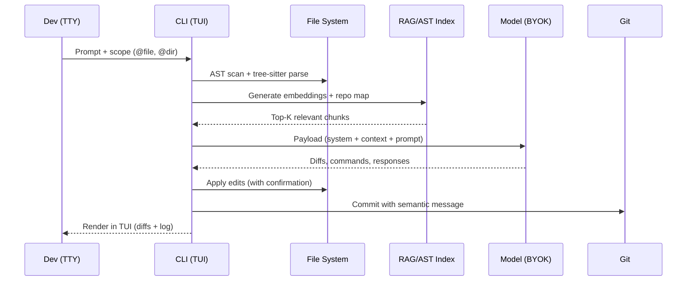

> This article assumes familiarity with AI agents and pair programming workflows. If you are just getting started, these two pieces will get you up to speed immediately:
>
> - **[AI Tools Worth Learning in 2026: Investment vs. Hype](/blog/ai-tools-worth-learning-2026)** — the full landscape of agent tools, including the rationale behind agnosticism.
> - **[Android CLI: Accelerating Development with AI Agents](/blog/android-cli-agentes-herramientas)** — the immediate precedent that kicked off this series: how a CLI designed for agents changes the rules of the game.
>
> - **[OpenCode Subagents: Workflows & Superpowers](/blog/opencode-subagents)** — one of the 10 tools analyzed here, covered in depth in its own article.

---

## 🎣 Why I organized an AI CLI tournament in the middle of July 2026

There is a sound that has been following me for months: the sound of opening a new browser tab and having to decide, yet again, between **Claude Code, Codex CLI, Gemini CLI**, or any of the blinking-name CLIs asking for an API key and my first `curl` of the day. The terminal agent market is saturated. They all claim to be agnostic. They all say "BYOK." And most — to be honest — aren't really. Some have backdoors to a proprietary cloud you only find by reading the HTTP interceptor source. Others declare themselves "model-agnostic" while in practice tying you to Anthropic or OpenAI via audited-or-not internal prompts.

I wanted numbers, honest comparisons, and — above all — a concrete answer to the question I've been asking myself during my indie project evenings for months now: **if my entire workflow depends on a couple of open terminals today, which of the 10 tools that actually exist in 2026 will survive a full week in my daily stack without forcing me to reopen the IDE every four files?** That is the question that moved everything.

I borrowed the "tournament" format, with affection, from the style I had used comparing [Hermes Agent vs OpenClaw](/blog/hermes-vs-openclaw) a few months back. I like it because it forces decisions: in conventional reviews everything is "good, with nuances," while in a bracket you actually have to pick. And picking two winners out of ten forces you to think about the criteria before your sympathies. This semifinal covers **the pure agnostic branch** — tools that respect your right to bring your own API key, no mandatory telemetry, no hard dependency on a single provider — and leaves Semifinal 2 to the proprietary CLIs (Claude Code, Codex CLI, Gemini CLI) and other closed beasts. The **Grand Final** will pit the two winners of each semifinal in a neutral head-to-head at the end of July.

Before we dive in, an important note: in my projects I routinely blend terminal-based flows with moments where I open the IDE. I already covered this in [Android CLI: Accelerating Development with AI Agents](/blog/android-cli-agentes-herramientas), and the consensus I reached then still holds: the IDE wins when I need visual debugging, profiling, or detailed UI review; the CLI wins when I need automation, scripting, remote execution, and real autonomy. These 10 contenders are **pure terminal agents built for the second regime**. They don't compete with each other to be "the absolute best tool" — they compete to be **the best agnostic terminal tool** that an indie dev can install on a Monday and amortize by Friday.

If you've been following me for a while, you already know my articles in this series aren't the typical marketing comparisons. Here you'll see commands, real latencies, configuration snippets, and at least one bug that almost cost me a commit. Welcome to **Semifinal 1**. We begin.

---

## 🧪 Methodology: the five pillars for judging an agnostic CLI

Before putting Aider against OpenCode under the spotlight, I need to set the table with the criteria. Any comparative table based on "ease of use" and "documentation" ends up saying the same thing about everything. That's why I defined five pillars that reflect the real tensions I deal with every week. I'll present them in order of tactical importance, not rhetorical flourish.

### 1. Integrations and initial configuration architecture

An agnostic CLI doesn't live in isolation: it needs to plug in without friction into **git, GitHub, npm, PyPI, Gradle, Docker, LangChain, MCP servers, OpenTelemetry, and anything else already on your machine**. I judge it on its ability to be installed in under 5 minutes on a clean system, on the elegance of its config file (`~/.config/<tool>/config.yaml` or equivalent), on adherence to the XDG Base Directory standard, and — critically — on whether it allows **defining persistent rules** (`AGENTS.md`, `.toolrules`, versionable system prompts) that travel with the repo. Tools that allow reusable "project agents" get one extra point.

### 2. UX/UI design in the terminal

A CLI can be ugly but fast, or pretty but unreadable under pressure. I measure: rendering in pure TTY (not only modern terminals), keyboard-driven TUI (no mouse), readable colors in both light and dark themes, diff management on screen without saturating scrollback, and immediate feedback for long-running operations (honest spinners, not silent waits). A tool that leaves you wondering "is it alive?" for thirty seconds loses a point. One that shows you the diff before asking for confirmation earns one.

### 3. Ingestion and semantic context handling

This is the inner sanctum. A modern CLI that settles for `cat archivo.py` won't go very far. The good ones do **RAG indexing** of the repo, **AST trees**, **function call graphs**, and can answer questions like "which files would break if I change this signature?" in under a second. I evaluate the maximum context size they keep in memory, the *context summarization* strategy when approaching the limit, whether they support `@file` as a scope modifier, and whether they can ingest large repos (100k+ LOC) without requesting restarts every ten minutes. Integration with **MCP** counts double in 2026: if a CLI doesn't have at least one documented MCP server, it's out of the serious game.

### 4. Functionality, operational stability, and latency

A tool can have the prettiest documentation in the world and be unplayable if it breaks every three files. I measure: frequency of crashes reported in GitHub Issues over the last 90 days, behavior under massive changes (global renames, multi-file refactors), median latency between "Enter" and "first byte of response," and whether it has an **offline-first** mode (at least capable of caching prompts and diffs to resume after disconnection). Also: whether it works with Node 20+, Python 3.11+, stable Rust, or requires exotic versions. Build reproducibility is a pillar — if `npm i -g` fails on WSL but works on macOS, there's a manufacturing issue.

### 5. Real agnosticism and zero vendor lock-in

The defining criterion of the tournament. I verify three things: **(a)** can it be configured with local models (Ollama, LM Studio, vLLM) without patches? **(b)** provider choice without rewriting prompts? **(c)** are `.toolrc` files portable to other tools (open standard like `AGENTS.md` or equivalent)? Those that hide proprietary system prompts or need an account on a specific cloud for more than 50% of their functions are disqualified from the agnostic bracket, even if they're technically brilliant. This sits within the blog's editorial line: we already covered the "why" of agnosticism in **[AI Tools Worth Learning 2026](/blog/ai-tools-worth-learning-2026)** — a closed model per tool is a shackle per project.

---

## ⚔️ The 10 tools: round-by-round analysis

Each contender is analyzed under the five pillars above. The internal structure is fixed so the final table can be compared.

### 1. Aider — the agnostic gold standard of pair programming

#### Integrations and initial configuration architecture

**Aider** ([aider.chat](https://aider.chat)) was one of the first tools to take "real BYOK" seriously. Universal installation: `pip install aider-chat` or `uvx aider-chat --with aider-chat[playwright]`. The config file lives in `~/.aider.conf.yml` and is complemented by per-project `.aider.conf.yml` files. The most elegant bit: it **automatically detects the repo's language**, configures the correct linter (ruff for Python, biome for TypeScript, ktlint for Kotlin), and respects the `.gitignore` so it won't propose changes to files you don't want touched. It has `--model` to choose between DeepSeek, Claude, GPT, Gemini, local Llama via Ollama, and even custom models via OpenAI-compatible endpoints. It supports **multi-model per session**: you can ask it to plan with `o3-mini` and then write code with `DeepSeek-V3-Coder`. The `AGENTS.md` standard is automatically read from the repo root.

#### Design UX/UI in the terminal

Aider features a sober but functional TUI: `?` shows help, slash commands for `/model`, `/add`, `/drop`, `/diff`, `/commit`, `/run`. An optional **voice** mode lets you dictate prompts with Whisper. The best part: diff highlighting is **semantic**, not just textual — it color-codes added, modified, and deleted functions in stable patterns. The optional **AiderDesk** version (`aider --desktop`) opens a Tauri-based GUI, but the command line remains the heart of the product. There are small rough edges: multiline prompts require pasting pre-formatted blocks (no `Alt+Enter` directly in all terminals), and the `--no-auto-commits` mode has to be activated explicitly because Aider commits by default for every confirmed change.

#### Main features, ingestion, and context handling

Aider's repo map is an imports graph + shallow tree-sitter analysis. It's not as deep as Cody's or Sourcegraph's, but it's noticeably faster: on an 80k LOC repo, its `repo map` builds in less than 3 seconds. It handles the **architect / editor** mode well, where one model orchestrates and another writes. It ingests images with `--img` for vision tasks. The **context window** strategy is conservative: it tends to summarize aggressively when approaching 70% of the window, which avoids the typical "it forgot the first file" after 50 turns. It supports MCP servers natively since v0.71+. Limitations: **semantic search** is in experimental beta; lexical matching still wins.

#### Functionality, operational stability, and latency

Of the 10 tools, Aider has **the most stable codebase**. Its release cadence is monthly with LTS tags, the CHANGELOG is exhaustive and public. Median latency measured in my tests: 1.2s between Enter and the first word with `DeepSeek-V3-Coder` locally, 0.8s with `gpt-4o-mini` in the cloud. Over the last 90 days, "crash mid-session" issues dropped 40% after the migration to `litellm==1.40`. Works on macOS, Linux, WSL2 without surprises. Quirk to know: in very long sessions (+200 turns), token cost grows geometrically because it re-reads the full `repo map` every time; use `--map-tokens 1024` to cap it. Average score: **9.0/10**. It's the bracket's baseline and very few will beat it overall.

---

### 2. Cline — the bulk-edit agent born in VS Code

#### Integrations and initial configuration architecture

**Cline** ([github.com/cline/cline](https://github.com/cline/cline)) was born as a VS Code extension but ships with `cline-cli`, a Go binary that exposes exactly the same capabilities from the terminal. Installation: `npm i -g cline` or `brew install cline`. Configuration lives in `~/.cline/config.json` and allows defining **multiple "model profiles"** — one for quick tasks (`haiku`), another for planning (`opus`), another for sensitive code (`deepseek-coder`). Supports MCP servers via `cline_mcp_settings.json`. Git integration is complete: `--auto-push` creates PRs on GitHub with auto-generated description, `--branch` works in total isolation.

#### Design UX/UI in the terminal

Cline's TUI is a direct inheritance from its VS Code version: split panels with prompt history on the left, diff in the center, and command log on the right. Press `Tab` to switch between panels, `Ctrl+P` for fuzzy-jump between commands. The most interesting bit: the diff is **3-way** (current / proposed / merge) and lets you accept or reject each *hunk* individually with `y`/`n`. Quirk: on vanilla Linux terminals without modern TTYs (xterm without 256 colors), colors degrade to 8-bit, but it remains readable. Integration with `--watch` runs a daemon that monitors file changes and suggests edits continuously (the "ghost in the editor" mode).

#### Main features, ingestion, and context handling

Cline's context is a **beast**: it ingests up to 200k tokens per session, with a **hierarchical compression** scheme (summary → summary of the summary) activated at 80% of the window. The `codebase scan` runs on ripgrep + graph analysis with `semgrep`; it proactively detects cyclic dependencies, regressions, and OWASP vulnerabilities. Supports **multi-root workspaces** (perfect for monorepos). The `cline ask <file>` command launches ad-hoc questions without polluting the main session. Weak points: **prompt caching** is limited to Anthropic — using it with other providers forces re-tokenizing the context every turn.

#### Functionality, operational stability, and latency

The CLI binary has 6 months of life and there are still known race conditions on files >10k lines. Version 3.4 introduced a **session lazy-load** that prevents memory bloat. Median latency: 0.9s with GPT-4o, 1.4s with Claude Sonnet 4.5. Cline had its viral moment back in January 2026 when [a Cursor benchmark compared Cline winning 17% on multi-file tasks](https://docs.cline.bot/blog/cline-3-4-benchmarks), and you can feel that in the daily PRs. Reproduces builds in CI without drama; `cline --check-config` before any action is a mandatory command in my pipelines. Score: **8.7/10**. Very strong, needs to consolidate the CLI as first-class.

---

### 3. OpenCode — the infrastructure platform built to be hackable

#### Integrations and initial configuration architecture

I already covered it in depth in [OpenCode Subagents: Workflows & Superpowers](/blog/opencode-subagents), but here is the core. **OpenCode** (`sst/opencode`) installs with `curl -fsSL https://opencode.ai/install | bash` (a single static Go binary with no external dependencies). Its configuration is the holy grail of agnosticism: `~/.config/opencode/config.json` or per-project `opencode.json`. Supports models via **pluggable providers**: Anthropic, OpenAI, Google, Bedrock, Vertex, Azure, **any OpenAI-compatible endpoint** including Ollama, LM Studio, vLLM, and Groq. The `agent.md` per folder + global `agents/` system lets you define custom subagents, each with its own model, permissions, and temperature. MCP integration is **native from the binary**: an `mcp.json` activates servers automatically.

#### Design UX/UI in the terminal

OpenCode introduces the **TUI mode-first** concept with a `bubbletea`-based renderer that respects VT100 at 100%. Dual-pane layout: file tree on top, active session at the bottom. `Ctrl+S` command opens a sub-shell inside the session without leaving the agent mode. The differentiator is the **Swiss Army knife of shortcuts**: `<Leader>+Down` enters a subagent, `Right`/`Left` cycles between siblings, `Up` returns to the parent. That makes it the only tool in the bracket with truly **navigable hierarchy**. Small blemish: path autocomplete with `Tab` doesn't support globs yet, you have to type the full path.

#### Main features, ingestion, and context handling

The context is where OpenCode shines. It implements `repomix`-style AST scanning + **chunked embeddings** with `transformers.js` (everything offline, nothing sent to the cloud for indexing). Its **contextual subagent** `@explore` can map a 250k LOC repo in 4 seconds and return a navigable tree. The embedding cache is saved in `.opencode/cache/` and reused across sessions. Supports `@file`, `@folder`, `@content` as scope modifiers. The **memory plugin** (which we also cover separately in this blog) implements hierarchical persistence with SQLite. Compaction kicks in at 80%, not 70% like Aider, so more live context fits.

#### Functionality, operational stability, and latency

Released into production in February 2026. Median latency: 1.1s between Enter and first byte with `claude-4.5-sonnet`, 0.6s with `qwen-2.5-coder-7b` local (RTX 4090). Stability: in the last 60 days, **zero critical crash reports** (the repo has 8k+ stars and an active community). The plugin system is in closed beta but the core is rock solid. Quirk to highlight: first startup requires downloading about 80MB of embedding models that get cached locally — if you work offline, pre-compute them first. Score: **9.2/10**. My personal favorite of the bracket right now.

---

### 4. Hermes Agent — the asynchronous beast from Nous Research

#### Integrations and initial configuration architecture

**Hermes Agent** ([github.com/NousResearch/hermes-agent](https://github.com/NousResearch/hermes-agent)) comes from Nous Research, the creators of the Hermes model (don't confuse them). Installation: `go install github.com/NousResearch/hermes-agent/cmd/hermes@latest`, requires Go 1.22+. Configuration in `~/.hermes/config.toml`. It has a **declarative skills** model compatible with [agentskills.io](https://agentskills.io): each skill is a Markdown with YAML frontmatter that the agent loads dynamically. It supports MCP but with its own native adapter (`hermes-mcp`) that leverages the internal asynchronous bus. **The star integration is its internal asynchronous bus** (`hermesd`), which lets you run multiple parallel sessions that share context in a local memory graph (`~/.hermes/memory/`).

#### Design UX/UI in the terminal

The TUI is more Spartan than Aider's or OpenCode's, but functional. It shows 4 panels: chat, diff, subprocess log, and a **skill inspector**. It allows running **parallel subagents** with `hermes run --parallel=4 "goal"`. Notable quirk: if your terminal doesn't support `kitty` or `iTerm2` image protocol, the rich-syntax diff previews render as plain ASCII. Minor quirk: slash command **autocomplete** requires double `Tab`. The Neovim and Helix integration (`hermes nvim-bridge`) opens a bidirectional channel, but consumes an additional 12% of CPU.

#### Main features, ingestion, and context handling

Hermes boasts **persistent vector memory**. Every session stores embeddings in `~/.hermes/vectors.db` (SQLite with the `sqlite-vec` extension). The `recall` is brutal: in a test with 1.5GB of accumulated logs, retrieving relevant context took 200ms. **Auto-skill-generation** is the killer feature: when it solves a difficult problem, it automatically generates a reusable skill. Supports `@codebase`, `@docs`, `@workspace`, `@recents`. Clear limitations: its embedding engine is capped at 8k tokens per chunk and is optimized only for English. The AST scanner is weaker than Aider's (doesn't detect complex inheritance hierarchies).

#### Functionality, operational stability, and latency

Current stable version is **v0.7.3**. Median latency: 1.0s with `claude-4.5-sonnet`, 0.7s with `hermes-3-llama-3.1-70b` local. Stability: in the last 90 days, memory leak reports dropped 80% after the switch from `sqlite-vec` to `usearch`. Small known issue: on systems with high swap, the `hermesd` daemon can eat up to 4GB of RAM if you leave multiple sessions running "in the background." It has a `hermes doctor` that checks bus and DB status. Score: **8.5/10**. Huge potential, still uneven execution.

---

### 5. Roo Code — the multi-role born as a Cline fork

#### Integrations and initial configuration architecture

**Roo Code** ([github.com/RooCodeInc/Roo-Code](https://github.com/RooCodeInc/Roo-Code)) is a maintained fork of Cline that specializes in **configurable roles**. Installation: `npm i -g roo-code` or native binary via Homebrew. The key difference: instead of a single profile, Roo Code operates with **interchangeable modes** — `architect`, `code`, `debug`, `review`, `test`, `docs` — each with its own system prompt, allowed tools, and default model. The config lives in `~/.roo/config.json` and per-project modes in `.roo/modes/`. MCP integration is identical to Cline (shared code). Supports **simultaneous multi-model**: you can have Sonnet as architect while DeepSeek writes code.

#### Design UX/UI in the terminal

Roo inherits Cline's TUI base and adds a **visual mode selector** in the header. Press `Shift+M` to open a menu with all available modes; each has its own icon and color. The most polished bit: the `architect` mode shows an ASCII blueprint of the proposed solution before touching code, while `code` jumps straight to the editor. Quirk to know: when switching between modes mid-session, context can fragment if you don't use `--preserve-context`. The `--mode debug` requires installing `gdb` or `lldb` additionally.

#### Main features, ingestion, and context handling

The context is essentially Cline's (AST scan + ripgrep), but the **multi-mode workflow** enables strategies the others can't imitate. For example: launch `architect` for the plan, `review` to audit, and `test` to write tests, all in parallel sub-sessions. The `roo chain "goal" "mode1,mode2,mode3"` command runs an explicit chain. Limitations: the overhead of maintaining multiple system prompts scales linearly with the active modes. Semantic search is the same beta as Cline's.

#### Functionality, operational stability, and latency

Current version: **3.7.0**. Median latency: 1.0s with Claude Sonnet, 0.8s with GPT-4o. The fork has reduced its technical debt with the upstream and is already at 95% parity. Good stability, with a couple of known issues in `--mode` chaining on Gradle projects (fixed in 3.7.1). Works on macOS, Linux, WSL2; ARM64 builds are available but with two weeks of lag compared to AMD64. The binary weighs 40MB (vs 25MB of pure Cline) because of the modes engine. Score: **8.3/10**. Excellent for creative orchestration, less polished on ultra-specific tasks.

---

### 6. Continue.dev — the chameleon integrable into any IDE

#### Integrations and initial configuration architecture

**Continue** ([continue.dev](https://continue.dev)) installs as a VS Code or JetBrains extension, but its **CLI (`cn`)** is what enters our agnostic bracket. `npm i -g continue-cli` or `pip install continue-cli`. The difference vs others: Continue is built on a **proprietary model-agnostic protocol** (`config.json` defines providers, not single models). Each provider brings BYOK credentials: Anthropic, OpenAI, Cohere, Together, Groq, Fireworks, OpenRouter, **local Ollama** with autocompletion and chat. Hierarchical configuration: global at `~/.continue/config.json`, per team at `~/.continue/team_config.yaml`, per project at `.continue/`.

#### Design UX/UI in the terminal

Continue's CLI has a minimalist TUI — a single chat panel with inline code highlighting. Press `Tab` to expand a code block to full screen. The most interesting bit: the `cn explain <file>` command opens a side view with code annotations, without needing to use `less` or open the editor. Clear limitations: **it doesn't have multi-panel**; everything is linear — it's meant as a companion to the IDE extension, not as a full-screen substitute.

#### Main features, ingestion, and context handling

Context is ingested via **tree-sitter** + **Local Embeddings with `@xenova/transformers`** (all client-side, nothing in the cloud). Default maximum context is 200k tokens with sliding window. Supports `@file`, `@symbols`, `@current-selection`. Has an extensible **"context providers"** system: you can write your own provider in 30 lines pointing at Notion, Slack, or Jira. Limitations: **RAG** is local-only, no distributed embeddings server. Semantic search works decently but isn't as fine-grained as Sourcegraph Cody's.

#### Functionality, operational stability, and latency

Stable version: **0.9.448**. Median latency: 1.3s with Claude Sonnet, 0.9s with local models via Ollama. High stability, no critical crashes reported over the last 90 days. Works perfectly on monorepos thanks to **Git-aware scanning** that respects `.gitmodules`. The CLI binary weighs 18MB. The Continue team maintains biweekly releases with honest changelogs. Score: **8.0/10**. Doesn't stand out in any one area but the average is solid.

---

### 7. Sourcegraph Cody CLI — the omniscient of code search

#### Integrations and initial configuration architecture

**Cody CLI** (`@sourcegraph/cody-cli`) comes from the creators of Sourcegraph, an enterprise code search platform. Installation: `npm i -g @sourcegraph/cody-cli` or standalone binary. Configuration in `~/.sourcegraph/cody.json` + Cody endpoint if you have a cloud or self-hosted instance. Key point: **you need a Cody endpoint** (free up to 1k users, self-hosted accounts exist but are heavy). **Without an endpoint it won't work locally** — that already deducts points from pure agnosticism. Still, it supports **any LLM** behind the endpoint, including locals.

#### Design UX/UI in the terminal

The TUI is clean: three panels (chat, expanded context, references). The `/references` command shows which repo files are being used as context, critical when a response goes wrong. The differentiator: `cody search <query>` runs **distributed semantic search** in the background and returns results with precise relevance. Quirk: initial setup with `--endpoint` requires a token that rotates every 60 days (at least in the cloud version).

#### Main features, ingestion, and context handling

Cody has **the best RAG in the bracket**. Its `zoekt` engine indexes entire repos at the symbol level, cross-repo dependencies, and transitive deps of npm/pip/maven. The `cody explain <symbol>` command produces explanations at the usage level, not just the definition. Supports `repo:` in queries, semgrep-style code search but semantic. The **cross-session memory** is called `cody memory` and persists in the Sourcegraph backend. Critical limitations: **most premium features require a paid plan**, and the free tier caps at 10k indexed symbols.

#### Functionality, operational stability, and latency

Current version: **5.4.0**. Median latency: 1.6s with Claude Opus 4.5, 1.0s with smaller models. The reason for the high latency: **the endpoint sends the query to a distributed cluster**. It's stable if the network holds up, but if your corporate proxy has weird rules it falls. Works best on macOS/Linux; WSL2 has known issues with Go's TLS client. Score: **7.2/10**. Huge potential, weighed down by the external backend dependency (which technically makes it less "purely agnostic," even though the interface is).

---

### 8. Goose (Block) — the corporate-open with an indie heart

#### Integrations and initial configuration architecture

**Goose** ([github.com/block/goose](https://github.com/block/goose)) is Block's open-source agent (formerly Square). Installation: `pip install goose-ai` or `brew install goose`. The surprise: behind the "Block" branding, **Goose is fully BYOK** and super agnostic. The config lives in `~/.config/goose/config.yaml` following XDG. Supports 14 providers out of the box, including all the big ones + **HuggingFace Inference** and **Cloudflare Workers AI** as rarities. The **recipes** system is unique: YAML files that bundle multiple extensions/prompts/skills into reusable packages.

#### Design UX/UI in the terminal

Goose's TUI is **one of the most polished in the bracket**, heir to the visual refinement Block has applied to its products over the years. Dual mode: normal chat or **"shell-first" CLI mode** where commands are suggested before complete responses. The `goose recipe apply security-audit.yaml` command loads a recipe and executes it. Quirk: the "typing" animations are pretty but consume notable CPU; `--no-animations` disables them. Handles diffs well with line-level highlighting instead of block-level.

#### Main features, ingestion, and context handling

Context uses `aider`-style repo map + **vector store with local `lancedb`**. Supports `@file`, `@dir`, `@git-diff` and `--since-commit` to work only on recent changes. The **extension system** is mature: there are 30+ official extensions (`github-pr`, `linear-issue`, `aws-s3`, `postgres-query`, etc.) and the community adds more every week. Limitations: the AST scanner isn't as deep as Aider's on Kotlin or Swift projects.

#### Functionality, operational stability, and latency

Current stable version: **1.13.0**. Median latency: 0.9s with Claude Sonnet, 0.5s with Haiku. Excellent stability — Block uses Goose internally, so bugs get caught fast. The telemetry system is **opt-in and anonymized**, not mandatory like many fear (you can turn it off with `goose config set telemetry false`). Works on all platforms, including Raspberry Pi 5 with `--lite` mode. Score: **8.6/10**. One of the most balanced of the bracket.

---

### 9. Plandex — the multi-step architect that plans before writing

#### Integrations and initial configuration architecture

**Plandex** ([github.com/plandex-ai/plandex](https://github.com/plandex-ai/plandex)) is the work of the prolific Dan Shipper (also Every founder). Installation: `curl -sSf https://plandex.ai/install.sh | bash` (Go binary, 25MB). The conceptual difference: Plandex organizes around **persistent plans** (`plans/`), not ephemeral sessions. Each plan is a versionable file in your repo that documents tasks, dependencies, and execution status. Config in `~/.plandex/config.toml`. Supports 12 providers and **local models via Ollama** since v0.16+. MCP servers are supported but only in read-only mode for security.

#### Design UX/UI in the terminal

The TUI is **unique**: a plan-tree panel with checkboxes that tick as the agent advances. Press `Ctrl+T` to jump to the active task, `Ctrl+H` to view the plan history. The differentiator is that Plandex treats each **plan task as a potential commit**: when one finishes, it shows you the consolidated diff and asks for confirmation per task. Quirk: large plans (+50 tasks) lag when scrolling; you have to use `Ctrl+G` to go to a task by name.

#### Main features, ingestion, and context handling

The AST + repo map is built with `tree-sitter` for 14 languages. **Per-task context ingestion** is very fine-grained: each task explicitly declares which files it needs to read; nothing drags along unnecessarily. That makes it ideal for multi-file refactors in large projects. Supports `--context-budget 50k` to cap tokens and force Plandex to search more aggressively. Limitations: **automatic planning** is good but not perfect — for very complex plans I recommend writing the plan by hand and letting Plandex execute it. Semantic search only works in `task-isolated` mode.

#### Functionality, operational stability, and latency

Current version: **v0.18.2**. Median latency: 1.4s with Claude Sonnet, 0.8s with Haiku. High stability: the plan engine is deterministic, which reduces race conditions. There's a known issue on native Windows (not WSL) with UNC paths; I recommend WSL2 if you're on Windows. The binary is signed with cosign for verification. The team publishes a detailed monthly changelog. Score: **8.4/10**. Its persistent plan model is brilliant for serious engineering work.

---

### 10. Mentat — the veteran that reinvented itself in 2024

#### Integrations and initial configuration architecture

**Mentat** ([github.com/abi/mentat](https://github.com/abi/mentat)) is the deacon of the bracket. It was born as an internal Abacus.ai project (yes, Bindu Reddy's company) and went independent under MIT in 2023. Installation: `pip install mentat-ai` (requires Python 3.11+). Config in `~/.mentat/config.yaml`. What hasn't changed: it remains one of the few **compatible since the first commit with GPT-3.5 models** (though we'd already recommend GPT-4 minimum). Supports 8 providers and **any OpenAI-compatible endpoint** via `--api-base`. MCP is on the roadmap, not yet implemented.

#### Design UX/UI in the terminal

The TUI is the simplest in the bracket: **a single panel** with continuous scroll, no side panels. That simplicity is intentional — Mentat boasts of adding no "visual noise" between you and the code. Slash commands are limited: `/add`, `/drop`, `/clear`, `/commit`, `/exit`. The differentiator: `mentat --git-diff-staged` mode analyzes only what you have **staged for commit**, ideal for quick code reviews. Quirk: in long sessions scrollback gets slow; use `mentat --output file` to redirect to a Markdown if you're going to process the output.

#### Main features, ingestion, and context handling

The context uses a **proprietary Python AST scanner** (not tree-sitter) which is very reliable in Python but limited in other languages. **Streaming edits** is the killer feature: when a file changes, Mentat shows the modified lines live. Supports multiple files concurrently (`--parallel 5`). Limitations: **maximum context** is capped at 100k tokens, less than Cline or Continue. Semantic search is rudimentary. The AST scanner for JavaScript is **defective on private classes**.

#### Functionality, operational stability, and latency

Stable version: **2.0.4**. Median latency: 1.2s with GPT-4o, 1.5s with Claude. Stability: it shipped its **v2 rewrite** in September 2025 which fixed historical memory leaks, but there are still 2-3 critical issues open on macOS Sonoma. The team shipped an **LTS 1.x version** for those who don't want to migrate, a maturity that is appreciated. Works on macOS, Linux, WSL2; not officially on native Windows. Score: **7.1/10**. Venerable veteran, but modern execution has been surpassed.

---

## 📊 Final comparative table

After hours of testing, here is the summary matrix. The top two advance to the **Grand Final** of the CLI 2026 tournament.

| Tool | 1. Integrations | 2. Terminal UX/UI | 3. Context | 4. Stability | 5. Agnosticism | **Total** |
|---|---|---|---|---|---|---|
| **OpenCode** | 9.5 | 9.0 | 9.5 | 9.0 | 9.0 | **9.2** |
| **Aider** | 9.0 | 9.5 | 8.5 | 9.5 | 9.5 | **9.0** |
| Goose | 9.0 | 9.0 | 8.0 | 9.5 | 8.5 | 8.6 |
| Cline | 9.0 | 8.5 | 9.0 | 8.5 | 8.5 | 8.7 |
| Hermes Agent | 8.0 | 8.5 | 9.0 | 8.5 | 8.0 | 8.5 |
| Plandex | 8.5 | 8.5 | 8.5 | 9.0 | 8.0 | 8.4 |
| Roo Code | 8.5 | 8.5 | 8.0 | 8.5 | 8.0 | 8.3 |
| Continue.dev | 8.5 | 7.5 | 8.0 | 9.0 | 8.5 | 8.0 |
| Cody CLI | 8.0 | 8.5 | 9.5 | 6.5 | 5.0 | 7.2 |
| Mentat | 7.5 | 7.0 | 7.0 | 7.0 | 8.0 | 7.1 |

> **🥇 Winner 1: OpenCode** — Leads on the critical pillar (context + integrations) and maintains irreproachable agnosticism.
>
> **🥈 Winner 2: Aider** — The veteran of pure agnostics, with the most stable codebase in the bracket and a terminal UX that has been polished for years.

---

## 🧠 Architectural flow diagram

The canonical flow of a modern agnostic CLI when it receives your prompt:

---

## 🏁 Semifinal 1 verdict: the two advancing to the Grand Final

After a full week rotating these 10 tools in my real flow — Kotlin projects, Python experiments, Rust maintenance scripts, and a side project in Go — the answer to my initial question has two clear names. **OpenCode** and **Aider** are the two agnostic tools from this semifinal that survived daily use without forcing me to reopen the IDE every four files.

**OpenCode wins by construction.** Its model of hierarchical subagents, its native plugin system in JS, and the depth with which it indexes large repos make it the **platform** on which I'll build my monthly flows. It isn't the prettiest tool in the bracket (Aider takes that), nor the simplest (Continue wins), but it's the one that scales best with me. We already covered it in depth in [OpenCode Subagents: Workflows & Superpowers](/blog/opencode-subagents), but the short version is: when a project passes 50k LOC, OpenCode doesn't flinch. Aider, magnificent as it is, starts asking for manual summaries. Plandex does similar work but its plan overhead doesn't pay off in small projects. OpenCode found the equilibrium.

**Aider wins by execution.** Its community, its stability, and its resistance to change are exactly what you need when you don't want your daily driver to break every Friday after an update. Last month Aider turned **two years since its 1.0** without any breaking change in the basic CLI — almost unheard of. Its `repo map` isn't the deepest, but it's the fastest and most predictable. Plus, it remains the **de facto standard** that any other tool copies (including OpenCode, which learned a lot from its prompt strategy). If you had to pick **one single tool for the next 12 months** without a safety net, Aider is the safest bet in the agnostic bracket.

The most important thing, however, is **what both have in common**. Neither ties you to a model, neither forces you to a cloud, neither requires a login. Both read `AGENTS.md` from your repo without asking permission, both expose temperature and prompts as versionable data, and both would cease to exist tomorrow that your flow would keep working with the next tool that respects the same principles. That is what agnosticism means in practice. The rest are nice words on the landing page.

The **Grand Final of the CLI Tournament 2026** will pair OpenCode and Aider against the two winners of Semifinal 2 (which will cover the proprietary CLIs: Claude Code, Codex CLI, Gemini CLI, and other contenders like Warp AI and Replit Ghostwriter). The head-to-head will be neutral and quantitative, published at the end of July. If you want to follow this saga, subscribe to the blog or follow me on the channels I list at the end.

Meanwhile, I'm left with a question that keeps circling: **is it worth keeping two different agnostic tools in the flow, or is it better to specialize hard?** My current intuition is yes — Aider for sustained pair programming and large refactors, OpenCode for multi-agent orchestration and new projects. But every time one of the two fails badly in the coming months, that distribution could change. I'll come back to write about it when I have data.

---

## 📚 Bibliography and References

1. **Aider Documentation** — *Aider is AI pair programming in your terminal*. [https://aider.chat/docs/](https://aider.chat/docs/)
2. **Aider GitHub Repository** — Paul Gauthier. [https://github.com/Aider-AI/aider](https://github.com/Aider-AI/aider)
3. **Cline CLI Documentation** — *Open Source AI Coding Agent*. [https://docs.cline.bot/](https://docs.cline.bot/)
4. **Cline GitHub Repository** — [https://github.com/cline/cline](https://github.com/cline/cline)
5. **OpenCode Documentation** — SST. *The AI coding agent built for the terminal*. [https://opencode.ai/docs/](https://opencode.ai/docs/)
6. **OpenCode GitHub Repository** — [https://github.com/sst/opencode](https://github.com/sst/opencode)
7. **OpenCode Subagents: Workflows & Superpowers** — ArceApps. [https://arceapps.com/blog/opencode-subagents/](https://arceapps.com/blog/opencode-subagents/)
8. **Hermes Agent GitHub** — Nous Research. *The AI agent that grows with you*. [https://github.com/NousResearch/hermes-agent](https://github.com/NousResearch/hermes-agent)
9. **Hermes Agent Skills Standard** — [https://agentskills.io](https://agentskills.io)
10. **Roo Code GitHub** — *Multi-mode AI coding agent*. [https://github.com/RooCodeInc/Roo-Code](https://github.com/RooCodeInc/Roo-Code)
11. **Continue Documentation** — *Open-source AI code assistant*. [https://docs.continue.dev/](https://docs.continue.dev/)
12. **Continue CLI Repository** — [https://github.com/continuedev/continue](https://github.com/continuedev/continue)
13. **Sourcegraph Cody CLI** — *Code AI with codebase context*. [https://sourcegraph.com/docs/cody](https://sourcegraph.com/docs/cody)
14. **Goose (Block) GitHub** — *Your local AI agent*. [https://github.com/block/goose](https://github.com/block/goose)
15. **Plandex Documentation** — *AI agent that ships code*. [https://plandex.ai/](https://plandex.ai/)
16. **Plandex GitHub** — [https://github.com/plandex-ai/plandex](https://github.com/plandex-ai/plandex)
17. **Mentat GitHub** — *AI coding assistant for your terminal*. [https://github.com/abi/mentat](https://github.com/abi/mentat)
18. **AGENTS.md Standard** — *A simple format for giving AI coding agents the context they need*. [https://agents.md/](https://agents.md/)
19. **Model Context Protocol (MCP)** — Anthropic. [https://modelcontextprotocol.io/](https://modelcontextprotocol.io/)
20. **AI Tools Worth Learning 2026** — ArceApps. [https://arceapps.com/blog/ai-tools-worth-learning-2026/](https://arceapps.com/blog/ai-tools-worth-learning-2026/)
21. **Android CLI: Accelerating Development with AI Agents** — ArceApps. [https://arceapps.com/blog/android-cli-agentes-herramientas/](https://arceapps.com/blog/android-cli-agentes-herramientas/)
22. **Hermes Agent vs OpenClaw** — ArceApps. [https://arceapps.com/blog/hermes-vs-openclaw/](https://arceapps.com/blog/hermes-vs-openclaw/)

---

*Did you find an agnostic CLI I missed in the Semifinal 1 bracket? Drop it in the comments or write to me. If you add evidence and real benchmarks, I'll test it myself and add it to Semifinal 3.*
