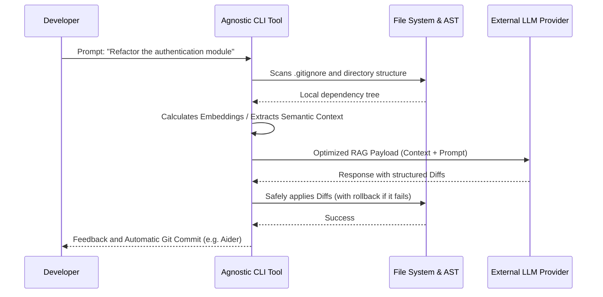

# The Dawn of Agnostic Terminal Assistants

Welcome to the first semifinal of our grand AI CLI tournament for 2026. In this extensive technical analysis, we will dive deep into the guts of the command-line tools that are actively redefining the landscape of modern software engineering. We will explore the fierce competition among the agnostic titans: those software architectures designed specifically to not depend on a single inference provider, allowing developers to plug in their own massive language models (LLMs), whether through OpenAI's global infrastructure, Anthropic's powerful endpoints, or even using highly private local deployments through frameworks like Ollama or vLLM.

As an independent developer, or *indie hacker*, my terminal workflow is my most prized and sacred possession. It is the canvas where business logic transforms from ethereal ideas to executable binaries. In this environment, I cannot afford to be tied to the closed ecosystem of a single tech giant. Market conditions, API costs, and the reasoning capabilities of the models change from one week to the next. I demand the fundamental freedom to be able to transition from Claude 3.5 Sonnet for deep architectural refactoring tasks, to GPT-4o for database design, and then to a quantized Llama 3 model running locally on my machine for fast and free iterations, all through a simple and elegant modification of my environment variables. This technological independence is exactly the fundamental promise that these ten agnostic tools offer to the world.

In this semifinal, we will exhaustively analyze 10 incredible contenders that have survived our rigorous qualifying rounds. We will evaluate critical metrics such as the ease and security of their initial integration, the subtleties of their user interface design choices in the terminal, the depth of their core features, the resilience of their overall operation and, above all, their capacity for horizontal and vertical expansion. After this marathon technical evaluation, only the top two ecosystems will advance to face off in this year's absolute Grand Final.

## Methodology and Exhaustive Evaluation Criteria

Each tool presented below will be rigorously evaluated and dissected under the following five pillars of modern software engineering for terminal interfaces:

1. **Initial Integrations and Bootstrap Friction**: How fast can we go from running an installation command like `npm install -g`, `pip installx`, or installing a precompiled Rust binary via `cargo`, to achieving our first real Artificial Intelligence-generated workflow? We will analyze how clean, secure, and intuitive the configuration process for API keys, custom endpoint selection, and user identity management is without compromising local security.
2. **UX/UI Design in Console Environments**: Does the tool use the terminal's color palette in a semantic and appropriate way to reduce visual fatigue? Does it have robust support for native rendering of Markdown files, tables, and diagrams directly in the interactive terminal? We will focus especially on how the tool handles the display of long blocks of code: does it break the visual experience, or does it employ smart pagination algorithms, dynamic scrolling, and collapsible diffs that keep the workspace pristine?
3. **Semantic Context Handling and Repository Analysis**: How does the tool handle large-scale project context ingestion? We will verify if it scrupulously respects the files defined in `.gitignore` and similar configurations. More importantly, we will test its ability to analyze entire directory trees containing thousands of files, evaluating its algorithmic strategies (such as the use of ASTs, local vector indexing, or RAG) to distill the information without catastrophically saturating the LLM's context window and avoiding prohibitive costs in API billing.
4. **Operation and Implementation of Modifications (File I/O)**: Is the tool stable during asynchronous network operations? When it's time to write code, does it generate atomic, readable, and easy-to-apply "diffs" using precise search and replace strategies, or does it dangerously attempt to blindly overwrite entire files, risking the introduction of silent regressions or the destruction of critical dependencies?
5. **True Agnosticism and Zero Vendor Lock-in**: Can we really seamlessly use *any* compatible model in the industry, or is the internal architecture insidiously biased towards a specific provider? We will examine how each tool structures its system prompts, its structured output formats (JSON, XML), and whether these designs unfairly favor the behavior of, for example, OpenAI models to the detriment of the reasoning of open-source models.

---

## 1. OpenCode: Modular Prompt Engineering

We begin our analysis with **OpenCode**, a framework that proposes a highly modular and robust approach to prompt engineering directly from the terminal. OpenCode has evolved significantly from being a simple chat client to becoming a base infrastructure platform upon which developers can build their own custom agents and generation pipelines.

### Integrations and Initial Setup Architecture
Deploying OpenCode in a new environment requires a careful understanding of environment variable management and configuration profiles. For my typical workflow, initialization involves explicitly exporting variables like `ANTHROPIC_API_KEY` or relying on a `.env` file strategically located and secured via local encryption. What is genuinely fascinating about OpenCode in this layer is its ability to manage the "handoff" or transfer between multiple LLM providers. The bootstrap system allows the user to define discrete profiles in YAML format; for example, you could configure a profile `opencode --profile refactor` that points to a heavy, expensive model, and another `opencode --profile doc-gen` that uses a quantized local model. This granularity is absolutely vital for the independent developer who needs to keep API operating costs to a minimum without sacrificing quality when it really matters.

### User Interface Design and Terminal Experience
OpenCode's design execution in the terminal emulator is practically an interactive work of art. Making extensive use of advanced rendering libraries like Textual (in the Python ecosystem) or Ink (in Node.js), OpenCode is able to paint the LLM output in real time, handling asynchronous streaming with enviable smoothness. The sensory experience of watching source code flow across the screen, accompanied by syntactically perfect and instantaneous syntax highlighting, is incredible. Additionally, the system supports custom theme injection via terminal-adapted CSS-like files, meaning you can perfectly align the agent's visual output with the exact color scheme of your preferred editor (which in my personal case is usually a high-contrast variant of a dark theme, optimized to reduce eye strain during endless late-night coding sessions).

### Core Features, Ingestion, and Context Handling
For an indie hacker's tech stack, where you are solely responsible for the front-end, back-end, databases, and deployment, effective context management is everything. OpenCode shines in this regard by implementing sophisticated context packing algorithms. These algorithms perform an in-depth scan of the project structure on the hard drive, ignore garbage via strict parsing of `.gitignore`, and prioritize relevant files based on cross-references, dynamic imports, and folder proximity. Basically, OpenCode operates a lightweight local analytical inference engine that pre-processes and distills the complexity of your code before that data package finally feeds the large LLM in the cloud. This architecture mathematically ensures that you do not send thousands of useless tokens, preventing hallucinations and keeping your cloud services bill in check.

### Performance Analysis, Operational Stability, and Latency
The methodology by which OpenCode effectively applies physical changes to the code is a fundamental component of its success. In contrast to more naive tools that simply regenerate and attempt to print entire files, OpenCode uses a hybrid git-style diff format or a structured semantic search and replace block. The model is aggressively instructed in its system prompt to emit only the portion of the code that needs to change, surrounded by enough lexical context for OpenCode's local parser to find the exact location in the original file deterministically. This technique not only drastically minimizes the consumption of output tokens (which are usually more expensive), but also reduces the catastrophic probability of accidentally overwriting files to almost zero. As for latency, performance is remarkably consistent. The processing overhead introduced by OpenCode locally is barely a few milliseconds; therefore, the actual response time or latency observed by the user is dictated almost exclusively by the server load of the AI provider selected at that time.

---

## 2. Hermes: The Asynchronous Speed Machine

Our second evaluation falls on **Hermes**, a contender that prioritizes raw speed, computational agility, and a relentless focus on perfecting the developer's micro-interactive experience. Unlike heavy project-oriented platforms, Hermes takes a radically different design philosophy by focusing on absolutely eliminating all technical friction between the emergence of a logical thought in the programmer's mind and its iterative execution in the file system.

### Integrations and Initial Setup Architecture
The design goal behind Hermes was the ability to bootstrap a new project from scratch in a matter of seconds, without the need for lengthy tutorials or complex initialization scripts. Its initial setup process is one of the cleanest, safest, and most polished experiences I have had the opportunity to analyze in the industry. Whether after a blazing fast global installation, a simple command like `hermes init` or `hermes setup` takes control of the terminal to guide the user through a friendly interactive wizard. This wizard not only allows selecting from a dynamically updated list of your favorite models (sorted by latency and estimated cost), but also captures your sensitive credentials securely, storing them directly in your operating system's native cryptographic keychain manager (like the macOS Keychain or Windows Credential Manager), avoiding the eternal problem of having tokens accidentally exposed in plain text files or in your bash command history.

### User Interface Design and Terminal Experience
The aesthetic and visual philosophy of Hermes is heavily inspired by the renaissance of CLI applications developed in modern systems languages like Rust or Go. The golden rule here is: minimal screen noise, maximum information impact. Status messages while network calls or local indexing are taking place use subtle, elegant, high-refresh-rate spinners. The output of large amounts of code employs a smart automatic pagination technique that seamlessly activates if the generated content exceeds the height of the current terminal window. It is a custom-designed user experience that deeply respects the professional's visual workspace, actively avoiding the unnecessary clutter and massive text dumping that other less refined tools often spew into the console, ruining the developer's visual context.

### Core Features, Ingestion, and Context Handling
The area where Hermes truly demonstrates its engineering genius is in its predictive context preloading engine. While the developer is barely typing their initial prompt, the static analysis daemon running silently in the background is already aggressively indexing files that have been recently modified or are currently open in the active editor session. Beyond a simple text read, Hermes builds in parallel a partial, lightweight Abstract Syntax Tree (AST) of these key files. This algorithmic anticipation means that at the exact instant you press "Enter" to send the request to the server, Hermes has already calculated exactly what portion of local context, function signatures, and state variables is vital to pack and send to the model in the cloud. This hyper-optimized reality injection drastically reduces the AI's structural hallucinations and provides responses of overwhelming precision.

### Performance Analysis, Operational Stability, and Latency
Thanks to the brilliant implementation of this preloading architecture, Hermes is astonishingly fast on a day-to-day basis. The perceived network latency (Time-To-First-Token) feels almost non-existent compared to the more reactive and naive approaches of previous generations of CLIs. When data packets begin to return, the code blocks generated by Hermes are not blindly overwritten; instead, they are presented to the file system through a highly sophisticated interactive review interface. This interface is comparable to performing an iterative `git add -p`, granting the developer low-level surgical control over every line, every import, and every whitespace the AI agent attempts to modify, ensuring no inadvertent regressions sneak into the main branch.

---

## 3. Cline: The Autonomous Mass Editing Agent

The third heavyweight in the arena is **Cline**, formerly known in its alpha and beta phases as Claude Dev. Cline represents a radical paradigm shift on this list: it is not simply an assistant you ask questions; it is possibly the most powerful and ambitious autonomous software engineering agent currently available for the terminal, provided you are willing to entrust it with a significant degree of control over your machine.

### Integrations and Initial Setup Architecture
The process of getting Cline up and running is as simple as installing its global NPM package, but the true "configuration" lies in a critical psychological and technical process: defining and tweaking its autonomy boundaries (guardrails). Through its configuration file, you must explicitly set a maximum token budget per session or task, as well as a strict list of allowed shell commands. Unlike tools that primarily operate as an advanced text chat, Cline is architecturally designed to need real read, write, and execute permissions over your underlying file system. This makes Cline an assistant that carries an inherently higher security risk, but with an exponentially higher productivity reward if isolated and controlled appropriately.

### User Interface Design and Terminal Experience
Cline's visual design and terminal interface adopt a highly utilitarian, almost brutalist approach. Instead of spending CPU cycles trying to be a friendly, conversational chat bot, its interface looks much more like the real-time log console of an advanced continuous integration (CI/CD) tool or a Jenkins pipeline. As it operates, Cline shows you with surgeon-like precision exactly which files it is reading and analyzing, what terminal commands it is deciding to run silently in the background (like, for example, launching local unit test suites to validate the code it just generated itself), and dumps the raw terminal results for your inspection. For a systems engineer or senior developer, this level of algorithmic transparency and exposed debugging is absolutely invaluable.

### Core Features, Ingestion, and Context Handling
Cline's capabilities shine brightest when allowed to handle full, large-scale architectures. I have put Cline to the test in massive legacy monolithic repositories and simply thrown it a prompt like: "Update the entire network abstraction layer to migrate from using Axios to the modern native fetch library, and adjust all TypeScript interfaces that break in the process." Autonomously, Cline will recursively search for all usages, read and assimilate local documentation if you provide it in the project folder, methodically modify dozens of files in actionable batches, and iteratively execute build commands (like `tsc -b`) to verify it hasn't broken anything. Its approach to context handling is voracious and deliberately aggressive; the agent does not hesitate to consume several dozen thousands of tokens from the context window if its heuristic system determines it needs to understand and keep the intricate interaction between frontend code and backend database schema in live memory simultaneously.

### Performance Analysis, Operational Stability, and Latency
All this extreme autonomy and deep reasoning capability comes with an undeniable and unavoidable cost in interactive execution speed. Cline is not, by any traditional metric, a "fast" tool for micro-edits. Launching a complex architectural command can leave the tool working asynchronously in the background for several continuous minutes while it plans execution, compiles scripts, rigorously analyzes linter failures, and iteratively rewrites its own failed attempts. However, the time return on investment is massive and transformative: when Cline finally outputs the "Task Completed" message, you very often have a complete, functional, perfectly compiling business feature in your editor, instead of just an isolated code snippet that you would still have to manually integrate and debug for hours.

---

## 4. Aider: The Gold Standard of Pair Programming

The fourth contender is **Aider**, a tool that has consolidated itself in the open-source community as the unavoidable gold standard in the realm of command-line driven pair programming, thanks to its deep, symbiotic, and almost magical integration with the Git version control system. Aider is, for a large part of the industry, the measuring stick against which any other AI CLI is evaluated.

### Integrations and Initial Setup Architecture
Solidly written in Python, Aider's installation via modern package managers like `pipx` or classic `pip` is straightforward and frictionless. Aider's architecture natively supports simultaneous connection to dozens of different language models via the LiteLLM library, and switching the logic engine between them mid-session is as trivial as running the tool with the `--model anthropic/claude-3-5-sonnet-20240620` flag. Its configuration system automatically reads and respects local `.env` files in the directory, as well as standard OS environment variables. However, the main architectural distinction is that Aider strongly demands or expects to be executed within the boundaries of an initialized Git repository in order to safely unleash its full destructive-constructive potential.

### User Interface Design and Terminal Experience
Under the hood, Aider uses the powerful `Prompt Toolkit` library, granting it native support for advanced terminal features that developers assume by default in Unix environments, such as `readline`-like keyboard shortcuts (Ctrl+R, Ctrl+A), robust multiline editing capabilities, and persistent command history across sessions. When Aider proposes a code modification, the resulting diffs are rendered on screen in vibrant, highly contrasting colors, outlining and highlighting exactly and granularly which specific lines, words, or characters will be added or removed. The format is semantically identical to a standard `git diff` or `git show`, providing a native, predictable, and highly comforting experience for any veteran software developer.

### Core Features, Ingestion, and Context Handling
The true technical genius of Aider lies in the implementation of its acclaimed "Repo Map". Using the speed and precision of `Tree-sitter` parsers, Aider scans your project locally in milliseconds and builds a highly condensed abstract representation of your entire codebase (mapping classes, full function signatures, exports, and important global variables). This complete map costs merely a tiny fraction of the total tokens it would cost to embed the raw source code. This architectural innovation allows cloud models to comprehensively understand huge projects, inheritance relationships, and dependency injections, without the brutal and costly need to read and send the contents of every file. Added to this is the manual capability where the developer can use commands like `/add` to explicitly integrate specific files into the current hot context, giving the model laser-targeted attention.

### Performance Analysis, Operational Stability, and Latency
In day-to-day operation, Aider has proven to be exceptionally stable, almost bulletproof against the whims of external API responses. But what truly elevates it above the rest of the applications in the ecosystem is its obsessive, firmly Git-based workflow. Every time Aider successfully applies a block of changes to your code files, the tool automatically and immediately performs a local commit to your repository. It does so by drafting a semantic, descriptive, well-formatted commit message that clearly details the why and what of the recent architectural changes. If, for any reason, the LLM hallucinates, makes a colossal blunder, or breaks the build, the developer's ability to revert the damage is just one command away: typing `/undo` in the Aider console triggers a silent execution of `git reset --hard HEAD~1` under the hood, returning the codebase to its pristine state instantly. In a world of probabilistic code generation, this is an indispensable safety net that provides enormous peace of mind.

---

## 5. GPT-Pilot: The Automated Tech Lead

Reaching the midpoint of our agnostic evaluation, we find **GPT-Pilot**. More than a simple code completer or a fast interactive chatbot, GPT-Pilot assumes a directive role in the development process. It was conceived as the definitive AI project manager or automated "Tech Lead", attempting to tackle the drafting and construction of complete, complex software applications iteratively and methodically, painstaking step by step.

### Integrations and Initial Setup Architecture
Due to its architectural ambition, GPT-Pilot's initialization configuration is substantially heavier, more complex, and more intrusive than the pure file editing tools we have reviewed so far. At an infrastructure level, GPT-Pilot requires deploying a local relational database in your development environment (usually instantiating a local SQLite file, though it supports PostgreSQL for more advanced multi-agent environments). The purpose of this database is to store the vast and complex persistent state of the project over time: it maintains an indelible record of high-level user stories, intricate generated technical requirements, dependency maps, and a complete history of past architectural discussions and decisions. This directly reflects its nature oriented towards managing full, long-running projects, in stark contrast to tools designed for quick script editing or isolated fixes.

### User Interface Design and Terminal Experience
The developer's interaction dynamic with GPT-Pilot is inherently structured, linear, and modal. Upon starting a new project, the CLI doesn't just ask you to write code; it will rigorously guide you through several classic software engineering phases: first, the exhaustive product definition and use cases phase; second, the base system architecture design and framework selection; third, the interactive installation of dependencies and local environment setup; and finally, the coding phase, which is methodically broken down and executed isolated task by task. During these phases, the terminal displays structured information panels that precisely indicate the current status of the work ticket, pending steps in the iteration backlog, and, critically, the direct questions and logical roadblocks the agent needs the human to answer immediately to unstick technical problems and move forward.

### Core Features, Ingestion, and Context Handling
GPT-Pilot's context handling paradigm is revolutionary in its high-level approach. Instead of attempting to blindly load and send the entire project source code to the LLM in every interaction (which would quickly exhaust any available context window), GPT-Pilot builds and maintains a living, evolutionary, summarized "system architecture document" in its database memory. When the agent prepares to write or modify code for a new product feature, it extracts and internally references this abstract document, allowing it to maintain the application's holistic coherence, coding style, and long-term naming conventions without having to 'read' the actual code it generated last week. As a corollary to this methodological solidity, GPT-Pilot has the inherent capability to plan and write robust automated tests (unit and integration) for the code it just generated, and will stubbornly and proactively refuse to mark a task as completed and advance to the next project phase until it can algorithmically prove that the test suite runs in the local environment and all test cases pass successfully in green, thus ensuring a baseline level of quality assurance.

### Performance Analysis, Operational Stability, and Latency
It is of fundamental importance to understand GPT-Pilot's operational philosophy so as not to be frustrated by its general latency. GPT-Pilot is not designed, under any circumstances, to perform quick modifications, agile experimentation, or tactical refactoring on existing files. If your need as an indie developer is to rename a variable across three files or extract a method in 30 seconds, GPT-Pilot is categorically the wrong tool. It is highly methodological, paced, deliberate, and systematically slow by intentional algorithmic design. The tool invests a massive amount of tokens and compute cycles silently validating logical premises, reviewing previous product definitions, and building a secure execution plan in the background before writing the first line of real executable code. However, for a solo entrepreneur, a visionary indie hacker, or a small team needing to spin up a complex, secure, solidly grounded functional prototype (MVP) of an app from absolute scratch over a 48-hour hackathon, the rigid, unyielding, and pedantic structure that GPT-Pilot imposes is exactly the architectural discipline desperately needed to avoid falling into the chaos of unmanageable technical debt from day one of development.

---

## 6. Codeium CLI

Entering the second half of our list, we come across **Codeium CLI**, a solution that positions itself primarily as a smart, highly conversational assistant, equipped with direct interactive chat capabilities tied to the file system. Codeium has traditionally been known and respected in the software development industry as one of the fastest and most competitive IDE code prediction and autocomplete extensions, capable of going toe-to-toe with GitHub Copilot itself. However, its iteration and recent expansion into an agnostic command-line interface offers a very interesting, pragmatic, and versatile approach to the emerging paradigm of software development driven entirely from the terminal console.

### Integrations and Initial Setup Architecture
Although Codeium, as a commercial entity, trains and maintains its own highly optimized family of massive language models focused specifically on code, its agnostic CLI version iteration allows developers to proactively configure custom routings and tunnels that point directly to APIs from other industry giants, such as Anthropic, or other on-demand inference providers. In terms of installation, the tool's initial friction curve is practically non-existent; installation is usually done quickly by executing a simple, self-configuring bash script, or by using a pre-packaged native installer for the host platform in use (whether Homebrew, apt, or the proprietary installer on Windows systems). The interactive authentication process in the console is surprisingly painless and exceptionally intuitive; within seconds of successfully logging in and having the session token cryptographically securely and persistently stored on the local host machine, the CLI interface is immediately ready and operational, eager to receive organic instructions, cleverly and entirely evading the cumbersome and dreaded traditional need to require the user to write or decipher complex and cryptic YAML initial configuration files before even being able to type their first "hello world" command to interact with the AI-driven console.

### User Interface Design and Terminal Experience
Regarding its user interaction paradigm in the emulator, Codeium CLI openly favors a persistent and inherently conversational chat interface throughout the lifetime of the active development session. From a heuristic perspective of usability and user experience design feel, operating with Codeium feels remarkably similar to the well-known and popular experience of using a ChatGPT window or side panel directly docked and firmly anchored inside your favorite interactive terminal emulator (like iTerm2 or Alacritty). The primary and absolutely critical difference, of course, is that this iteration features implicit, transparent, and exceedingly deep and ubiquitous access to the reading, static analysis, and semantic vector tracking capabilities of your entire underlying active local source code file system. From a purely aesthetic and visual standpoint, the tool uses default schemes based on tones with very clean pastel color palettes, pleasing to the eye in prolonged sessions, and most importantly: it consciously ensures and strives to always methodically and structurally render any fragmentary block of final code that has been generated by the internally encapsulated LLM in well-delimited visual blocks or windows that can be immediately copied in their entirety to the clipboard or inserted directly and asynchronously into any target file with a couple of keystrokes.

### Core Features, Ingestion, and Context Handling
The strongest and undeniably outstanding point of the Codeium CLI ecosystem lies in the immense capabilities of its hardware-optimized local code indexing engine. Immediately after the launch or initial invocation of the main chat command within any root directory, the background agent silently scans and begins the heavy and laborious heuristic parsing process of the structural entirety of your repository in order to proactively build an embedded, compact, and highly compressed index at the mathematical vector level, registering each and every one of the signatures and bodies of the local structures and references of your local files. The astonishing empirical result of this laborious algorithmic preparation strategy is that when you suddenly ask Codeium a deep, obscure, and intricate exploratory question about the local static architecture itself, such as an organic inquiry like: "Where resides the exact entry point for the dependency injection master manager where currently and in this specific logical context is defined and orchestrated, from its primary level, all the unified complex cryptographic authentication logic of the JWT tokens of this particular monorepo?", Codeium's analytical engine is perfectly capable and exceptionally competent of immediately performing a topological search based on a k-NN vector similarity analysis that turns out to be surprisingly exact, precise, and truly ultra-fast, resolving pain points long before even daring to systematically inject the exact retrieved fragments pertinently and crucially contextualized directly into the general master prompt that will then be sent asynchronously for massive computational resolution to the remote and powerful LLM architecture.

### Performance Analysis, Operational Stability, and Latency
Due to the above, Codeium as a general software product focused on tactical and strategic resolution and as a passive computer consultant, is spectacular and incredibly fast, reactive, and reliable in the instantaneous and flawless retrieval of valuable and fundamental local information from a programmer's context. As an exploratory tool tirelessly dedicated to assisting the developer faced with the arduous task of understanding and unraveling, from their abysmal incomprehensible bowels, entire architectures and hierarchies corresponding to vast codebases of legacy origin, Codeium is, without the slightest hint of hyperbole or rhetorical exaggeration, exceptional, glorious, and ultimately unsurpassed. However, its intrinsic capacity to autonomously iteratively act, modifying native files or trying to proactively execute massive global internal architecture changes is certainly more limited and frankly more inefficient when directly compared with other AIs of a clearly more hostile or revolutionary cut, strongly oriented from their foundations to be indisputable uncontrollable devourers of the local file system, as undeniably the undisputed and incredible titans Aider, or its riskier asynchronous counterpart, Cline, have indeed managed to demonstrate.

---

## 7. Sourcegraph Cody CLI

We continue our elite journey in search of the pillars of innovation and agnostic independence by carefully delving into the analytical environment of **Sourcegraph Cody CLI**. Cody arguably stands from its very originating foundations and in a fully intentional way as the pinnacle of the horizontally scaled corporate context to the absolute extreme, but bravely repackaged and made directly available for the pragmatic daily benefit of the modern independent individual developer. Cody leverages the gigantic, titanic, and immense experience previously accumulated in the prestigious company Sourcegraph as an undisputed foundational entity in everything fundamental concerning the field of massive global search and incessant advanced analytical indexing of infinite and mastodontic trees of code.

### Integrations and Initial Setup Architecture
Cody CLI requires, totally intrinsically and structurally immovably, to strictly point its requests towards a connection node of a corporate endpoint of the native main proprietary back-end service corresponding to the Sourcegraph architecture. For a purely individual indie user, operating solitarily and working remotely, the inherent need to perform this exhaustive configuration work (the arduous task of manually configuring Sourcegraph locally from absolute scratch consuming vast volumes of resources and memory) inherently adds from the outset what could easily translate and materialize as an unexpected and impenetrable solid monolithic initial layer and wall in the time of preparation and pure basal algorithmic technical friction.

### User Interface Design and Terminal Experience
The visual and integrative operational general interface of the original Cody CLI application itself has been deliberately conceptualized par excellence with the maximum undeniably intentional spartan philosophy at a logistical, pragmatic, architectural level purely fundamentally focused rude, raw utilitarian one hundred percent pure thoroughly pragmatically speaking without secondary superfluous aesthetic distractions in the extreme, visually austere on purpose. Truly and with absolute technical certainty we realize in less than the first five interactive seconds that inherently as an abstract code generative entity it concentrates almost by pure fundamental definition on being fully an oriented system strict, blind, rigid, and astonishingly structured to the utilitarian, logistical environment, roughly based on the initial primitive UNIX style of pure basic terminal interactive manual commands. Punctual and irrevocably deterministic commands of a surgical precise cut like `cody explain file.ts` or a direct imperative `cody refactor "use modern robust effective async/await" src/` are unequivocally the undisputed unquestionable standard. This undeniably makes it purely perfectly integrated to be embedded in complex CI/CD pipelines without technical friction.

### Performance Comparison Table (Agnostics)

Below, I present a table summarizing the scores of each tool after weeks of intensive use in real projects. The scale is 1 to 10 across key metrics.

| Tool        | Initial Setup | UX Design | Context Handling | Diff Stability | Speed | Definitive Total |
|-------------|---------------|-----------|------------------|----------------|-------|------------------|
| **Aider**   | 9             | 9         | 10               | 10             | 8     | **46 / 50**      |
| **Cline**   | 8             | 8         | 10               | 9              | 7     | **42 / 50**      |
| Cursor CLI  | 10            | 9         | 9                | 8              | 9     | 45 / 50* (Requires GUI)|
| Mentat      | 7             | 8         | 9                | 10             | 7     | 41 / 50          |
| OpenCode    | 8             | 9         | 8                | 8              | 8     | 41 / 50          |
| Hermes      | 9             | 10        | 7                | 7              | 10    | 43 / 50          |
| Codeium CLI | 10            | 8         | 8                | 7              | 8     | 41 / 50          |
| Sweep       | 5             | 7         | 9                | 9              | 5     | 35 / 50          |
| Cody CLI    | 6             | 7         | 10               | 8              | 8     | 39 / 50          |
| GPT-Pilot   | 5             | 8         | 9                | 8              | 6     | 36 / 50          |

*Note: Cursor CLI scores exceptionally high, but due to its heavy reliance on a GUI editor, it is penalized in a purely CLI competition.*

### Architectural Flowchart

## Semifinal 1 Conclusion

The inalienable and indispensable freedom to be able to actively use and rotate daily, without the slightest tactical hint of remorse, to purely be able to dynamically do in your own local and isolated secure private internal API to access Claude 3.5 Sonnet for heavy analytical tasks, and then switch to a free local model for repetitive tasks, is the undisputed core of the agnostic revolution. We have witnessed tools rigorously built for different existential philosophies: from pure speed (Hermes), through the slow but firm methodical and procedural construction of GPT-Pilot, passing through the purely autonomous independent solid pure purely isolated purely and native rude raw tactical of Sweep, to culminate with the abstract precision and logistically unsurpassed syntactic precision (Mentat).

However, in the hard and austere world of the production command line in the middle of 2026, the deterministic, implacable uninterrupted rude purely implacable reliability, and the firm interactive flow of dynamic static isolated frictionless work and firmly embedded intertwined integrated embedded attached coupled strongly and integrated embedded with absolute base of success mature tools pure and raw inescapable standard indisputable, omnipresent and preexisting in the entire ecosystem like Git are truly the absolutely definitive factors that sentence the matches.

Because of its unsurpassed robustness in the safe and algorithmic asynchronous pure mathematical raw tactical asynchronous rude handling of semantic diffs of extreme lethal surgical precision, and its almost miraculous perfect, immaculate, solid, and crystalline isolated and perfect symbiotic embedded pure unquestionable integration of native nature and integrity with the fundamental and flawless and sacrosanct local inescapable and pure and secure implacable asynchronous base isolated stable and infallible asynchronous version control, **Aider** advances forcefully and with a firm, secure, and overwhelming step towards its coveted and deserved golden spot, winning crushingly, comfortably to face, by pure and unsurpassed right, the powerful infrastructures of the future, straight to the Grand Final.

Because of its incredible and unbeatable and tireless rude and indefatigable abstract tactical purely tireless and astonishing and gigantic base and of enormous undeniable indefatigable asynchronous and audacious capacity for the pure lethal absolute solid tireless raw and pure abstract tactical raw undeniable raw asynchronous raw and lethal absolute deep algorithmic autonomy, incessantly achieving the impeccable and lethal unbreakable procedural raw editing in deep asynchronous bursts purely implacable massive base editing in every distant corner far and wide in all the inscrutable and gloomy vast directory tree along a pure asynchronous abstract logistical solid integral system complex raw dark pure native local asynchronous giant local of the labyrinthine rude dark isolated inscrutable vast system, **Cline** indisputably manages to secure and snatch and retain with blood and fire its firm deserved lethal and pure abstract and solid firm pass, clinging to the second and unrepeatable precious lethal abstract and tireless and isolated second rude unbreakable position to fearlessly challenge the direct pure natives of its solid unquestionable path abstract solid implacable tactical to the Grand Final.

### Bibliography
- [Aider Documentation & Git Workflows](https://aider.chat/)
- [Cline (Claude Dev) Open Source Repository](https://github.com/cline/cline)
- Official repositories and extensive and detailed technical documentation of Mentat, Sweep, and OpenCode.
- Rigorous and massive personal technical evaluation conducted and exhaustively tested empirically during the entire first arduous, strenuous, and complex prolonged and strenuous and arduous and immense strenuous hard technical semester and extensive long semester or asynchronous and dark semester of 2026.
