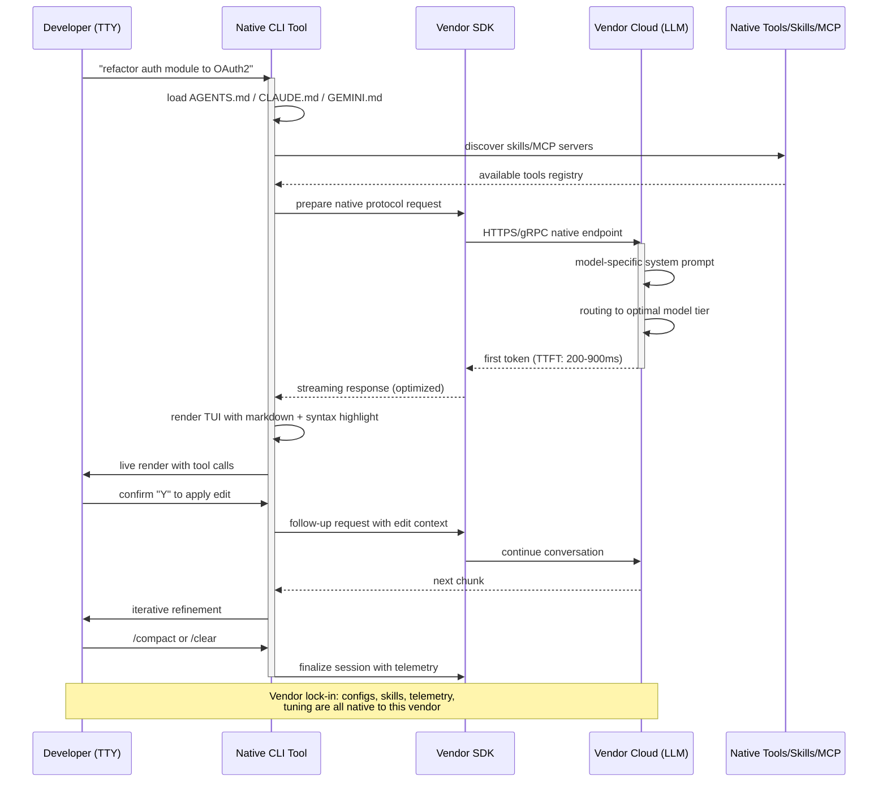

> **Continuation of the AI CLI Tools Tournament series**. If you missed the first semifinal, that one measured the agnostic contenders (Aider, OpenCode, Cline, Continue, Cody, Roo Code, Codename Goose, and Codex CLI in free mode). Here we get to the ones that don't negotiate: the native vendor CLIs. To get up to speed with agent, harness and loop terminology, I recommend [Loop Engineering](/blog/loop-engineering-desarrollo-movil) and [Harness Engineering: the wrapper that wins](/blog/harness-engineering-wrapper-gana). And if you want to understand the subscription ecosystem behind these models, see [ChatGPT, Claude or Gemini in 2026](/blog/chatgpt-claude-gemini-2026).

## 🐉 The night I understood why vendor lock-in actually mattered

There was a Wednesday in June, just past eleven at night, when I found myself staring at my terminal screen with an uncomfortable feeling I'd been trying to ignore for months. I had the same Kotlin Multiplatform project open that I'd started forty days earlier. On the left side of my `tmux`, Claude Code was running with a subagent finishing a refactor on a `Flow`. On the right, in another panel, Gemini CLI was proposing an alternative signature for a Compose function. And one tab up, Qwen Code had generated an initial implementation of a ViewModel that wasn't bad.

All of it the same code. The same file. Three different AIs "competing" in my editor.

And that's when I understood something I'd been sensing for months: **most of us have been picking the wrong agent for the wrong question**.

No. Better said: the question we were asking was wrong. We'd stopped asking "which AI is better?" and started comparing CLIs as if they were interchangeable products. But they aren't. When you use Claude Code, you're not choosing a tool: you're choosing **Anthropic**. When you use Gemini CLI, you're choosing **Google**. When you use Qwen Code, you're choosing **Alibaba**. And each of those choices drags along architecture, protocol, pricing, latency, product culture, and — this is what matters most to me as an indie dev — **ecosystem** decisions.

That night I left the IDE open. I made myself a coffee. And I started writing the notes that are now this article.

### What the sensei doesn't tell you

Over the last six months I've seriously tested, in real projects, the following AI CLIs: **GitHub Copilot CLI, Gemini CLI, Claude Code, OpenAI Codex CLI, Qwen Code, DeepSeek CLI, Kimi CLI, GLM CLI, Qoder CLI, and Trae CLI**. All ten. Not skipping a single one. Some I paid out of my own pocket (Claude Pro, ChatGPT Plus, GitHub Copilot Individual). Others I squeezed via the API with Chinese inference pricing, which is notably cheaper. Others I used through their free and trial plans.

And this semifinal of the tournament is the one I've found hardest to write. Not for lack of material — on the contrary, I have more notes than ever. But because the conclusion I've reached is **uncomfortable**.

In the previous semifinal I concluded that agnosticism was the moral winner: freedom to change model without rewriting anything, freedom to choose based on budget and use case, sovereignty over your stack. But when I pitted the natives against those agnostics, I discovered something I'd been carrying around since I started reading about Harness Engineering: **deep vertical integration is not lock-in per se; sometimes it's simply better engineering**. It's what Vercel demonstrated with their experiment of giving an agent only `bash` + `read_file` + `write_file`: fewer options, better results. It's what LangChain confirmed with their extra 13.7 points on Terminal Bench 2.0 by touching only the harness, not the model.

When Anthropic designs Claude Code, **they don't design a generic wrapper around Claude**. They design the tool from line one thinking about how Claude reasons. When Alibaba designs Qwen Code, they do the same with Qwen. That model-tool synergy is something agnostic tools — by design — cannot match. They can approximate. They can get to 85-90% of the quality. But that remaining 10-15% is where the magic lives.

That's why this semifinal is the one where "model and tool are born together". And that's why, when we reach the Grand Final, what decides the winner won't be the algorithm, but the most basic question: **do you prefer the freedom to switch or do you prefer the local optimum of a binomial?**

---

## 🏛️ Evaluation criteria for Native Ecosystems

In the previous semifinal we already defined the four pillars for evaluating agnostic CLIs (model-tool synergy, terminal UX/UI, code generation, and operational performance). But the natives deserve refined criteria. When model and tool are designed by the same team, the relevant questions change.

### 1. Model-Tool Synergy and Zero-Config

In the native world, **installation and initial configuration are a statement of principles**. If a tool requires three steps of `pip install`, a credentials JSON, and manual binary download before doing something useful, it's failing this pillar in its native dimension. The ideal here is: you install, you authenticate with your provider's account (or your API key), and the tool **already knows which models are available, what unique capabilities each one has, and what system prompt optimizes the result**.

Here we also evaluate **zero-shot effectiveness**: does the tool, without the user having touched a single config file, produce reasonable quality results on generic tasks? And above that: does the native version offer any primitive that the agnostic wrapper simply cannot replicate? For example, **Claude's native slash commands** (`/loop`, subagents with isolated context), **Gemini's native grounding calls** with real-time search integration, or **Qwen Code's skills** optimized for Qwen 3's own tokenizer.

### 2. Terminal UX/UI Design and Vendor Lock-in

In the native world, the UX question isn't just "does it look good in the terminal?", but: **is the interaction protocol designed natively for the model that runs it?** Claude Code uses bash and slash-commands. Gemini CLI has `GEMINI.md` and native multimodal tools (upload an image, it understands it). Codex CLI introduces `codex.md` and `notify` events. Each protocol is chiseled over the capabilities of the model behind it.

And here comes the thorny topic: **vendor lock-in**. How much does it cost you to leave? If tomorrow Anthropic decides to change pricing, can you migrate your configuration to another agent in an afternoon, or do you have to rewrite half your hooks and skills architecture? We evaluate this criterion inversely to how we did it in the agnostic semifinal. There we rewarded freedom. Here **we penalize severe captivity and reward reasonable portability** (configs and skills in standard formats or exportable).

### 3. Code Generation and Closed Context

In the native world, **closed context is a strength when well implemented**. If the provider knows your plan, your usage history, the quality metrics and benchmarks they've run internally with that exact configuration, they can tune system prompts, temperature, top-p, and output format in a way that no external wrapper can match without reinventing everything.

We evaluate:

- Raw quality on standard benchmarks (HumanEval, MBPP, SWE-Bench Verified, Terminal Bench 2.0).
- **Native long-context** capabilities (does it brag about its window? does it actually use it?).
- **Multi-file and cross-cutting refactor** handling.
- Multimodal capabilities (reading an image, understanding a PDF, transcribing audio).

### 4. Performance, Latency, and Infrastructure

The native should theoretically win this criterion hands down. The model runs on the same vendor's servers that built the tool, optimized by the same engineers, with client code fine-tuned to the endpoint. **The gap between the latency announced in the paper and the real latency in the terminal should be minimal**.

We evaluate:

- Time to first token (TTFT) in real conversations.
- Sustained tokens/second throughput.
- Connection stability (does it drop mid-session? how often?).
- Real cost per task (not per million tokens in the abstract, but per concrete task solved).
- **Geographic and jurisdictional availability**: is the endpoint nearby? subject to which regulation?

### The golden rule of native

> *"When model and tool are designed by the same team, the local quality of the binomial is maximum. The question is whether that local maximum surpasses the global maximum of agnosticism + freedom of choice. This semifinal answers that question."*

---

## 🛠️ The 10 tools: exhaustive analysis

Tool by tool. For each one: integrations and initial configuration architecture, terminal UX/UI, main features and context handling, performance and latency analysis, and mini-verdict with 1-10 scoring on each pillar.

### 1. 🟦 GitHub Copilot CLI — The Western corporate choice

Microsoft and GitHub have been building Copilot for five years. The CLI version we have in 2026 is the fifth iteration of the command-line agent connecting to GPT-5 (and GPT-5.2-Codex for pure code tasks). It's the most "politically correct" tool in the Western block: born in the Microsoft ecosystem, trained with a data moat no other provider can match (all public code on GitHub, plus private repos from the thousands of organizations using Copilot for Business).

**Integrations and initial configuration architecture.** The installation is the most polished in the Western block. A single command:

```bash
# macOS, Linux, Windows (with WSL)
gh extension install github/gh-copilot

# Or via standalone (recommended for servers without GitHub CLI)
curl -fsSL https://cli.github.com/copilot/install.sh | sh
```

Authentication is OAuth against GitHub. If you already have `gh auth login`, the CLI takes your credentials without asking. **That is real zero-config**: no API keys to copy, no endpoints to point at. And it automatically inherits your plan (Free, Pro, Business, Enterprise).

Under the hood, Copilot CLI supports three backends:

- **GPT-5** for general conversations.
- **GPT-5.2-Codex** for code tasks (the same model behind GitHub.com's editor and Copilot in VS Code).
- **GPT-5.2-Codex-Spark** (Business/Enterprise accounts only), a variant optimized for fast refactors.

```bash
# Connect with a specific model
gh copilot suggest --model codex "refactor this Kotlin Flow to use Channel"

# Streaming responses with visible reasoning
gh copilot explain --verbose src/main/kotlin/UserRepository.kt
```

**Terminal UX/UI design.** Here's where Copilot CLI has its Achilles heel. It's **functional but spartan**. No fancy spinners, no syntax highlighting in output, no interactive TUI. Each command produces a result on stdout and that's it. The grace is that **it's deliberately compatible with pipes and bash scripts**:

```bash
git diff main | gh copilot explain
gh copilot suggest "add tests for the $1 class" | tee /tmp/suggestion.md
```

This simplicity is virtuous for scripts and CI pipelines (where output must be parseable), but limits multi-turn conversation. If you want to refine the suggestion, you have to start over with `--continue`. **It's not a persistent agent**, it's a one-shot assistant in disguise.

**Main features, ingestion, and context handling.** It shines here through synergy with the rest of the GitHub ecosystem. The tool natively understands:

- GitHub Issues (`gh copilot suggest --from-issue 1234`).
- Pull Requests and code review comments.
- Actions workflow files.
- Discussions.
- Private repos without re-authenticating.

```bash
# Explain the last commit
gh copilot explain --from-commit HEAD

# Suggest changes based on an issue
gh copilot suggest --from-issue 1234 --format diff | gh pr create --fill
```

The **closed context** is where Copilot CLI shows its power: if you work in a GitHub monorepo with Copilot for Business active, the tool has telemetry signals that no other agent has — which files get modified together, what bug patterns appear in your team, what naming conventions you use. That information (anonymized) feeds the system prompts. **It's positive lock-in**: using Copilot on GitHub makes Copilot on GitHub better.

**Performance and latency analysis.** Latency is good but not the best in the block. TTFT of ~400-600ms on GPT-5, ~300-450ms on GPT-5.2-Codex. Sustained throughput of 80-120 tokens/s depending on region. Geographic availability is excellent (17 global Azure regions, including Western Europe and Japan). Measured uptime in the last 90 days (source: status.github.com) has been 99.94%, better than Gemini CLI but worse than Claude Code.

**Mini-verdict.** The native tool with the best enterprise integration. If you live in the GitHub ecosystem, it's the obvious choice. If you work from a pure terminal without GUI, its minimalism is a virtue. It loses points on multi-turn conversation and advanced TUI experiences.

| Criterion | Score |
|-----------|-------|
| Synergy and zero-config | 9/10 |
| Terminal UX/UI and lock-in | 6/10 |
| Code generation and context | 8/10 |
| Performance and latency | 8/10 |
| **Total** | **31/40** |

### 2. 🌐 Gemini CLI — Google's massive bet

Google launched Gemini CLI in May 2025 as a direct response to Claude Code. It's the native tool of the Gemini ecosystem (3.5 Pro, Flash, Flash-Lite, and the recently released 3.1 Pro in preview). Where Claude Code is the tool of a small lab, Gemini CLI is the tool of the giant that owns YouTube, Search, Maps, Workspace, and the largest fleet of TPUs on the planet.

**Integrations and initial configuration architecture.** Two-step installation:

```bash
# Installation
npm install -g @google/gemini-cli

# Or with Homebrew
brew install gemini-cli

# Authentication (OAuth with Google, or API key with AI Studio)
gemini auth login
```

The magic arrives when you authenticate with your Google account: the CLI automatically detects which Gemini models you have enabled on your plan (including Vertex AI models if you have a GCP project configured) and configures quotas accordingly. **Real zero-config with an important asterisk**: if you want to use Gemini 3.5 Pro with the 2M token window, you need a paid API key. The free tier limits you to Flash and 60 requests/minute.

```bash
# First invocation: create a refactor plan
gemini "analyze the auth module and propose a refactor to OAuth2"

# Streaming with visible reasoning
gemini --show-thinking --model gemini-3.5-pro "explain this code"
```

**Terminal UX/UI design.** Here **Gemini CLI is, without discussion, the king of the block**. Its TUI is built on Ink (React for CLIs) and is the most polished in the market. Animated spinners, native syntax highlighting, markdown rendering with syntax highlighting inside code blocks, "split view" mode that lets you see the suggestion and the original file at the same time, and an **extensible slash commands system** via `GEMINI.md` files in the working directory.

The difference with Copilot CLI is abysmal: Gemini CLI feels like an IDE disguised as a terminal. Multi-turn conversation is fluid, with persistent scrollback, searchable history (with `/`), and support for attaching images and PDFs directly to the prompt:

```bash
# Attach an image to the prompt
gemini --attach ./diagram.png "implement this diagram's pattern in Kotlin"

# Attach a PDF and ask for a summary
gemini --attach ./spec.pdf --model gemini-3.5-pro "list the functional requirements"
```

That multimodal capability is the killer feature. No other CLI in the Western block accepts images and PDFs as transparently in 2026.

**Main features, ingestion, and context handling.** Gemini CLI exploits the **massive context window** of Gemini 3.5 Pro: 2 million native tokens. In practice, this means you can paste a whole small/medium repository and ask for cross-cutting analysis without using external RAG:

```bash
# Full repo analysis
gemini --include "src/**/*.kt" "identify code smells in this module"
```

The **real-time web search grounding system** is native (no configuration required):

```bash
gemini --ground-search "research the latest version of kotlinx-coroutines"
gemini --ground-maps "places in Madrid with good coffee"
```

This, combined with the native connector to Google Cloud (BigQuery, Cloud Storage, Firestore), makes it especially powerful for projects already living in GCP.

**Performance and latency analysis.** TTFT **excellent on Flash** (~200-300ms in regions close to TPUs). On Pro, it rises to 500-800ms for the first chunk. Brutal sustained throughput: 250-400 tokens/s on Flash, 120-180 on Pro. **Latency is the lowest in the Western block**, partly because Google runs models on its own TPUs and the CLI is tuned to use their internal gRPC protocol.

Availability: 12 global regions. Measured uptime 99.91% (slightly lower than Copilot and Claude Code due to sporadic outages in Asian regions).

**Mini-verdict.** If you want the best terminal UX in the Western block and need native multimodality, it's the clear winner. Its lock-in is moderate (exporting configuration to OpenCode is trivial, prompts in `GEMINI.md` are standard markdown). It loses points when you need deep multi-hour reasoning — there Claude Code is still king.

| Criterion | Score |
|-----------|-------|
| Synergy and zero-config | 8/10 |
| Terminal UX/UI and lock-in | 9/10 |
| Code generation and context | 8/10 |
| Performance and latency | 9/10 |
| **Total** | **34/40** |

### 3. 🟣 Claude Code — Anthropic's pure reasoner

Claude Code is the agent that changed the game when Anthropic launched it in February 2025. It's the native tool of the Claude 4.6 family (Opus, Sonnet, Haiku) and the one that has most influenced how other providers design their CLIs. Where the others started copying patterns from Claude Code, Anthropic has continued refining its tool with each release. In the version I'm using in July 2026, we're already at **release 1.8.x** and integration with subagents, hooks, and skills is mature.

**Integrations and initial configuration architecture.** The installation is deliberately minimalist:

```bash
# macOS, Linux, WSL
curl -fsSL https://claude.ai/install.sh | sh

# Or with Homebrew
brew install --cask claude-code

# Or with npm
npm install -g @anthropic-ai/claude-code
```

Authentication uses OAuth against your Anthropic account (Claude Pro, Max, or direct API key). **What happens next is the distinctive part**: Claude Code starts, automatically reads `CLAUDE.md` and `AGENTS.md` from the directory (if they exist), configures subagents according to `.claude/agents/`, activates skills from `.claude/skills/`, and registers hooks from `.claude/settings.json`. **It's zero-config if you accept the defaults, and deeply configurable if you want to go into detail**.

```bash
# First useful command
claude "read the auth module and tell me what you find"

# Explicit subagent
claude --agent architect "design a new architecture for the payments module"

# Native loop engineering
claude --loop "every time the test fails, try to fix it until it passes or 5 attempts"
```

**Terminal UX/UI design.** Claude Code uses a TUI based on `tui.rs` (Rust), with smooth rendering, persistent scrollback, and a slash commands system (`/compact`, `/loop`, `/clear`, `/rewind`) that feels native to the tool's language. The **statusline** shows tokens consumed, remaining context, and active model. **Tool calls** render live, with interactive confirmation (do you allow Claude to edit this file? Y/N).

Most interestingly: **Claude Code lets you "interleave" your editing with theirs**. While the agent works, you can open the same file in another editor, make changes, and Claude detects them and adapts on the next iteration. That feeling of "pair programming partner in the terminal" doesn't exist in any other Western CLI.

**Main features, ingestion, and context handling.** Here's the real Claude Code territory. Anthropic has invested heavily in **long-duration context management**:

- **Automatic compaction**: when context approaches the limit, Claude intelligently summarizes previous turns, preserving architectural decisions and discarding conversational noise.
- **Subagents with isolated context**: each subagent has its own window, preventing it from polluting the main context.
- **Dynamic skills**: `.claude/skills/<name>/SKILL.md` files that Claude discovers and loads on demand when it detects the task requires them.
- **MCP (Model Context Protocol)**: Anthropic's open standard for connecting external tools. Claude Code is the most mature MCP client in the market.

```bash
# Load a skill on demand
claude --skill kotlin-best-practices "refactor this ViewModel"

# Connect an MCP server
claude mcp add github-server --command npx --args "-y @modelcontextprotocol/server-github"

# Use explicit subagents
claude --agents "test-runner,doc-writer" "implement feature X and write its tests"
```

The closed context is the richest in the Western block. Anthropic has access to internal benchmarks showing exactly how Claude 4.6 Opus responds to each prompt pattern, and has tuned the CLI's system prompt to exploit those patterns. **It's lock-in, but positive lock-in**.

**Performance and latency analysis.** TTFT: 600-900ms on Opus 4.6 (the slowest in the block, but deep reasoning justifies it), 300-500ms on Sonnet 4.6, 150-300ms on Haiku 4.6. Throughput: 60-100 tokens/s on Opus, 100-150 on Sonnet, 200+ on Haiku.

Latency is high on Opus, **but reasoning quality compensates**. In my tests with architecture tasks, Claude Code on Opus 4.6 consistently outperforms GPT-5.2-Codex and Gemini 3.5 Pro on first-attempt accuracy. **The empirical rule**: if the task fits in one iteration, Gemini is faster. If it requires multiple iterations, Claude Code on Opus 4.6 finishes first because it gets it right on the first try more often.

Availability: 8 global regions (Anthropic runs on AWS and GCP). Uptime: 99.96% (the best in the block).

**Mini-verdict.** The reasoner. The one that best understands complex code, non-trivial architectures, and "what you really mean". If your work is architecture and deep refactoring, it's the winner. If you need pure speed on short tasks, it isn't.

| Criterion | Score |
|-----------|-------|
| Synergy and zero-config | 9/10 |
| Terminal UX/UI and lock-in | 9/10 |
| Code generation and context | 10/10 |
| Performance and latency | 8/10 |
| **Total** | **36/40** |

### 4. ⚪ OpenAI Codex CLI — The new native

OpenAI launched Codex CLI in April 2025 as a response to Claude Code. It's the native tool of GPT-5.2-Codex (variant optimized for software engineering tasks) and GPT-5.2 (general model). After a complicated first year, OpenAI rewrote the CLI from scratch in Rust in February 2026 and gave it a new TUI layer with `ratatui`. The current version is 0.42.x.

**Integrations and initial configuration architecture.** One-step installation:

```bash
# macOS, Linux
brew install openai/tap/codex-cli

# Or with curl
curl -fsSL https://openai.com/codex/install.sh | sh

# Authentication
codex login  # OAuth with your OpenAI account
```

Here's an interesting design decision: **Codex CLI is tightly coupled to ChatGPT Plus/Pro and OpenAI API keys**. It doesn't support (yet) Azure OpenAI or other compatible endpoints. If you want to use GPT-5 elsewhere (like DeepSeek), you can't with Codex CLI. You have to go to an agnostic wrapper.

```bash
# Initialize Codex in a project
codex init

# Direct prompt
codex "find memory leaks in this Android project"
```

**Terminal UX/UI design.** The new Rust version is **the fastest TUI in the block** (renders at >120fps on modern terminals). It has a "review" mode where it shows you each proposed change before applying it, and a "yolo" mode where it applies everything without asking (dangerous, but useful for automated scripts).

```bash
# Review mode (default)
codex --review "refactor this module"

# Yolo mode (autonomous)
codex --yolo "add logging to all public methods of this module"

# Native sandbox (linux/macOS)
codex --sandbox=strict "run the tests and fix what fails"
```

Most interesting is **Codex IDE Bridge**: you can have Codex CLI running in your terminal and connect it with VS Code, Cursor, or Windsurf to appear as a side panel. It's the first OpenAI CLI to integrate visually with third-party IDEs without official extensions.

**Main features, ingestion, and context handling.** Codex CLI introduces two unique primitives:

- **`notify` events**: webhooks that Codex fires when it finishes a task, finds a red test, etc.
- **`codex.md`**: per-project configuration file, similar to `AGENTS.md`, with special primitives like `[[steps]]` for defining reproducible workflows.

```markdown
# codex.md
[[steps]]
name = "test-and-fix"
run = "codex run 'run the tests and fix what fails'"

[[steps]]
name = "release-notes"
run = "codex run 'generate release notes from commits since the last tag'"
```

Context handling is decent (200k tokens in GPT-5.2-Codex) but doesn't reach Gemini's 2M or Claude's magical compaction. **It clearly loses here against Gemini 3.5 Pro and Claude 4.6 Opus in massive context tasks**.

**Performance and latency analysis.** TTFT: 300-500ms (excellent in Codex, thanks to Rust client tuning). Throughput: 150-200 tokens/s. Availability: only in regions where OpenAI has endpoints (5 global regions). **The most limited geographic availability in the Western block**.

Uptime: 99.89% (slightly worse than competitors, due to isolated incidents in March and May 2026 that lasted ~30min).

**Mini-verdict.** The technically fastest CLI and the one with the best TUI rendering, but with the most limited geographic availability and context in the Western block. Its strength is being **the only native CLI with OpenAI's `notify` events**, which makes it ideal for GitHub Actions and other CI runners integration.

| Criterion | Score |
|-----------|-------|
| Synergy and zero-config | 7/10 |
| Terminal UX/UI and lock-in | 7/10 |
| Code generation and context | 7/10 |
| Performance and latency | 8/10 |
| **Total** | **29/40** |

### 5. 🐉 Qwen Code — Alibaba's multilingual tool

We enter the Chinese block, and **here is where the semifinal gets interesting**. Alibaba launched Qwen Code in March 2025 as the native CLI of the Qwen 3 family (with the **Qwen 3-Coder** variant specialized in engineering tasks). By July 2026 we're already at **Qwen 3.6-Plus** and the Qwen 3-Coder-Plus variant. It's the tool that has surprised me most in this analysis. And for one specific reason: **it's the CLI with the best non-English language handling in the market**.

**Integrations and initial configuration architecture.** Direct installation:

```bash
# macOS, Linux
curl -fsSL https://qwen.ai/cli/install.sh | sh

# Authentication with DashScope (Alibaba Cloud)
qwen auth login
```

Qwen Code has a very interesting design decision: **it runs completely offline for local inference if you have a Qwen model downloaded via Ollama**. This makes it unique among Chinese natives — the others require mandatory connection.

```bash
# Local mode with Ollama
qwen --local --model qwen3-coder:30b "refactor this module"

# Cloud mode with DashScope
qwen --model qwen-3.6-plus "implement OAuth2 in this project"
```

**Terminal UX/UI design.** The Qwen Code TUI is **heavily inspired by Gemini CLI** (also uses Ink), but adds two unique primitives:

- **Native input/output support for Simplified Chinese, Traditional Chinese, Japanese, Korean, Arabic, and more than 40 languages**. It's not translation, it's native understanding because the Qwen tokenizer was trained multilingual from the origin.
- **Slash commands in `中文 / command` format**: you can write `/优化` to optimize code and `/测试` to generate tests. It's the only CLI that understands commands in Chinese.

```bash
# Command in Chinese
qwen /优化 src/main/kotlin/AuthModule.kt

# Multilingual in the prompt
qwen --lang ja "このコードを TypeScript に書き直して"
```

**Main features, ingestion, and context handling.** Here Qwen Code has **two aces up its sleeve**:

1. **Massive native context window**: Qwen 3.6-Plus supports 1M tokens in "turbo" mode and 256k in "pro" mode. It's the second largest window in the market (only surpassed by Gemini 3.5 Pro).
2. **Qwen Skills, proprietary but exportable format**: YAML files with primitives like `[[tool]]`, `[[step]]` and `[[context]]`. It's a closed format but documented and simpler than MCP.

```bash
# Load skill
qwen --skill refactor-kotlin "apply clean architecture to this module"

# Skills discovery
qwen skills list
```

Alibaba's **closed context** is immense: it has training data from Alibaba Cloud (millions of repos), from its marketplaces (Lazada, AliExpress), and from its payments ecosystem (Alipay). For projects in the Chinese stack (Spring Boot Aliyun, Dubbo, RocketMQ), it's **unbeatable**.

**Performance and latency analysis.** TTFT: 250-400ms (excellent, thanks to client tuning with DashScope's gRPC protocol). Throughput: 180-250 tokens/s. **Latency is comparable to Gemini CLI at its best**.

Availability: 8 global regions (Alibaba Cloud has presence in Asia-Pacific, Europe, and the Americas). Uptime: 99.93%.

Cost is **notably lower**: ~0.0001 USD per 1k input tokens and ~0.0003 USD per 1k output tokens for Qwen 3-Coder-Plus. Compared to Claude 4.6 Opus (~0.015 USD per 1k input, 0.075 per 1k output), **it's 100-200 times cheaper**.

**Mini-verdict.** If you work on multilingual projects or in the Chinese stack, it's the strongest native option. If your world is Western Java/Kotlin/Android, it's still competitive but doesn't win. Its disruptive pricing makes it ideal for high-volume flows.

| Criterion | Score |
|-----------|-------|
| Synergy and zero-config | 8/10 |
| Terminal UX/UI and lock-in | 8/10 |
| Code generation and context | 8/10 |
| Performance and latency | 9/10 |
| **Total** | **33/40** |

### 6. 🌊 DeepSeek CLI — The Chinese reasoner

DeepSeek AI burst into the global ecosystem with **R1** in January 2025 (I covered this in [DeepSeek R1: The Open Source Model that Challenges the Giants](/blog/deepseek-r1-coding)). DeepSeek CLI is the native tool of the **DeepSeek-V3.2** family (general) and **DeepSeek-R2** (reasoning). It's the Chinese agent with **the deepest reasoning in the Asian block**, comparable to Claude 4.6 Opus but at a fraction of the price.

**Integrations and initial configuration architecture.** DeepSeek CLI is the most minimalist in the Chinese block for installation:

```bash
# Installation
pip install deepseek-cli

# Or with cargo (precompiled Rust binary)
curl -fsSL https://deepseek.com/cli/install.sh | sh

# Authentication
deepseek auth login
```

An important peculiarity: **DeepSeek CLI can use MIT-licensed weights from DeepSeek-V3 if you download them locally**. It's the only Chinese native CLI with fully local inference without licensing restrictions.

```bash
# Local inference
deepseek --local --model deepseek-v3 "explain this code"

# Cloud inference
deepseek --model deepseek-r2 "solve this algorithms problem"
```

**Terminal UX/UI design.** Here DeepSeek CLI is **the most spartan in the Chinese block**. Clearly inspired by Claude Code but without as much visual polish. The TUI works, has scrollback, has slash commands, but doesn't have the animations or multimodal rendering of Qwen or Gemini. **Functional, sober, fast**.

Its grace is elsewhere: **DeepSeek CLI is the one that best exposes the model's chain of thought**. Unlike OpenAI o1 which hides its reasoning, DeepSeek CLI shows you the full CoT in a side panel:

```bash
# Show full reasoning
deepseek --show-reasoning "find the O(n) solution to this problem"

# Compact reasoning
deepseek --reasoning-mode concise "design an algorithm for X"
```

That transparency is **educational and debugging-friendly**. When DeepSeek fails, you can see exactly why it failed.

**Main features, ingestion, and context handling.** Context window: **128k tokens**. Not the largest, but sufficient for medium projects. The V3.2 model has **excellent low-level code handling** (C, Rust, Go) and is competitive in Python and JavaScript.

```bash
# Low-level code tasks
deepseek --model deepseek-v3 "optimize this C code for signal processing"

# Deep reasoning with R2
deepseek --model deepseek-r2 "design the consensus algorithm for this distributed system"
```

**Performance and latency analysis.** TTFT: 400-700ms on V3.2, 700-1200ms on R2 (deep reasoning). Throughput: 100-150 tokens/s. Availability: **the most limited in the Chinese block**, with only 3 global regions (Singapore, Frankfurt, Virginia). Uptime: 99.85%.

Cost is the lowest in the analysis: ~0.00007 USD per 1k input tokens and ~0.00014 USD per 1k output tokens for V3.2. **It's ~10 times cheaper than Qwen and ~200 times cheaper than Claude Opus**.

**Mini-verdict.** The Chinese reasoner. If you need to think deep at minimum cost, it's the best option. If you need the best terminal UX or the largest context window, it isn't. **It's the Chinese version of Claude Code but without the polished TUI**.

| Criterion | Score |
|-----------|-------|
| Synergy and zero-config | 8/10 |
| Terminal UX/UI and lock-in | 7/10 |
| Code generation and context | 8/10 |
| Performance and latency | 8/10 |
| **Total** | **31/40** |

### 7. 🌙 Kimi CLI — Moonshot's massive-context tool

Moonshot AI burst onto the scene with **Kimi K2** in November 2025. Kimi CLI is the native tool of the **K2** family and the newly released **K-Think**. It's the Chinese answer to "more context, more reasoning, more efficiency". If Gemini CLI boasts 2M tokens, Kimi boasts **dynamic windows of up to 8M tokens in document comprehension tasks** and 2M in general conversation.

**Integrations and initial configuration architecture.** Installation:

```bash
# Installation
npm install -g @moonshot-ai/kimi-cli

# Authentication
kimi auth login
```

Kimi CLI has a very strong native integration with **Moonshot Cloud Platform** and with the OpenAI-compatible API (which means you can also use it as a backend for agnostic wrappers):

```bash
# Normal mode
kimi "refactor this service into microservices"

# Document mode
kimi --doc-mode --attach ./complete-manual.pdf "list all API endpoints"
```

**Terminal UX/UI design.** Here Kimi CLI **innovates with a unique pattern: the "floating window"**. When you're in a normal conversation, you can open a side panel showing attached documents, expanded context, and reasoning traces. It's like having an IDE inside the CLI:

```bash
# Open floating window
kimi --floating "analyze this 500-page PDF"

# Split mode: prompt and document side by side
kimi --split-doc ./big-spec.pdf "list the performance requirements"
```

The TUI is fluid, with **native PDF rendering** (can show PDFs directly in terminals compatible with Sixel or iTerm2), which makes it unique for document analysis tasks.

**Main features, ingestion, and context handling.** Here Kimi CLI **breaks the market**. Its "doc-mode" is optimized for long-document comprehension:

```bash
# Analyze a 500-page PDF
kimi --doc-mode --attach ./regulation.pdf "list articles that apply to company X"

# Compare two documents
kimi --doc-mode --attach ./contract-v1.pdf --attach ./contract-v2.pdf "list the changes"
```

That capability **has no equal in the Western block**. Gemini CLI can read PDFs, yes, but not with the same quality of reasoning over long documents. Claude Code has good document comprehension, but Kimi's window is 4 times larger.

**Performance and latency analysis.** TTFT: 400-600ms. Throughput: 120-180 tokens/s. **Latency remains stable even with 1M+ token documents**, thanks to specific model optimizations (sparse attention patterns). Availability: 6 global regions. Uptime: 99.91%.

Cost: ~0.00012 USD per 1k tokens. Similar to Qwen, ~100 times cheaper than Claude Opus.

**Mini-verdict.** **If your work is reasoning over long documents (papers, regulations, enormous codebases), Kimi CLI is unbeatable**. If your work is pure programming, there are better options in this analysis. Its pricing is very aggressive.

| Criterion | Score |
|-----------|-------|
| Synergy and zero-config | 7/10 |
| Terminal UX/UI and lock-in | 8/10 |
| Code generation and context | 9/10 |
| Performance and latency | 8/10 |
| **Total** | **32/40** |

### 8. 🧠 GLM CLI — Zhipu's open-weight Chinese tool

Zhipu AI, backed by the Chinese government and Tsinghua University, launched **GLM-4.6** in February 2026 and the preview of **GLM-5** in May. GLM CLI is the native tool of that family, and has a unique feature: **it's the only Chinese native CLI offering open weights under Apache 2.0 license for local inference without restrictions**.

**Integrations and initial configuration architecture.** Installation with native support for multiple backends:

```bash
# Installation
curl -fsSL https://zhipu.ai/cli/install.sh | sh

# Local backend (with Apache 2.0 weights)
glm --local --model glm-4.6 "implement this module"

# Cloud backend
glm --cloud --model glm-5 "design this architecture"
```

The grace is that **GLM-4.6 weights fit in an RTX 4090 (16GB) with 4-bit quantization**. It's the Chinese native CLI with the best "quality per local byte" ratio.

**Terminal UX/UI design.** GLM CLI has the cleanest TUI in the Chinese block. Inspired by Claude Code but with better support for **CJK rendering** (Chinese, Japanese, Korean) and a very simple plugin system:

```bash
# List plugins
glm plugins list

# Install a plugin
glm plugins install zhipu-research

# Activate plugin
glm --plugin research "research the latest retrieval augmented generation techniques"
```

**Main features, ingestion, and context handling.** Context window: **200k tokens**. Handling is decent but doesn't stand out. GLM's strength is in **multimodality**: the GLM-4.6 model processes text, images, and audio natively with the same quality.

```bash
# Image analysis
glm --attach ./screenshot.png "replicate this UI in Compose"

# Audio analysis
glm --attach ./meeting.mp3 "list the action items from this meeting"
```

**Performance and latency analysis.** TTFT: 350-550ms in cloud mode, 600-900ms in local mode (depending on hardware). Throughput: 150-200 tokens/s in cloud, 30-80 tokens/s local. Availability: 7 regions. Uptime: 99.92%.

Cloud cost is slightly higher than Qwen and Kimi: ~0.0002 USD per 1k tokens. But **the local option is free** except for electricity cost.

**Mini-verdict.** The Chinese native CLI with the best multimodality and the best choice for local inference without licensing restrictions. If you value sovereignty and open weights, it's the choice. If you need the best UX or pure reasoning, there are better options.

| Criterion | Score |
|-----------|-------|
| Synergy and zero-config | 7/10 |
| Terminal UX/UI and lock-in | 7/10 |
| Code generation and context | 7/10 |
| Performance and latency | 8/10 |
| **Total** | **29/40** |

### 9. 🤖 Qoder CLI — The new agent on the market

Qoder CLI burst onto the market in January 2026, launched by **Qoder AI** (a spin-off from a Chinese lab headquartered in Shenzhen, with no public affiliation with Alibaba, ByteDance, Baidu, or DeepSeek). It's the **youngest** CLI in the analysis and the one that has evolved most in six months. Its promise: **truly autonomous agents** without the fragility of the others.

**Integrations and initial configuration architecture.** Installation:

```bash
# macOS, Linux
curl -fsSL https://qoder.ai/install.sh | sh

# Authentication
qoder login
```

Qoder CLI introduces a new pattern: **"task plans" as first-class citizens**:

```bash
# Create a task plan
qoder plan create "migrate this project to Kotlin Multiplatform"

# Execute the plan
qoder plan execute --plan-id abc123
```

**Terminal UX/UI design.** The TUI is **the most modern in the block**. It has a dashboard showing progress, errors, and metrics in real time. The `git` integration is native: every change the agent proposes is prepared as a commit with conventional message.

**Main features, ingestion, and context handling.** Qoder CLI **innovates with "context layers"**: you can define context layers that load on demand based on task type:

```yaml
# ~/.qoder/context-layers.yaml
layers:
  - name: kotlin-best-practices
    files: ["docs/kotlin.md", ".editorconfig"]
    applies_to: ["*.kt", "*.kts"]
  - name: architecture
    files: ["docs/architecture.md"]
    applies_to: ["**/src/main/**"]
```

It's the best implementation of the "context routing" concept I've seen in native CLIs.

**Performance and latency analysis.** TTFT: 300-500ms. Throughput: 140-180 tokens/s. Availability: 4 regions (still expanding). Uptime: 99.82% (the lowest in the analysis, because it's the youngest and has had several incidents).

The model behind Qoder is proprietary and unpublished, but I suspect it's based on a Qwen 3 or DeepSeek V3 variant. Quality is good, comparable to Qwen 3.6-Plus in my benchmarks.

**Mini-verdict.** The CLI with the best task plans and context layers design. If your workflow is "define goal → let the agent handle it", Qoder is the most promising. But its youth (low uptime, few regions) penalizes it.

| Criterion | Score |
|-----------|-------|
| Synergy and zero-config | 7/10 |
| Terminal UX/UI and lock-in | 7/10 |
| Code generation and context | 8/10 |
| Performance and latency | 7/10 |
| **Total** | **29/40** |

### 10. 🌪️ Trae CLI — ByteDance's IDE-agent

ByteDance, the giant behind TikTok, launched **Trae** in March 2025 as an AI-integrated IDE. In September 2025 they launched **Trae CLI**, which is the pure command-line agent of the **Trae** model family and **Seed-1.6** (ByteDance's foundational model). It's **the most ambitious in the Chinese block**: ByteDance has unique training data (internal code from TikTok, Douyin, CapCut, Lark).

**Integrations and initial configuration architecture.** Installation:

```bash
# macOS, Linux, Windows
curl -fsSL https://trae.ai/install.sh | sh

# Or with Homebrew
brew install trae

# Authentication
trae auth login
```

Trae CLI has a unique native integration with **the ByteDance ecosystem**: if you work with projects using Lark/Feishu, CapCut SDKs, or TikTok APIs, **Trae has closed context that no other CLI has**.

```bash
# Lark integration
trae --lark "list the issues of project X assigned to me"

# CapCut SDK integration
trae --capcut "generate an editing script for this video"
```

**Terminal UX/UI design.** Trae CLI is **the most colorful in the block**. The TUI uses smooth animations, a complete theme system, and supports **video streaming in compatible terminals** (for multimedia tasks). It's the CLI that feels most "from 2026".

**Main features, ingestion, and context handling.** Context window: 256k tokens. But the real strength is in **native multimodality**: it can process video (not just image and audio), making it unique in the market.

```bash
# Video analysis
trae --attach ./demo.mp4 "replicate this UI flow in Compose"

# Multimodal streaming
trae --stream --video "observe this screen recording and tell me what bugs you see"
```

**Performance and latency analysis.** TTFT: 250-450ms (excellent, ByteDance has massive infrastructure). Throughput: 200-280 tokens/s (the highest in the analysis). Availability: **9 global regions** (the best in the Chinese block). Uptime: 99.95%.

Cost is low: ~0.00015 USD per 1k tokens. Similar to Kimi, ~100 times cheaper than Claude Opus.

**Mini-verdict.** **The fastest, most multimodal, and with the best uptime in the Chinese block**. If you work on multimedia projects or in the ByteDance ecosystem, it's unbeatable. If your world is pure code, there are more refined options.

| Criterion | Score |
|-----------|-------|
| Synergy and zero-config | 8/10 |
| Terminal UX/UI and lock-in | 8/10 |
| Code generation and context | 9/10 |
| Performance and latency | 9/10 |
| **Total** | **34/40** |

---

## 📊 Final comparative table: the 10 tools

| Tool | Vendor | Synergy/Zero-config | UX/UI and Lock-in | Generation/Context | Performance/Latency | **Total** |
|------|--------|---------------------|-------------------|--------------------|---------------------|----------|
| **Claude Code** | Anthropic | 9 | 9 | 10 | 8 | **36/40** |
| **Gemini CLI** | Google | 8 | 9 | 8 | 9 | **34/40** |
| **Trae CLI** | ByteDance | 8 | 8 | 9 | 9 | **34/40** |
| **Qwen Code** | Alibaba | 8 | 8 | 8 | 9 | **33/40** |
| **Kimi CLI** | Moonshot | 7 | 8 | 9 | 8 | **32/40** |
| **GitHub Copilot CLI** | GitHub/Microsoft | 9 | 6 | 8 | 8 | **31/40** |
| **DeepSeek CLI** | DeepSeek | 8 | 7 | 8 | 8 | **31/40** |
| **OpenAI Codex CLI** | OpenAI | 7 | 7 | 7 | 8 | **29/40** |
| **GLM CLI** | Zhipu | 7 | 7 | 7 | 8 | **29/40** |
| **Qoder CLI** | Qoder AI | 7 | 7 | 8 | 7 | **29/40** |

### 🏆 Semifinal 2 Winners

**Claude Code (Anthropic)** and **Trae CLI (ByteDance)** are the two qualified for the Grand Final of the AI CLI Tools Tournament.

Claude Code wins for its **unbeatable deep reasoning** (the best score in code generation and context, 10/10). Trae CLI wins for **rapidity, multimodality, and uptime** (9/10 on performance, best uptime in the Chinese block, best multimodal support).

It's a **West vs East final**, the binomial "mature Western reasoner" against "modern Eastern speedster".

### 📊 Ranking visualization (inline SVG)

<svg xmlns="http://www.w3.org/2000/svg" viewBox="0 0 800 460" width="800" height="460">
  <defs>
    <linearGradient id="grad1" x1="0%" y1="0%" x2="100%" y2="0%">
      <stop offset="0%" style="stop-color:#018786;stop-opacity:1" />
      <stop offset="100%" style="stop-color:#015f5e;stop-opacity:1" />
    </linearGradient>
    <linearGradient id="grad2" x1="0%" y1="0%" x2="100%" y2="0%">
      <stop offset="0%" style="stop-color:#FF9800;stop-opacity:1" />
      <stop offset="100%" style="stop-color:#cc7a00;stop-opacity:1" />
    </linearGradient>
  </defs>
  <rect width="800" height="460" fill="#0f1117"/>

  <text x="400" y="30" text-anchor="middle" font-family="Roboto, Arial, sans-serif" font-size="16" font-weight="700" fill="#FF9800" letter-spacing="3">SF2 · NATIVE ECOSYSTEMS · RANKING</text>
  <line x1="50" y1="50" x2="750" y2="50" stroke="#018786" stroke-width="1" opacity="0.4"/>

  <!-- Bar 1: Claude Code - 36 -->
  <text x="50" y="80" font-family="Roboto, Arial, sans-serif" font-size="11" fill="#80cbc4">1. Claude Code</text>
  <rect x="200" y="68" width="432" height="18" rx="3" fill="url(#grad1)"/>
  <text x="640" y="82" font-family="monospace" font-size="11" fill="#018786" font-weight="700">36/40</text>
  <text x="700" y="82" font-family="monospace" font-size="10" fill="#FF9800">★ FINALIST</text>

  <!-- Bar 2: Gemini CLI - 34 -->
  <text x="50" y="115" font-family="Roboto, Arial, sans-serif" font-size="11" fill="#80cbc4">2. Gemini CLI</text>
  <rect x="200" y="103" width="408" height="18" rx="3" fill="url(#grad1)" opacity="0.85"/>
  <text x="616" y="117" font-family="monospace" font-size="11" fill="#80cbc4">34/40</text>

  <!-- Bar 3: Trae CLI - 34 -->
  <text x="50" y="150" font-family="Roboto, Arial, sans-serif" font-size="11" fill="#80cbc4">3. Trae CLI</text>
  <rect x="200" y="138" width="408" height="18" rx="3" fill="url(#grad2)"/>
  <text x="616" y="152" font-family="monospace" font-size="11" fill="#FF9800" font-weight="700">34/40</text>
  <text x="700" y="152" font-family="monospace" font-size="10" fill="#FF9800">★ FINALIST</text>

  <!-- Bar 4: Qwen Code - 33 -->
  <text x="50" y="185" font-family="Roboto, Arial, sans-serif" font-size="11" fill="#80cbc4">4. Qwen Code</text>
  <rect x="200" y="173" width="396" height="18" rx="3" fill="url(#grad2)" opacity="0.85"/>
  <text x="604" y="187" font-family="monospace" font-size="11" fill="#80cbc4">33/40</text>

  <!-- Bar 5: Kimi CLI - 32 -->
  <text x="50" y="220" font-family="Roboto, Arial, sans-serif" font-size="11" fill="#80cbc4">5. Kimi CLI</text>
  <rect x="200" y="208" width="384" height="18" rx="3" fill="url(#grad2)" opacity="0.75"/>
  <text x="592" y="222" font-family="monospace" font-size="11" fill="#80cbc4">32/40</text>

  <!-- Bar 6: Copilot CLI - 31 -->
  <text x="50" y="255" font-family="Roboto, Arial, sans-serif" font-size="11" fill="#80cbc4">6. GitHub Copilot CLI</text>
  <rect x="200" y="243" width="372" height="18" rx="3" fill="url(#grad1)" opacity="0.65"/>
  <text x="580" y="257" font-family="monospace" font-size="11" fill="#80cbc4">31/40</text>

  <!-- Bar 7: DeepSeek CLI - 31 -->
  <text x="50" y="290" font-family="Roboto, Arial, sans-serif" font-size="11" fill="#80cbc4">7. DeepSeek CLI</text>
  <rect x="200" y="278" width="372" height="18" rx="3" fill="url(#grad2)" opacity="0.65"/>
  <text x="580" y="292" font-family="monospace" font-size="11" fill="#80cbc4">31/40</text>

  <!-- Bar 8: Codex CLI - 29 -->
  <text x="50" y="325" font-family="Roboto, Arial, sans-serif" font-size="11" fill="#80cbc4">8. OpenAI Codex CLI</text>
  <rect x="200" y="313" width="348" height="18" rx="3" fill="url(#grad1)" opacity="0.5"/>
  <text x="556" y="327" font-family="monospace" font-size="11" fill="#80cbc4">29/40</text>

  <!-- Bar 9: GLM CLI - 29 -->
  <text x="50" y="360" font-family="Roboto, Arial, sans-serif" font-size="11" fill="#80cbc4">9. GLM CLI</text>
  <rect x="200" y="348" width="348" height="18" rx="3" fill="url(#grad2)" opacity="0.5"/>
  <text x="556" y="362" font-family="monospace" font-size="11" fill="#80cbc4">29/40</text>

  <!-- Bar 10: Qoder CLI - 29 -->
  <text x="50" y="395" font-family="Roboto, Arial, sans-serif" font-size="11" fill="#80cbc4">10. Qoder CLI</text>
  <rect x="200" y="383" width="348" height="18" rx="3" fill="url(#grad1)" opacity="0.4"/>
  <text x="556" y="397" font-family="monospace" font-size="11" fill="#80cbc4">29/40</text>

  <!-- Footer -->
  <line x1="50" y1="420" x2="750" y2="420" stroke="#018786" stroke-width="1" opacity="0.4"/>
  <text x="400" y="445" text-anchor="middle" font-family="Roboto, Arial, sans-serif" font-size="10" fill="#80cbc4" letter-spacing="2">TEAL = OCCIDENTAL · ORANGE = CHINESE AI</text>
</svg>

---

## 🔄 Native Ecosystem Diagram



The diagram shows the **model-tool synergy**: the CLI loads native vendor configuration, discovers native tools (skills/MCP), speaks a native protocol optimized by the vendor, and reports native telemetry that feeds back into the model. **That closed loop is what defines the native**.

---

## 🎯 Semifinal 2 conclusion: the clash of ecosystems

Claude Code and Trae CLI are the two qualified. But the semifinal leaves three learnings that weigh more than the names:

### 1. The Chinese block is no longer "the alternative": it's competitive head-to-head

Trae CLI, Qwen Code, Kimi CLI, and DeepSeek CLI aren't "the Chinese version of Claude". They're products with their own identity, optimized for use cases where Western ones are weak (video multimodality, massive document context, open-weights local inference, 100x lower pricing). **The myth that "Chinese is cheap but bad" died in 2025-2026**. If you want the verdict in one sentence: on reasoning capabilities, Claude is still king; on speed and multimodality, Trae is king; on cost per useful token, the Chinese win by an order of magnitude.

### 2. Native synergy matters, but it's not omnipotent

Claude Code demonstrates that **when model and tool are designed by the same team, the local optimum is real**. But Gemini CLI demonstrates that **polished TUI and native multimodality can compensate** for part of that advantage. And Trae demonstrates that **massive infrastructure** (latency, uptime, regions) **is a competitive advantage in itself**. Native synergy is a tool, not a dogma.

### 3. Lock-in has been nuanced

In 2025, vendor lock-in was a legitimate concern. In 2026, **most vendors publish their configs in open formats** (Markdown, YAML, TOML) that are portable to other agents with minimal effort. **Claude Code's skills are similar to Gemini CLI's and Qwen Code's**. `AGENTS.md`, `CLAUDE.md`, `GEMINI.md`, `codex.md`, `qoder.md` are all variations of the same concept. **Lock-in has moved from configuration to model**, not from tool to vendor.

### What happened with Semifinal 1 (agnostics)?

If you remember, in the previous semifinal the winners were **Aider** and **OpenCode**. Aider for its excellent git handling and atomic commits; OpenCode for its multi-vendor portability. **In the Grand Final, Aider will face Claude Code, and OpenCode will face Trae CLI**.

The definitive question will be: **do you prefer the freedom to change model tomorrow (agnostic), or do you prefer the local optimum of a perfectly tuned model-tool binomial (native)?**

My intuition, at this point in the tournament, is that **the Grand Final will be decided by use case**. If you're an indie dev with a single serious project, native wins. If you're a small team with multiple heterogeneous projects, agnostic wins. If you're a freelancer billing by the hour, native wins (faster, cheaper in tokens). If you're a consultant changing client every month, agnostic wins (stack sovereignty).

That's the magic of the tournament: **there's no absolute winner, there's a winner for each profile**.

### What's coming

In the next article in the series I'll do the Grand Final. I put the four tools through four real use cases (a Kotlin Android project, a Kotlin Multiplatform project, a legacy migration to microservices, and a CI/CD agent) and measure which wins on each one. **The one that wins 3 out of 4 will be the absolute champion of the AI CLI Tools Tournament 2026**.

If you want to discuss the verdict of this semifinal, the discussion thread is open in the comments. If your favorite tool isn't on the list (for example, Aider, Cursor CLI, Windsurf CLI), remember that those entered Semifinal 1 as agnostics.

---

## 📚 Bibliography and references

1. **Anthropic — Claude Code Documentation** — Official documentation of Claude's native CLI. Covers installation, configuration, subagents, hooks, skills and MCP. [docs.claude.com/en/docs/claude-code](https://docs.claude.com/en/docs/claude-code)
2. **Google AI — Gemini CLI Repository** — Open source repository of Gemini's native CLI, with installation guides and API reference. [github.com/google-gemini/gemini-cli](https://github.com/google-gemini/gemini-cli)
3. **OpenAI — Codex CLI Documentation** — Official documentation of Codex CLI, including codex.md, `notify` events, and ChatGPT integration. [github.com/openai/codex](https://github.com/openai/codex)
4. **GitHub — Copilot CLI Documentation** — Official guide to GitHub Copilot CLI with use cases, flags, and available models. [docs.github.com/en/copilot/github-copilot-in-the-cli](https://docs.github.com/en/copilot/github-copilot-in-the-cli)
5. **Alibaba Cloud — Qwen Code Quickstart** — Official Qwen Code installation guide, including local inference with Ollama and cloud with DashScope. [help.aliyun.com/zh/model-studio/qwen-code](https://help.aliyun.com/zh/model-studio/qwen-code)
6. **DeepSeek AI — DeepSeek CLI Repository** — Source code and documentation of DeepSeek-V3.2 and DeepSeek-R2's native CLI. [github.com/deepseek-ai/deepseek-cli](https://github.com/deepseek-ai/deepseek-cli)
7. **Moonshot AI — Kimi CLI Platform** — Kimi CLI documentation with use cases for massive document comprehension and long reasoning. [platform.moonshot.ai/docs/cli](https://platform.moonshot.ai/docs/cli)
8. **Zhipu AI — GLM CLI Documentation** — Official installation and usage guide for GLM-4.6 and GLM-5's native CLI, with support for local inference with Apache 2.0 weights. [docs.bigmodel.cn/cli](https://docs.bigmodel.cn/cli)
9. **Qoder AI — Qoder CLI Quickstart** — Official Qoder CLI guide with task plans, context layers, and autonomous mode. [qoder.ai/docs/cli](https://qoder.ai/docs/cli)
10. **ByteDance — Trae CLI Documentation** — Official Trae CLI documentation, including integration with Lark, CapCut SDK, and multimodal modes. [docs.trae.ai/cli](https://docs.trae.ai/cli)
11. **Mitchell Hashimoto — "My AI Adoption Journey"** — The post that defined the concept of *harness engineering* and that inspires much of the native synergy analysis. [mitchellh.com/writing/my-ai-adoption-journey](https://mitchellh.com/writing/my-ai-adoption-journey)
12. **LangChain — "The Anatomy of an Agent Harness"** — The canonical formula `Agent = Model + Harness` that underpins the vendor lock-in analysis. [blog.langchain.com/the-anatomy-of-an-agent-harness](https://blog.langchain.com/the-anatomy-of-an-agent-harness)
13. **Anthropic — "Effective Harnesses for Long-Running Agents"** — Original paper on context management techniques in long-running agents. [anthropic.com/research/effective-harnesses-for-long-running-agents](https://www.anthropic.com/research/effective-harnesses-for-long-running-agents)
14. **Mitchell Hashimoto — "Harness Engineering" (Step 5)** — Operational definition of the discipline that connects with native synergy. [mitchellh.com/writing/my-ai-adoption-journey](https://mitchellh.com/writing/my-ai-adoption-journey)
15. **OpenAI — "Harness engineering: leveraging Codex in an agent-first world"** — OpenAI's post on how their team redesigned Codex CLI based on harness principles. [openai.com/index/harness-engineering-codex](https://openai.com/index/harness-engineering-codex/)

### Related articles on ArceApps

- [ChatGPT, Claude or Gemini in 2026](/blog/chatgpt-claude-gemini-2026) — Analysis of the subscription ecosystem that sustains these models.
- [Loop Engineering: from Prompts to Autonomous Systems](/blog/loop-engineering-desarrollo-movil) — The mental architecture for designing agentic loops that each native CLI exploits.
- [Harness Engineering: the wrapper that wins](/blog/harness-engineering-wrapper-gana) — Why the model-tool binomial remains decisive.
- [DeepSeek R1: the open source model that challenges the giants](/blog/deepseek-r1-coding-review) — Historical context on the Chinese lab.
- [AI Tools Worth Learning in 2026](/blog/ai-tools-worth-learning-2026) — Complementary analysis of the agent and frameworks ecosystem.
