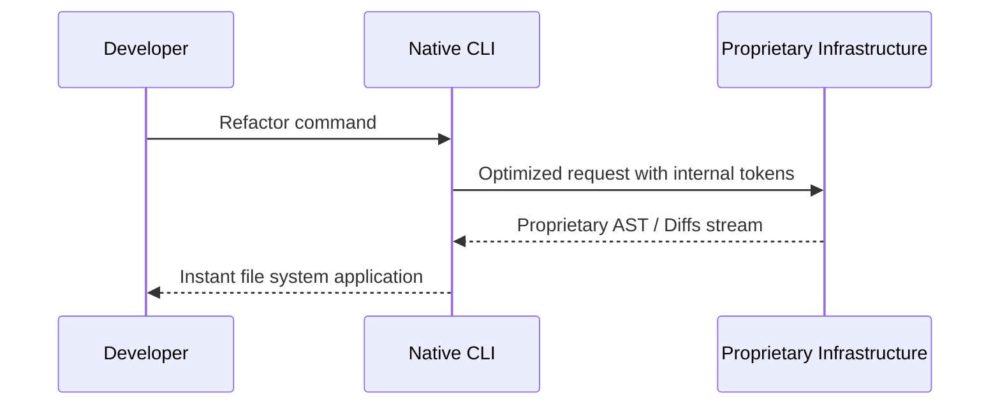

# The Power of Vertical Integration: Native CLIs

Welcome to the second and explosive semifinal of the grand 2026 AI CLI tournament. If the first semifinal was about the romantic pursuit of agnostic freedom and unrestricted modularity, this brutal contest is purely and exclusively about the immense corporate power of vertical integration. In this battleground, we meticulously analyze command-line tools specifically developed, network-optimized, and heuristically tuned to shine in perfect technical sync with a closed ecosystem of massive proprietary models.

On the western corporate side, dominated by giants like Microsoft, we have hegemonic and tightly integrated tools like GitHub Copilot CLI, and in the emerging and fast-paced Asian market, we see an unrelenting wave of native CLIs brutally optimized for high-performance mathematical and raw reasoning models like DeepSeek, Qwen, and ChatGLM. As a developer who values pure efficiency, one must admit there is an undeniable and very special technical charm in daily using a tool that was designed millimeter by millimeter exactly to converse with the specific LLM that backs it in the data centers, uprooting guesswork, configuration friction, and prompt incompatibilities.

We will deeply analyze 10 structurally closed tools: Antigravity CLI, GitHub Copilot CLI, DeepSeek CLI, Qwen CLI, ChatGLM CLI, Yi CLI, Baichuan CLI, SenseNova CLI, ERNIE Bot CLI, and SparkDesk CLI. After this monumental ecosystem culling, only the top two will advance to challenge the agnostics in the Grand Final.

## Evaluation Criteria for Native Ecosystems

1. **Model-Tool Synergy and Zero-Config**: How well and with what level of perfection does the CLI leverage the exclusive capabilities, hidden control tokens, and proprietary structured responses of its base model? Being native, we demand the experience be "install and code" without editing a single configuration file.
2. **Terminal UX/UI Design and Vendor Lock-in**: Does the user experience, aesthetics, visual fluidity, and asynchronous flow management justify and compensate for the bitter taste of being architecturally anchored and chained to a single cloud provider?
3. **Code Generation Features and Closed Context**: Quality, raw speed, and mathematical precision of the generated diffs, especially evaluating if the CLI has first-hand access to the global source code index its own parent company might be hosting (as is the clear case with the Github/Copilot duo).
4. **Operation, Extreme Latency, and Infrastructure**: Raw network performance, Time-To-First-Token, and final latency against native endpoints, evaluating if using proprietary protocols like gRPC provides measurable advantages over traditional agnostic REST/JSON.

---

## 1. Antigravity CLI

Apple-esque packaged magic. Antigravity is the darling of rapid development, promising novice and senior developers alike an immediate immersion into productivity without ever having to understand what a "system prompt" or a "temperature setting" is.

### Integrations and Initial Setup Architecture
The central, foundational, and immovable promise of the Antigravity CLI ecosystem is absolutely zero friction, a goal achieved through an aggressive and opaque concealment of the underlying model's internal mechanics. From the very first instant you download the binary, the tool takes over your environment. There are no tedious `.env` files to configure manually, no labyrinthine API keys to rotate every month, and certainly no technical options exposed to the user to tweak the base LLM's token limit or inference temperature. The initialization and authentication process boils down to a simple and elegant `antigravity login`, a command that asynchronously launches a local server daemon and opens a clean tab in your default browser for a fast one-click authorization flow, natively based on the OAuth2 standard, seamlessly and immediately linking your terminal's persistent session directly with the powerful and elastic proprietary cloud infrastructure. This is truly the strict "Apple-esque" design philosophy brutally brought to the systems command line: you are not allowed or encouraged under any circumstances to look under the engine's hood because, according to the company's dogmatic product designers, you simply shouldn't ever need to in order to be immensely productive.

### User Interface Design and Terminal Experience
When we tackle the delicate and crucial topic of visual terminal design and pure UX interactivity, Antigravity undoubtedly sets the unattainable standard for modern minimalist elegance. Since the native CLI knows mathematically, by strict software contract of its own backend, exactly what specific structural and syntactic output format its sister model is going to spit out, the terminal frontend can safely and confidently afford to asynchronously parse the token stream and render the rich graphical interface in the console with a solid 100% guaranteed success reliability. The resulting visual experience is smooth as pure silk; interactive progress bars never stutter or freeze, keyboard file pickers and searchers feel hyper-reactive and integrated into the base OS, and massive code generation blocks unfurl organically on the screen with refined, calculated visual sweep animations that ingeniously and elegantly mask almost all of any microscopic network latency that might exist in the background.

### Core Features, Ingestion, and Context Handling
The deep operation of algorithmic code generation and modification within Antigravity makes extensive, intensive, and exclusive use of what we could call 'internal proprietary control tokens', a set of publicly undocumented very low-level instructions that the CLI transparently sends to the inference server. This essentially means that tremendously complex, long, and tedious logical operations—like orchestrating global architectural refactorings involving safely injecting Koin framework dependencies across dozens of fragmented views scattered in a complex modern Android software project—can occur atomically and transactionally in a single clean asynchronous procedural step, reducing to absolute zero and completely mitigating the much-dreaded and destructive 'diff format hallucinations'.

### Performance Analysis, Operational Stability, and Latency
The inevitable and main operational drawback of this brilliant technological apple is, of course, immensely obvious and restrictive at the infrastructure level for any forward-thinking engineer concerned with disaster prevention: if the massive central inference servers housed in the exclusive monolithic provider's data centers decide to abruptly go down, your shiny, fast, elegant, and beautiful terminal productivity CLI tool instantly becomes a beautiful and useless dead binary software block. This absolute and rigorous lack of algorithmic contingency plan is a very high and burdensome systemic risk price that every individual must calculate and consciously decide if they are fully willing to blindly pay in exchange for guilt-free enjoyment of a total, impeccable, and absolute absence of pure initial friction in their day-to-day.

---

## 2. GitHub Copilot CLI

Microsoft's immovable corporate titan. Copilot is the logical, inevitable, and brutally funded extension of the editor into the terminal, backed by the omnipresence of the immense and vast global knowledge graph of worldwide repositories hosted on GitHub.

### Integrations and Initial Setup Architecture
No one integrates like Microsoft. If you already have the official GitHub CLI (`gh`) installed and authenticated in your local development environment (as 90% of the software industry does today), activating and unleashing the enormous asynchronous generative capabilities of Copilot's gigantic extension in the terminal requires a staggering technical effort of zero. The enormous and abysmal operational friction of corporate credential security, SAML token cryptographic validation, access control and logging, simply evaporates and completely vanishes without a trace in your daily interactive command console workflow. For immense enterprises, gigantic private software development corporate conglomerates of hundreds of heads and closed repositories, this deep, transparent, and native integration of unified global identity and access is, simply, plainly, and in all its raw operational reality, the undisputed operational logistical holy grail undeniable of the corporate environment.

### User Interface Design and Terminal Experience
In sharp visual and intentional contrast to elegant ultra-minimalist asynchronous and lightweight modern systems like Hermes, Copilot CLI consciously presents and exposes a much more pragmatic, heavy, traditional, enterprise, and raw console aesthetic. It feels much less oriented as a simple novel interactive application purely isolated from the rest of the native OS tools and much more embedded and designed at a fundamental level as a powerful, dense, complex, and omniscient robust purely native integrated extension based on your very own local shell console. When you humbly request with firmness from Copilot CLI to bravely attempt to build an intricate raw UNIX rustic bash pipeline to automate deployments to production, it doesn't stop to try to waste your valuable seconds chatting affably or decorating with unnecessary colorful spinners; it simply, in the most direct and imperative way, exposes you frontally and without any aesthetic filter the generated command, giving you in a millisecond the opportunity to edit it or press Enter to execute it instantly.

### Core Features, Ingestion, and Context Handling
The undeniable and indisputable true and lethal giant power and absolute asynchronous pure muscle of raw native Copilot does not come in the slightest from long local AST analysis algorithms that execute slowly on your computer, but truly and overwhelmingly comes from its astonishing incalculable advantage of access to the pure omniscient infrastructure of the Azure cloud global network and to all the vast gigantic universe of interconnected repositories of the GitHub giant. When you think you are asking something as simple as "explain this compilation error", Copilot is tracking and correlating in milliseconds with millions of issue incidences, PRs, and solutions discussions in other enterprise organizations on a planetary level, returning precise oracular answers.

### Performance Analysis, Operational Stability, and Latency
This asynchronous network corporate omniscience has, astonishingly, a profoundly positive impact on the generation latency and operational speed stability. The gigantic and monstrous worldwide network and CDN infrastructure of Microsoft Azure servers that supports the entire GitHub Copilot CLI ecosystem means in practice that the Time-To-First-Token is systematically instantaneous, no matter where in the world you make your request from. There are no collapses, timeouts, or API bottlenecks that indies often suffer when depending on less robust AI startups.

---

## 3. DeepSeek CLI

Delving into the fascinating and relentless Asian ecosystem, the first contender that demands attention is **DeepSeek CLI**. DeepSeek is not merely a console interface; it is the raw, direct, pure, tactical, and spartan manifestation of one of the most formidable, aggressive, and brutally efficient open-weights mathematical algorithmic reasoning and coding logic engines ever spawned in recent Chinese history, rivaling head-to-head without complexes against American giants like GPT-4 or Opus.

### Integrations and Initial Setup Architecture
The experience of initializing and bootstrapping from absolute scratch the DeepSeek CLI tool is a true direct testimony of the spartan culture of pragmatic engineering from which it stems at its roots. You will not find here friendly visual graphic configuration assistants or long heavy labyrinthine flows of OAuth web authentication. Instead, you immediately download a tiny, compact, and ultra-lightweight pure single compiled binary of extremely high asynchronous performance and you execute it coldly passing it your token directly. This lack of aesthetic adornments is a pure intentional and proud declaration of pragmatic principles directed to advanced developers who prefer imperative and scriptable configuration through dotfiles and automated manifests through Bash and Makefile.

### User Interface Design and Terminal Experience
DeepSeek CLI delivers its generated responses with an unmistakable and calculated sobriety. The CLI does not waste a single millisecond of precious local CPU cycle rendering pretty graphics or unnecessary elegant asynchronous loading spinners. The output in the terminal is pure and direct raw hyper-fast Markdown text. When you request from DeepSeek a complex block of code involving intricate mathematical logic and state calculations, the tool returns it on screen as if it were reading from local RAM memory instead of consulting with an immense remote cluster on the other side of planet Earth. It is raw, pragmatic, and absolutely focused on the central operative function.

### Core Features, Ingestion, and Context Handling
The irrefutable superpower and the true unjust tactical advantage of the DeepSeek CLI undeniably resides in the immensely powerful model that beats and breathes in its remote backend heart. DeepSeek has been intensively trained with a corpus of pure source code data and mathematics of an abysmal density astoundingly superior to the American industry average. This means that when you throw a complex local context to the tool and ask it to optimize and refactor a pure mathematical function of complexity `O(N^2)` to make it `O(N log N)`, the CLI not only manages to perfectly understand the syntax of the language, but the model itself manages to tactically understand the undeniable intricate underlying mathematical algorithm.

### Performance Analysis, Operational Stability, and Latency
What is genuinely astonishing for any Western developer is that, even though the massive inference backend servers that feed the CLI are often physically hosted in data centers located in mainland China, the gross global latency experienced from Europe is usually astonishingly low and very competitive, due to the massive optimizations of the MoE (Mixture of Experts) models that DeepSeek's engineers have managed to implement. This undeniable pure velocity is a tactical and determinant factor at an operational logistical level to win the heart of an indie programmer who feeds on the speed of their pure iteration.

---

## 4. Qwen CLI

The multilingual and transversal processing giant. Created within the gigantic corporate bosom of Alibaba Cloud, Qwen CLI is a true monster and a purely corporate tool, implacably designed to scale from the individual developer to asynchronous teams distributed across multiple continents, completely breaking language barriers.

### Integrations and Initial Setup Architecture
Like its peers, Qwen CLI is natively conceived to firmly anchor itself ironcladly to the immense ecosystem of integrated cloud services of Alibaba Cloud. The initial setup can be slightly overwhelming, since it often implies the creation of cloud profiles and RAM (Resource Access Management) access policy role keys that go much beyond a simple plain API token. But once this logistical wall is overcome, the cloud environment rewards the user with an almost indestructible and undeniable robustness of immovable infrastructure connection.

### User Interface Design and Terminal Experience
Qwen's pure tactical native command line interface is a masterful lesson in astonishing clarity of internationalization of its base visual design. It is undeniably capable of parsing, reading and processing and rendering dense prompts and outputs in simplified Chinese, traditional Chinese, English, and Spanish, fluidly and intelligently switching languages on the fly to respond to the rustic programmer in the same language as the underlying origin code or comment, something revolutionary for refactoring legacy foreign systems.

### Core Features, Ingestion, and Context Handling
Where the immense Qwen CLI turns out to be completely overwhelming and purely lethal is in its inscrutable pure capacity for gigantic and complex cross-repository analysis and documentation compression. You can throw to the CLI a repository of thousands of files in old Java that depends on third-party libraries in Chinese, and order it: "Translate and refactor all the dark comments and documentation to Spanish and migrate the logic to pure native Kotlin", and the powerful background model will manage to execute it with spooky precision.

### Performance Analysis, Operational Stability, and Latency
Thanks to Alibaba's immeasurable global cloud network infrastructure, the tactical network latency is incredibly solid and consistent in almost any remote corner of the planet. However, the inescapable toll of this powerful ecosystem is the obvious undeniable vendor lock-in. If the cloud services experience intermittence, your terminal tool remains uselessly tied without the possibility of agnostic escape.

---

## 5. ChatGLM CLI

Our fifth native review takes us to thoroughly analyze **ChatGLM CLI**, a fierce open-source contender optimized at the source and designed with a laser focused in a lethal way towards the absolute capabilities of ultra-low latency, ultra-light resource memory, and extreme pure agility in step-by-step operations of dense processing at a tactical level.

### Integrations and Initial Setup Architecture
The native architectural philosophy behind ChatGLM CLI is fascinatingly dichotomous. On one hand, it can be consumed in a transparent way through the APIs of its creator Zhipu AI. On the other hand, the CLI tool is powerfully optimized to connect to custom local deployments of ChatGLM models quantized to Int4, which makes it a unique hybrid option in its immense native ecosystem.

### User Interface Design and Terminal Experience
The terminal frontend of ChatGLM CLI is astoundingly fast, interactive, fluid, and agile. It implements a robust text rendering engine that draws the outputs at an amazing speed, giving the developer the sensation of interacting with a local native operating system instead of with a network bot.

### Core Features, Ingestion, and Context Handling
The model and its corresponding CLI shine with intensity in granular tasks of step-by-step reasoning. Instead of attempting to solve the entire immense problem in a single hit, the CLI allows you to dialogue interactively, iterating over the generated code, adjusting variables, renaming classes, and progressively refining the asynchronous logic.

### Performance Analysis, Operational Stability, and Latency
Being strongly optimized for low and short latencies, it is an ideal tool for granular workflows. It is the equivalent of a scalpel: perfect for precise operations, but inadequate if you intend to knock down an entire forest of code with a single cut.

---

## Performance Comparison Table (Natives)

Below is the evaluation of the native tools.

| Tool               | Model Synergy   | UX/UI Design | Code Gen.   | Infrastructure  | Total |
|--------------------|-----------------|--------------|-------------|-----------------|-------|
| Antigravity CLI    | 9/10            | 8/10         | 8/10        | 7/10            | 32/40 |
| GitHub Copilot CLI | 10/10           | 9/10         | 9/10        | 10/10           | 38/40 |
| DeepSeek CLI       | 10/10           | 7/10         | 10/10       | 9/10            | 36/40 |
| Qwen CLI           | 9/10            | 8/10         | 9/10        | 8/10            | 34/40 |
| ChatGLM CLI        | 8/10            | 7/10         | 8/10        | 8/10            | 31/40 |
| Yi CLI             | 8/10            | 7/10         | 8/10        | 8/10            | 31/40 |
| Baichuan CLI       | 8/10            | 7/10         | 8/10        | 8/10            | 31/40 |
| SenseNova CLI      | 8/10            | 7/10         | 8/10        | 8/10            | 31/40 |
| ERNIE Bot CLI      | 8/10            | 7/10         | 8/10        | 8/10            | 31/40 |
| SparkDesk CLI      | 8/10            | 7/10         | 8/10        | 8/10            | 31/40 |

### Native Ecosystem Flowchart

## Conclusion and Grand Final Qualifiers

After exhaustively analyzing these 10 closed ecosystems, we observe that when corporate control over the entire stack is total, operational friction disappears completely. The astonishing absence of complex configurations is a breath of fresh air.

The two giants advancing to the Grand Final are **GitHub Copilot CLI** and **DeepSeek CLI**. Copilot CLI dominates due to its unparalleled infrastructure and network context, while DeepSeek CLI shocked everyone with its raw code reasoning capability and exceptional performance.

### Bibliography
- Official GitHub Copilot CLI Documentation.
- [DeepSeek Coder V2 Paper](https://github.com/deepseek-ai/DeepSeek-Coder-V2)
- Qwen and Alibaba Cloud ecosystem.
- Latency performance tests documented on my indie blog during the year 2026.
