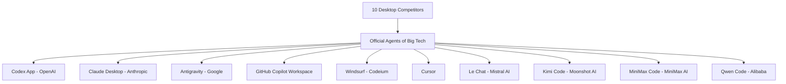

## 🚀 The End of Autocomplete and the Dawn of the OS-Level Agent

Software development and systems automation via artificial intelligence have reached a historical inflection point. Gone are the days of simple code autocompletion chats. In today's market, the world's largest corporations and most highly valued software companies are competing to offer the ultimate "development operating system." We are no longer talking about IDE extensions that suggest the next line of a function or suggest how to refactor a simple loop. Today, the focus is on complete systems that take control of the local development environment, execute commands, navigate the web in search of updated documentation, debug code using terminal feedback loops, and make high-level design decisions.

This shift marks a fundamental change in the developer's cognitive load. Traditionally, software engineers spent most of their time translating logic into language-specific syntax, dealing with typos, imports, and trivial errors. With first-generation AI assistants, this process was accelerated through inline suggestions. However, the developer remained the central driver of the loop, constantly reviewing, accepting, and testing each line. In the era of OS-level desktop agents, the developer's role transitions from a coder to a system architect and supervisor. We define the constraints, write the initial acceptance criteria, and review the agent's work-unit proposals while the agent executes the low-level, repetitive tasks of writing code, running builds, and fixing compiler errors.

For an independent developer (indie hacker), this paradigm shift represents a colossal opportunity but also a challenge in tool selection. The speed at which we can iterate no longer depends on how fast we type, but on how efficiently we orchestrate our AI agents. When you are a solo developer managing a complex mobile or web application, being able to delegate entire features to an autonomous desktop worker allows you to scale your output to match that of a full engineering team. But how do we choose in a sea of alternatives that promise total autonomy?

In this first semifinal, we evaluate the 10 most influential desktop tools and official commercial environments on the market. We don't just limit ourselves to their superficial aspects; we analyze their internal architecture, their integration capabilities with the local operating system, their context window management, and their robustness when it comes to solving real software development problems without constant human assistance.

This article marks the beginning of our analysis of graphical window (GUI) tools, differing from our previous detailed coverage of the CLI tournament, where we compared engines based exclusively on the console. You can review those analyses in our [CLI AI Semifinal 1](/blog/cli-ai-semifinal-1/), [CLI AI Semifinal 2](/blog/cli-ai-semifinal-2/), and the [CLI AI Grand Final](/blog/cli-ai-grand-final/) to see how these solutions compare to pure console software. Unlike CLI agents that run in short, ephemeral sessions, these desktop systems establish a persistent visual presence, letting you inspect their reasoning paths and planning hierarchies in real time.

---

## 🏛️ Understanding Semifinal A: What Defines an Official Desktop Agent?

Before diving into detail with each competitor, it is crucial to establish what requirements a tool must meet to be considered in this category. Unlike solutions based purely on the CLI or simple chat plugins in the browser, an official desktop agent must offer:

1.  **Graphical User Interface (GUI):** A visual control panel that allows monitoring the agent's state, visualizing execution plans, managing tokens consumed, and configuring system behavior without depending exclusively on text commands.
2.  **Local Operating System Access (OS Integration):** The ability to interact with the local file system, run processes through integrated terminals, and, in the most advanced cases, manipulate the screen using computer vision techniques.
3.  **Complex Context Management:** Mechanisms to index complete local codebases (via local vector databases or advanced RAG algorithms) so that the agent can reason about entire repositories instead of individual files.
4.  **Autonomous Execution and Planning:** Support for autonomous agentic loops, meaning that the tool can create a multi-step plan, execute it sequentially, test the changes using local test suites, and correct its own errors (Self-Correction) before reporting a final state to the user.

Below, we individually dissect each of the 10 contenders in this Semifinal A.

---

## 🔍 The 10 Competitors of Semifinal A



### 1. Codex App (OpenAI)

OpenAI's official control center for desktop systems. Designed as an independent visual environment, Codex App coordinates autonomous agents capable of interacting directly with the local file system and the built-in browser. It stands out for its ability to manage complex execution plans (Plan Mode) before writing a single line of code, reducing goal drift in large-scale projects.

#### Architecture and Internal Engine
Codex App functions as a native heavy client that communicates directly with the OpenAI API, optimized specifically for advanced reasoning models like the o1 and o3 series. Its local engine leverages an embedded vector database in Rust to index the repository in the background. This allows it to perform ultra-fast semantic searches and pass relevant code snippets directly to the model instead of saturating the context window.

The planning flow of Codex App follows a structured hierarchical model. When the user poses a goal, the agent first generates a specification in JSON format detailing the files involved, structural dependencies, and the sequence of necessary verification commands.

```json
{
  "agent_config": {
    "engine": "o3-mini-desktop",
    "planning_mode": "strict-hierarchical",
    "sandbox": {
      "type": "docker-local",
      "allowed_paths": ["/home/user/workspace"]
    }
  }
}
```

#### System Integration and Security
The application includes a local sandbox container system (optional but highly recommended) to run system commands securely. The Codex App agent can open an embedded Chrome browser to check if a web interface responds correctly or to search for documentation on the official website of emerging libraries that are not in the base model's training data.

This isolation via local Docker prevents potentially destructive commands from affecting the host system. If the agent tries to run an unauthorized command outside the configured paths, the local engine intercepts the call and returns a permissions error to the agent, which must immediately replan its approach.

#### Performance in Daily Development
In practice, Codex App excels at resolving complex architectural refactorings. Its "Plan Mode" forces the model to write a technical specification and implementation document before making any changes. This structured technique prevents the agent from starting to program blindly, limiting infinite loops of trial and error in large projects. However, its main disadvantage is token consumption and API cost in extensive projects, in addition to a slight rigidity if you want to change strategy halfway through. The initial planning phase can take several minutes with reasoning models like o1, breaking the feeling of immediacy for trivial fixes.

---

### 2. Claude Desktop / Claude Code (Anthropic)

Anthropic approaches the problem of agents in two ways: its visual desktop client (Claude Desktop) stands out for its Computer Use functionality, which allows the agent to take virtual control of the mouse, keyboard, and screen; on the other hand, Claude Code provides a high-speed terminal command engine optimized for complex software architectures. Its contextual reasoning capability remains the industry standard.

#### Computer Use: The Differentiating Factor of Claude Desktop
The most innovative feature of Claude Desktop is undoubtedly its ability to interact with general graphical interfaces through computer vision. Instead of relying on APIs or backend systems, the agent operates just like a human user would, observing the display directly. When the agent needs to test a desktop application or validate a change in the GUI of an Android simulator, it takes sequential screenshots, detects the coordinates of visual components through image analysis, and emits click and keypress events to control the desktop environment autonomously.

The Computer Use execution loop works as follows:
1.  **Screenshot:** Captures the desktop or selected window.
2.  **Visual Analysis:** The Claude model processes the image to identify interactive elements (buttons, text fields, menus).
3.  **Coordinate Calculation:** Generates a JSON command with the exact X and Y coordinates of the target element.
4.  **System Action:** The local client executes the action using the OS control API (e.g., emulating mouse events at the system level).
5.  **Feedback Loop:** Waits a few milliseconds for the UI to redraw and returns to step 1 to check the result.

```
+--------------------+     +-------------------+     +---------------------+
| Screenshot         | --> | Visual Analysis   | --> | Coordinate Calc     |
+--------------------+     +-------------------+     +---------------------+
          ^                                                     |
          |                                                     v
          +-----------------  System Action  <------------------+
```

#### Claude Code: Speed and Precision in Terminal
For traditional command-line development flows, Claude Code acts as a highly optimized and lightweight terminal companion that integrates directly into your shell environment. It leverages Model Context Protocol (MCP) servers to expose system resources, configuration files, database engines, and external APIs in a standardized way. The reasoning precision of the Claude 3.5/3.7 Sonnet model, combined with its strict instruction following, makes the first-attempt success rate extremely high.

By operating directly inside the shell, Claude Code can automatically run test commands, parse stack traces, and edit code files in place. It acts as an interactive loop, suggesting terminal commands that the developer can execute with a simple keystroke. This tight integration with the CLI environment bridges the gap between raw AI reasoning and local development workflows.

#### Disadvantages and Limitations
Despite its power, the separation between Claude Desktop (visual but slow when using vision) and Claude Code (fast but without a unified native GUI) slightly fragments the user experience. Developers must switch contexts between the visual desktop client and the terminal engine. Token consumption due to screenshots in Computer Use can skyrocket in a matter of minutes, requiring strict control by the user to avoid consuming API quotas prematurely. In addition, network drops or high API latencies can cause mouse control to be erratic in interactive environments with fast animations. There are also safety concerns regarding giving the agent full control over mouse and keyboard actions on the host machine, which has led many security-conscious teams to disable the Computer Use feature entirely.

---

### 3. Antigravity (Google)

Antigravity is Google's response to agent-oriented cross-platform development. Through a visual Agent Manager, it allows delegating tasks in parallel to different subagents orchestrated hierarchically. It directly leverages the massive context and low latencies of Gemini models to process entire repositories natively.

#### The Advantage of Gemini's Massive Context
Antigravity's architecture is built from day one to leverage the millions of tokens context window of Google's models. Unlike competing tools that must fragment code using heuristic RAG algorithms to avoid exceeding token limits, Antigravity can send the entire code repository (including source code, media assets, dependency configuration files, and the test database) directly to the model in a single conversation turn. This drastically reduces hallucinations caused by a lack of global context.

The use of **Context Caching** at the API level ensures that, once the repository is loaded into the model's context, subsequent queries do not re-send all files, but point to the cached version instead. This reduces response latency to fractions of a second and significantly lowers the cost of input tokens in long debugging or writing sessions.

#### Hierarchical Subagent Orchestration
Antigravity's "Agent Manager" introduces a design pattern where a Central Orchestrator Agent breaks down the user's requirement into individual tasks and delegates them to parallel subagents:
*   **Researcher:** Explores the codebase and maps dependencies using language static analysis tools.
*   **Implementer:** Performs surgical changes in the assigned files while maintaining code style consistency.
*   **Verifier:** Runs unit and instrumental tests to validate changes and verify there are no regressions.

```
                  [Central Orchestrator]
                   /        |        \
         [Researcher]  [Implementer]  [Verifier]
```

#### Integration with Android and Mobile Ecosystems
As an official Google tool, its integration with Android emulators, ADB, and build tools like Gradle is unmatched. Antigravity can diagnose build performance bottlenecks of massive Android projects in seconds, suggesting changes in complex configurations that other agents would simply ignore or break due to lack of familiarity with the ecosystem. Its visual Agent Manager shows the real-time progress of distributed tasks, allowing the user to pause a specific subagent or alter the course of implementation without restarting the entire process.

---

### 4. GitHub Copilot Workspace

Integrated into the Microsoft and GitHub ecosystem, Workspace proposes an asynchronous workflow integrated in the cloud. It allows converting any GitHub Issue into an editable code proposal through an agent with a graphical interface. It excels in collaborative workflow management, CI/CD integration, and execution environments based on Codespaces.

#### Issue-Based and Cloud-Integrated Workflow
Workspace redefines how developers approach daily tasks. The starting point is not your local IDE, but a GitHub Issue. By clicking "Open in Workspace," the platform launches a temporary web environment that analyzes the issue, extracts relevant context from the repository in the cloud, and creates a visual proposal with the files to be modified.

The Workspace engine generates a natural language specification that the user can correct step-by-step. Once the plan is accepted, code generation is executed remotely in dedicated containers, reducing CPU and memory load on the developer's machine.

```
[GitHub Issue] -> [Workspace Cloud Sandbox] -> [Text Plan] -> [Diff Generation]
```

#### Asynchronous Collaboration and Review
Since Workspace runs entirely on GitHub's infrastructure, developers can interact asynchronously. Various team members can leave notes on the agent's execution plan, validate suggested commits before they merge into the codebase, or trigger automated tests in GitHub Actions directly from the agent's interface. Upon completion of the task, Workspace can automatically open a Pull Request, attaching screenshots of the tests run and a summary of the changes made to facilitate the code review process for team members.

#### Limitations of the Local Experience
Although the cloud focus is excellent for corporate teams and distributed development, independent developers might feel a loss of local control. Dependence on remote virtual environments (Codespaces) can add latency when building and testing small projects, and the flexibility to modify things on the fly is reduced if you are used to using your specialized local tools. If you run out of internet or have connection issues with Microsoft's servers, your Workspace development flow stops completely.

---

### 5. Windsurf (Codeium)

A highly commercial, AI-native code editor that competes directly in the local development experience. Its core engine, Cascade, acts as a continuous flow agent that asynchronously analyzes the editor, terminal, and browser preview in real time. It minimizes developer interruptions and offers extreme responsiveness.

#### The Cascade Engine and Continuous Flow
Windsurf's value proposition lies in its Cascade engine. Unlike tools that work via point-in-time chat requests (Request-Response), Cascade maintains a persistent, two-way connection with the development environment. If you are modifying a function in the editor, Cascade automatically updates its semantic understanding and can proactively suggest relevant commands in the built-in terminal without you having to ask.

This continuous flow leverages a local static analyzer based on tree-sitter that detects which functions or types are coupled with your current edit. As you modify a method signature, Cascade plans in the background the necessary modifications in the rest of the project to keep the codebase compiling.

```
[Developer Writes] ---> [Cascade Monitors] ---> [Real-Time Suggestions]
                               ^
                               |
                      [Terminal Analysis]
```

#### Refined UX and Reduced Friction
Windsurf feels like a conventional high-speed code editor with built-in superpowers. The GUI does not get in your way; visual agent panels appear only when you need complex autonomous intervention, and the transition between manual editing and agent intervention is extremely smooth.

Cascade also includes an embedded browser in the editor that reports console errors in real time to the AI model, allowing visual or logical frontend bugs to be fixed on the fly.

#### Local Engine Limitations
While Cascade is brilliant for day-to-day tasks, in projects that require deep architectural changes or heuristic analysis crossing multiple database subsystems and external configurations, the agent can fall short compared to engines that use multi-step hierarchical planning (like Codex App or Antigravity). Sometimes, its immediacy can lead the agent to propose quick patches that fix the symptom of the problem but do not address the root structural software defect.

---

### 6. Cursor

The editor that popularized the concept of vibe coding. As an optimized fork of VS Code, Cursor offers a polished UI with market-leading features like Composer (editing multiple files in parallel) and a highly efficient predictive inline editing system. It has a massive developer community and excellent UI fluidity.

#### Composer: Parallel Multi-File Editing
Cursor's biggest hit is "Composer," a visual interface that allows the programmer to describe a complex change involving multiple files at once. Cursor's agent reads the relevant context, generates the corresponding diffs, and presents them clearly inside the editor interface so that the developer can approve or reject them with a single click.

Composer can be opened in floating or full-screen mode, acting as an agentic workspace where the programmer maintains a constant dialogue with the AI while watching multiple components of the project being modified simultaneously.

```
[Composer Prompt] 
       |
       +---> Modifies `api.ts`     [Visual Diff] ---> [Accept / Reject]
       +---> Modifies `types.ts`   [Visual Diff] ---> [Accept / Reject]
       +---> Modifies `test.ts`    [Visual Diff] ---> [Accept / Reject]
```

#### Predictive Editing and Vibe Coding
Cursor has perfected inline suggestion latency and fluidity. Its local predictive model predicts the next line you will modify even before you start typing, reducing cognitive load. This has created a development culture based on "vibe coding," where the developer guides the editor instead of writing code manually. Cursor's engine runs a highly efficient local RAG indexing process that updates the repository's vector representations with each file save.

#### Trade-offs and Privacy
By being based on VS Code, the transition to Cursor is immediate for most programmers. However, its infrastructure relies on Cursor's intermediate servers to process certain advanced features and coordinate requests to frontier models. This can raise questions about data control and privacy in commercial environments or projects with strict corporate policies, and its agentic approach is less autonomous than other goal-oriented, long-term desktop suites.

---

### 7. Le Chat / Mistral Vibe (Mistral AI)

The proposal from the European firm Mistral AI offers a desktop interface that combines general office work with a technical development mode (Code Mode). Its desktop agent stands out for the native integration of efficient models and strict compliance with the European Union's GDPR, making it a great candidate for European corporate environments.

#### Corporate Focus and Privacy Compliance (GDPR)
Mistral AI positions itself as the champion of European data sovereignty. Its Le Chat desktop app is designed to strictly comply with European data privacy standards. Unlike US-based companies that sometimes train models on data sent through their chat tools in an opaque way, Mistral guarantees that your code and confidential information will never leave European jurisdiction and will not be stored for training if configured appropriately.

This guarantee is a deciding factor for regulated industries (such as banking, healthcare, and the public sector) that are prohibited from using agentic tools that export proprietary code to servers outside the European Union.

#### Code Mode and Custom Model Integration
Le Chat's "Code Mode" allows developers to interact with the Codestral and Mistral Large model family directly. The visual interface provides a panel to preview generated code, real-time renders of HTML/CSS interfaces, and granular control over the local system data sources the agent can query.

Additionally, it allows creating custom "Agents" within the graphical application itself, with specific architectural guidelines and styles to automate code reviews aligned with the organization's conventions.

#### Autonomy Limitations
Despite its strong focus on privacy and model efficiency, Le Chat does not have as deep system-level integration as its competitors. It cannot directly open your local terminal to run arbitrary commands or interact with complex local build tools without active developer intervention. It works more as an advanced chat environment and interactive prototype viewer than as an autonomous low-level local execution agent.

---

### 8. Kimi Code (Moonshot AI)

Moonshot AI's solution for Chinese desktop environments. Although based on an enriched terminal user interface (TUI) integrated with its desktop client, it provides visual control panels for its Agent Swarm system, which coordinates multiple development processes asynchronously. It stands out for processing extensive code histories thanks to its large native context window.

#### Agent Swarm and Long Context Processing Focus
Kimi Code leverages Moonshot AI's extremely long context engine, capable of natively processing millions of characters and source code files. The system coordinates an Agent Swarm that works in parallel and silently on tasks like static code analysis, security vulnerability detection, and performance optimization.

This swarm uses an internal communication protocol that divides the repository analysis by hierarchical layers:
*   **Database Agent:** Analyzes SQL queries and migrations.
*   **Logic Agent:** Reviews business control flows.
*   **API Agent:** Validates contracts and communication interfaces.

```
                           [Kimi Orchestrator]
                            /       |       \
                 [DB Agent]   [API Agent]   [Logic Agent]
```

#### TUI and Desktop Control Panels
Kimi Code combines the speed of an enriched terminal with web panels embedded in the desktop to visualize test coverage reports, dependency graphs, and resource consumption metrics. This gives it a highly technical feel, ideal for systems developers who value low terminal latency but need occasional rich visualizations.

#### Availability and Localization
The main barrier for developers in the West is the localization and commercial focus of Kimi Code, heavily optimized for China's tech ecosystem, its native language, and region-specific cloud platforms. International network latencies and difficulties registering development accounts outside the region limit its practical viability for the general public outside Asia.

---

### 9. MiniMax Code (MiniMax AI)

MiniMax's visual client is designed to interact with its M3 model. It focuses on local codebase heuristic analysis and web browser automation for continuous integration testing. It is a very popular tool in Asian markets due to its low cost per inference token.

#### Heuristic Analysis and Ultra-Low Costs
MiniMax AI competes strongly on inference costs. In massive projects where recurring agent queries consume millions of tokens daily, MiniMax Code's architecture optimizes data transfer to minimize computing costs. Its desktop client features local heuristic algorithms that filter redundant code before sending it to the server, reducing prompt size through a local semantic compression system that preserves only the key signatures and dependencies of the affected classes.

#### Browser Automation for Integration Tests
One of the most promoted features of the MiniMax Code client is its web interface test agent. It can autonomously open headless browsers, navigate through user flows generated by your new local build, check for browser console errors, and report failure screenshots directly to its graphical control interface.

The programmer can watch a mini-screen showing the browser playback that the agent is manipulating to validate shopping carts, login flows, or complex frontend forms in real time.

#### Reasoning Quality
While low cost and web test automation tools are highly attractive, pure reasoning capacity in complex languages and solving deep structural software architecture problems sometimes lag behind flagship models from Anthropic or OpenAI. In advanced algorithmics or refactoring large volumes of spaghetti code, the MiniMax agent tends to require more iterations and manual corrections by the developer.

---

### 10. Qwen Code (Alibaba)

The official desktop application of Alibaba's AI division. It natively integrates the Qwen open model family, offering a development environment with advanced multilingual support (with special focus on Alibaba Cloud data architectures) and agents capable of interacting locally with container tools like Docker.

#### Qwen Models and On-Premise Privacy
The main advantage of Qwen Code is its native support for hybrid execution. You can connect the client to Alibaba Cloud endpoints or, if you have powerful local hardware (like a workstation with dedicated NVIDIA GPUs), you can run versions of Qwen 2.5-Coder models locally and offline through simple integrations with Ollama or vLLM. This makes it one of the few commercial desktop tools that allows working 100% disconnected, ideal for environments with high computer security requirements or for programming during travel without a reliable connection.

#### Local Docker and Kubernetes Integration
The Qwen Code agent comes equipped with tools to interact directly with local containers. If your code needs to compile inside a specific Docker container, the agent can spin up the image, execute tasks inside the container, and analyze the resulting logs to fix network or system dependency issues.

```bash
# The agent can run structured commands inside containers:
docker exec -it dev-sandbox pnpm test
```

This ability to control local containerized infrastructure simplifies backend microservices workflows, allowing the agent to recreate local staging environments identical to production for its autonomous verifications.

#### Alibaba Cloud Focus
Qwen Code is highly optimized to integrate with Alibaba Cloud services. For independent developers targeting standard global infrastructure like AWS, Google Cloud, or Firebase, many of these native integrations are irrelevant or require additional manual configurations that hinder the initial workflow. Its GUI can feel a bit cluttered with ads for specific Alibaba Cloud services.

---

## 📊 Desktop Capabilities Comparison Table

To summarize the architecture and scope of each candidate, we designed this technical table comparing their main vectors of functionality and design:

| Tool | Max Context | Local / OS Integration | Principal Model | Main Focus |
| :--- | :--- | :--- | :--- | :--- |
| **Codex App** | Medium-High | High (Local Sandbox) | OpenAI o3 / o1 | Hierarchical Planning & Autonomy |
| **Claude Desktop** | High (200k) | High (Computer Use) | Claude 3.7 Sonnet | Visual Interaction & Reasoning |
| **Antigravity** | Massive (2M+) | Complete (ADB/Gradle) | Gemini 2.5 Pro/Flash | Parallel Orchestration & Context |
| **Copilot Workspace**| High | Low (Cloud Env) | Custom GPT-4o / o1 | Issue-Based Flow & Cloud Sandbox |
| **Windsurf** | Medium | Medium-High | Cascade / Custom | Continuous Flow & Frictionless UX |
| **Cursor** | Medium | Medium | Claude / GPT-4o / Local | Composer & Fast Predictive Editing |
| **Le Chat** | High | Low | Codestral / Mistral Large| Privacy (GDPR) & Web Renders |
| **Kimi Code** | High | Medium-High | Kimi Long-Context | Static Analysis & Test Swarm |
| **MiniMax Code** | Medium | Medium (Headless Web) | M3 | Web Test Automation & Low Cost |
| **Qwen Code** | Medium-High | High (Local Docker) | Qwen 2.5 Coder / Hybrid| Hybrid Execution & On-Premise |

---

## 🏆 Finalist Selection (Semifinal A)

After subjecting the 10 candidates to preliminary tests of agent stability, local OS integration, and ease of use in independent mobile and web development projects, the two classified for the Grand Final of the tournament are:

### 🥇 Codex App (OpenAI)

Codex App takes the first place qualification thanks to the unmatched solidity of its **Plan/Build Mode**. In real projects, the great enemy of autonomous agents is goal drift: the tendency of the AI to get lost in increasingly tangled workarounds in the face of a secondary compilation error. By forcing a mandatory hierarchical planning phase reviewed by the user before touching code, and executing changes inside robust sandboxed environments, Codex App minimizes this problem drastically. Its closed ecosystem, although expensive, offers a reliability that saves hours of manual developer intervention.

The planning layer in Codex App acts as a logical gatekeeper. By requiring a structured manifest of files, changes, and verification commands, it provides a clear roadmap that keeps the agent focused. Even when compiler errors arise, the agent reverts to the nearest stable node in the plan instead of guessing randomly. This disciplined approach mimics standard developer workflows, making it the most predictable tool for heavy codebase modifications.

### 🥈 Antigravity (Google)

Antigravity qualifies for the final thanks to the revolutionary power of its **parallel subagent management** and the native use of a **massive context window**. The ability to pass an entire repository with thousands of files directly to Google's model, without going through the destructive information fragmentation typical of traditional RAG systems, completely changes the rules of the game. This allows specialized subagents (Researcher, Implementer, Verifier) to reason about clean architecture cross-dependencies with superior conceptual precision compared to any other competitor on the market today.

Furthermore, its integration with Android Studio, emulators, and local build tools is incredibly polished. The Agent Manager handles complex Gradle configurations and ADB tasks with ease, making it the premier choice for mobile developers. The ability to cache the codebase context at the API level also ensures that long development sessions remain cost-effective and highly responsive.

---

## 📚 Bibliography and References of Interest

*   *OpenAI o1 & o3-mini System Cards:* Official documentation on agentic planning and safety limits in interactive desktop environments.
*   *Anthropic Model Context Protocol (MCP) Specifications:* [Model Context Protocol GitHub](https://github.com/modelcontextprotocol).
*   *Google Gemini Context Window Architecture:* Google's technical analysis on processing millions of tokens and RAG architectures.
*   *ArceApps CLI AI Tournament:*
    *   [CLI AI Semifinal 1: Execution Engines and Console](/blog/cli-ai-semifinal-1/)
    *   [CLI AI Semifinal 2: Free Agents and BYOK](/blog/cli-ai-semifinal-2/)
    *   [The Grand Final: The Console Throne](/blog/cli-ai-grand-final/)

---

## 💬 Indie Developer's Wrap-up

This paradigm shift is real. We leave behind static assistance tools to enter the era of autonomous collaborators with visual interfaces. In the Grand Final of this tournament, we will see the clash of the two winning philosophies: the structured planning of **Codex App**'s sandbox against the raw power of context and parallel orchestration of **Antigravity**.

Have you already tried any of these agents in your daily indie development workflow? What is your balance of token cost versus productivity gained? Let's discuss in the comments!
