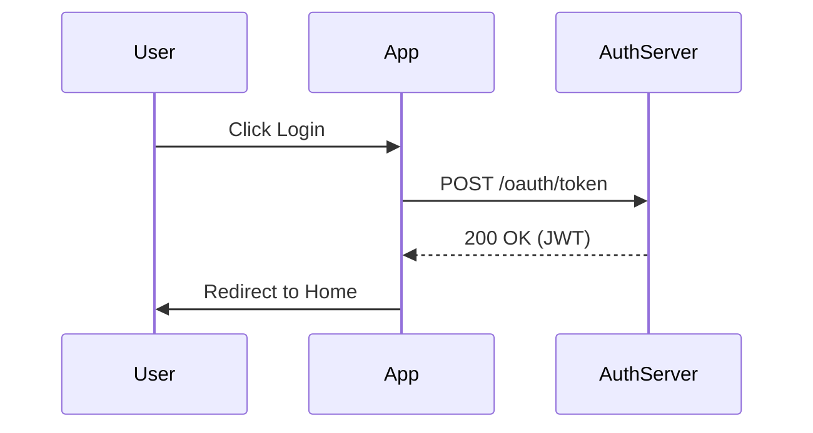

If you are a developer, your current knowledge "system" probably looks like this: three Stack Overflow tabs open for a week, a `TODO.txt` on the desktop you haven't opened since 2023, and a bunch of useful terminal commands saved in your bash history that you pray not to lose.

The problem isn't that you don't consume valuable information; it's that your brain isn't designed for persistent storage of terabytes of technical data. This is where **Obsidian** comes in, but not as a simple note-taking app.

In this guide, we will configure Obsidian as if it were an IDE: with version control, automation, diagrams as code, and SQL-like queries. Welcome to your **Second Brain**.

## 1. The Philosophy: "Markdown First"

Before installing anything, understand why Obsidian has displaced Notion and Evernote in the developer community:

1.  **Zero Vendor Lock-in:** Your notes are plain `.md` files on your hard drive. If Obsidian disappears tomorrow, you open your folder with VS Code and keep working.
2.  **Git Friendly:** Being plain text, you can (and should) version your knowledge.
3.  **Local-First:** Works without internet. Ideal for consulting your snippets when plane wifi fails.

## 2. Vault Structure: The "DevOps" System

Forget the infinite nested folder system. As devs, we know searching is more efficient than navigating. However, a high-level structure is necessary to maintain order.

This is the structure I recommend, based on **PARA** principles (Projects, Areas, Resources, Archives) but adapted for engineering:

```
/ (Root)
├── 00_Inbox         # The input "buffer". Everything starts here.
├── 10_Projects      # Active projects (repos you are working on).
│   ├── ArceApps
│   └── API Gateway
├── 20_Knowledge     # Your personal wiki (Languages, Frameworks, Concepts).
│   ├── Kotlin
│   ├── AWS
│   └── System Design
├── 30_Journal       # Daily Standup logs and retrospectives.
├── 40_Templates     # Templates (Bug reports, RFCs).
└── 99_Assets        # Images and attachments.
```

## 3. Core Plugins: Powering Up the IDE

"Vanilla" Obsidian is like VS Code without extensions: functional, but limited. Install these community plugins to unlock its potential.

### Dataview: SQL for your Notes

This is the *game changer*. Dataview allows you to treat your vault like a database. Imagine every project note has this frontmatter:

```yaml
---
type: project
status: active
tech: [kotlin, astro]
deadline: 2025-06-01
---
```

You can create a dynamic dashboard listing all your active projects:

```dataview
TABLE status, deadline, tech
FROM "10_Projects"
WHERE status = "active"
SORT deadline ASC
```

**Real Use Case:** I use Dataview to track "Technical Debt". When I find something to fix but don't have time, I create a quick note with the tag `#tech-debt` and a field `priority:: high`. My dashboard automatically shows me what I should refactor on Friday.

### Obsidian Git: Automatic Versioning

You don't need to pay for Obsidian Sync if you know how to use Git. This plugin commits and pushes your changes automatically every X minutes.
*   **Advantage:** You have a history of diffs of your thinking. "What did I think about this architecture 6 months ago?" -> `git blame`.

### Advanced Tables

If you've ever tried formatting a Markdown table by hand, you know the pain. This plugin adds navigation with `Tab` and auto-formatting, making managing comparison tables (e.g., "REST vs GraphQL") trivial.

## 4. Diagrams as Code (Mermaid)

As software architects, we think in diagrams. Obsidian has native support for **Mermaid.js**. You don't need to open Figma or Lucidchart to draw a simple flow; do it directly in your note.

A sequence diagram for an authentication flow would look like this:



This renders visually in Obsidian. The best part: the diagram is text, so it's searchable and versionable.

## 5. The Daily Workflow: "The Engineering Log"

The most underrated tool is the **Daily Note**. Configure Obsidian to create a daily note automatically. Use it as your "external RAM" during the day.

My Daily Note template (`40_Templates/Daily.md`) includes:

1.  **Focus of the Day:** A single priority task.
2.  **Log:** A list with timestamps.
    *   `09:30` - Daily Standup. Blocking with backend team regarding user API.
    *   `10:15` - Investigating production error. Stacktrace points to `NullPointerException` in payment service.
    *   `11:00` - Solution found: missing validation on input. [[Link to PR]]
3.  **Snippets:** Any useful command or code block I discovered today.

At the end of the year, you have a detailed log of your growth and achievements, invaluable for performance reviews.

## 6. Canvas: Your Infinite Whiteboard

Obsidian Canvas is an infinite surface where you can drop notes, images, and web links.
**For Devs:** Use it for high-level architecture diagrams. Drag your note on "Microservice A" and connect it with "Database B". It's the best way to visualize complex systems before writing a single line of code.

## 7. Mobile Sync: Coding (or Documenting) on the Bus

A true "Second Brain" must always be available. It's no use having a brilliant idea on the subway if you can't note it down until you get home.

### The free option: Git
If you use Android, you can use **Termux** or apps like **GitJournal** to pull/push to your repository. However, the most robust option recently is using the official Obsidian app with a third-party plugin for Git, or simply using a folder sync tool like **Syncthing**.

My favorite setup (Android + Linux):
1.  **Syncthing** running on my laptop and my phone.
2.  A shared folder `/ObsidianVault`.
3.  Any change on mobile is reflected instantly on PC via local network (or internet if relays are configured).

### The "Painless" option: Obsidian Sync
If you value your time over $8/month and need end-to-end encryption without configuring servers, Sync is the answer. Plus, it allows keeping configurations separate (you might not want to load all heavy plugins on mobile).

## 8. Team Documentation: Obsidian Publish

What happens when your "Digital Garden" grows so much you want to share it?
Obsidian Publish allows you to publish parts of your vault as a static website (very similar to what you are reading now, but generated on the fly by Obsidian).

**Use case for Tech Leads:**
Create a `Team Docs` folder in your vault. Document Onboarding processes, Code Standards, and RFCs. Publish that folder. Now you have an internal wiki that updates itself every time you edit the file locally. No CI/CD pipelines breaking, no Hugos or Jekylls to maintain. Just text.

## Conclusion: From Consumer to Creator

Configuring Obsidian requires an initial time investment, just like configuring your `.vimrc` or keyboard shortcuts. But the return on investment is massive.

You stop being a developer who "googles things" to become one who "consults their knowledge base". The difference is subtle, but defines mastery.

**Your challenge for today:** Install Obsidian, create the `00_Inbox` folder, and write your first note about what you learned in this article. Link everything.
