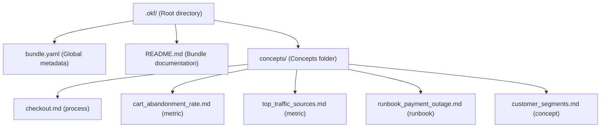
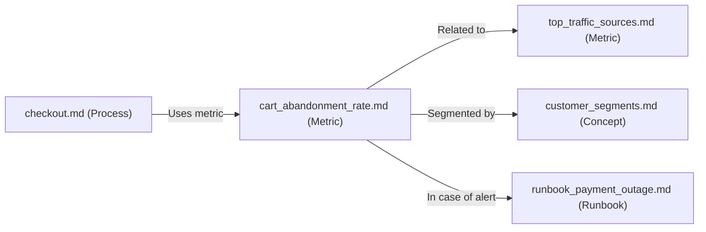

# OKF: What Google Just Launched (And Why It Matters to You Even If You Don't Use Google)

## 1. THE OPENING — The Hook

Imagine this. It's 11 PM. You are finishing the training of an AI agent to answer support tickets for your company. You've been at it for weeks. You've fed it PDFs of user manuals. You've copy-pasted links to Notion workspaces. You've opened a read-only tab to the BigQuery database where customer records live. And yet, when you ask it something even slightly specific — "what is the SLA for the Pro plan?" — it responds with a generic, hallucinated paragraph that has nothing to do with your business rules.

You get the sinking feeling that it knows everything about the world, but absolutely nothing about your business. It acts like a brilliant intern who has been at the company for three months and still doesn't know where the coffee machine is.

That frustration has a technical name: the lack of portable context. And it isn't a new problem. Your team has it. The team next door has it. Half the software industry is currently struggling with it. Everyone is trying to solve it in their own corner using ad-hoc, proprietary, and incompatible custom wrappers.

On June 12, 2026, Google Cloud quietly published something called OKF (Open Knowledge Format). There was no big keynote. There were no flashy fireworks. It was just a technical blog post accompanied by a repository on GitHub. And yet, it could be one of those small, boring pieces of infrastructure that end up completely changing how we build AI agents. Let me explain why.

---

## 2. WHY THIS TOPIC AND WHY NOW

Very few blogs have deep-dived into OKF yet. Most of the conversation is concentrated in English and confined to highly specialized channels (data engineering, AI infrastructure). But this isn't just a topic for data engineers or database administrators. If you build AI agents, if you work with LLMs, if you maintain a wiki for your project, or if you simply care about where the software engineering ecosystem is heading: you need to pay attention.

And the urgency isn't marketing fluff: the specification is barely a month old. There is a very short window of opportunity where you can take it seriously before the rest of the industry catches up.

Let's look at the quick historical context: Google has been trying to break into the "knowledge management for AI" space for years. Knowledge Graph, Vertex AI Search, Agentspace... all of them closed, proprietary enterprise SaaS products. OKF represents their first open, vendor-neutral, and lightweight attempt to establish a standard. Coming from a hyperscaler like Google Cloud, that shift is not trivial.

In the next 15 minutes, we are going to unpack exactly what OKF is, why it exists, how to use it, what problems it solves, what it doesn't solve, and my honest assessment of whether this standard will stick around or die trying.

---

## 3. THE UNDERLYING PROBLEM

### 3.1 Organizational knowledge is a complete mess

Let's describe how knowledge accumulates in a typical company: it behaves like geological sediment. There are outdated PDFs buried in shared Google Drive folders, Notion pages last modified three years ago, Zendesk tickets marked as resolved with hacky workarounds, code comments scattered across old GitHub PRs, and critical Slack threads that sink into the oblivion of infinite scroll. This is what we call tribal knowledge: things that people know but are never written down in a structured, accessible way.

Studies by firms like IDC and Gartner have been saying the same thing for years: between 60% and 80% of corporate data is unstructured. But let's be honest, "unstructured" is just a polite engineering euphemism for "it is scattered everywhere and nobody knows which version is the source of truth."

When humans searched for information, this chaos was painful but manageable. A human knows how to navigate ambiguity, knows who to ping on Slack, or ignores a document if the update stamp is from 2022. However, in the era of AI agents, this disorganization is a fatal bottleneck. You cannot tell an LLM to "figure it out in the Drive." The agent needs curated, structured, and reliable knowledge to work.

### 3.2 Agents are smart but ignorant

A state-of-the-art LLM has read almost the entire public internet. It can explain Einstein's theory of general relativity, write a complex SQL query, or compose a poem in pentameter. But it knows absolutely nothing about your company's inner workings. It doesn't know what your internal column `churn_risk` means, how your payment gateway calculates conversion rates, or why your onboarding process has 14 manual steps instead of 5.

To compensate for this deep ignorance of the business, engineering teams usually make three key mistakes:
1. **Pasting context manually in every prompt:** It works for simple scripts, but it doesn't scale. The context size blows up, latency increases, and you end up spending a fortune on tokens to repeat the exact same rules over and over.
2. **Classic RAG (Retrieval-Augmented Generation):** The standard process of chunking documents, passing them through an embedding model, and storing them in a vector database for similarity search. It is the industry trend, but it is expensive, opaque, and brittle. If your chunking algorithm splits a crucial paragraph in half, the agent loses the context and starts hallucinating.
3. **Proprietary metadata systems:** Every team invents their own JSON schema or custom text formats to feed context to their agents, leading to the third problem.

### 3.3 The "knowledge island" effect

The ultimate result of this custom approach is complete fragmentation. The support agent doesn't know what the marketing agent knows. The CRM agent cannot understand the data structures used by the data warehouse. Every team builds their own "knowledge island" using incompatible schemas.

The real pain starts when you decide to switch LLM providers (e.g., migrating from OpenAI to Anthropic, or running a local model like Llama or DeepSeek) or when you want to switch agent frameworks (like moving from LangChain to AutoGen or Claude Code). You quickly realize you have to rebuild your entire context layer from scratch because it was heavily coupled to proprietary tools.

This is the exact wall that OKF promises to break.

---

## 4. WHAT IS OKF, EXACTLY?

### 4.1 The short definition

**OKF (Open Knowledge Format)** is an open, vendor-neutral specification published by Google Cloud on June 12, 2026. It is currently in its version 0.1 (Draft) under the Apache 2.0 license.

### 4.2 The long definition

It is a technical specification designed to represent organizational knowledge — tables, metrics, APIs, processes, runbooks, and decisions — in a standard format that both humans and AI agents can read and write without proprietary SDKs, runtime environments, or vendor lock-in.

The beauty of OKF lies in its radical simplicity: it is not a new framework. Google describes it with a phrase that has become the core thesis of the standard:

> "OKF formalizes the LLM-wiki pattern into a portable, interoperable format." — Google Cloud

### 4.3 What it is NOT

To avoid confusion, let's establish what OKF is not:
* **It is not a platform:** You don't sign up for an account to use it.
* **It is not an API:** You don't make HTTP calls to a Google server to parse a bundle.
* **It is not an enterprise SaaS product:** There are no monthly fees or premium tiers.
* **It is not a complex JSON schema:** While engineers love nesting data in JSON or Protocol Buffers, OKF relies on something far more readable.

It is, literally, an agreed-upon way to write and link plain text files. If JSON Schema is the agreement on how to describe the shape of data, OKF is the agreement on how to describe the meaning and context surrounding that data.

---

## 5. THE ANATOMY OF AN OKF BUNDLE

### 5.1 The building blocks

An OKF "Bundle" is simply a physical directory containing a predictable, lightweight file structure:

* **Concept:** Every unit of knowledge (like a metric definition or a deployment process) is written in a standard Markdown (`.md`) file inside a folder named `concepts/`.
* **Bundle Metadata:** A configuration file named `bundle.yaml` in the root directory that defines global metadata (name, version, maintainer, description).
* **Frontmatter:** The YAML block at the beginning of each concept Markdown file. The only strictly required field is `type` (defining if the concept is a `metric`, `process`, `table`, `runbook`, etc.). Everything else (title, description, linked resources, tags, and update timestamps) is optional.
* **Knowledge Graph:** Relationships between concepts are defined using standard Markdown links (`[text](file.md)`). By linking files together, you build an organic, traversable knowledge graph that LLMs can recursively follow to build full context.

### 5.2 Directory structure of an OKF Bundle

The following Mermaid diagram represents the folder layout of a standard `.okf/` bundle in a repository:



And here is the network graph representing the relationship between these concepts:



### 5.3 A real-world concept example: `cart_abandonment_rate.md`

Here is how a real OKF concept file looks under the hood, defining a shopping cart abandonment metric:

```markdown
---
type: metric
title: Cart abandonment rate
description: The percentage of users who initiate checkout but do not complete the payment.
resource: bigquery://analytics.weekly_cart_abandonments
tags: [ecommerce, kpi, weekly]
updated: 2026-06-15
---

# Cart abandonment rate

This metric is calculated **weekly** from the `analytics.weekly_cart_abandonments` table in BigQuery.

## Formula

abandonment = sessions_initiating_checkout - sessions_completing_payment
abandonment_rate = abandonment / sessions_initiating_checkout

## Why it matters

It is one of the three primary indicators of our conversion funnel. Along with [weekly traffic](top_traffic_sources.md) and [customer segments](customer_segments.md), it defines our core business health.

## Related runbooks

If the abandonment rate increases by more than 15% week-over-week, immediately consult the [payment outage runbook](runbook_payment_outage.md) to check Stripe API availability.
```

And this is the corresponding `bundle.yaml` metadata file:

```yaml
name: ecommerce-context
version: 0.1.0
description: Core structured context for AI agents working on our e-commerce platform.
maintainer: data-platform@example.com
```

Look at the files: there is no magic. It is plain Markdown, standard YAML, and normal relative links that any editor can render.

### 5.4 The power of simplicity

The fact that an OKF bundle can be opened in any text editor, rendered natively on GitHub, searched on the command line using `grep`, and versioned line-by-line using `git` is a deliberate architectural decision. Google designed this standard to require zero runtime infrastructure. They wanted to make sure you don't need their cloud (GCP) to read, store, or migrate your own organizational knowledge.

---

## 6. THE THREE DESIGN PRINCIPLES

The OKF specification stands on three foundational pillars:

1. **"Just Markdown":** The content of each concept is standard Markdown. Any editor can open it. GitHub renders it by default. Standard CLI tools search it. If your team knows how to write a readme, they already know how to write OKF concepts.
2. **"Just files":** An OKF bundle requires no vector database, no special API servers, and no custom storage engines. It is just a directory of files. You can zip it, commit it to Git, upload it to an S3 bucket, or serve it statically via Nginx.
3. **"Just YAML frontmatter":** The absolute minimum amount of metadata structure to make the bundle queryable by code. Only `type` is required. Everything else is optional and extensible. If a parser encounters a custom metadata field it doesn't recognize, it simply skips it.

<blockquote>"No new runtime. No required SDK. Just markdown files with YAML frontmatter in a directory. It is the format your team was already using informally, but now with a name and a few simple rules." — Google Cloud, paraphrasing their own engineering team.</blockquote>

And this simplicity is not an accident. It is the formalization of a pattern that developers have been building on their own for years.

---

## 7. THE LINEAGE: FROM OBSIDIAN TO KARPATHY TO GOOGLE

### 7.1 Before OKF: personal wikis and local knowledge graphs

If you use tools like Obsidian, Notion, Roam Research, or Logseq, this pattern will feel incredibly familiar. The practice of keeping markdown notes connected by relative links (what Obsidian calls a *vault*) has been the foundation of Personal Knowledge Management (PKM) for a decade.

We developers were already managing our documentation this way: plain markdown files referencing other markdown files to build a network of ideas. We had incredible local knowledge graphs running on our machines, but we were missing a standard to allow AI agents to navigate this graph without relying on heavy databases.

### 7.2 The turning point: Karpathy's LLM Wiki pattern

In late 2024, Andrej Karpathy (former Director of AI at Tesla, co-founder of OpenAI) published a gist proposing what he named the **"LLM Wiki pattern"**:

The core idea was to keep the curated knowledge and operational instructions of a software project in a dedicated folder of plain markdown files inside the codebase repository. This allowed coding agents and language models to read the project's documentation in the exact same way a human developer reads `README.md` or `CONTRIBUTING.md` to understand system architecture.

Following his gist, the developer community started implementing this pattern informally:
* [AGENTS.md](file:///home/arceappspc/Projects/ArceApps/arceapps.github.io/src/content/blog/es/agents-md-estandar.md) files in the root of repositories to define guidelines for agentic runs.
* `CLAUDE.md` files designed specifically for tools like Claude Code to read local testing, build, and styling rules.
* Team wikis written in plain markdown stored in `.github/` or `docs/` folders.

### 7.3 What was missing: the common agreement

The problem with this organic adoption was that everyone did it differently. Some wrote descriptions in H2 headers, others in HTML comments, and others in custom YAML blocks. There was no common specification for properties like linked databases, schemas, or document types. There was no way to share this context between different AI tools seamlessly.

Google recognized this gap and introduced OKF not to invent a new technology, but to serve as a "minimum common agreement." It is a metadata layer that says: "If you are going to use the LLM-Wiki pattern, let's agree on these basic rules so that tools across the entire industry can read it."

It is a direct historical parallel to the creation of Markdown in 2004. People were already formatting emails and text documents with informal symbols. Aaron Swartz and John Gruber didn't invent formatting; they just defined a simple set of rules to convert text to HTML. And it won the web. OKF aims to do the exact same thing for AI knowledge.

---

## 8. STEP-BY-STEP PRACTICAL EXAMPLE

### 8.1 Build your first Bundle in 5 minutes

Setting up an OKF bundle in your local project directory is incredibly easy and requires no complex tooling. Follow these steps:

1. **Create the configuration directory:** In the root of your project, create a directory named `.okf/`.
2. **Define global metadata:** Create a file named `bundle.yaml` in the root of the `.okf/` folder. Specify the name, version, a short description, and the maintainer's email.
3. **Set up the concepts directory:** Inside `.okf/`, create a subdirectory named `concepts/`. This is where all your Markdown concept definitions will live.
4. **Write your first concept file:** Create a file named `processes_deploy.md` and start it with a YAML frontmatter block defining `type: process`, `title`, and other metadata. Write the rest of the file in standard Markdown explaining your deployment workflow.
5. **Establish relationships:** Create a second concept file (e.g., `runbook_database_backup.md` of `type: runbook`) and link the first file to the second using standard Markdown link syntax: `[Deployment Process](processes_deploy.md)`.
6. **Commit to Git:** Run `git add .okf/` and commit the files. From this moment on, any AI agent with access to your repository can read and navigate your local knowledge graph.

### 8.2 How an AI agent consumes the context

The major benefit of this pattern is the clarity and simplicity of the consumption flow. Instead of requiring you to spin up database instances, run embedding pipelines, and execute vector similarity searches, the agent simply:

1. Scans the `.okf/` directory at the start of execution.
2. Parses `bundle.yaml` to understand the scope of the available knowledge.
3. Reads the specific concept file it needs based on the user's current task or file focus.
4. If that concept file links to other concepts via standard Markdown links, the agent recursively fetches those files to build a structured context tree.

This makes debugging context issues completely transparent. If the agent makes a mistake or hallucinates, you can inspect the execution logs and see exactly which Markdown files it read from your concepts folder. There are no surprises from "vector similarity" algorithms retrieving random, out-of-context chunks of text. Furthermore, token usage is highly predictable and significantly cheaper.

### 8.3 Official reference tools published by Google

To ensure the specification was immediately usable, the Google Cloud engineering team released a set of open-source reference tools in their GitHub repository:

* **Concept Generator CLI:** A script that connects to database warehouses (like BigQuery) and automatically generates Markdown concept files (`.md`) for every table and view, extracting column names, data types, and primary-foreign key relationships.
* **Context Enricher:** An automated step that uses Gemini 1.5 Pro or Gemini 2.0 Flash to analyze the generated concept files and enrich them with clear documentation, common JOIN paths, and business descriptions to make them easier for agents to consume.
* **Static Graph Visualizer:** A Python/Node script that parses your `.okf/concepts/` folder and compiles a single, lightweight interactive HTML file. This file visualizes your entire knowledge graph directly in the browser using D3.js—running completely offline with zero tracking.
* **Reference Bundles:** Google included three fully implemented sample bundles to show the standard in action: the GA4 e-commerce schema, the public Stack Overflow dataset schema, and the historical Bitcoin transactions dataset.

---

## 9. COMPARISON: OKF VS. WHAT WE USED BEFORE

To understand the real value of OKF, we must compare it to the existing context-management practices in the AI industry. The diagram below illustrates the shift in architecture from traditional RAG workflows to OKF's flat-file approach:

```mermaid
graph TD
    subgraph Traditional Flow (RAG/Proprietary)
        Docs[Scattered Documents] --> Chunking[Chunking Pipeline]
        Chunking --> Embeddings[Embedding Model]
        Embeddings --> VectorDB[Vector Database]
        VectorDB --> Search[Semantic Similarity Search]
        Search --> Agent1[AI Agent]
    end

    subgraph OKF Flow
        FlatFiles[Markdown + YAML Files] --> Git[Git Repository/Versioning]
        Git --> DirectRead[Direct Graph Retrieval]
        DirectRead --> Agent2[AI Agent]
    end
    
    style VectorDB fill:#FF9800,stroke:#333,stroke-width:2px,color:#fff
    style FlatFiles fill:#018786,stroke:#333,stroke-width:2px,color:#fff
```

### 9.1 OKF vs. Traditional RAG (Vector Search)

* **RAG:** Designed to handle millions of unstructured documents (such as legal contracts, long chat transcripts, or legacy PDFs). It relies on embedding models and vector databases. It is excellent for semantic search across large volumes of data, but it is expensive to run, complex to maintain, and prone to retrieval noise.
* **OKF:** Designed for highly curated, low-volume, high-value organizational knowledge (such as core business logic, KPI metrics, or internal APIs). Because it relies on plain text files connected by explicit Markdown links, retrieval is deterministic, auditable, and has near-zero latency.
* **When to use which:** Use RAG when you have massive amounts of unstructured files that you cannot manually curate. Use OKF to define the core semantic rules, business metrics, and operational runbooks that your AI agents must follow without exception.

### 9.2 OKF vs. `AGENTS.md` / `CLAUDE.md`

* **`AGENTS.md` & `CLAUDE.md`:** These are single-file instruction manuals designed to guide the behavior of a specific agent inside a single repository. They are read at the start of a session and tell the agent *how* to act.
* **OKF:** A portable knowledge graph that defines *what* the agent knows about the organization. An OKF bundle can be published independently at a URL, imported across multiple repositories, and shared by several different agents simultaneously.
* **Coexistence:** They complement each other. In practice, your `AGENTS.md` file can include a directive telling the agent: *"Read and respect the OKF knowledge graph in the local .okf/ directory to answer any questions about our database schemas and business metrics."*

### 9.3 OKF vs. Notion / Confluence / Proprietary Wikis

* **Notion & Confluence:** Rich databases with beautiful web interfaces. They are excellent for human collaboration, but their data is locked behind complex proprietary APIs. Furthermore, they lack a standard format to export inter-document semantic relationships clearly for LLMs.
* **OKF:** Because it consists of plain text files in local directories, it is immune to SaaS platform lock-in. If your wiki tool changes its pricing or goes out of business, your organizational knowledge remains safely versioned in your Git repository.

### 9.4 OKF vs. JSON Schema / RDF / OWL / Semantic Web Ontologies

* **RDF, OWL, and Semantic Web:** Incredibly powerful standards for representing mathematical knowledge graphs. However, they are so complex, verbose, and difficult for humans to write that they have been largely ignored outside of academic circles and advanced data science teams.
* **OKF:** Sacrifices complex mathematical relations and formal types in favor of widespread adoption. It is standard Markdown that any developer can edit in VS Code or Vim in two seconds, and any LLM can understand without specialized loaders.

---

## 10. WHAT OKF IS NOT (ANTI-HYPE)

As with any technology introduced by a tech giant like Google Cloud, marketing hype can easily distort reality. Let's look at what OKF **is not**:

* **It is not a Google Search ranking signal:** Implementing an OKF bundle on your public website will not improve your traditional search engine optimization (SEO) ranking. Google Cloud was clear: this is a metadata format designed for internal AI agents and application context, not for the Google Search bot to index websites.
* **Public LLMs do not crawl it automatically:** Just because you host a `.okf/` folder on your server doesn't mean ChatGPT, Claude, or Gemini will automatically find it and cite your business. The specification is only a month old; for AI search engines to read it automatically, it would first need to become a web standard like `robots.txt`. Today, you must manually program your agents to parse and consume your bundles.
* **It is not an official, guaranteed Google product:** The GitHub repository contains a clear disclaimer: *"This is not an official Google product."* It is an open-source draft (v0.1) pushed by Google Cloud engineers. The specification can change dramatically or be abandoned if it doesn't gain traction. Do not build critical production pipelines around it without being ready to rewrite your parsers.
* **It is not a magic solution for bad documentation:** If your internal wikis are outdated, your metrics are poorly defined, or your APIs are documented incorrectly, OKF won't fix it. The standard provides portability, but content quality is still your responsibility. Garbage in, garbage out.

---

## 11. WHO BENEFITS TODAY?

Despite being in draft status, OKF provides immediate value in several scenarios:

### 11.1 Internal Data Teams

If you manage complex data warehouses in BigQuery, Snowflake, Databricks, or PostgreSQL with hundreds of tables and metrics, onboarding new engineers is painful. Documenting what each column means, what JOIN operations are valid, and how key metrics are calculated in OKF concept files allows your AI data analysts (like a Slack bot that writes SQL queries) to act like senior data engineers from day one.

### 11.2 Agent Developers Using Custom Business Data

If you are building an AI agent to answer user queries about your CRM, inventory, or support tickets: instead of pasting business rules in massive system prompts, store them in an OKF bundle. The agent can query and read these definitions deterministically as needed, keeping prompt sizes small and responses accurate.

### 11.3 Open Source Projects and Libraries

If you maintain a popular open-source library, you can ship an OKF bundle in your repository to document its architecture and API design patterns. Coding agents like Claude Code, Cursor, or Copilot will read these concepts and suggest much cleaner, more idiomatic code to developers using your library.

### 11.4 Indie Hackers and Makers

If you have a side project, keeping a `.okf/` folder forces you to organize your operational knowledge as a graph. Having your deployment processes, database backups, and APIs documented in a clean, standardized format will save you hours of frustration when you return to the codebase after months away.

---

## 12. CRITIQUES AND HONEST RISKS

To maintain a balanced architectural perspective, we must address the risks facing this new standard:

* **Risk 1: The adoption cliff.** Open standards only survive if the community adopts them. If OKF remains a niche tool that only the Google Cloud ecosystem understands, it will die. The standard needs other key AI players—such as Anthropic, OpenAI, or Microsoft—to support the format natively in their developer toolkits.
* **Risk 2: Google Cloud vendor drift.** Although Google claims OKF is vendor-neutral, its initial reference tooling is heavily integrated with Google Cloud services like BigQuery and Vertex AI. We must watch closely to ensure that future updates do not introduce hidden dependencies that compromise the standard's portability.
* **Risk 3: Draft v0.1 instability.** Designing systems around a draft specification is risky. Future iterations are highly likely to introduce breaking changes to the `bundle.yaml` structure or required frontmatter properties. Developers should be cautious and wait for a v0.5 or v1.0 release before integrating it into core production pipelines.
* **Risk 4: Simplicity as a limitation.** By sticking to flat Markdown files, OKF lacks features that more robust knowledge graphs possess, such as typed relationships between nodes, inheritance, or granular version control for individual concepts. Adding these features later without complicating the standard will be a major challenge.

---

## 13. MY OPINION (EXTENDED)

### The Good

It is refreshing to see Google Cloud choose a genuinely open path. Instead of locking this metadata standard inside a proprietary, paid feature of Vertex AI Search, they published the specification under the Apache 2.0 license and hosted it on GitHub. This shows they realize the context problem for AI agents cannot be solved by building more closed gardens, but by establishing shared standards.

The specification's simplicity is also its greatest strength. If you have experience with Markdown and YAML, you can learn OKF and write your first bundle in five minutes. There are no databases to configure or APIs to learn. This low barrier to entry is essential for developer adoption.

### The Bad

The ultimate success of OKF will depend entirely on its governance. If Google retains absolute control over the specification's roadmap, the standard will likely evolve to favor GCP's products. To build industry-wide trust, Google should donate OKF to an independent foundation (like the Linux Foundation or CNCF) where all AI ecosystem participants have an equal voice.

Furthermore, we must push back against the hype from marketing agencies already selling OKF as "the next SEO for AI." This misleading narrative creates false expectations and distracts developers from the standard's real technical utility, potentially damaging its reputation before it can mature.

### My 12-18 Month Prediction

I place a **60% probability on OKF succeeding** and a **40% probability on it failing**.

If popular agent orchestration frameworks (like LangChain, LlamaIndex, or AutoGen) and AI development tools (like Claude Code, Cursor, or Copilot) build native support for reading OKF folders over the next year, the standard will stick. If it remains confined to Google Cloud's developer circles, it will join the long list of interesting Google technologies that died from lack of community adoption (such as AMP or early-stage web Dart).

---

## 14. CLOSING AND CTA

### Summary in one sentence

> **OKF (Open Knowledge Format)** is an open-source, vendor-neutral metadata standard that uses Markdown files and YAML frontmatter to make your organization's business metrics and operational processes portable and understandable for AI agents.

### Call to Action

If you want to move from theory to implementation, in our next blog post we will **build a real OKF bundle from scratch** using a sample e-commerce dataset, and show exactly how a local coding agent like Claude Code reads and uses the concepts to answer database questions.

**Subscribe to the ArceApps newsletter** or follow me on social media to make sure you don't miss the upcoming hands-on tutorial.

### Open Questions for Discussion

I would love to hear your thoughts in the comments section below:
1. How do you currently manage business context for your AI development pipelines? Are you using ad-hoc `AGENTS.md` files, Notion wikis, or have you already built a custom RAG solution?
2. Do you believe a standard proposed by Google Cloud can be adopted neutrally by competitors like OpenAI, Microsoft, or Anthropic?
3. What kind of personal or side project would you document using an OKF bundle?
4. If you had to choose today for a new enterprise agent: would you implement a vector-based RAG architecture or bet on the simplicity of an OKF concept graph?

***

## Bibliography and References

*   **Google Cloud Platform:** [Official OKF Specification Repository (knowledge-catalog) on GitHub](https://github.com/GoogleCloudPlatform/knowledge-catalog)
*   **Google Cloud Blog:** [Official Open Knowledge Format Announcement (June 12, 2026)](https://cloud.google.com/blog/)
*   **Andrej Karpathy:** [Original 'LLM Wiki' Gist (December 2024)](https://gist.github.com/karpathy)
*   **ArceApps Blog:** [Guide to Implementing the AGENTS.md Standard](file:///home/arceappspc/Projects/ArceApps/arceapps.github.io/src/content/blog/en/agents-md-estandar.md)
*   **ArceApps Blog:** [Effective Context Engineering for Language Models](file:///home/arceappspc/Projects/ArceApps/arceapps.github.io/src/content/blog/en/contexto-efectivo-ia.md)
*   **ArceApps Blog:** [Managing Markdown Knowledge with Obsidian for Developers](file:///home/arceappspc/Projects/ArceApps/arceapps.github.io/src/content/blog/en/obsidian-desarrolladores.md)

