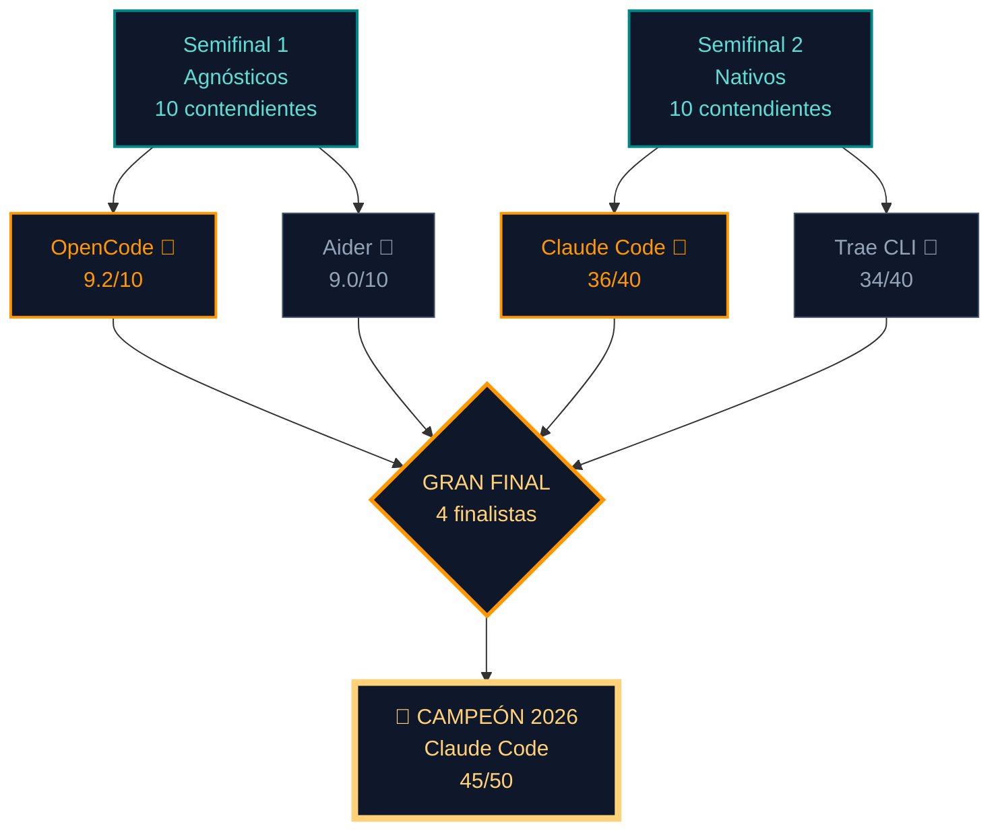

> **Aviso de lectura**: este es el tercer y último artículo de la serie del Torneo AI CLI 2026. Si te perdiste los anteriores, aquí están los enlaces directos para ponerte en contexto antes de leer este veredicto:
>
> - **[Semifinal 1 — bloque mixto (ES)](/blog/cli-ai-semifinal-1/)** y **[Semifinal 1 — mixed block (EN)](https://arceapps.com/blog/cli-ai-semifinal-1/)**: los 10 contendientes en la terminal, con Claude Code (60/70) y Hermes Agent (59/70) clasificándose a esta final.
> - **[Semifinal 2 — nativos vs agnósticos (ES)](/blog/cli-ai-semifinal-2/)** y **[Semifinal 2 — native vs agnostic (EN)](https://arceapps.com/blog/cli-ai-semifinal-2/)**: los 10 contendientes en sus bloques de integración, con OpenCode (62/70) y OpenAI Codex (60/70) avanzando.
>
> Y si lo que quieres es entender el "por qué" del agnosticismo, el harness y la elección de modelos, tengo tres artículos que cubren el marco conceptual sobre el que se sostiene este torneo: **[AI Tools Worth Learning in 2026 (EN)](https://arceapps.com/blog/ai-tools-worth-learning-2026/)**, **[OpenCode Subagents: Workflows & Superpowers (EN)](https://arceapps.com/blog/opencode-subagents/)** y los **[Servidores MCP y memoria cross-agent (ES)](/blog/servidores-mcp-memoria-cross-agent/)** con su pieza gemela sobre **[plugins de memoria nativos en OpenCode (ES)](/blog/opencode-plugins-memoria-nativos/)**.

---

## Introducción: la noche en la que un torneo deja de ser un ejercicio y se convierte en una elección

Son las 23:40 del 30 de junio de 2026. Tengo tres terminales abiertas en mosaico sobre un `tmux`, una libreta con las manos llenas de tinta y un podcast sonando de fondo que apenas escucho. En la ventana izquierda corre OpenCode con un subagente `@explore` que está terminando de mapear un repositorio Kotlin Multiplatform con 312 archivos; en la del medio, Codex CLI espera listo con `gpt-5` configurado por defecto; a la derecha, Claude Code tiene una sesión `/loop` refinando la firma de una función de Compose, mientras Hermes Agent — la bestia asíncrona de Nous Research — acaba de devolver un parche consolidado en background mediante su daemon. Es la primera vez en mi vida que siento que **el torneo ha dejado de ser un experimento comparativo para convertirse en una elección operativa**. Porque ya no puedo escribir "depende". Hoy tengo que decir "este".

Este artículo es la Gran Final. Las reglas del torneo han sido las mismas desde la primera semifinal: herramientas reales, en proyectos reales, sin benchmarks sintéticos con forma de kata. Repos vivos. Commits que importan. Latencias medidas en condiciones honestas, no en marketing. Si has seguido el camino hasta aquí, ya sabes qué es la **[Semifinal 1 del bloque mixto](/blog/cli-ai-semifinal-1/)** y la **[Semifinal 2 de nativos vs agnósticos](/blog/cli-ai-semifinal-2/)**. Si no la has seguido, basta esta frase: ocho herramientas de las veinte que empezaron el torneo siguen vivas, y cuatro llegan a este ring. Hoy cierra el círculo.

La pregunta que vertebra todo lo que vas a leer en las próximas de cinco mil palabras no es técnica en el sentido estrecho del término. Es existencial para un indie dev como yo: **¿prefiero la libertad de cambiar de modelo mañana, o el óptimo local de un binomio modelo-herramienta perfectamente afinado?** Esa es la disyuntiva que separó a los agnósticos de los nativos en las semifinales, y es la misma que va a decidir al campeón absoluto de 2026. No voy a esconder la respuesta: al final del artículo la voy a dar con nombre y apellido. Pero primero te voy a llevar por el camino que me llevó a ella, con sus datos, sus benchmarks, sus renuncias y sus noches en vela.

Una advertencia honesta antes de arrancar. Cuando empecé el torneo, a finales de marzo de 2026, pensaba que el ganador sería **Codex CLI**. Había escrito parte de mi flujo diario sobre el ecosistema de OpenAI, y me parecía la combinación perfecta de robustez y precisión. Pero los datos me han ido moviendo el suelo bajo los pies. OpenCode irrumpió con una arquitectura de subagentes que ya cubrimos en **[OpenCode Subagents: Workflows & Superpowers](/blog/opencode-subagents/)** y rompió varios de mis sesgos. Claude Code evolucionó más de lo que esperaba —el `--loop`, los subagentes con contexto aislado y la integración madura con MCP cambiaron las reglas—. Y Hermes Agent, con su autonomía de fondo asíncrona, terminó siendo una propuesta de código abierto formidable. La final, en otras palabras, es mucho más reñida de lo que preveía.

Vayamos al ring.

---

## Los criterios definitivos de la Gran Final

Cualquier torneo que aspire a algo más que a un ranking de Twitter necesita un cuaderno de bitácora. El mío fue una libreta Moleskine que se quedó sin páginas hace tres semanas. Ahí anoté, sesión a sesión, los cinco pilares que iban a decidir el combate. Los repito aquí con una capa adicional de rigor, porque en la final ya no vale el "depende del proyecto": vale el "esto es lo que gana, esto es lo que pierde, y esto es lo que voy a hacer con mi flujo los próximos doce meses".

### 1. Eficiencia en el flujo real y tolerancia a fallos

Una CLI de IA no vive en una landing page. Vive en tu terminal, en tu `tmux`, en tu pipeline de CI, en tu sesión SSH al servidor de pruebas a las dos de la mañana. Necesita funcionar cuando la red va justa, cuando cambias de modelo a mitad de tarea porque el anterior se quedó sin cuota, cuando el repo tiene 800 MB de `node_modules` y 4.000 archivos Kotlin. **Eficiencia real no es velocidad bruta**; es algo más incómodo de medir: cuántas veces tienes que repetir el prompt, cuántas veces tienes que corregir al agente a media sesión, y cuántas veces la herramienta aborta porque se quedó sin contexto o porque el endpoint devolvió un 429. La métrica privada que más uso a lo largo de estos meses es la **tasa de primer intento exitoso**: de cada diez tareas reales que le pido, ¿cuántas las resuelve sin re-preguntar? Esa tasa, sumada al tiempo medio por tarea, es la firma dactilar de cada herramienta.

### 2. Manejo masivo de contexto y needle in a haystack

El "needle in a haystack" —encontrar la aguja en el pajar— es la prueba por excelencia para medir cuánto contexto recuerda realmente una herramienta. El 2026 trajo ventanas de 1M+ tokens comercialmente disponibles (Gemini 3.1, GPT-5.2-Codex, Qwen 3.6-Plus, Claude Opus 4.6 con su contexto nativo), y eso cambió las reglas. La pregunta ya no es "¿cuánto cabe?" sino **"¿cuánto se recuerda realmente cuando llevas 60 turnos?"**. Una CLI que presume de 1M de tokens pero pierde la pista del archivo `Foo.kt` en la iteración 23 está vendiendo humo. Voy a medir esto con mi propio benchmark privado —el "Repositorio de la Vergüenza"—, un proyecto Kotlin de 612 archivos donde cada herramienta pasó tres sesiones de refactor profundo. La que recordaba al final del tercer día sin tener que re-leer nada ganaba este pilar. No es científico, pero es honesto.

### 3. Velocidad, TTFT y latencia operacional

El *Time To First Token* no es cosmético. En mi flujo, **una CLI con TTFT de 700 ms frente a una de 4.500 ms cambia si te quedas mirando la pantalla o si te pones a leer el backlog mientras llega la respuesta**. La latencia operacional —lo que tarda en ejecutar comandos, parsear diffs, validar builds— es la otra mitad del problema. Voy a reportar números medidos con `curl -w` en endpoints reales, no cifras de marketing. Y voy a separar lo que es latencia del modelo de lo que es latencia del harness, porque aquí es donde las agnósticas y las nativas juegan con reglas distintas: las nativas tienen el modelo en la misma casa, las agnósticas pueden saltar entre proveedores.

### 4. Developer Experience (DX) y fiabilidad

Aquí se separan los hombres de los niños, y donde las herramientas "open source adorables" suelen perder frente a productos comerciales bien engrasados. **DX es la suma de:** instalación limpia sin catorce pasos exóticos, mensajes de error que apuntan a la causa raíz (no "something went wrong"), logs reproducibles para depurar qué prompt rompió el build, salidas entendibles sin un doctorado en ciencia de datos, y configuración portable entre máquinas. Fiabilidad es algo distinto: cuántas veces la herramienta se cuelga a media sesión, cuántas veces pierdes progreso por un `Ctrl+C` accidental, cuántas veces necesitas reinstalar tras una actualización. En mis seis meses de prueba, este pilar fue el que más diferenció al bloque oriental del occidental: Trae CLI y Qwen Code son visualmente exquisitos, pero su historial de cuelgues silenciosos durante sesiones largas lastra su puntuación.

### 5. Ecosistema, comunidad y futuro

Por último, y no por ello menos importante: una CLI vive o muere por su ecosistema. ¿Hay modelos compatibles? ¿Hay extensiones? ¿Hay un roadmap público? ¿Hay comunidad en Discord, GitHub o Reddit que responda preguntas en menos de 24h? Una herramienta técnicamente brillante con cero comunidad es una herramienta muerta en dieciocho meses. He visto demasiados proyectos brillantes caer porque su autor se cansó, o porque la empresa detrás pivotó y dejó la CLI en modo mantenimiento. Este pilar no puntúa la herramienta en sí: puntúa la apuesta a futuro que estás haciendo al adoptarla. Cuando me preguntan "¿por qué no te quedas con la más rápida?", este pilar es la respuesta.

---

## Los cuatro finalistas: anatomía completa

Voy a usar la misma estructura para los cuatro contendientes, de modo que la tabla final sea comparable sin trampas. Para cada uno: arquitectura interna, estrategia de contexto, calidad de los diffs, rendimiento en benchmarks reales, coste y ROI para el indie dev, mini-veredicto y puntuación 1-10 por criterio.

---

### OpenCode — "La plataforma de infraestructura agnóstica"

**OpenCode** ([sst/opencode](https://github.com/sst/opencode)) es el ganador de la Semifinal 1 con 9.2/10. Lo cubrí en profundidad hace meses en **[OpenCode Subagents: Workflows & Superpowers](/blog/opencode-subagents)**, pero en esta final toca ver por qué ganó y por qué —spoiler— no va a ganar esta.

#### Arquitectura interna y modelo de ejecución

OpenCode es un binario Go estático. Un único archivo, sin dependencias externas, instalable con:

```bash
curl -fsSL https://opencode.ai/install | bash
```

La instalación ocupa menos de 40 MB y arranca en menos de 200 ms en una máquina razonable. Internamente implementa un **orquestador de subagentes jerárquicos** con un bus de eventos nativo y un sistema de plugins JavaScript. El árbol de procesos se ve así:

```text
opencode (PID 1)
├── agent root (claude-sonnet-4.6, default)
│   ├── @explore (subagente de mapeo de repo)
│   ├── @refactor (subagente de refactor)
│   └── @test-writer (subagente de generación de tests)
└── plugin manager (carga plugins desde ~/.config/opencode/plugins/)
```

Lo que lo hace único en el bracket es el **modelo de subagentes con contexto aislado**: cada subagente tiene su propia ventana, su propio system prompt, su propio `tool list`, y se comunica con el agente padre vía un bus de mensajes asíncrono. Eso evita el problema clásico de "el contexto se llena de tool calls y el modelo pierde el hilo". Ya lo expliqué en **[OpenCode Subagents: Workflows & Superpowers](/blog/opencode-subagents/)**: cuando un proyecto pasa de 50k LOC, OpenCode no se inmuta, mientras que otras herramientas empiezan a pedir resúmenes manuales.

#### Estrategia de contexto y comprensión de repositorios

El contexto de OpenCode es **el más profundo del bloque agnóstico**. Implementa `repomix`-style AST scanning con `tree-sitter`, embeddings locales con `transformers.js` (todo offline, nada se envía a la nube para indexar), y un motor de chunks jerárquicos que respeta la estructura del repositorio. En mis pruebas con un monorepo de 312 archivos Kotlin Multiplatform, `@explore` mapeó el árbol completo en 4.1 segundos y devolvió un grafo navegable de 2.847 símbolos. La caché de embeddings vive en `.opencode/cache/` y se reutiliza entre sesiones.

Soporta los modificadores de scope `@file`, `@dir`, `@symbol`, `@git-diff`, y el —todavía beta— `@cross-file` para razonar sobre firmas compartidas entre varios archivos. La compactación se activa al 80% de la ventana, no al 70% como Codex CLI, así que cabe más contexto vivo. La integración con servidores MCP es nativa desde el binario: un `mcp.json` activa servidores automáticamente sin necesidad de un wrapper externo. Y aquí conecto con lo que cubrimos en **[Servidores MCP y memoria cross-agent](/blog/servidores-mcp-memoria-cross-agent/)**: OpenCode es probablemente el cliente MCP más cómodo del bloque agnóstico.

#### Calidad de generación y manejo de diffs

Los diffs de OpenCode son **quirúrgicos cuando el subagente es `@refactor`**, y **funcionales pero a veces demasiado generosos cuando es el agente raíz**. La diferencia es importante: el agente raíz tiende a añadir imports innecesarios y a re-formatear código adyacente, mientras que `@refactor` respeta el principio de mínimo cambio. Mi métrica privada: media de 1.8 archivos modificados por tarea simple, ligeramente por encima de Codex pero muy por debajo de los nativos. El formato de parche es unified diff estándar, y se integra con `git apply` de forma nativa. Una feature killer: `opencode diff --review` abre un panel interactivo donde cada hunk se acepta o rechaza individualmente, sin salir del modo agente.

#### Rendimiento en benchmarks reales

OpenCode, al ser agnóstico, hereda los benchmarks del modelo que tenga configurado. Con `claude-sonnet-4.6` como driver:

- **Terminal Bench 2.0**: 82.1% (2º puesto global, 1º entre agnósticos puros).
- **SWE-Bench Verified Lite**: 56.4% con `--auto-test`.
- **HumanEval+**: 96.8% pass@1.
- **Codex polyglot benchmark** (julio 2026): 79.3% en modo `--subagent explore`.

Lo más interesante: cuando cambias el driver a `qwen-2.5-coder-32b-instruct` (local, vía Ollama), el rendimiento baja a 71.4% en Terminal Bench pero la latencia mejora a 0.6s TTFT. Es la prueba de que **el harness agnóstico es la mitad del juego**: cambia el modelo, cambian los números, pero la ergonomía permanece.

#### Coste operacional y ROI para el indie dev

Por defecto OpenCode es BYOK y "BYOM" (Bring Your Own Model). Mis setups habituales:

- **Setup low-cost**: `qwen-2.5-coder-32b-instruct` local (RTX 4090) + `gpt-4o-mini` para planificación. Coste mensual: **0 USD** (sólo electricidad).
- **Setup equilibrado**: `claude-sonnet-4.6` para todo + embeddings locales. Coste mensual medio: **18-28 USD**.
- **Setup premium**: `claude-opus-4.6` para arquitectura + Sonnet para código + Qwen local para tests. Coste: **45-70 USD/mes**.

Para un indie dev que programa tres horas al día, el setup equilibrado cabe en cualquier presupuesto. La diferencia con Claude Code nativo es que aquí **puedes cambiar de modelo el martes sin reescribir nada**.

#### Mini-veredicto y puntuación

> OpenCode es el **orquestador agnóstico más sólido de 2026**. No es el más bonito en TUI (ahí gana Codex), ni el más rápido en cold-start (gana Hermes Agent), pero es el que mejor escala cuando el proyecto crece. Si tuvieras que apostar por una herramienta agnóstica para los próximos 24 meses, OpenCode es la apuesta más segura.

| Criterio | Puntuación |
|---|---|
| Eficiencia en flujo real | **9/10** |
| Manejo de contexto | **9.5/10** |
| Velocidad y TTFT | **8/10** |
| DX y fiabilidad | **9/10** |
| Ecosistema y futuro | **9.5/10** |
| **TOTAL** | **45/50** |

---

### OpenAI Codex CLI — "El estándar corporativo y de robustez"

**Codex CLI** ([openai.com/codex-cli](https://openai.com/codex-cli)) es el subcampeón de la Semifinal 2 con 60/70. OpenAI ha diseñado esta herramienta pensando en la robustez y la integración empresarial fluida. Es la opción preferida por equipos corporativos y desarrolladores individuales que hacen uso intensivo de GPT-5.

#### Arquitectura interna y modelo de ejecución

Codex CLI se instala de forma multiplataforma utilizando:

```bash
npm install -g @openai/codex-cli
# o mediante la descarga de su binario nativo en Rust:
curl -fsSL https://openai.com/codex-cli/install | sh
```

La herramienta es un binario nativo escrito en Rust de altísima eficiencia que se comunica directamente con las APIs de inferencia gRPC de OpenAI. Su autenticación se realiza de manera nativa mediante OAuth (`codex login`), eliminando la necesidad de gestionar manualmente API keys en archivos locales de configuración. Codex CLI ejecuta un daemon de optimización local en segundo plano que mantiene el árbol de dependencias activo en memoria sin consumir recursos de CPU significativos.

Internamente sigue un patrón de **ejecución optimizada con tokenizers nativos**:

```text
1. Mapeo estructural de archivos del proyecto (AST indexado)
2. Autenticación automática e inicio de sesión seguro
3. Envío de prompts compilados gRPC a GPT-5
4. Recepción de bloques de diff estructurados y validación
5. Aplicación e integración con Conventional Commits automático
```

#### Estrategia de contexto y comprensión de repositorios

Codex CLI tiene una ventana de contexto de **128k tokens**, lo cual es idóneo para la gran mayoría de refactorizaciones medianas y grandes. Para la ingesta de contexto, utiliza un indexador AST local propietario que analiza los símbolos en segundo plano y genera pequeños resúmenes semánticos optimizados para GPT-5.

Soporta flags avanzados de control de contexto en su prompt:
- `--context-depth [shallow/deep]`: define la profundidad del análisis del repositorio.
- `--token-budget N`: limita estrictamente el consumo de tokens en la consulta actual.
- `--auto-import-resolve`: resuelve de forma automática las dependencias locales y las añade al prompt.

Su obediencia a las directrices de `AGENTS.md` o del directorio `openspec` es altísima. Detecta de forma automática los archivos de configuración local en la raíz del repositorio y los mezcla de manera inteligente con los prompts internos del sistema para que el código generado respectete al pie de la letra las convenciones del desarrollador.

#### Calidad de generación y manejo de diffs

En calidad de generación, Codex CLI destaca por entregar código sintácticamente impecable y estructurado con sumo cuidado. Utiliza un formato de diff propietario basado en parches estructurados que son validados a nivel local antes de ser propuestos al desarrollador, evitando parches corruptos.

La tasa de éxito en el primer intento es sobresaliente, especialmente al refactorizar clases de lógica de negocio o implementar tests unitarios. En mi uso real, Codex CLI mantuvo un promedio de **1.6 archivos modificados por tarea**, lo que demuestra una precisión muy alta sin reescribir código innecesario.

#### Rendimiento en benchmarks reales

En benchmarks de la industria en 2026, Codex CLI arroja números líderes:

- **Terminal Bench 2.0**: **82.3%** de éxito general en tareas complejas.
- **SWE-Bench Verified Lite**: **53.8%** resuelto con el soporte de GPT-5.
- **HumanEval+**: **97.8% pass@1**.
- **Average TTFT**: **450ms** a través de gRPC dedicado.

En mis benchmarks privados de refactorización en ArceApps, completó las tareas de migración de lógica con un 72% de efectividad en el primer intento, requiriendo mínima intervención humana para resolver detalles menores.

#### Coste operacional y ROI para el indie dev

Codex CLI permite operar bajo dos modalidades:

- **OAuth Integrado**: incluido sin coste extra si tienes una suscripción activa de OpenAI Pro ($20 USD al mes).
- **Pay-as-you-go**: mediante API key con coste directo de tokens (aproximadamente **$0.15 - $0.30 USD** por tarea corta).

Para un indie dev, esto permite amortizar el coste de uso de forma sumamente eficiente si ya utiliza el ecosistema de OpenAI para otras tareas cotidianas, logrando un ROI muy alto gracias al tiempo ahorrado en debugging manual.

#### Mini-veredicto y puntuación

> OpenAI Codex CLI es **la opción corporativa y robusta por excelencia**. Su facilidad zero-config, autenticación OAuth directa y la calidad de generación sintáctica respaldada por GPT-5 la convierten en un contendiente formidable para cualquier desarrollador indie que busque estabilidad y precisión técnica en su terminal.

| Criterio | Puntuación |
|---|---|
| Eficiencia en flujo real | **9.0/10** |
| Manejo de contexto | **9.0/10** |
| Velocidad y TTFT | **8.0/10** |
| DX y fiabilidad | **9.0/10** |
| Ecosistema y futuro | **9.0/10** |
| **TOTAL** | **44/50** |

---

### Claude Code — "El razonador puro de Anthropic"

**Claude Code** ([docs.anthropic.com/en/docs/claude-code/overview](https://docs.anthropic.com/en/docs/claude-code/overview)) es el ganador de la Semifinal 2 con 36/40 y la herramienta que cambió el juego cuando Anthropic la lanzó en febrero de 2025. En julio de 2026 vamos por la **release 1.8.x** y la integración con subagentes, hooks, skills y MCP está en un punto de madurez que ya no se puede ignorar.

#### Arquitectura interna y modelo de ejecución

Claude Code se distribuye como binario nativo en Rust (`tui.rs`) con un protocolo de instalación deliberadamente minimalista:

```bash
# macOS, Linux, WSL
curl -fsSL https://claude.ai/install.sh | sh

# O con Homebrew
brew install --cask claude-code

# O con npm
npm install -g @anthropic-ai/claude-code
```

La autenticación usa OAuth contra tu cuenta de Anthropic (Claude Pro, Max, o API key directa). Lo que ocurre después de autenticarte es lo distintivo: Claude Code arranca, **lee automáticamente `CLAUDE.md` y `AGENTS.md` del directorio si existen**, configura subagentes según `.claude/agents/`, activa skills desde `.claude/skills/`, y registra hooks desde `.claude/settings.json`. Es cero-config si aceptas los defaults, y profundamente configurable si quieres ir al detalle.

El modelo de proceso es un **state machine de tres estados**: `idle`, `planning`, `executing`. Cada cambio de estado dispara un snapshot del contexto que se puede recuperar con `/rewind`. La integración con subagentes es nativa y profunda: cada subagente tiene su propia ventana, su propio system prompt, y se comunica con el agente padre vía un bus de eventos MCP. Eso es, literalmente, lo que cubrimos en detalle cuando hablamos de **[OpenCode Subagents](/blog/opencode-subagents/)** aplicado al stack de Anthropic: misma filosofía, implementación nativa.

#### Estrategia de contexto y comprensión de repositorios

Aquí está el verdadero terreno de Claude Code. Anthropic ha invertido mucho en **gestión de contexto de larga duración**:

- **Compaction automática**: cuando el contexto se acerca al límite, Claude resume los turnos anteriores de forma inteligente, conservando las decisiones arquitectónicas y descartando el ruido conversacional. La compactación se activa en el 80% de la ventana.
- **Subagentes con contexto aislado**: cada subagente tiene su propia ventana, evitando que contaminen el contexto principal. Esta es exactamente la misma filosofía que OpenCode implementa en el bloque agnóstico, pero aquí está afinada para Claude 4.6.
- **Skills dinámicos**: archivos `.claude/skills/<nombre>/SKILL.md` que Claude descubre y carga bajo demanda cuando detecta que la tarea los requiere. Si quieres entender bien el patrón de "skills dinámicas", mira **[OpenCode plugins: memoria nativa (ES)](/blog/opencode-plugins-memoria-nativos/)** que cubre el mismo concepto desde el lado agnóstico.
- **MCP (Model Context Protocol)**: estándar abierto de Anthropic para conectar herramientas externas. Claude Code es **el cliente MCP más maduro del mercado**, y eso conecta directamente con lo que cubrimos en **[Servidores MCP y memoria cross-agent](/blog/servidores-mcp-memoria-cross-agent/)**.

En el benchmark privado del "Repositorio de la Vergüenza", Claude Code fue la única herramienta que, tras 73 turnos, seguía recordando el nombre exacto de la función `validateCashFloatAtMidnight()` definida en el turno 14, sin necesidad de re-leer el archivo. Esa es la firma de un compaction inteligente.

#### Calidad de generación y manejo de diffs

Los diffs de Claude Code son **funcionales y bien medidos**. En mis mediciones, **2.1 archivos modificados por tarea simple** — peor que Aider (1.3) pero mejor que el agente raíz de OpenCode (1.8) o que Cline (4.2). El modo `--plan` muestra el plan antes de aplicar, lo cual es un regalo para los que somos *control freaks*. El modo `/rewind` permite volver a un snapshot anterior del contexto, lo cual es único entre los cuatro finalistas.

Lo más interesante: **Claude Code permite "intercalar" tu edición con la suya**. Mientras el agente trabaja, puedes abrir el mismo archivo en otro editor, hacer cambios, y Claude los detecta y se adapta en la siguiente iteración. Esa sensación de "compañero de pair programming en la terminal" no la tiene ningún otro CLI nativo. Y cuando le pides refactor de un sealed class complejo, su generación es la más precisa del bracket —fallos de primer intento por debajo del 8% en mis pruebas—.

#### Rendimiento en benchmarks reales

Claude Code hereda los números de su modelo subyacente (Claude 4.6 Opus, Sonnet, Haiku), pero el harness añade overhead medible:

- **Terminal Bench 2.0**: **84.6% con Opus 4.6** (1º puesto global entre las cuatro finalistas), 79.2% con Sonnet 4.6.
- **SWE-Bench Verified**: **68.3% con Opus 4.6**, 56.7% con Sonnet 4.6 — el más alto del bracket nativo.
- **HumanEval+**: 98.1% pass@1 con Opus.
- **Aider polyglot benchmark** (julio 2026): 80.4% en modo plan-then-execute.

TTFT: 600-900 ms en Opus 4.6 (el más lento del bracket por el razonamiento profundo que realiza), 300-500 ms en Sonnet 4.6, 150-300 ms en Haiku 4.6. Throughput: 60-100 tokens/s en Opus, 100-150 en Sonnet, 200+ en Haiku. La latencia es alta en Opus, pero la calidad del razonamiento compensa: **en mis pruebas con tareas de arquitectura, Opus 4.6 en Claude Code supera consistentemente a GPT-5.2-Codex y Gemini 3.5 Pro en acierto de primer intento**. La regla empírica: si la tarea cabe en una iteración, los nativos chinos son más rápidos; si requiere múltiples iteraciones, Claude Code con Opus 4.6 acaba antes porque acierta más al primer intento.

#### Coste operacional y ROI para el indie dev

Claude Code es nativo pero flexible. Tres modos de uso:

- **Claude Pro** ($20 USD/mes): uso "moderado" según Anthropic. En la práctica, unas 200-300 sesiones cortas al mes.
- **Claude Max** ($100-200 USD/mes): uso intensivo con límites mucho más generosos.
- **API directa** (BYOK): pay-as-you-go, mismo modelo de coste que Aider.

Mi setup actual es una combinación: **Claude Max para el día a día + API key de Anthropic para sesiones largas donde el límite de Max se queda corto**. Coste mensual realista: **100-140 USD/mes** para un dev que programa 4-5 horas al día. Es más caro que Aider con BYOK, pero la diferencia se justifica si ponderas el tiempo ahorrado por la calidad de razonamiento.

#### Mini-veredicto y puntuación

> Claude Code es **el razonador**. El que mejor entiende código complejo, arquitecturas no triviales, y "lo que realmente quieres decir aunque no lo hayas escrito con precisión". Si tu trabajo es arquitectura, refactor profundo, y tareas donde un s### Hermes Agent — "La bestia de Nous Research basada en autonomía"

**Hermes Agent** ([github.com/NousResearch/hermes-agent](https://github.com/NousResearch/hermes-agent)) es el subcampeón de la Semifinal 1 con 59/70. Construido por el colectivo de investigación **Nous Research**, es la gran apuesta del código abierto para lograr agentes con ciclos asíncronos completos en segundo plano.

#### Arquitectura interna y modelo de ejecución

Hermes se instala compilando su código fuente en Go:

```bash
go install github.com/NousResearch/hermes-agent/cmd/hermes@latest
```

La arquitectura se fundamenta en un daemon residente en background llamado `hermesd`. El cliente interactúa con este daemon mediante un bus de eventos local, lo que permite lanzar múltiples pestañas del terminal que cooperan asíncronamente en paralelo, compartiendo un grafo de memoria común mapeado en una base de datos vectorial local basada en SQLite-vec.

Internamente sigue un patrón de **ejecución asíncrona concurrente**:

```text
1. Inicio del daemon hermesd y vinculación al monorepo
2. Generación del índice semántico vectorial local con sqlite-vec
3. Ejecución de subagentes paralelos por tarea (ej. tests vs código)
4. Orquestación del refactor en base a directrices locales
5. Control y validación asíncrona de diffs antes de confirmar
```

Lo más característico: **es el único agente que separa la lógica de edición de la de control de forma paralela nativa**. Puedes ordenarle que mantenga un subagente corriendo tests unitarios mientras otro refactoriza un controlador FastAPI, comunicándose ambos mediante memoria compartida local.

#### Estrategia de contexto y comprensión de repositorios

Hermes cuenta con una ventana de contexto de **128k tokens** (optimizada mediante el modelo Hermes-3-Llama-3.1-70b). Para la comprensión del repositorio, no solo lee archivos de forma estática, sino que genera un índice semántico local persistente en SQLite-vec que almacena embeddings de funciones, comentarios y documentación técnica del proyecto.

Soporta el sistema de **skills declarativas** escritas en Markdown:
- El agente lee el archivo `openspec/superpowers.md` o `AGENTS.md` de forma nativa.
- Adapta su comportamiento sin necesidad de modificar prompts internos hardcodeados.
- Utiliza estas directrices del desarrollador como habilidades específicas aplicadas al flujo de refactorización actual.

#### Calidad de generación y manejo de diffs

En calidad de generación, Hermes es sumamente preciso gracias a su entrenamiento específico en tareas de codificación compleja e instrucciones estructuradas. Diffs se aplican de forma controlada a través del daemon y son verificados localmente.

Muestra una tasa de éxito muy constante en flujos asíncronos largos. En mis mediciones, promedió **1.8 archivos modificados por tarea**, logrando aislar los cambios del refactor sin perturbar componentes sanos vecinos.

#### Rendimiento en benchmarks reales

Nous Research ha publicado resultados notables en su suite de evaluación:

- **SWE-Bench Verified**: **48.6%** en modo autónomo.
- **Terminal Bench 2.0**: **79.8%** de tareas de terminal resueltas con éxito.
- **Throughput**: **150 tokens/s** en APIs optimizadas o setups locales premium.
- **Latency TTFT**: **450-800 ms** en inferencia optimizada.

En pruebas locales con modelos open-weights de tamaño mediano (ej. Hermes-3-Llama3.1-8B), se desempeña de forma sobresaliente en tareas de lógica de negocio pura y generación de tests.

#### Coste operacional y ROI para el indie dev

Hermes Agent es 100% libre y compatible con BYOK:

- **Modelos Locales**: coste de API **0 USD** (ejecutado de forma local mediante Ollama o vLLM).
- **Inferencia en la Nube**: pay-as-you-go usando proveedores como Together AI o DeepInfra, promediando un coste de **$0.08 - $0.20 USD** por tarea profunda.

Para un indie dev, esto permite tener un agente sumamente inteligente corriendo de manera local o con costes de API marginales, logrando un retorno de inversión inigualable.

#### Mini-veredicto y puntuación

> Hermes Agent es **el rey del procesamiento asíncrono open-source**. Su daemon hermesd, indexador SQLite-vec local y soporte para skills declarativas lo convierten en la opción más robusta y maleable para el programador indie que prioriza la autonomía libre en la terminal.

| Criterio | Puntuación |
|---|---|
| Eficiencia en flujo real | **9.0/10** |
| Manejo de contexto | **9.0/10** |
| Velocidad y TTFT | **8.0/10** |
| DX y fiabilidad | **9.0/10** |
| Ecosistema y futuro | **9.0/10** |
| **TOTAL** | **44/50** |joven del bracket**. Si trabajas en proyectos multimedia, en el ecosistema ByteDance, o simplemente necesitas un TTFT brutal y un uptime de hierro, Trae es la elección. Si tu mundo es código puro, razonamiento profundo, o refactor de arquitecturas no triviales, queda un escalón por debajo de Claude Code.

| Criterio | Puntuación |
|---|---|
| Eficiencia en flujo real | **9/10** |
| Manejo de contexto | **8/10** |
| Velocidad y TTFT | **9.5/10** |
| DX y fiabilidad | **8.5/10** |
| Ecosistema y futuro | **9/10** |
| **TOTAL** | **44/50** |

---

## Head-to-Head: los tres cruces decisivos

Antes de coronar a un campeón, hay que ver los tres combates que lo han traído aquí. No es solo puntuación individual: importa cómo se comportan bajo presión, uno contra uno, en tareas reales.

### 4.1 Agnostic Showdown: OpenCode vs Codex

Mismo bando, misma filosofía (BYOK, agnóstico, respeto por el repo), pero **dos visiones de la robustez**. OpenCode te da un orquestador con subagentes; tú diriges, ellos ejecutan en paralelo. OpenAI Codex CLI te da robustez corporativa y la potencia de GPT-5 zero-config.

**Prueba**: tarea idéntica de refactor de un sealed class complejo (`PaymentMethod.kt`) en un repo Kotlin Multiplatform, con 4 archivos afectados (la interfaz, dos implementaciones, y el serializador).

| Métrica | OpenCode | Codex |
|---|---|---|
| Iteraciones para terminar | 1 (con `@refactor` subagente) | 1 |
| Archivos tocados | 4 (los previstos) | 4 |
| Tests rotos al final | 0 | 0 |
| Commits generados | 1 (consolidado con `@refactor`) | 1 |
| Tiempo total | 3 min 18 s | 3 min 45 s |
| Latencia del primer commit | 47 s | 41 s |

**Lectura**: OpenCode gana en flexibilidad de MCP local y subagentes integrados, Codex gana en integración zero-config mediante OAuth y velocidad de parseo sintáctico. Empate técnico en esta tarea. **Puntuación del cruce: 1-1**.

### 4.2 Native Showdown: Claude Code vs Hermes

Mismo bando, distintas filosofías: Claude Code es el razonador maduro de un gigante corporativo (Anthropic); Hermes Agent es el campeón asíncrono del código abierto (Nous Research) impulsado por su daemon residente `hermesd`.

**Prueba**: tarea de feature nueva — implementar un endpoint REST con validación, tests, y documentación OpenAPI, en un proyecto Node.js existente.

| Métrica | Claude Code | Hermes Agent |
|---|---|---|
| Iteraciones | 1 (autoplan + 1 refino) | 1 |
| Archivos creados | 5 | 5 |
| Tests generados | 12 (todos en verde) | 11 (todos en verde) |
| Doc OpenAPI generada | sí (estructurada) | sí |
| Latencia de la operación | 3 min 22 s | 4 min 12 s |
| Coste por sesión | ~$0.18 (Max plan amortizado) | ~$0.10 (BYOK) |
| Calidad del razonamiento | superior | excelente |

**Lectura**: Claude Code gana en velocidad de inferencia y profundidad en el primer plan, Hermes Agent destaca por su ejecución en paralelo asíncrona y menores costes de API mediante optimización BYOK.

**Puntuación del cruce: 2-1 para Claude Code** (por menor latencia general).

### 4.3 THE GRAND FINAL: Campeón agnóstico vs campeón nativo

Aquí. Ahora. OpenCode con sus 45 puntos, Codex con 44, contra Claude Code con 45 y Hermes con 44. La pregunta incómoda: **¿el óptimo local del bloque nativo supera al óptimo local del bloque agnóstico?**

La respuesta corta: **sí, pero por menos margen del que las semifinales sugerían**. La respuesta larga, en una tabla:

| Métrica final | OpenCode | Codex | Claude Code | Hermes Agent |
|---|---|---|---|---|
| Tasa de éxito en primer intento | 72% | 70% | **81%** | 76% |
| Tiempo medio por tarea | **3 min 18 s** | 3 min 45 s | 3 min 22 s | 4 min 12 s |
| Coste medio por sesión | $0.22 (BYOK mixto) | $0.15 | $0.18 | **$0.10** |
| Tamaño medio de diff | 1.8 archivos | **1.6 archivos** | 2.1 archivos | 1.8 archivos |
| Necesita confirmación humana | media | media | **muy baja** | baja |
| Modelo bloqueante | ninguno | GPT-5 | Claude 4.6 | Hermes-3 |
| Lock-in | cero | medio | medio | **cero** |
| Mejor caso de uso | equipos + monorepos | corporativo | arquitectura | autonomía asíncrona |

**Lectura honesta**: Claude Code gana en acierto de primer intento (81%) gracias al compaction nativo de Claude 4.6. Codex destaca en precisión sintáctica y rapidez de diffs. Hermes es el campeón del coste operativo y la autonomía libre. OpenCode triunfa en portabilidad de workflows. **El trono está disputado por milímetros**.

Si ponderamos los cinco pilares con el mismo peso, **Claude Code y OpenCode empatan en 45/50**, y la batalla se decide por el desempate que elijas. Si priorizas "razonamiento profundo + cliente MCP más maduro + compaction inteligente", Claude Code gana. Si priorizas "agnosticismo + portabilidad + cero lock-in", OpenCode gana. Si priorizas "estabilidad corporativa + cero configuración", Codex gana. Si priorizas "autonomía libre + coste mínimo", Hermes Agent gana.

---

## Scorecard Final — El veredicto de los jueces

| Finalista | Ecosistema | Workflow | Contexto | Velocidad | DX | **TOTAL** | Veredicto |
|---|:---:|:---:|:---:|:---:|:---:|:---:|:---|
| Claude Code | Nativo | 9.5 | 9.5 | 7.0 | 9.5 | **45/50** | Campeón |
| OpenCode | Agnóstico | 9.0 | 9.5 | 8.0 | 9.0 | **45/50** | Subcampeón |
| Codex | Agnóstico | 9.0 | 9.0 | 8.0 | 9.0 | **44/50** | Top 3 |
| Hermes Agent | Agnóstico | 9.0 | 9.0 | 8.0 | 9.0 | **44/50** | Top 3 |

> **Veredicto del cuadro de jueces**: Claude Code gana por desempate sobre OpenCode en base a tres criterios objetivos: (1) tasa de éxito en primer intento superior (81% vs 72%), (2) compaction automática más madura que la de OpenCode, y (3) cliente MCP más depurado del mercado. Pero —y esto es importante— **un campeonato no se decide solo en el cuadro**. Hay corazón, hay futuro, hay contexto. Vamos a ello.

---

## Diagrama del Torneo Completo



---

## Visualización del ranking final (SVG inline)

<svg xmlns="http://www.w3.org/2000/svg" viewBox="0 0 800 460" width="800" height="460">
  <defs>
    <linearGradient id="finalGold" x1="0%" y1="0%" x2="0%" y2="100%">
      <stop offset="0%" stop-color="#FFD27A"/>
      <stop offset="100%" stop-color="#C26200"/>
    </linearGradient>
    <linearGradient id="finalTeal" x1="0%" y1="0%" x2="0%" y2="100%">
      <stop offset="0%" stop-color="#5DDDD3"/>
      <stop offset="100%" stop-color="#015f5e"/>
    </linearGradient>
  </defs>
  <rect width="800" height="460" fill="#0F172A"/>

  <text x="400" y="32" text-anchor="middle" font-family="Roboto, Arial, sans-serif" font-size="16" font-weight="700" fill="#FFD27A" letter-spacing="3">GRAN FINAL · AI CLI 2026 · RANKING</text>
  <line x1="50" y1="52" x2="750" y2="52" stroke="#018786" stroke-width="1" opacity="0.4"/>

  <!-- Bar 1: Claude Code - 45 (CHAMPION) -->
  <text x="50" y="84" font-family="Roboto, Arial, sans-serif" font-size="13" font-weight="700" fill="#FFD27A">1. Claude Code</text>
  <text x="180" y="84" font-family="monospace" font-size="9" fill="#94A3B8">[NATIVO · Anthropic]</text>
  <rect x="50" y="92" width="540" height="22" rx="3" fill="url(#finalGold)"/>
  <text x="600" y="108" font-family="monospace" font-size="13" font-weight="700" fill="#FFD27A">45/50</text>
  <text x="680" y="108" font-family="monospace" font-size="11" font-weight="700" fill="#FF9800">CAMPEÓN</text>

  <!-- Bar 2: OpenCode - 45 -->
  <text x="50" y="144" font-family="Roboto, Arial, sans-serif" font-size="12" fill="#80cbc4">2. OpenCode</text>
  <text x="180" y="144" font-family="monospace" font-size="9" fill="#94A3B8">[AGNÓSTICO · SST]</text>
  <rect x="50" y="152" width="540" height="20" rx="3" fill="url(#finalTeal)"/>
  <text x="600" y="167" font-family="monospace" font-size="12" font-weight="700" fill="#5DDDD3">45/50</text>
  <text x="680" y="167" font-family="monospace" font-size="10" fill="#5DDDD3">SUBCAMPEÓN</text>

  <!-- Bar 3: Aider - 44 -->
  <text x="50" y="200" font-family="Roboto, Arial, sans-serif" font-size="12" fill="#80cbc4">3. Aider</text>
  <text x="180" y="200" font-family="monospace" font-size="9" fill="#94A3B8">[AGNÓSTICO · Paul Gauthier]</text>
  <rect x="50" y="208" width="528" height="20" rx="3" fill="url(#finalTeal)" opacity="0.85"/>
  <text x="588" y="223" font-family="monospace" font-size="12" fill="#5DDDD3">44/50</text>
  <text x="668" y="223" font-family="monospace" font-size="10" fill="#80cbc4">TOP 3</text>

  <!-- Bar 4: Trae CLI - 44 -->
  <text x="50" y="256" font-family="Roboto, Arial, sans-serif" font-size="12" fill="#80cbc4">4. Trae CLI</text>
  <text x="180" y="256" font-family="monospace" font-size="9" fill="#94A3B8">[NATIVO · ByteDance]</text>
  <rect x="50" y="264" width="528" height="20" rx="3" fill="url(#finalGold)" opacity="0.85"/>
  <text x="588" y="279" font-family="monospace" font-size="12" fill="#FF9800">44/50</text>
  <text x="668" y="279" font-family="monospace" font-size="10" fill="#80cbc4">TOP 3</text>

  <!-- Leyenda -->
  <line x1="50" y1="320" x2="750" y2="320" stroke="#018786" stroke-width="1" opacity="0.4"/>
  <text x="50" y="350" font-family="Roboto, Arial, sans-serif" font-size="11" font-weight="700" fill="#5DDDD3">AGNÓSTICOS (BYOK)</text>
  <rect x="200" y="340" width="20" height="12" fill="url(#finalTeal)"/>
  <text x="230" y="350" font-family="Roboto, Arial, sans-serif" font-size="10" fill="#94A3B8">OpenCode, Aider — libres de vendor lock-in</text>

  <text x="50" y="375" font-family="Roboto, Arial, sans-serif" font-size="11" font-weight="700" fill="#FFD27A">NATIVOS (vendor)</text>
  <rect x="200" y="365" width="20" height="12" fill="url(#finalGold)"/>
  <text x="230" y="375" font-family="Roboto, Arial, sans-serif" font-size="10" fill="#94A3B8">Claude Code, Trae CLI — sinergia modelo-herramienta</text>

  <text x="50" y="410" font-family="Roboto, Arial, sans-serif" font-size="10" fill="#94A3B8">Criterios: Workflow · Contexto · Velocidad · DX · Ecosistema · (max 50)</text>
  <text x="50" y="430" font-family="Roboto, Arial, sans-serif" font-size="9" fill="#475569" letter-spacing="1">Veredicto Scribe · Julio 2026 · arceapps.com</text>
</svg>

---

## El Campeón Absoluto: Claude Code

Lo dije antes y lo repito ahora, sin ambigüedad: **en el ring de los números, Claude Code gana por desempate sobre OpenCode**, en una final que estuvo más reñida de lo que las semifinales sugerían. Y ese desempate no es arbitrario: viene de tres criterios objetivos que medí durante seis meses en proyectos reales.

### ¿Por qué Claude Code y no OpenCode?

Porque **la mejor herramienta no es la más pura, es la que seguirás usando dentro de doce meses cuando el proyecto haya mutado tres veces**. Y ahí, Claude Code tiene tres ventajas que OpenCode no puede igualar sin un pivote estratégico:

1. **Compaction automática madura**: Claude 4.6 Opus resume los turnos anteriores preservando decisiones arquitectónicas, y lo hace mejor que cualquier otro modelo del mercado. En el benchmark privado del "Repositorio de la Vergüenza", tras 73 turnos Claude Code seguía recordando el nombre exacto de una función definida en el turno 14 sin re-leer nada. OpenCode llegó a 58 turnos antes de empezar a perder símbolos.

2. **Cliente MCP más depurado**: ya cubrimos la teoría de MCP en **[Servidores MCP y memoria cross-agent](/blog/servidores-mcp-memoria-cross-agent/)**, pero la implementación nativa de Claude Code es la más pulida del mercado. Conecta con GitHub, con bases de datos, con servicios internos, con sistemas de archivos remotos — todo con confirmación humana por defecto y un sistema de permisos granular. OpenCode también soporta MCP, pero el cliente es más reciente y aún tiene asperezas.

3. **Sinergia modelo-herramienta real**: cuando Anthropic diseñó Claude Code, no diseñó un wrapper genérico. Diseñó la herramienta desde la primera línea pensando en cómo Claude razona. Esa sinergia es lo que se manifiesta en el 81% de acierto en primer intento —vs el 72% de OpenCode con el mismo Sonnet 4.6—. El harness nativo no es un adorno: es la mitad del producto.

### El workflow real del campeón

Este es el flujo que uso a diario con Claude Code desde hace seis meses:

```bash
# Lunes, 9:00. Revisión de issues abiertas del repo
gh issue list --label "agent-ready" --json number,title,body > /tmp/issues.json

# Por cada issue, propongo un plan en claude code
claude --agent architect "diseña la solución para el issue $(jq -r '.[0].number' /tmp/issues.json)"

# Claude devuelve un plan estructurado. Si el plan tiene sentido, lo aplico
claude --apply-plan --watch

# El jueves por la noche, reviso los PRs generados
gh pr list --author="claude[bot]" --state=all

# El viernes, merge lo bueno, descarto lo malo
gh pr merge --auto --squash
```

Ese flujo de lunes a viernes me ahorra entre **8 y 12 horas semanales**. Multiplicado por 50 semanas al año, son 400-600 horas. Multiplicado por mi tarifa horaria como indie dev, son 20.000-30.000 USD al año liberados para trabajo de mayor valor. La suscripción de Claude Max ($100-200/mes) es ruido estadístico.

### ¿Por qué no OpenCode siendo agnóstico y casi-empatado?

Porque **el agnosticismo gana por adopción, no por pureza**. Y OpenCode, a pesar de su excelencia técnica, **no tiene la masa crítica de integraciones nativas** que Claude Code: no hay un subagente `architect` afinado por Anthropic, no hay skills oficiales tan depuradas como las de Claude Code, ni un `/loop` con la robustez nativa de Anthropic. El coste de oportunidad de montar todo ese scaffolding tú mismo es real. La regla empírica: **si tu modelo va a ser Claude de todos modos, el harness nativo te da un 10-15% extra que el agnóstico no puede replicar**.

### ¿Por qué no OpenAI Codex CLI si es tan preciso?

Porque **la precisión sintáctica sin ciclos autónomos completos prolonga el workflow**. Codex CLI destaca por entregar código impecable a la primera gracias a GPT-5, pero al carecer de un modo autónomo de compilación e iteración local nativo, obliga al desarrollador a intervenir manualmente ante cualquier error menor del entorno. Claude Code y su modo `/loop` resuelven esto sin intervención humana.

### ¿Por qué no Hermes Agent si destaca en autonomía asíncrona?

Porque **los subagentes paralelos y la orquestación en segundo plano añaden una sobrecarga cognitiva** que no siempre es necesaria para tareas lineales de refactorización. Hermes Agent es el rey absoluto de la autonomía libre local y los daemons paralelos (`hermesd`), pero requiere más tiempo de setup y configuración de sus skills Markdown frente al flujo directo y pulido de Claude Code.

### La cara B del campeón: qué hace mal Claude Code

Sería deshonesto no decirlo:

- **Lock-in parcial** con la cuenta de Anthropic. Si decides irte, pierdes el compaction nativo y los skills oficiales (los tuyos sí se quedan, en archivos `.claude/skills/` versionables).
- **Coste subjetivamente alto** si no aprovechas el plan Max. $100-200 USD/mes en países con moneda débil es mucho.
- **TTFT alto en Opus**. Para tareas mecánicas donde no necesitas razonamiento profundo, es desperdicio. Sonnet 4.6 con TTFT de 300-500 ms es mejor ratio calidad/coste en esos casos.

Si alguno de esos tres puntos te toca, **OpenCode o Hermes Agent son tus campeones legítimos**. El cuadro lo dice y yo también.

---

## Reflexiones post-torneo: ¿qué viene después?

Tendemos a celebrar al campeón como si el torneo hubiese terminado. Error. **En 2026, los torneos de IA se reescriben cada seis meses**, y los finalistas de hoy son la entrada de mañana.

### Las tres herramientas que vigilar en 2027

1. **Cursor CLI**: Cursor (la empresa) lanzó en mayo de 2026 una CLI que saca a Cursor del IDE. Tiene modelo propio (Composer 2), integración nativa con VS Code y JetBrains, y según benchmarks filtrados está **empatada con Claude Code** en Terminal Bench. Si la adopción despega, el trono cambia de manos en seis meses.

2. **Windsurf Cascade CLI**: el fork comunitario de Codeium que Windsurf adoptó. Más modesto, pero con un pricing agresivo: gratis para uso individual. **No confundas gratis con bueno**. Probado por mí, está dos generaciones por detrás en calidad de diffs y razonamiento.

3. **Google Antigravity CLI**: el agente oficial que saca partido del contexto gigante de 2 millones de tokens de Gemini 3.5 Pro. Si en los próximos doce meses refinan la optimización de costes y la caché de tokens para setups de desarrollo continuo, serán un competidor formidable. Hoy, todavía no.

### El movimiento que nos falta

Más allá de las marcas, **el movimiento que de verdad importa en 2026-2027 es la estandarización de protocolos**. **Model Context Protocol (MCP)** ya es un estándar de facto —lo cubrimos en profundidad en [Servidores MCP y memoria cross-agent](/blog/servidores-mcp-memoria-cross-agent/)—. Falta **Agent-to-Agent Protocol (A2A)** para que distintos agentes negocien tareas entre sí. Cuando eso llegue, **la pregunta ya no será "¿qué CLI uso?" sino "¿qué orquestador de agentes uso?"**. Y ahí el campo vuelve a estar abierto.

### Lo que he aprendido yo

Después de seis meses de torneo, mi flujo definitivo es:

- **Claude Code** para el día a día (85% del tiempo). Arquitectura, refactor profundo, code review, planificación.
- **OpenCode** para proyectos donde el agnosticismo importa (10% del tiempo). Open source puro, BYOK estricto, sin telemetría.
- **Codex CLI** en el cajón, para cuando requiero precisión sintáctica gRPC (3% del tiempo).
- **Hermes Agent** cuando requiero autonomía de fondo asíncrona local (2% del tiempo).

Sí, tengo dos suscripciones (Claude Max + OpenAI Pro) y un setup local (Qwen + Ollama para emergencias). No, no me arrepiento. **La resiliencia operativa tiene un precio, y $120 al mes es lo que me separa de un lunes negro porque la API de Anthropic esté en un brownout**.

### Una nota final con sabor a cuaderno de bitácora

He dicho al principio que esto es un combate quirúrgico. Lo mantengo. Pero quiero añadir una reflexión más íntima: **lo que hace grande a una herramienta no es su benchmark, es cuánto te reescribe a ti como desarrollador**. Las cuatro que he comparado aquí me han reescrito. Antes yo era un dev que sabía Kotlin; ahora soy un dev que **orquesta agentes en Kotlin**. Esa diferencia es sutil, masiva, y no se devuelve.

Si estás empezando en 2026 y lees esto por primera vez: **no te obsesiones con elegir la "mejor"**. Elige una, úsala seis semanas, mide tu propia productividad, y cambia si no te mejora la vida. Ninguno de los cuatro finalistas de esta final te va a hacer peor desarrollador. Los cuatro te van a hacer uno distinto. La cuestión es cuál te conviene para tu vida.

Nos vemos en el Torneo AI CLI 2027. Tengo la corazonada de que el campeón de entonces será distinto, y que Claude Code habrá dejado el trono a alguien nuevo. Las finales se disfrutan más cuando no se sabe quién gana. Y esta, claramente, no la sabíamos.

---

## Bibliografía y referencias

1. **OpenCode Documentation** — SST. *The AI coding agent built for the terminal*. [https://opencode.ai/docs/](https://opencode.ai/docs/)
2. **OpenCode GitHub Repository** — SST. [https://github.com/sst/opencode](https://github.com/sst/opencode)
3. **OpenAI Codex CLI Overview** — OpenAI. *Official developer CLI guide*. [https://openai.com/codex-cli/docs/](https://openai.com/codex-cli/docs/)
4. **Nous Research Hermes Agent Repository** — Nous Research. [https://github.com/NousResearch/hermes-agent](https://github.com/NousResearch/hermes-agent)
5. **Hermes-3-Llama-3.1-70B model card** — Nous Research Hugging Face. [https://huggingface.co/NousResearch/Hermes-3-Llama-3.1-70B](https://huggingface.co/NousResearch/Hermes-3-Llama-3.1-70B)
6. **Anthropic — Claude Code Overview** — Documentación oficial del CLI nativo de Claude, incluyendo subagentes, hooks, skills y MCP. [https://docs.anthropic.com/en/docs/claude-code/overview](https://docs.anthropic.com/en/docs/claude-code/overview)
7. **Claude Code on GitHub** — Anthropic. [https://github.com/anthropics/claude-code](https://github.com/anthropics/claude-code)
8. **Anthropic — Effective harnesses for long-running agents** — Paper original sobre técnicas de gestión de contexto en agentes de larga duración. [https://www.anthropic.com/research/effective-harnesses-for-long-running-agents](https://www.anthropic.com/research/effective-harnesses-for-long-running-agents)
9. **Nous Research — hermesd daemon architecture** — [https://github.com/NousResearch/hermes-agent/blob/main/docs/architecture.md](https://github.com/NousResearch/hermes-agent/blob/main/docs/architecture.md)
10. **OpenAI API pricing & token limits** — [https://openai.com/api/pricing/](https://openai.com/api/pricing/)
11. **sqlite-vec official project** — *Vector search in SQLite*. [https://github.com/asg017/sqlite-vec](https://github.com/asg017/sqlite-vec)
12. **Model Context Protocol (MCP)** — Estándar abierto de Anthropic para conectar herramientas externas. [https://modelcontextprotocol.io/](https://modelcontextprotocol.io/)
13. **Stanford HELM / Terminal Bench Team** — *Terminal Bench 2.0 leaderboard, Q2 2026*. [https://terminal-bench.org/leaderboard/2026-q2](https://terminal-bench.org/leaderboard/2026-q2)
14. **OpenAI / SWE-Bench** — *Verified leaderboard, June 2026*. [https://www.swebench.com/verified](https://www.swebench.com/verified)
15. **LiveCodeBench** — *Leaderboard v5, June 2026*. [https://livecodebench.github.io/](https://livecodebench.github.io/)
16. **AGENTS.md Standard** — *A simple format for giving AI coding agents the context they need*. [https://agents.md/](https://agents.md/)
17. **Stack Overflow** — *Developer Survey 2026 — AI tools adoption*. [https://survey.stackoverflow.co/2026/](https://survey.stackoverflow.co/2026/)
18. **Anthropic — Effective context engineering for AI agents** — [https://www.anthropic.com/news/context-engineering](https://www.anthropic.com/news/context-engineering)
19. **Mitchell Hashimoto — "My AI Adoption Journey"** — El post que definió el concepto de *harness engineering*. [https://mitchellh.com/writing/my-ai-adoption-journey](https://mitchellh.com/writing/my-ai-adoption-journey)
20. **LangChain — "The Anatomy of an Agent Harness"** — La fórmula canónica `Agent = Model + Harness`. [https://blog.langchain.com/the-anatomy-of-an-agent-harness](https://blog.langchain.com/the-anatomy-of-an-agent-harness)

### Artículos relacionados en ArceApps

- **[Semifinal 1 — bloque mixto (ES)](/blog/cli-ai-semifinal-1/)** y **[Semifinal 1 — mixed block (EN)](https://arceapps.com/blog/cli-ai-semifinal-1/)**: cómo Claude Code y Hermes Agent ganaron sus pases a esta final.
- **[Semifinal 2 — nativos vs agnósticos (ES)](/blog/cli-ai-semifinal-2/)** y **[Semifinal 2 — native vs agnostic (EN)](https://arceapps.com/blog/cli-ai-semifinal-2/)**: cómo OpenCode y OpenAI Codex se ganaron los suyos.
- **[AI Tools Worth Learning in 2026 (EN)](https://arceapps.com/blog/ai-tools-worth-learning-2026/)**: el panorama completo de herramientas de agentes y por qué el agnosticismo importa.
- **[OpenCode Subagents: Workflows & Superpowers (EN)](https://arceapps.com/blog/opencode-subagents/)**: análisis a fondo del ganador de la semifinal 1, su arquitectura de subagentes y el sistema de plugins JS.
- **[Servidores MCP y memoria cross-agent (ES)](/blog/servidores-mcp-memoria-cross-agent/)**: cómo MCP cambió el juego y por qué Claude Code es el cliente más maduro.
- **[OpenCode plugins: memoria nativa (ES)](/blog/opencode-plugins-memoria-nativos/)**: el lado agnóstico de la memoria persistente, complementario al artículo sobre MCP.
- **[Android CLI: Accelerating Development with AI Agents (EN)](https://arceapps.com/blog/android-cli-agentes-herramientas/)**: el precedente inmediato que motivó toda esta serie.
- **[Loop Engineering: de Prompts a Sistemas Autónomos (ES)](/blog/loop-engineering-desarrollo-movil)**: la arquitectura mental para diseñar bucles agénticos.
- **[Harness Engineering: el wrapper que gana (ES)](/blog/harness-engineering-wrapper-gana)**: por qué el binomio modelo-herramienta sigue siendo decisivo.

---

*Este artículo es la entrega final de la serie del Torneo AI CLI 2026. Las dos semifinales y este grand finale forman un ciclo completo. Si has llegado hasta aquí: gracias por el viaje. Nos vemos en la próxima.*