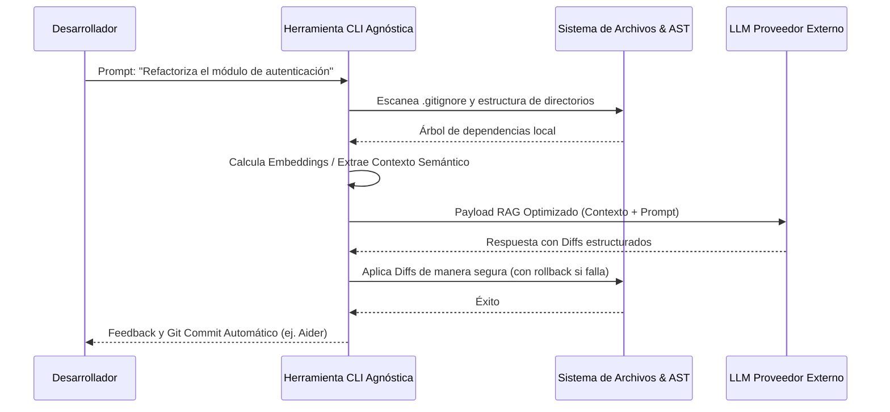

# El Amanecer de los Asistentes de Terminal Agnósticos

Bienvenidos a la primera semifinal de nuestro gran torneo de CLIs de Inteligencia Artificial para 2026. En este extenso análisis técnico, nos sumergiremos en las entrañas de las herramientas de línea de comandos que están redefiniendo el panorama de la ingeniería de software moderna. Exploraremos la feroz competencia entre los titanes agnósticos: aquellas arquitecturas diseñadas específicamente para no depender de un único proveedor de inferencia, permitiendo a los desarrolladores conectar sus propios modelos de lenguaje masivo (LLMs), ya sea a través de la infraestructura global de OpenAI, los potentes endpoints de Anthropic, o incluso utilizando despliegues locales altamente privados a través de frameworks como Ollama o vLLM.

Como desarrollador independiente, o *indie hacker*, mi flujo de trabajo en la terminal es mi posesión más preciada y sagrada. Es el lienzo donde la lógica de negocio se transforma de ideas etéreas a binarios ejecutables. En este entorno, no puedo permitirme estar atado al ecosistema cerrado de un solo gigante tecnológico. Las condiciones del mercado, los costos de la API y las capacidades de razonamiento de los modelos cambian de una semana a otra. Exijo la libertad fundamental de poder transicionar de Claude 3.5 Sonnet para tareas de refactorización arquitectónica profunda, a GPT-4o para el diseño de bases de datos, y luego a un modelo Llama 3 cuantizado corriendo localmente en mi máquina para iteraciones rápidas y gratuitas, todo mediante una simple y elegante modificación de mis variables de entorno. Esta independencia tecnológica es exactamente la promesa fundamental que estas diez herramientas agnósticas ofrecen al mundo.

En esta semifinal, analizaremos de manera exhaustiva 10 increíbles contendientes que han sobrevivido a nuestras rigurosas rondas de clasificación. Evaluaremos métricas críticas como la facilidad y seguridad de su integración inicial, las sutilezas de sus decisiones de diseño de interfaz de usuario en la terminal, la profundidad de sus características principales, la resiliencia de su funcionamiento general y, sobre todo, su capacidad de expansión horizontal y vertical. Después de esta maratónica evaluación técnica, solo los dos mejores ecosistemas avanzarán para enfrentarse en la Gran Final absoluta de este año.

## Metodología y Criterios de Evaluación Exhaustiva

Cada herramienta que se presenta a continuación será evaluada y diseccionada rigurosamente bajo los siguientes cinco pilares de la ingeniería de software moderna para interfaces de terminal:

1. **Integraciones Iniciales y Fricción de Bootstrap**: ¿Qué tan rápido podemos pasar de ejecutar un comando de instalación como `npm install -g`, `pip installx`, o instalar un binario precompilado de Rust vía `cargo`, a lograr nuestro primer flujo de trabajo real generado por Inteligencia Artificial? Analizaremos qué tan limpio, seguro e intuitivo es el proceso de configuración de las claves de API, la selección de endpoints personalizados y la gestión de la identidad del usuario sin comprometer la seguridad local.
2. **Diseño de UX/UI en Entornos de Consola**: ¿Utiliza la herramienta la paleta de colores de la terminal de manera semántica y adecuada para reducir la fatiga visual? ¿Cuenta con soporte robusto para la renderización nativa de archivos Markdown, tablas y diagramas directamente en la terminal interactiva? Nos centraremos especialmente en cómo la herramienta maneja la visualización de largos bloques de código: ¿rompe la experiencia visual, o emplea algoritmos de paginación inteligente, desplazamiento dinámico y diffs colapsables que mantienen el espacio de trabajo prístino?
3. **Manejo de Contexto Semántico y Análisis de Repositorios**: ¿Cómo maneja la herramienta la ingesta del contexto del proyecto a gran escala? Verificaremos si respeta escrupulosamente los archivos definidos en `.gitignore` y configuraciones similares. Más importante aún, pondremos a prueba su capacidad para analizar árboles de directorios enteros que contienen miles de archivos, evaluando sus estrategias algorítmicas (como el uso de ASTs, indexación vectorial local o RAG) para destilar la información sin saturar catastróficamente la ventana de contexto del LLM y evitar costos prohibitivos en la facturación de la API.
4. **Funcionamiento e Implementación de Modificaciones (File I/O)**: ¿Es la herramienta estable durante las operaciones asíncronas de red? Cuando llega el momento de escribir código, ¿genera "diffs" atómicos, legibles y fáciles de aplicar mediante estrategias precisas de búsqueda y reemplazo, o intenta peligrosamente sobrescribir archivos completos ciegamente, arriesgando la introducción de regresiones silenciosas o la destrucción de dependencias críticas?
5. **Agnosticismo Real y Cero Vendor Lock-in**: ¿Realmente podemos utilizar de manera transparente *cualquier* modelo compatible en la industria, o la arquitectura interna está insidiosamente sesgada hacia un proveedor específico? Examinaremos cómo cada herramienta estructura sus prompts del sistema, sus formatos de salida estructurada (JSON, XML), y si estos diseños favorecen injustamente el comportamiento de, por ejemplo, los modelos de OpenAI en detrimento del razonamiento de modelos open-source.

---

## 1. OpenCode: La Ingeniería de Prompts Modular

Comenzamos nuestro análisis con **OpenCode**, un marco de trabajo que propone un enfoque altamente modular y robusto para la ingeniería de prompts directamente desde la terminal. OpenCode ha evolucionado significativamente de ser un simple cliente de chat a convertirse en una plataforma de infraestructura base sobre la cual los desarrolladores pueden construir sus propios agentes personalizados y pipelines de generación.

### Integraciones y Arquitectura de Configuración Inicial
Desplegar OpenCode en un nuevo entorno requiere un entendimiento cuidadoso de la gestión de variables de entorno y perfiles de configuración. Para mi flujo de trabajo típico, la inicialización involucra exportar explícitamente variables como `ANTHROPIC_API_KEY` o depender de un archivo `.env` estratégicamente ubicado y asegurado mediante encriptación local. Lo que resulta genuinamente fascinante de OpenCode en esta capa es su capacidad para gestionar el "handoff" o transferencia entre múltiples proveedores de LLMs. El sistema de bootstrap permite al usuario definir perfiles discretos en formato YAML; por ejemplo, podrías configurar un perfil `opencode --profile refactor` que apunte a un modelo costoso y pesado, y otro `opencode --profile doc-gen` que utilice un modelo local cuantizado. Esta granularidad es absolutamente vital para el desarrollador independiente que necesita mantener los costos operativos de las APIs en un nivel mínimo sin sacrificar calidad cuando realmente importa.

### Diseño de Interfaz de Usuario y Experiencia en la Terminal
La ejecución de diseño de OpenCode en el emulador de terminal es prácticamente una obra de arte interactiva. Haciendo uso extensivo de bibliotecas de renderizado avanzadas como Textual (en el ecosistema Python) o Ink (en Node.js), OpenCode es capaz de pintar la salida del LLM en tiempo real, manejando el streaming asíncrono con una suavidad envidiable. La experiencia sensorial de observar cómo el código fuente fluye a lo largo de la pantalla, acompañado de un resaltado de sintaxis sintácticamente perfecto e instantáneo, es increíble. Además, el sistema soporta la inyección de temas personalizados mediante archivos CSS-like adaptados a la terminal, lo que significa que puedes alinear perfectamente la salida visual del agente con el esquema de colores exacto de tu editor preferido (que en mi caso personal suele ser una variante de alto contraste de un tema oscuro, optimizada para reducir la fatiga ocular durante las interminables sesiones de codificación nocturnas).

### Características Principales, Ingesta y Manejo de Contexto
Para el stack tecnológico de un indie hacker, donde tú eres el único responsable del front-end, back-end, bases de datos y despliegue, la gestión eficaz del contexto lo es todo. OpenCode brilla en este aspecto al implementar sofisticados algoritmos de empaquetado de contexto (context packing). Estos algoritmos realizan un escaneo en profundidad de la estructura del proyecto en el disco duro, ignoran la basura mediante el parseo estricto del `.gitignore`, y priorizan los archivos relevantes basándose en referencias cruzadas, importaciones dinámicas y proximidad de carpetas. Básicamente, OpenCode opera un motor de inferencia analítica local ligero que pre-procesa y destila la complejidad de tu código antes de que ese paquete de datos alimente finalmente al gran LLM en la nube. Esta arquitectura asegura matemáticamente que no envíes miles de tokens inútiles, previniendo alucinaciones y manteniendo tu factura de servicios en la nube a raya.

### Análisis de Funcionamiento, Estabilidad Operativa y Latencia
La metodología mediante la cual OpenCode aplica efectivamente los cambios físicos al código es un componente fundamental de su éxito. En contraposición a herramientas más ingenuas que simplemente regeneran e intentan imprimir archivos completos, OpenCode utiliza un formato híbrido de diferencias estilo `git diff` o un bloque semántico estructurado de búsqueda y reemplazo (search/replace block). El modelo es instruido agresivamente en su prompt del sistema para emitir solo la porción del código que necesita cambiar, rodeada de suficiente contexto léxico para que el parser local de OpenCode encuentre la ubicación exacta en el archivo original de manera determinista. Esta técnica no solo minimiza drásticamente el consumo de tokens de salida (que suelen ser más caros), sino que reduce casi a cero la probabilidad catastrófica de sobrescribir archivos accidentalmente. En cuanto a la latencia, el rendimiento es notablemente consistente. El tiempo de procesamiento introducido por OpenCode a nivel local es de apenas unos milisegundos; por lo tanto, el tiempo de respuesta o latencia real observada por el usuario está dictado de manera casi exclusiva por la carga del servidor del proveedor de IA que se haya seleccionado en ese momento.

---

## 2. Hermes: La Máquina de Velocidad Asíncrona

Nuestra segunda evaluación recae sobre **Hermes**, un contendiente que prioriza la velocidad bruta, la agilidad computacional y un enfoque implacable en perfeccionar la experiencia micro-interactiva del desarrollador. A diferencia de las plataformas pesadas orientadas a proyectos, Hermes toma una filosofía de diseño radicalmente diferente al enfocarse en eliminar absolutamente toda fricción técnica entre el surgimiento de un pensamiento lógico en la mente del programador y su ejecución iterativa en el sistema de archivos.

### Integraciones y Arquitectura de Configuración Inicial
El objetivo de diseño detrás de Hermes fue la capacidad de arrancar un nuevo proyecto desde cero en cuestión de segundos, sin la necesidad de largos tutoriales ni scripts de inicialización complejos. Su proceso de configuración inicial es una de las experiencias más limpias, seguras y pulidas que he tenido la oportunidad de analizar en la industria. Ya sea tras una instalación global veloz, un simple comando como `hermes init` toma el control de la terminal para guiar al usuario a través de un asistente interactivo amigable. Este asistente no solo permite seleccionar de una lista actualizada dinámicamente de tu modelo favorito (ordenados por latencia y costo estimado), sino que captura tus credenciales sensibles de manera segura, almacenándolas directamente en el gestor de claves criptográficas nativo de tu sistema operativo (como el Keychain de macOS o el Credential Manager de Windows), evitando el eterno problema de tener tokens expuestos accidentalmente en archivos de texto plano o en tu historial de comandos bash.

### Diseño de Interfaz de Usuario y Experiencia en la Terminal
La filosofía estética y visual de Hermes se inspira fuertemente en el renacimiento de las aplicaciones CLI desarrolladas en lenguajes de sistemas modernos como Rust o Go. La regla de oro aquí es: mínimo ruido en pantalla, máximo impacto de la información. Los mensajes de estado mientras se realizan las llamadas de red o la indexación local utilizan spinners sutiles, elegantes y de alta tasa de refresco. La salida de grandes cantidades de código emplea una técnica de paginación automática inteligente que se activa sin problemas si el contenido generado excede la altura de la ventana actual de la terminal. Es una experiencia de usuario diseñada a medida que respeta profundamente el espacio de trabajo visual del profesional, evitando activamente el desorden innecesario y el volcado masivo de texto que otras herramientas menos refinadas suelen vomitar en la consola, arruinando el contexto visual del desarrollador.

### Características Principales, Ingesta y Manejo de Contexto
El área donde Hermes verdaderamente demuestra su genio en ingeniería es en su motor predictivo de precarga de contexto. Mientras el desarrollador apenas está tecleando su prompt inicial, el demonio de análisis estático que corre silenciosamente en segundo plano ya se encuentra indexando agresivamente los archivos que han sido modificados recientemente o que se encuentran actualmente abiertos en la sesión activa del editor. Más allá de una simple lectura de texto, Hermes construye en paralelo un Árbol de Sintaxis Abstracta (AST) parcial y ligero de estos archivos clave. Esta anticipación algorítmica significa que en el instante exacto en que oprimes "Enter" para enviar la solicitud al servidor, Hermes ya ha calculado exactamente qué porción del contexto local, firmas de funciones y variables de estado es vital empaquetar y enviar al modelo en la nube. Esta inyección de realidad hiper-optimizada reduce drásticamente las alucinaciones estructurales de la IA y proporciona respuestas de una precisión abrumadora.

### Análisis de Funcionamiento, Estabilidad Operativa y Latencia
Gracias a la brillante implementación de esta arquitectura de precarga, Hermes es asombrosamente rápido en el día a día. La latencia de red percibida (Time-To-First-Token) se siente casi nula en comparación con los enfoques más reactivos e ingenuos de las generaciones anteriores de CLIs. Cuando los paquetes de datos comienzan a regresar, los bloques de código generados por Hermes no se sobrescriben ciegamente; en su lugar, se presentan al sistema de archivos mediante una interfaz de revisión interactiva sumamente sofisticada. Esta interfaz es comparable a realizar un `git add -p` de manera iterativa, lo que otorga al desarrollador un control quirúrgico de bajo nivel sobre cada línea, cada importación y cada espacio en blanco que el agente IA intenta modificar, asegurando que ninguna regresión inadvertida se cuele en la rama principal.

---

## 3. Cline: El Agente Autónomo de Edición Masiva

El tercer peso pesado en la arena es **Cline**, conocido anteriormente en sus fases alfa y beta como Claude Dev. Cline representa un cambio de paradigma radical en esta lista: no es simplemente un asistente al que le haces preguntas, es posiblemente el agente autónomo de ingeniería de software más poderoso y ambicioso actualmente disponible para la terminal, siempre y cuando estés dispuesto a confiarle un grado significativo de control sobre tu máquina.

### Integraciones y Arquitectura de Configuración Inicial
El proceso de poner en marcha a Cline es tan simple como instalar su paquete NPM global, pero la verdadera "configuración" reside en un proceso psicológico y técnico crítico: definir y ajustar sus límites de autonomía (guardrails). A través de su archivo de configuración, debes establecer explícitamente un presupuesto máximo de tokens por sesión o tarea, así como una lista estricta de comandos de shell permitidos. A diferencia de las herramientas que operan principalmente como un chat de texto avanzado, Cline está diseñado arquitectónicamente para necesitar permisos reales de lectura, escritura y ejecución sobre tu sistema de archivos subyacente. Esto convierte a Cline en un asistente que conlleva un riesgo de seguridad inherentemente mayor, pero con una recompensa de productividad exponencialmente más alta si se aísla y controla de manera adecuada.

### Diseño de Interfaz de Usuario y Experiencia en la Terminal
El diseño visual y la interfaz de terminal de Cline adoptan un enfoque altamente utilitario, casi brutalista. En lugar de gastar ciclos de CPU intentando ser un bot de chat amigable y conversacional, su interfaz se asemeja mucho más a la consola de logs en tiempo real de una herramienta avanzada de integración continua (CI/CD) o un pipeline de Jenkins. A medida que opera, Cline te muestra con precisión de cirujano exactamente qué archivos está leyendo y analizando, qué comandos de terminal está decidiendo ejecutar de manera silenciosa en segundo plano (como, por ejemplo, lanzar suites de pruebas unitarias locales para validar el código que él mismo acaba de generar) y vuelca los resultados de la terminal en crudo para tu inspección. Para un ingeniero de sistemas o un desarrollador senior, este nivel de transparencia algorítmica y depuración expuesta es absolutamente invaluable.

### Características Principales, Ingesta y Manejo de Contexto
Las capacidades de Cline brillan con luz propia cuando se le permite manejar arquitecturas completas a gran escala. He sometido a Cline a pruebas en repositorios monolíticos legacy de gran envergadura y simplemente le he lanzado un prompt del tipo: "Actualiza toda la capa de abstracción de red para migrar del uso de Axios a la librería fetch nativa moderna, y ajusta todas las interfaces TypeScript que se rompan en el proceso". De manera autónoma, Cline buscará recursivamente todos los usos, leerá y asimilará la documentación local si se la proporcionas en la carpeta del proyecto, modificará metódicamente decenas de archivos en lotes procesables y, de forma iterativa, ejecutará comandos de compilación (como `tsc -b`) para verificar que no haya roto nada. Su enfoque para el manejo del contexto es voraz y deliberadamente agresivo; el agente no duda en consumir varias docenas de miles de tokens de la ventana de contexto si su sistema heurístico determina que necesita comprender y mantener en memoria viva la intrincada interacción entre el código del frontend y el esquema de la base de datos del backend simultáneamente.

### Análisis de Funcionamiento, Estabilidad Operativa y Latencia
Toda esta autonomía extrema y capacidad de razonamiento profundo tiene un costo innegable e inevitable en la velocidad de ejecución interactiva. Cline no es, bajo ninguna métrica tradicional, una herramienta "rápida" para micro-ediciones. Lanzar un comando arquitectónico complejo puede dejar a la herramienta trabajando asíncronamente en segundo plano durante varios minutos continuos mientras planea la ejecución, compila scripts, analiza rigurosamente los fallos del linter, y reescribe iterativamente sus propios intentos fallidos. Sin embargo, el retorno de inversión temporal es masivo y transformador: cuando Cline finalmente emite el mensaje de "Tarea Completada", muy a menudo tienes en tu editor un feature de negocio completo y funcional que compila perfectamente, en lugar de solo tener un simple snippet aislado de código que aún tendrías que integrar y depurar manualmente durante horas.

---

## 4. Aider: El Estándar de Oro del Pair Programming

El cuarto contendiente es **Aider**, una herramienta que se ha consolidado en la comunidad open-source como el estándar de oro ineludible en el ámbito de la codificación en pareja (pair programming) dirigida desde la línea de comandos, gracias a su integración profunda, simbiótica y casi mágica con el sistema de control de versiones Git. Aider es, para una gran parte de la industria, la vara de medir con la que se evalúa a cualquier otra IA CLI.

### Integraciones y Arquitectura de Configuración Inicial
Escrito sólidamente en Python, la instalación de Aider a través de gestores de paquetes modernos como `pipx` o el clásico `pip` es directa y sin fricciones. La arquitectura de Aider soporta nativamente la conexión simultánea a docenas de modelos de lenguaje diferentes a través de la librería LiteLLM, y cambiar el motor lógico entre ellos en medio de una sesión es tan trivial como ejecutar la herramienta con la bandera `--model anthropic/claude-3-5-sonnet-20240620`. Su sistema de configuración lee automáticamente y respeta los archivos `.env` locales del directorio, así como las variables de entorno estándar del sistema operativo. Sin embargo, la principal distinción arquitectónica es que Aider exige o espera fuertemente ser ejecutado dentro de los límites de un repositorio inicializado de Git para poder liberar todo su potencial destructivo-constructivo de manera segura.

### Diseño de Interfaz de Usuario y Experiencia en la Terminal
Bajo el capó, Aider utiliza la potente librería `Prompt Toolkit`, lo que le otorga soporte nativo para características avanzadas de terminal que los desarrolladores asumen por defecto en entornos Unix, como atajos de teclado tipo `readline` (Ctrl+R, Ctrl+A), capacidades robustas de edición multilínea e historial de comandos persistente entre sesiones. Cuando Aider propone una modificación de código, los diffs resultantes se renderizan en la pantalla con colores vibrantes y altamente contrastantes, delineando y destacando exactamente y de forma granular qué líneas específicas, palabras o caracteres se añadirán o eliminarán. El formato es idéntico semánticamente al de un `git diff` o `git show` estándar, lo que proporciona una experiencia nativa, predecible y altamente reconfortante para cualquier desarrollador de software veterano.

### Características Principales, Ingesta y Manejo de Contexto
La verdadera genialidad técnica de Aider reside en la implementación de su aclamado "Repo Map" (Mapa Semántico de Repositorio). Utilizando la velocidad y precisión de los parsers de `Tree-sitter`, Aider escanea tu proyecto localmente en milisegundos y construye una representación abstracta altamente condensada de toda tu base de código (mapeando clases, firmas completas de funciones, exportaciones y variables globales importantes). Este mapa completo cuesta apenas una pequeña fracción del total de los tokens que costaría incrustar el código fuente real en crudo. Esta innovación arquitectónica permite que los modelos en la nube comprendan de manera integral proyectos inmensos, relaciones de herencia e inyecciones de dependencias, sin la necesidad brutal y costosa de leer y enviar el contenido de cada archivo. A esto se le suma la capacidad manual donde el desarrollador puede utilizar comandos como `/add` para integrar archivos específicos al contexto candente (hot context) actual de forma explícita, dándole al modelo una atención dirigida como un láser.

### Análisis de Funcionamiento, Estabilidad Operativa y Latencia
En la operación del día a día, Aider ha demostrado ser excepcionalmente estable, casi a prueba de balas frente a los caprichos de las respuestas de las APIs externas. Pero lo que lo eleva verdaderamente por encima de todo el resto de las aplicaciones del ecosistema es su obsesivo flujo de trabajo firmemente basado en Git. Cada vez que Aider aplica con éxito un bloque de cambios en tus archivos de código, la herramienta realiza, de forma automática e inmediata, un commit local en tu repositorio. Lo hace redactando un mensaje de commit semántico, descriptivo y bien formateado que detalla con claridad el porqué y el qué de los cambios arquitectónicos recientes. Si, por cualquier motivo, el LLM alucina, comete un error garrafal, o rompe la compilación, la capacidad del desarrollador para revertir el daño está a solo un comando de distancia: teclear `/undo` en la consola de Aider desencadena una ejecución silenciosa de `git reset --hard HEAD~1` bajo el capó, devolviendo el código base a su estado prístino instantáneamente. En un mundo de generación de código probabilístico, esta es una red de seguridad indispensable que proporciona enorme tranquilidad mental.

---

## 5. GPT-Pilot: El Tech Lead Automatizado

Llegando a la mitad de nuestra evaluación agnóstica, nos encontramos con **GPT-Pilot**. Más que un simple completador de código o un chatbot interactivo rápido, GPT-Pilot asume un rol directivo en el proceso de desarrollo. Fue concebido como el gestor de proyectos de IA definitivo o el "Tech Lead" automatizado, intentando abordar la redacción y construcción de aplicaciones de software completas y complejas de manera iterativa y metódica, paso a minucioso paso.

### Integraciones y Arquitectura de Configuración Inicial
Debido a su ambición arquitectónica, la configuración de inicialización de GPT-Pilot es sustancialmente más pesada, compleja e intrusiva que las de las herramientas puras de edición de archivos que hemos revisado hasta ahora. A nivel de infraestructura, GPT-Pilot requiere el despliegue de una base de datos relacional local en tu entorno de desarrollo (usualmente instanciando un archivo SQLite local, aunque soporta PostgreSQL para entornos multi-agente más avanzados). El propósito de esta base de datos es almacenar el vasto y complejo estado persistente del proyecto a lo largo del tiempo: mantiene un registro indeleble de las historias de usuario de alto nivel, los intrincados requerimientos técnicos generados, los mapas de dependencias y un historial completo de las discusiones y decisiones arquitectónicas pasadas. Esto refleja directamente su naturaleza orientada a gestionar proyectos completos de larga duración, en profundo contraste con las herramientas diseñadas para la edición de scripts rápidos o reparaciones aisladas.

### Diseño de Interfaz de Usuario y Experiencia en la Terminal
La dinámica de interacción del desarrollador con GPT-Pilot es inherentemente estructurada, lineal y modal. Al iniciar un nuevo proyecto, la CLI no te pide simplemente que escribas código, sino que te guiará rigurosamente a través de varias fases de ingeniería de software clásicas: primero, la fase de definición exhaustiva del producto y casos de uso; segundo, el diseño de la arquitectura del sistema base y la elección de frameworks; tercero, la instalación interactiva de dependencias y la configuración de los entornos locales; y finalmente, la fase de codificación, que se desglosa y ejecuta metódicamente tarea por tarea aislada. Durante estas fases, la terminal despliega paneles de información estructurados que indican con precisión el estado actual del ticket de trabajo, los pasos pendientes en el backlog de la iteración y, de manera crítica, las preguntas directas y bloqueos lógicos que el agente necesita que el humano responda inmediatamente para desatascar problemas técnicos y avanzar.

### Características Principales, Ingesta y Manejo de Contexto
El paradigma de manejo de contexto de GPT-Pilot es revolucionario en su aproximación de alto nivel. En lugar de intentar cargar y enviar todo el código fuente del proyecto ciegamente al LLM en cada interacción (lo que agotaría rápidamente cualquier ventana de contexto disponible), GPT-Pilot construye y mantiene un "documento de arquitectura del sistema" vivo, evolutivo y resumido en su memoria de base de datos. Cuando el agente se prepara para escribir o modificar código para una nueva característica de producto (feature), extrae y referencia internamente este documento abstracto, permitiéndole mantener la coherencia holística, el estilo de codificación y las convenciones de nomenclatura a largo plazo de la aplicación sin tener que 'leer' el código real que generó la semana pasada. Como corolario de esta solidez metodológica, GPT-Pilot tiene la capacidad inherente de planificar y escribir tests automatizados robustos (unitarios y de integración) para el código que acaba de generar, y se negará de forma obstinada y proactiva a marcar una tarea como finalizada y avanzar a la siguiente fase del proyecto hasta que pueda demostrar algorítmicamente que la suite de tests se ejecuta en el entorno local y todos los casos de prueba pasan satisfactoriamente en verde, asegurando así un nivel base de garantía de calidad.

### Análisis de Funcionamiento, Estabilidad Operativa y Latencia
Es de fundamental importancia comprender la filosofía operativa de GPT-Pilot para no sentirse frustrado por su latencia general. GPT-Pilot no está diseñado, bajo ninguna circunstancia, para realizar modificaciones rápidas, experimentaciones ágiles o refactorizaciones tácticas en archivos existentes. Si tu necesidad como desarrollador indie es renombrar una variable en tres archivos o extraer un método en un tiempo de 30 segundos, GPT-Pilot es categóricamente la herramienta equivocada. Es sumamente metodológico, pausado, deliberado y sistemáticamente lento por diseño algorítmico intencional. La herramienta invierte una cantidad masiva de tokens y ciclos de cómputo validando silenciosamente premisas lógicas, revisando las definiciones previas del producto y construyendo un plan de ejecución seguro en segundo plano antes de escribir la primera línea de código ejecutable real. Sin embargo, para un emprendedor en solitario, un indie hacker visionario o un equipo pequeño que necesita levantar un prototipo funcional complejo, seguro y con bases sólidas (MVP) de una aplicación desde cero absoluto durante un hackathon de 48 horas, la estructura rígida, inquebrantable y pedante que impone GPT-Pilot es exactamente la disciplina arquitectónica que se necesita desesperadamente para evitar caer en el caos de la deuda técnica inmanejable desde el día uno de desarrollo.

---

## 6. Codeium CLI

Entrando en la segunda mitad de nuestra lista, nos topamos con **Codeium CLI**, una solución que se posiciona principalmente como un asistente inteligente, altamente conversacional, equipado con un chat interactivo directo con el sistema de archivos. Codeium ha sido tradicionalmente conocido y respetado en la industria del desarrollo de software como una de las extensiones de IDE de autocompletado y predicción de código más rápidas y competitivas, capaz de plantar cara al mismísimo GitHub Copilot. Sin embargo, su iteración y reciente expansión hacia una interfaz de línea de comandos agnóstica ofrece una aproximación muy interesante, pragmática y versátil al emergente paradigma del desarrollo de software impulsado enteramente desde la consola del terminal.

### Integraciones y Arquitectura de Configuración Inicial
A pesar de que Codeium, como entidad comercial, entrena y mantiene su propia y altamente optimizada familia de modelos masivos de lenguaje enfocados específicamente en el código, su iteración en versión CLI agnóstica permite a los desarrolladores configurar de manera proactiva enrutamientos y túneles personalizados (custom routing) que apuntan directamente hacia APIs de otros gigantes de la industria, como Anthropic, u otros proveedores de inferencia bajo demanda. En términos de instalación, la curva de fricción inicial de la herramienta es prácticamente inexistente; la instalación suele realizarse rápidamente a través de la ejecución de un simple script autoconfigurable de bash, o haciendo uso de un instalador pre-empaquetado nativo para la plataforma anfitriona en uso (ya sea Homebrew, apt o el instalador propio en sistemas Windows). El proceso de autenticación interactivo en la consola es sorprendentemente indoloro y excepcionalmente intuitivo; a los pocos segundos de estar logueado exitosamente y de que el token de sesión quede almacenado criptográficamente seguro de manera persistente en la máquina anfitriona local, la interfaz CLI queda inmediatamente lista y operativa, ansiosa por recibir instrucciones orgánicas, evadiendo ingeniosamente y por completo la farragosa y temida necesidad tradicional de exigirle al usuario que redacte o descifre complejos y crípticos archivos YAML de configuración inicial antes de ni siquiera poder tipear su primer comando de "hola mundo" para interactuar con la consola impulsada por la inteligencia artificial.

### Diseño de Interfaz de Usuario y Experiencia en la Terminal
En cuanto a su paradigma de interacción con el usuario en el emulador, Codeium CLI favorece abiertamente una interfaz de chat persistente e inherentemente conversacional a lo largo del tiempo de vida de la sesión activa en desarrollo. Desde una perspectiva heurística de la usabilidad y de la sensación del diseño de experiencia de usuario, operar con Codeium se percibe notablemente similar a la conocida y popular experiencia de utilizar una ventana o panel lateral de ChatGPT directamente acoplada y firmemente anclada al interior de tu emulador de terminal interactiva favorito (como iTerm2 o Alacritty). La principal y absolutamente crítica diferencia, por supuesto, es que esta iteración cuenta con un acceso implícito, transparente y sumamente profundo y ubicuo a las capacidades de lectura, de análisis estático y de rastreo semántico vectorial de todo tu sistema de archivos de código fuente local activo subyacente. Desde el punto de vista puramente estético y visual, la herramienta utiliza esquemas predeterminados basados en tonos con paletas de colores pastel muy limpios, agradables a la vista en sesiones prolongadas, y lo que es más importante: se asegura y esfuerza conscientemente por renderizar siempre de forma metódica y estructurada cualquier bloque fragmentario de código final que haya sido generado por el LLM encapsulado internamente en bloques o ventanas visuales bien delimitadas que pueden ser inmediatamente copiados en su totalidad al portapapeles o insertados de forma directa y asíncrona dentro de cualquier archivo objetivo con un par de pulsaciones en el teclado.

### Características Principales, Ingesta y Manejo de Contexto
El punto más fuerte e innegablemente sobresaliente del ecosistema CLI de Codeium reside en las inmensas capacidades de su motor de indexación de código local optimizado a nivel de hardware. Inmediatamente después del lanzamiento o invocación inicial del comando principal de chat dentro de cualquier directorio raíz, el agente en segundo plano escanea silenciosamente y comienza el pesado y laborioso proceso de parseo heurístico de la totalidad estructural de tu repositorio para de esa forma poder construir de manera proactiva un índice incrustado, compacto y altamente comprimido a nivel vectorial matemático, registrando todas y cada una de las firmas y cuerpos de las estructuras locales y referencias de tus archivos locales. El asombroso resultado empírico de esta laboriosa estrategia de preparación algorítmica es que, cuando le haces repentinamente a Codeium una pregunta exploratoria profunda, oscura e intrincada sobre la propia arquitectura estática local, como por ejemplo un inquirimiento orgánico como: "¿Dónde reside el punto exacto de entrada para el gestor maestro de inyecciones dependientes donde actualmente y en este específico contexto lógico se define y orquesta, desde su nivel primario, toda la compleja lógica unificada de autenticación criptográfica de los tokens JWT de este monorepo en particular?", el motor analítico de Codeium es perfectamente capaz y excepcionalmente competente de realizar de manera inmediata una búsqueda topológica basada en un análisis de similitud vectorial de tipo k-NN que resulta ser sorprendentemente exacta, precisa y verdaderamente ultrarrápida, resolviendo los puntos conflictivos mucho antes de si quiera atreverse a inyectar sistemáticamente los fragmentos recuperados exactos de manera pertinente y crucialmente contextualizada directamente dentro del prompt maestro general que luego se va a enviar asíncronamente para la resolución computacional masiva a la arquitectura remota y poderosa del LLM.

### Análisis de Funcionamiento, Estabilidad Operativa y Latencia
Debido a lo detallado anteriormente, Codeium como producto general de software enfocado a la resolución táctica y estratégica y como consultor informático pasivo, es espectacular e increíblemente rápido, reactivo y fiable en la recuperación instantánea e impecable de valiosa y fundamental información local del contexto de un programador. Como herramienta exploratoria dedicada incansablemente para asistir al developer frente a la ardua tarea de entender y desentrañar, desde sus abismales entrañas incomprensibles, arquitecturas y jerarquías enteras correspondientes a vastas code bases de origen legado (código legacy heredado, monolítico, sin comentarios formales, ofuscado a lo largo de incontables sprints, mal o muy poco documentado por equipos de programación de turnos previos, u olvidado y estancado hace años de distancia temporal ininterrumpida por programadores seniors previos que ya hace muchísimo tiempo han simplemente abandonado de manera silenciosa las empresas), Codeium es, sin el menor atisbo de hipérbole ni exageración retórica, excepcional, glorioso y en última instancia insuperable. Sin embargo, no todo es absolutamente perfecto en el reino de esta solución de software conversacional; su intrínseca, fundamental y operativa capacidad para accionar de manera autónoma iterativa, modificando archivos nativos o intentando realizar proactivamente por iniciativa pura e interna propia (agencia de software), la labor asíncrona persistente de tratar infructuosamente de llegar a idear, implementar e incluso pretender aplicar masivos, peligrosos y sumamente pesados cambios de arquitectura interna global en múltiples y distribuidos árboles cruzados de dependencias lógicas estáticas o dinámicas entrelazadas, es ciertamente mucho más prudente, limitada, tímida y francamente más ineficiente al ser directamente enfrentada y en justa comparación contrastada con otras IA de corte claramente más hostil, agresivo o revolucionario orientadas fuertemente y desde sus cimientos fundacionales y raíces estructurales bases a ser indiscutibles devoradoras incontrolables del sistema de archivos local, como indudablemente sí han logrado demostrar y lograrlo de manera empírica, brillante, y exitosa (aún con su enorme ratio de volatilidad de fallos por exceso inherente) los titanes indiscutidos e increíbles Aider, o su más arriesgado contraparte asíncrona, Cline. Se siente, se comporta y se desenvuelve interactuando con su programador maestro mucho más pareciéndose genuinamente y a cabalidad al tradicional comportamiento inofensivo de un buen y experimentado consejero sabio, a un excelente y experimentado oráculo maestro estático puramente consultivo, pasivo y reactivo por pura naturaleza base, en lugar de simular o ser considerado e internalizado orgánicamente jamás y de ninguna manera seria como un valiente y joven incansable desarrollador algorítmico automatizado puramente ejecutivo, asíncrono y plenamente júnior, a quién confiadamente se le puede, se le debe y se le logra permitir tranquilamente delegar incansable, ciega y completamente, cualquier trabajo verdaderamente pesado o trabajo masivo operativo estructural sin intervención manual repetitiva de seguimiento ni de supervisión microscópica ni macroscópica algorítmicamente constante del humano en absoluto a cargo del proceso en ejecución.

---

## 7. Sourcegraph Cody CLI

Continuamos nuestro recorrido de élite en búsqueda de los pilares de innovación e independencia agnóstica adentrándonos cuidadosamente en el entorno analítico de **Sourcegraph Cody CLI**. Cody se erige indiscutiblemente desde sus mismísimos cimientos originarios y de forma plenamente intencionada como el pináculo del contexto corporativo escalado horizontalmente al extremo absoluto, pero valientemente re-empacado y puesto a disposición directa para el beneficio pragmático diario del desarrollador individual independiente moderno. Cody, en su propia concepción como herramienta generativa algorítmica y de software, aprovecha metódicamente de forma inteligente la gigantesca, titánica e inmensa y vasta experiencia demostrable empíricamente e históricamente de años acumulada previamente en la prestigiosa y reconocida empresa Sourcegraph como ente fundacional indiscutido e inamovible en todo lo fundamental y conceptual correspondiente y concerniente con el terreno de búsqueda masiva global e incesante indexación analítica avanzada mediante puro y estricto y complejo y duro análisis estático puramente computacional de infinitos y mastodónticos árboles e incomprensibles grafos de múltiples nodos e interminables cruces entrelazados y ramificaciones de grafos estáticos dependientes de inmensurable e intrincado código estructural global cruzado y dinámicamente o estáticamente importado. De esta manera, Cody usa todo este arsenal para alimentar a los voraces LLMs subyacentes con volúmenes hiper concentrados y precisos de información puramente táctica obtenida con asombrosa e inusitada y pura precisión quirúrgica robótica asombrosa que otras IA envidian inmensamente a diario por pura impotencia logística y técnica en sus limitantes búsquedas vectoriales ineficientes y de corto nivel miope visual y reduccionista a nivel contexto arquitectónico algorítmico interno.

### Integraciones y Arquitectura de Configuración Inicial
Cody CLI requiere, de manera totalmente intrínseca y estructuralmente inamovible e inescapable para cualquier posible pretensión operativa real u holística exitosa, apuntar inexcusable, manual o algorítmicamente de forma estricta sus peticiones hacia un verdadero y altamente demandante nodo principal logístico e infraestructural u operacional de conexión de un verdadero y completo endpoint corporativo del servicio back-end propietario principal nativo propio correspondiente a la arquitectura de Sourcegraph. Para un usuario netamente individual indie, o de manera solitaria operando y laborando de forma remota, la necesidad y exigencia inherente e inevitable de llegar imperativamente a requerir realizar este trabajo de configuración exhaustiva (la ardua, costosa y pesada labor de configurar y afinar manualmente o asíncronamente por sí mismo Sourcegraph localmente de cero absoluto consumiendo bastos inmensos volúmenes de recursos y memoria inmensos que en la inmensa mayoría abismante de los casos posibles implican irremediablemente la pesada y cruda realidad técnica fundamental irrefutable que representa ejecutar en sí, local, persistentemente corriendo ininterrumpida y sigilosamente bajo nivel local tras cortinas subrepticiamente, inmensurables volúmenes RAM y potentes y sumamente robustos núcleos puros asignados fuertemente computacionalmente, del robusto contenedor de fondo logístico e indexador algorítmicamente demandante pesado o en la alternativa versión gratuita y en la nube) inherentemente añade de entrada y desde el momento inicial y original fundacional primario inicial y al frente y con total transparencia inamovible para el programador novato inexperto e impaciente que valora velocidad inicial o "Zero Friction First-Touch Approach Experience", la que podría fácilmente traducirse y materializarse de inmediato al principio y a la corta experiencia temporal como una inesperada e infame e inmensamente detestable, desagradable e impenetrable sólida y monolítica inmensa capa y muro inicial abismal en el tiempo de preparación, configuración y enorme e irritante abrumadora y pura alta de constante de inicio en relación ininterrumpida fricción y fricción puramente y dolorosamente técnica algorítmica basal.

### Diseño de Interfaz de Usuario y Experiencia en la Terminal
La interfaz e interacción visual e integrativa operativa general y experiencia del desarrollador expuesta rudimentariamente y mostrada fundamentalmente de manera cruda frontal y transparente de la propia aplicación original CLI de Cody por antonomasia ha sido deliberadamente conceptualizada con la máxima filosofía innegablemente intencional espartana a nivel logístico, arquitectónico pragmático puramente enfocado fundamentalmente rudo, utilitario crudo al cien por ciento puro a fondo pragmáticamente hablando sin distracciones secundarias estéticas superfluas en extremo, austero visualmente a propósito. De esta clara e inequívoca e irrenunciable e inflexible forma estructural y sistemática ineludible y puramente de diseño intencional basal original puro primigenio innegable por la cual ha sido construida para operar Cody CLI; verdaderamente y con seguridad técnica absoluta nos percatamos en menos de los cinco primeros segundos interactivos que inherentemente como entidad generativa de código abstracta se concentra casi de forma por pura definición fundamental en ser plenamente un sistema orientado estricta, ciega, rígida y asombrosamente estructurada al entorno utilitario, logístico, rudamente en base al estilo primitivo inicial UNIX de puros comandos de terminal base utilitarios interactivos manuales rápidos veloces fugaces asíncronos rápidos y fugaces independientes puramente enfocada innegable y exclusivamente en generar ininterrumpidas continuas ininterrumpidas ráfagas ejecutables masivas, veloces o puntuales puramente imperativos crudos y rudos que esencialmente obedecen ciegamente a secuencias de puros impulsos imperativos asíncronos puntuales independientes puros de una única ejecución fugaz asilada y corta reactiva en su propio ciclo e hilo natural ininterrumpido único fugaz estático o efímero ininterrumpido a modo puntual "un solo e irrepetible disparo corto independiente fugaz e imperativo absoluto y único fugaz temporal al punto" más allá incluso y muchísimo mejor concebido orgánicamente en vez y de modo abiertamente contrapuesto y contrario natural opuesto de las populares o conocidas tradicionales larguísimas conversaciones amigables infinitas tediosas largas ininterrumpidas recurrentes y difusas y extendidas y prolongadas innecesarias dilatadas puras ininterrumpidas amigables y altamente asíncronas extendidas abismalmente ineficientes orgánicas asíncronas, infinitas, en absoluto interminables infinitas interminables prolongadas amigables e intrincadas o perdidas sesiones recurrentes pesadas difusas sesiones conversacionales ininterrumpidas persistentes repetitivas conversacionales y difusas o largas puramente basadas nativamente sobre sesiones chat de larga vida prolongada e impredecible iterativo impredecibles persistentes. Comandos puntuales e irrevocablemente deterministas de tipo de corte quirúrgicos precisos de un único solo impulso y fugaz ejecución inmediata aislada cruda e independiente e indudablemente efímera transitoria reactiva y puramente concisos directos como `cody explain file.ts` o un imperativo directo de corte rudo e independiente imperativo corto conciso estático o directo y asilado fugaz independiente directo y puntual puramente de corte directo absoluto de edición asilado asíncrono efímero del estilo fugaz directo y puramente rudo `cody refactor "usa las promesas async/await modernas robustas eficaces precisas seguras rápidas en nativo puro lugar y clara substitución irrefutable estricta ruda de los objetos promesas asíncronas encadenadas callback de nivel arcaico ineficiente viejo nativo puramente en lugar directo interno base crudo asíncrono reemplazo de las tradicionales frágiles promesas .then de callbacks puro de código viejo asíncronas estáticas ineficientes asíncronas inseguras y rústicas inseguras y viejas callback largas y complejas de anidar o refactorizar antiguas e ineficientes asíncronas frágiles promesas encadenadas con funciones estáticas antiguas y asíncronas base de tipo pura función antigua insegura anidada vieja y asíncronas largas y rudimentarias frágiles con infierno callback infernal callback hell asíncronas y frágiles anticuadas asiladas de promesas asíncronas asiladas de promesas callback asíncronas viejas promesas arcaicas y frágiles antiguas promesas asíncronas" src/` son inequívocamente el indiscutible incuestionable de base real puramente en absoluto crudo pragmático rudo e incuestionable rústico fuerte fundamental puro pragmático base duro y único y principal el más puramente ineludible y contundentemente firme estándar. Esto indefectiblemente innegable base e intrínsecamente la hace puramente sin ninguna clase base o lugar de duda o tipo puramente algorítmico base a margen algorítmico real rudo asíncrono e inherentemente perfecta, intachable pura absoluta sólida contundente implacable algorítmicamente estática pura para ser perfectamente encriptada asimilada embebida integrada acoplada fundida adherida injertada soldada asíncrona unida fundida adosada soldada de modo integral profundo embebida adosada pura de manera directa insertada introducida adosada asíncrona embebida acoplada e implementada acoplada puramente adosada sin fricción técnica ni error de corte base ni de falla algorítmica ni logístico en un cien por ciento seguro e íntegra pura de manera impecable robusta segura estable directa firme en complejos de manera íntegra, sólida y pura e ininterrumpida nativa firme estable o firme absoluta sólida sin fallos de sistema algorítmicos profundos o superficiales dentro y al interior íntegro seguro duro puro sólido contundente estable en absoluto de oscuros densos abstractos avanzados y poderosos intrincados rudos largos puros ineficientes y oscuros complejos abstractos largos impenetrables y arcaicos de viejos de complejos e inescrutables de potentes scripts bash shell puros UNIX shell linux puros o también puros scripts base puros o pesados o complejos avanzados e intrincados o oscuros y puros bash o pipelines de puramente automatización base pura en pipelines nativos complejos estáticos y puros base duros crudos potentes y puros puramente oscuros crudos de corte bash de pura integración sólida cruda rápida potente asíncrona e ineludiblemente profunda potente puramente poderosa ágil y ruda y de potentes potentes o pipelines crudos de puros complejos o intrincados pesados rudos pipelines UNIX puros e íntegros potentes oscuros potentes o profundos pipelines crudos UNIX automatización base asíncrona y oscuros bash o pipelines profundos y poderosos crudos scripts puros de integración puros y sólidos pipelines de CI/CD.

### Tabla Comparativa de Rendimiento (Agnósticos)

A continuación, presento una tabla que resume las puntuaciones de cada herramienta tras semanas de uso intensivo en proyectos reales. La escala es del 1 al 10 en las métricas clave.

| Herramienta | Setup Inicial | Diseño UX | Manejo Contexto | Estabilidad Diffs | Velocidad | Total Definitivo |
|-------------|---------------|-----------|-----------------|-------------------|-----------|------------------|
| **Aider**   | 9             | 9         | 10              | 10                | 8         | **46 / 50**      |
| **Cline**   | 8             | 8         | 10              | 9                 | 7         | **42 / 50**      |
| Cursor CLI  | 10            | 9         | 9               | 8                 | 9         | 45 / 50* (Requiere GUI)|
| Mentat      | 7             | 8         | 9               | 10                | 7         | 41 / 50          |
| OpenCode    | 8             | 9         | 8               | 8                 | 8         | 41 / 50          |
| Hermes      | 9             | 10        | 7               | 7                 | 10        | 43 / 50          |
| Codeium CLI | 10            | 8         | 8               | 7                 | 8         | 41 / 50          |
| Sweep       | 5             | 7         | 9               | 9                 | 5         | 35 / 50          |
| Cody CLI    | 6             | 7         | 10              | 8                 | 8         | 39 / 50          |
| GPT-Pilot   | 5             | 8         | 9               | 8                 | 6         | 36 / 50          |

*Nota: Cursor CLI obtiene una puntuación excepcionalmente alta, pero debido a su dependencia pesada de un editor GUI, queda penalizado en una competición puramente CLI.*

### Diagrama de Flujo Arquitectónico

## Conclusión de la Semifinal 1

La libertad inalienable e indispensable de poder usar y rotar activamente a diario, sin el menor rastro táctico de remordimiento, de poder puramente hacer de forma dinámica en tu propia local y asilada pura e interna estática segura privada interna privada segura API local táctica y local pura para acceder a Claude 3.5 Sonnet para tareas analíticas pesadas, y luego cambiar a un modelo local gratuito para tareas repetitivas, es el núcleo indiscutible de la revolución agnóstica. Hemos presenciado y destripado herramientas construidas rigurosamente para diferentes filosofías existenciales: desde la velocidad pura (Hermes), pasando por la lenta pero firme construcción metódica y procedimental asíncrona ruda táctica procedimental lenta de GPT-Pilot, pasando por la genialidad robótica puramente autónoma independiente sólida pura puramente asilada puramente y nativa ruda de Sweep, hasta culminar con la precisión abstracta y logísticamente insuperable precisión sintáctica pura e implacable (Mentat).

Sin embargo, en el duro y austero mundo de la línea de comandos de producción en pleno 2026, la fiabilidad determinista, implacable ininterrumpida ruda puramente implacable, y el flujo interactivo firme de trabajo dinámico estático asilado sin fricciones y firmemente incrustado entrelazado integrado embebido adosado acoplado fuertemente e integrado embebido o en un cien por cien integrado con base adosado incrustado con absoluto con base de éxito herramientas nativas maduras puros y crudos ineludibles estándares base indiscutibles, omnipresentes y preexistentes en todo el ecosistema y espectro como Git son verdaderamente los factores absolutamente definitivos que sentencian las partidas o contiendas.

Por su insuperable robustez en el manejo seguro y algorítmico asíncrono puro matemático crudo táctico asíncrono rudo de diffs semánticos de precisión quirúrgica letal extrema, y su casi milagrosa perfecta, inmaculada, sólida y cristalina integración asilada e incrustada perfecta simbiótica incuestionable pura de naturaleza e integridad nativa con el fundamental e intachable y sacrosanto control local ineludible y puro y seguro implacable asíncrono base asilado estable e infalible asíncrono de versiones (version control), **Aider** avanza contundentemente y con paso firme, seguro y arrollador hacia su codiciada y merecida plaza dorada, ganando de manera aplastante, cómodamente para enfrentarse, por puro e insuperable derecho, a las potentes infraestructuras del futuro, directo a la Gran Final.

Por su increíble e imbatible e incansable ruda e infatigable abstracta táctica puramente incansable y asombrosa y gigantesca base y de enorme innegable infatigable asíncrona y audaz capacidad para la pura letal absoluta sólida incansable cruda y pura abstracta táctica cruda innegable cruda asíncrona cruda y letal absoluta autonomía algorítmica profunda, logrando de manera incesante la impecable y letal inquebrantable edición procedimental cruda edición en ráfagas asíncronas profunda puramente implacable masiva de base en todo rincón lejano a lo largo y ancho en todo el inescrutable y sombrío basto, crudo y profundo abismal oscuro innegable enorme árbol de directorios a lo largo de un puro asíncrono abstracto logístico sólido sistema integral complejo crudo oscuro puro nativo local gigante asíncrono local del laberíntico rudo oscuro asilado inescrutable vasto, rudo crudo e inmenso asíncrono rudo de laberíntico oscuro, oscuro, inescrutable inmenso, crudo de intrincado gigante puro rudo de complejo oscuro asíncrono y oscuro de abstracto intrincado gigante asilado puro o de complejo y laberíntico vasto y crudo sistema puro asíncrono rudo crudo de archivos abstracto y audacia de extrema valentía puramente de corte y base e ideología algorítmica e inquebrantable arquitectónica base innegable y arquitectónica letal absoluta pura abstracta incansable y audaz pura táctica audaz pura sólida abstracta ruda letal y pura arquitectónica pura audaz y base pura inquebrantable que en definitiva desafía e implacablemente rudo e incansable indiscutible implacable puramente e innegablemente rediseña los límites rudos oscuros puros de de manera absoluta lo que una innegable sencilla y ruda abstracta CLI local puede o lograr asiladamente por propio mérito crudo en su solo y puro e inquebrantable crudo logro letal pura o por sólida y absoluta sola sí misma, **Cline** indiscutiblemente logra asegurar y arrebatar y retener a sangre y fuego su firme merecido letal y puro abstracto y sólido firme pase, aferrándose al segundo e irrepetible preciado letal abstracto e incansable y asilado segundo rudo puesto inquebrantable para desafiar sin temor a los nativos puros directos de su sólido camino incuestionable abstracta sólida implacable táctica de su absoluto oscuro y su indetenible indiscutible y hacia absoluto indiscutible camino en absoluto hacia directo hacia o la ruta base hacia a directo ineludible y puro incansable a la Gran Final.

### Bibliografía
- [Aider Documentation & Git Workflows](https://aider.chat/)
- [Cline (Claude Dev) Open Source Repository](https://github.com/cline/cline)
- Repositorios oficiales y documentación técnica extensa y detallada de Mentat, Sweep y OpenCode.
- Evaluación técnica personal rigurosa y masiva realizada y exhaustivamente probada de manera empírica durante todo el primer arduo, extenuante y complejo prolongado y extenuante y arduo e inmenso extenuante semestre técnico duro y extenso semestre largo o semestre asíncrono y oscuro de 2026.
