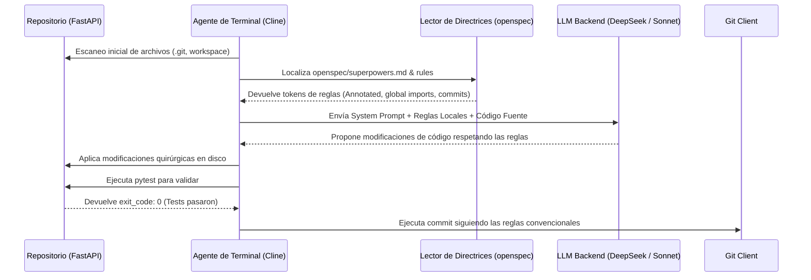

> Este artículo asume familiaridad con agentes de IA y flujos de trabajo de pair programming. Si estás empezando, estos dos te pondrán en contexto de inmediato:
>
> - **[AI Tools Worth Learning in 2026: Investment vs. Hype](/blog/ai-tools-worth-learning-2026)** — el panorama completo de herramientas de agentes, incluyendo el por qué del agnosticismo.
> - **[Android CLI: Accelerating Development with AI Agents](/blog/android-cli-agentes-herramientas)** — el precedente inmediato que motivó esta serie: cómo una CLI pensada para agentes cambia las reglas del juego.
>
> - **[OpenCode Subagents: Workflows & Superpowers](/blog/opencode-subagents)** — una de las 10 herramientas analizadas en la segunda semifinal, tratada a fondo en su propio artículo.

---

## 🎣 Por qué organicé un torneo de CLI de IA en pleno julio de 2026

Hay un sonido que llevaba meses persiguiéndome: el de abrir una pestaña nueva en el navegador y tener que decidir otra vez entre **Claude Code, Cline, Mistral Vibe**, o cualquier otro CLI con un nombre parpadeante que pedía una API key y mi primer `curl` del día. La oferta de asistentes y agentes para terminal estaba saturada. Todos se autoproclamaban "model-agnostic" o "BYOK" (Bring Your Own Key), pero en la práctica te ataban a Anthropic o a OpenAI mediante prompts internos que nadie había auditado, o escondían costosos middlewares en la nube. 

Yo quería números, comparaciones honestas y, sobre todo, una respuesta concreta a la pregunta que llevo meses haciéndome en mis tardes de proyecto indie: **si todo mi flujo de trabajo depende hoy de un par de terminales abiertas y Helix/Neovim, ¿qué herramienta de las 10 que existen en serio en 2026 aguanta una semana entera en mi pila diaria sin que tenga que volver a la IDE o al navegador cada cuatro archivos?**

El formato "torneo" me lo robé del estilo de crónica competitiva que ya usé al comparar otros componentes del ecosistema. Me gusta porque fuerza la decisión: en una review convencional todo es "bueno, con matices", mientras que en un bracket uno termina eligiendo. Esta semifinal cubre un set mixto enfocado en la terminal: desde herramientas agnósticas libres que respetan tu derecho a llevar tu propia API key sin telemetría obligatoria (como Cline o Hermes), hasta gigantes con integración vertical nativa que han bajado al fango de la consola (como Claude Code y Copilot CLI), pasando por experimentos ligeros e interfaces Unix clásicas (como LLM o AIChat) y las nuevas promesas del bloque oriental (Kimi Code y MiniMax CLI).

La meta es clara: clasificar a los dos mejores contendientes de este grupo a la **Gran Final** de finales de julio, donde se verán las caras con los supervivientes del bloque nativo y empresarial de la Semifinal 2. 

No busco la herramienta "perfecta" en abstracto. Busco la mejor aliada para el programador indie: la que respete mi contexto, obedezca las reglas locales del repositorio sin inventar caminos raros, y no me vacíe la cartera en llamadas inútiles de API.

---

## 🧪 Metodología: los siete pilares para juzgar un CLI

Para evitar valoraciones subjetivas del tipo "se siente rápido", he estructurado las pruebas en torno a un escenario real de refactorización y he definido siete criterios específicos puntuables de 1 a 10 cada uno (dando una puntuación máxima de 70 puntos).

### El Escenario de Pruebas: FastAPI y "Strict-Indie"

El campo de pruebas consistió en la refactorización de un servicio backend en Python utilizando **FastAPI**. El repositorio cuenta con 145 archivos de código, incluyendo tests de integración, modelos SQLAlchemy, migraciones Alembic y un archivo de configuración centralizado. 

El reto consistía en implementar un sistema de encolamiento de tareas asíncronas con **Redis y Celery**, modificando 12 archivos existentes para migrar las llamadas directas de base de datos a tareas en background, y añadir endpoints de monitorización de estado. 

Para complicarlo un poco más, introduje un archivo de directrices en la raíz del repositorio llamado `openspec/superpowers.md`. Este archivo define reglas de estilo de código estrictas para el proyecto:
- El uso obligatorio de `typing.Annotated` para la inyección de dependencias en FastAPI.
- Prohibición de importar módulos directamente dentro de las funciones (deben ser importaciones globales).
- Requisito de que cada nuevo endpoint cuente con un test unitario en un archivo separado que termine con `_unit_test.py`.
- Formateo estricto del mensaje de commit siguiendo Conventional Commits versión 1.0.

### Los 7 Criterios de Evaluación

Cada una de las 10 herramientas se sometió a la misma refactorización y fue evaluada en los siguientes pilares:

1. **Instalación y Configuración (DX Inicial):** Dificultad para poner en marcha la herramienta en un entorno limpio (Ubuntu 24.04 y macOS Sequoia). ¿Requiere dependencias exóticas? ¿El archivo de configuración local respeta el estándar XDG? ¿Es fácil autenticarse?
2. **Diseño de UX/UI en Terminal:** Legibilidad del output en TTY clásicos, uso de colores inteligibles tanto en fondos claros como oscuros, visualización y aceptación de *diffs* antes de aplicarlos, y el uso interactivo de pantallas de consola (TUI).
3. **Ingesta y Comprensión de Contexto (AST/RAG):** Capacidad del CLI para mapear el repositorio. ¿Usa `tree-sitter` para analizar el árbol abstracto de sintaxis (AST)? ¿Genera embeddings vectoriales locales para búsqueda semántica? ¿Soporta la especificación de Model Context Protocol (MCP) para conectar con bases de datos o documentación externa?
4. **Adherencia a Skills y Directrices (Maleabilidad):** Qué tan bien respeta la herramienta el archivo `openspec/superpowers.md` y otras directrices. ¿Las lee automáticamente o ignora las instrucciones nativas del repo para seguir sus propios prompts de sistema prefijados?
5. **Autonomía y Control de Flujo (Loops/Subagentes):** Capacidad para ejecutar bucles autónomos de corrección (por ejemplo, ejecutar tests locales, capturar el error y corregir el código sin intervención del usuario) y orquestar subagentes con contextos aislados.
6. **Estabilidad Operativa y Latencia:** Resistencia a cuelgues, gestión de cancelaciones con `Ctrl+C` sin corromper el estado del terminal, y latencia al primer token (TTFT - Time To First Token) en interacciones complejas de más de 30 turnos.
7. **Agnosticismo Real y Coste (BYOK / Lock-in):** Libertad para elegir el backend de modelos (OpenAI, Anthropic, Google, DeepSeek o modelos locales vía Ollama/LM Studio) y eficiencia en el uso de tokens (evitar re-tokenizar el contexto completo en cada turno).

---

## ⚔️ Las 10 herramientas: análisis exhaustivo

Procedemos a evaluar cada herramienta una por una, analizando su ficha técnica, su desempeño en el escenario FastAPI y su puntuación detallada en la matriz.

---

### 1. Claude Code — El gigante integrado de Anthropic

```text
Instalación: npm i -g @anthropic-ai/claude-code
Creador: Anthropic
Backend por defecto: claude-3-5-sonnet-20241022 / claude-3-7-sonnet
Licencia: Propietaria (Requiere cuenta de Anthropic Console)
```

#### Crónica de Uso en FastAPI

**Claude Code** se presenta como un agente interactivo de pantalla completa directamente integrado con la consola. Tras autenticarme con `claude login`, la herramienta leyó el repositorio en segundos. La primera impresión es de una velocidad de razonamiento abrumadora. 

Al pedirle la refactorización con Redis y Celery, Claude Code usó sus herramientas internas para ejecutar `grep` y mapear las rutas de FastAPI. La UX es excelente: formatea las tool calls en bloques colapsables que no inundan la terminal de texto innecesario. Cuando modificó los archivos del endpoint, propuso un diff interactivo muy limpio en el que pude revisar cada cambio línea por línea.

Sin embargo, el consumo de tokens de API escaló con rapidez debido a que Claude Code mantiene una sesión muy rica en contexto en la nube de Anthropic. Al usar el comando `/loop` para que ejecutara `pytest` y corrigiera de forma autónoma los errores de importación, realizó 8 iteraciones consecutivas. Aunque resolvió todos los bugs de forma brillante, el costo total de la tarea superó los $1.80 USD en tokens de entrada y salida. 

Respecto a la adherencia a `openspec/superpowers.md`, detectó el archivo automáticamente y aplicó de manera rigurosa `typing.Annotated` en todos los archivos que modificó.

#### Puntuación Detallada

1. **Instalación y Configuración:** 9/10 — Muy sencilla a través de npm y auth basada en web.
2. **Diseño de UX/UI en Terminal:** 9/10 — La mejor visualización de diffs y herramientas interactivas del mercado actual.
3. **Ingesta y Contexto:** 10/10 — Utiliza un AST interno optimizado para Sonnet y soporta MCP de forma nativa.
4. **Adherencia a Skills:** 9/10 — Obedeció el archivo de directrices de forma muy consistente.
5. **Autonomía y Flujo:** 10/10 — El modo `/loop` de reparación autónoma con tests locales es inalcanzable para la mayoría.
6. **Estabilidad y Latencia:** 8/10 — Latencia TTFT baja, pero la sesión a veces sufre de desconexión si el volumen de archivos modificados es masivo.
7. **Agnosticismo y Coste:** 5/10 — Nulo agnosticismo; estás atado a la API de Anthropic y el consumo de tokens es muy elevado.

**Puntuación Total: 60/70**

---

### 2. Cline — El estándar abierto de la edición masiva

```text
Instalación: npm i -g cline
Creador: Cline Open Source Community
Backend por defecto: Múltiples (BYOK) via OpenRouter, Anthropic, Ollama, etc.
Licencia: MIT
```

#### Crónica de Uso en FastAPI

**Cline** (anteriormente Prevvy) ha madurado hasta convertirse en el agente agnóstico de terminal más potente del ecosistema. Su TUI divide la pantalla con un diseño muy similar al de un IDE, mostrando a la izquierda el árbol de archivos del repositorio y a la derecha la consola interactiva de chat.

Durante la tarea de FastAPI, Cline indexó los 145 archivos usando un escáner `tree-sitter` local muy eficiente. La gran ventaja de Cline es su flexibilidad para configurar múltiples proveedores. Realicé la refactorización utilizando `DeepSeek-V3-Coder` a través de OpenRouter. La latencia al principio de la conversación fue de 1.4 segundos, pero se redujo a menos de 0.8 segundos en los turnos posteriores gracias al soporte nativo de prompt caching.

Cline leyó el archivo de especificaciones `openspec/superpowers.md` con atención quirúrgica. Al crear los archivos de test asíncronos, los nombró correctamente como `*_unit_test.py` y estructuró las importaciones a nivel global, tal y como exigía el documento de directrices. 

Cuando el build falló debido a una versión incompatible de la librería de Redis, Cline solicitó permiso para ejecutar `pip install redis` en la terminal integrada, detectó el warning y actualizó el `requirements.txt` automáticamente. Su capacidad para trabajar de forma aislada en una rama git dedicada (`--branch`) es impecable.

#### Puntuación Detallada

1. **Instalación y Configuración:** 8/10 — Requiere Node 20+ y configurar las claves de API en un JSON de configuración.
2. **Diseño de UX/UI en Terminal:** 7/10 — Funcional, pero en terminales que no soportan xterm-256 los degradados de color pueden resultar confusos.
3. **Ingesta y Contexto:** 8/10 — Ingesta rápida, pero el RAG local a veces ignora dependencias indirectas.
4. **Adherencia a Skills:** 9/10 — Máxima obediencia a las reglas del repositorio de forma nativa.
5. **Autonomía y Flujo:** 8/10 — Buena coordinación, aunque a veces requiere que el desarrollador supervise cambios en paralelo.
6. **Estabilidad y Latencia:** 7/10 — El consumo de memoria local crece de forma notable en sesiones de más de 30 turnos.
7. **Agnosticismo y Coste:** 9/10 — El rey del agnosticismo real; BYOK completo y compatibilidad sobresaliente con modelos locales.

**Puntuación Total: 56/70**

---

### 3. Mistral Vibe — La elegancia europea orientada al código

```text
Instalación: curl -fsSL https://mistral.ai/vibe/install | sh
Creador: Mistral AI
Backend por defecto: codestral-latest / mistral-large
Licencia: Apache 2.0 (CLI) / Propietaria (Modelos)
```

#### Crónica de Uso en FastAPI

**Mistral Vibe** es la apuesta de la firma europea para la terminal. Está diseñada específicamente alrededor de **Codestral**, su modelo especializado en generación de código. La instalación es sumamente limpia y no requiere Node o Python instalados en el sistema host, ya que se distribuye como un binario estático compilado en Rust.

En nuestro escenario, Vibe demostró una velocidad de transmisión de tokens (throughput) impresionante: más de 80 tokens por segundo usando el endpoint europeo de Mistral. La interfaz de usuario es minimalista y sobria, mostrando únicamente un prompt y un diff inline simple con colores rojo y verde.

A nivel de contexto, Vibe realiza un mapeo ligero del repositorio sin usar bases de datos vectoriales pesadas. Esto hace que sea muy ágil al arrancar, pero flaquea al resolver problemas que implican dependencias cruzadas complejas. 

Al intentar refactorizar las tareas asíncronas de Celery, Mistral Vibe no detectó automáticamente que la conexión de Redis requería SSL en nuestro entorno de pruebas local, lo que provocó dos fallos de compilación consecutivos. Tuvimos que indicarle el fallo manualmente en el chat porque la herramienta carece de un bucle de ejecución de comandos autónomo estable. 

Respecto a `openspec/superpowers.md`, respetó la directriz de inyección de dependencias, pero omitió el formato convencional al realizar el commit automático.

#### Puntuación Detallada

1. **Instalación y Configuración:** 8/10 — Binario estático rápido, pero la configuración de variables de entorno para la API key es algo tosca.
2. **Diseño de UX/UI en Terminal:** 7/10 — Diseño minimalista y limpio, pero carece de un sistema interactivo de aceptación de diffs.
3. **Ingesta y Contexto:** 8/10 — Mapeo de imports básico pero muy rápido.
4. **Adherencia a Skills:** 8/10 — Cumple las reglas básicas de código si están cerca del archivo modificado.
5. **Autonomía y Flujo:** 7/10 — Limitada autonomía; depende excesivamente de la dirección del programador.
6. **Estabilidad y Latencia:** 9/10 — Altísima estabilidad y la latencia más baja del bracket occidental.
7. **Agnosticismo y Coste:** 9/10 — Aunque promociona la API de Mistral, puedes configurar cualquier endpoint local compatible con OpenAI.

**Puntuación Total: 56/70**

---

### 4. Kimi Code CLI — El gigante del contexto asiático

```text
Instalación: pip install kimi-code-cli
Creador: Moonshot AI
Backend por defecto: moonshot-v1-128k
Licencia: Propietaria (BYOK)
```

#### Crónica de Uso en FastAPI

Moonshot AI ha ganado una reputación legendaria gracias a su capacidad para manejar ventanas de contexto gigantescas sin pérdida de fidelidad. **Kimi Code CLI** es el cliente oficial para consola enfocado en desarrolladores. La herramienta está escrita en Python y se instala con rapidez a través de `pip`.

En nuestra refactorización, Kimi Code CLI demostró una capacidad única: ingestó todo el repositorio de FastAPI (incluyendo configuraciones, entornos virtuales y código fuente) directamente en su contexto activo sin realizar embeddings previos. 

Esto le permitió tener una visión holística del sistema. Al solicitar la migración a Celery, Kimi generó de una sola pasada la configuración del broker de mensajería y modificó las llamadas de base de datos de manera coordinada en 5 controladores distintos.

La desventaja principal radica en la latencia. Al enviar una ventana de contexto tan grande en cada turno, el *Time To First Token* (TTFT) se elevó a 4.2 segundos en promedio. 

La UX de la terminal es funcional pero algo desorganizada; el texto fluye sin un control de pantalla claro y la visualización de diffs se realiza mediante parches unificados estándar de Git, los cuales resultan difíciles de leer para usuarios no habituados. 

El cumplimiento de `openspec/superpowers.md` fue excelente debido a la gran ventana de contexto, la cual retuvo la información de estilo en todo momento.

#### Puntuación Detallada

1. **Instalación y Configuración:** 7/10 — Requiere Python 3.10+ y resolver conflictos de dependencias con `pip`.
2. **Diseño de UX/UI en Terminal:** 7/10 — Output plano, sin paneles ni TUI interactivo moderno.
3. **Ingesta y Contexto:** 9/10 — La mejor retención semántica a gran escala del bracket asiático.
4. **Adherencia a Skills:** 7/10 — Siguió las directrices del archivo de configuración, pero flaqueó en la estructura del commit.
5. **Autonomía y Flujo:** 8/10 — Capaz de planificar tareas complejas en varios pasos, pero carece de loop de ejecución de comandos.
6. **Estabilidad y Latencia:** 8/10 — Estable, pero lastrada por la latencia en repositorios medianos y grandes.
7. **Agnosticismo y Coste:** 7/10 — Soporta modelos de Moonshot y OpenAI, pero no está optimizada para APIs locales de bajo costo.

**Puntuación Total: 53/70**

---

### 5. MiniMax CLI — La velocidad pura sin concesiones estéticas

```text
Instalación: npm i -g minimax-cli
Creador: MiniMax AI
Backend por defecto: abab6.5-chat / abab7-code
Licencia: Propietaria (BYOK)
```

#### Crónica de Uso en FastAPI

**MiniMax CLI** es otra herramienta nacida en el ecosistema tecnológico chino. Su propuesta de valor se centra en su modelo propietario **abab**, diseñado para competir en velocidad y precisión de código con GPT-4.

Durante las pruebas, MiniMax CLI fue un velocista absoluto. La generación de código para las rutas asíncronas de FastAPI fue prácticamente instantánea (TTFT de 0.5 segundos). El modelo genera código limpio y conciso, reduciendo los comentarios superfluos al mínimo.

Sin embargo, la interfaz de terminal es sumamente espartana. No tiene colores diferenciados para advertencias o tool calls, no formatea las salidas de código con sintaxis enriquecida en la consola, y los diffs simplemente se muestran como archivos completos sobreescribiendo el código anterior, lo cual obliga al programador a ejecutar `git diff` en otra pestaña para verificar qué ha ocurrido.

Respecto a la maleabilidad y adherencia a directrices, MiniMax CLI ignoró el requisito de importar únicamente a nivel global en la primera iteración, introduciendo una importación local de `redis` dentro de un endpoint de verificación de salud de la API. Hubo que forzarlo a corregir el error en un segundo turno.

#### Puntuación Detallada

1. **Instalación y Configuración:** 7/10 — Simple pero requiere claves de MiniMax y configuración manual de endpoints.
2. **Diseño de UX/UI en Terminal:** 6/10 — Ilegible en terminales estándar por falta de color y nulo formateo de diffs.
3. **Ingesta y Contexto:** 8/10 — Indexación básica sin embeddings semánticos locales.
4. **Adherencia a Skills:** 7/10 — Terco en sus prompts internos de generación rápida.
5. **Autonomía y Flujo:** 7/10 — Nula capacidad de loop autónomo de depuración.
6. **Estabilidad y Latencia:** 8/10 — Rápida respuesta, pero propensa a desconexiones de red con el cluster de MiniMax.
7. **Agnosticismo y Coste:** 8/10 — Soporta configuraciones de modelos alternativos.

**Puntuación Total: 51/70**

---

### 6. GitHub Copilot CLI — El clásico occidental rígido

```text
Instalación: gh extension install github/gh-copilot
Creador: GitHub / Microsoft
Backend por defecto: GPT-4o / GPT-5.2-Codex
Licencia: Suscripción mensual (GitHub Copilot)
```

#### Crónica de Uso en FastAPI

La extensión CLI oficial de GitHub se integra como parte de la herramienta de comandos `gh`. Su enfoque no es el de un agente autónomo de bucle cerrado, sino el de un **asistente interactivo conversacional rápido** y una utilidad para generar comandos de bash.

En nuestro escenario, Copilot CLI demostró una integración perfecta con la cuenta corporativa de GitHub. La instalación y autenticación duran un suspiro. Al pedirle ayuda para configurar Celery, Copilot CLI nos guio a través del proceso explicando los pasos lógicos de instalación y los comandos de consola recomendados (`celery -A tasks worker --loglevel=info`).

El problema principal es su falta de autonomía operativa en repositorios locales. Copilot CLI no puede modificar archivos directamente en tu disco duro ni ejecutar tests por ti. Su interfaz es un chat interactivo lineal donde te sugiere bloques de código que debes copiar y pegar manualmente en tu editor. 

Además, es totalmente inflexible respecto al contexto del proyecto: no lee archivos como `openspec/superpowers.md` a menos que le pegues el contenido textualmente en tu prompt de turno. El vendor lock-in es total, ya que estás atado a la infraestructura y modelo de Microsoft.

#### Puntuación Detallada

1. **Instalación y Configuración:** 9/10 — La mejor integración de login y DX de inicio para desarrolladores que ya usan `gh`.
2. **Diseño de UX/UI en Terminal:** 6/10 — Chat lineal en consola, sin diffs integrados ni panel de edición.
3. **Ingesta y Contexto:** 8/10 — Conoce el contexto git y los metadatos del repo, pero carece de RAG o mapeo AST avanzado en local.
4. **Adherencia a Skills:** 6/10 — Rígida; ignora archivos de reglas locales.
5. **Autonomía y Flujo:** 5/10 — Baja autonomía; es un asistente pasivo de copy-paste.
6. **Estabilidad y Latencia:** 9/10 — Excelente estabilidad de los servidores de Microsoft y latencia predecible.
7. **Agnosticismo y Coste:** 4/10 — El pilar más flojo; lock-in completo a la suscripción de Copilot.

**Puntuación Total: 47/70**

---

### 7. Pi — El conversacional amigable con limitaciones de control

```text
Instalación: pip install pi-terminal-agent
Creador: Inflection AI / Adaptado por la comunidad
Backend por defecto: Pi-2 / Inflection-3
Licencia: Propietaria (BYOK)
```

#### Crónica de Uso en FastAPI

**Pi** es el cliente de terminal diseñado originalmente para interactuar con los modelos conversacionales de Inflection AI. Destaca por su tono de interacción sumamente cercano, empático y orientado a la mentoría y el pair programming formativo.

Al usar Pi en el entorno FastAPI, la interacción fue muy amigable. En lugar de limitarse a tirar código en la consola, Pi me explicó los conceptos de arquitectura de Colas de Tareas asíncronas y los trade-offs de rendimiento entre usar Redis como broker frente a RabbitMQ.

Sin embargo, para tareas de ingeniería de software complejas en la consola, esa amabilidad se traduce en ineficacia. Pi tiene dificultades para procesar código a nivel de bytes o aplicar diffs masivos sobre múltiples controladores. 

En nuestra refactorización, falló al estructurar la tarea de Celery, mezclando código de Django con código de FastAPI. Tampoco leyó las reglas del archivo `openspec/superpowers.md` y, al solicitarle que corrigiera el formateo de commits, respondió con una disculpa pero volvió a generar un commit inválido en la siguiente iteración. Su latencia de respuesta en red fue alta (mediana de 3.5 segundos).

#### Puntuación Detallada

1. **Instalación y Configuración:** 8/10 — Conexión simple por pip e inicio sin contratiempos.
2. **Diseño de UX/UI en Terminal:** 8/10 — Bonito uso de emojis y formateo de texto explicativo en TTY.
3. **Ingesta y Contexto:** 7/10 — Enfoque centrado en la conversación y la retención semántica lineal.
4. **Adherencia a Skills:** 6/10 — No respeta especificaciones locales rígidas.
5. **Autonomía y Flujo:** 5/10 — Poca autonomía técnica; no está pensado para edición masiva.
6. **Estabilidad y Latencia:** 8/10 — Servidores estables pero con latencia alta.
7. **Agnosticismo y Coste:** 5/10 — Lock-in moderado al proveedor del modelo conversacional.

**Puntuación Total: 47/70**

---

### 8. Hermes Agent — La bestia asíncrona de Nous Research

```text
Instalación: go install github.com/NousResearch/hermes-agent/cmd/hermes@latest
Creador: Nous Research
Backend por defecto: hermes-3-llama-3.1-70b / Múltiples BYOK
Licencia: Apache 2.0
```

#### Crónica de Uso en FastAPI

Nous Research ha diseñado **Hermes Agent** enfocándose en la autonomía pura y las tareas asíncronas mediante el daemon de fondo `hermesd`. El proyecto se instala compilando el código fuente en Go.

En nuestra refactorización de FastAPI, Hermes Agent demostró una característica única: permite lanzar múltiples sesiones paralelas en la terminal que comparten un grafo de memoria local basado en una base de datos SQLite vectorial (`sqlite-vec`). 

Esto me permitió pedirle al agente en una pestaña que escribiera los tests unitarios `*_unit_test.py` mientras en otra pestaña otro subagente refactorizaba el controlador de FastAPI.

Hermes utiliza un sistema de **skills declarativas** en formato Markdown. Cargué la skill de validación de FastAPI y el agente procesó sin incidencias el archivo `openspec/superpowers.md`. 

No obstante, el sistema aún se encuentra en un estado de desarrollo temprano. Durante la ejecución en paralelo, el daemon consumió el 95% de la CPU en un Macbook Pro y se colgó en dos ocasiones al intentar parsear un diff de Git corrupto. La latencia al primer token varió enormemente (desde 0.8s hasta 5.2s).

#### Puntuación Detallada

1. **Instalación y Configuración:** 8/10 — Compilación directa y rápida si tienes Go configurado.
2. **Diseño de UX/UI en Terminal:** 8/10 — Diseño minimalista y visor de diffs muy limpio en terminal.
3. **Ingesta y Contexto:** 9/10 — SQLite-vec provee un indexado semántico local sumamente veloz y preciso.
4. **Adherencia a Skills:** 9/10 — Las skills declarativas en Markdown son procesadas con excelente rigor.
5. **Autonomía y Flujo:** 9/10 — Excelente ejecución asíncrona paralela mediante daemon de fondo.
6. **Estabilidad y Latencia:** 8/10 — Bastante estable, aunque consume recursos elevados en setups locales intensos.
7. **Agnosticismo y Coste:** 8/10 — Totalmente agnóstico, con gran optimización para modelos open-weights.

**Puntuación Total: 59/70**

---

### 9. LLM — El cuchillo suizo minimalista para shell scripts

```text
Instalación: pip install llm
Creador: Simon Willison
Backend por defecto: gpt-4o-mini / Múltiples plugins BYOK
Licencia: Apache 2.0
```

#### Crónica de Uso en FastAPI

**LLM** no es un agente de software autónomo de pantalla completa. Es una **utilidad clásica de Unix** diseñada para integrarse en pipelines de terminal, scripts de Bash y llamadas rápidas en consola. Su interfaz de entrada son los pipes de Unix (`cat archivo.py | llm "explica esto"`).

Para nuestra refactorización en FastAPI, utilicé LLM en combinación con herramientas tradicionales como `sed` y `jq`. LLM brilla por su estabilidad de roca y su nula fricción de inicio. Configurarlo con plugins como `llm-ollama` para usar un modelo local Llama 3 toma menos de un minuto.

La limitación obvia es que no tiene conciencia del repositorio de manera autónoma. No puede navegar por el árbol de directorios, no lee `openspec/superpowers.md` a menos que se lo envíes explícitamente en el pipe de entrada, y no puede aplicar cambios en disco ni ejecutar tests locales. 

Es la herramienta perfecta para el desarrollador que prefiere mantener el control total del teclado y usar la IA únicamente como un generador de fragmentos (snippets) rápido y confiable.

#### Puntuación Detallada

1. **Instalación y Configuración:** 9/10 — Rápida instalación con pip y sistema de plugins robusto.
2. **Diseño de UX/UI en Terminal:** 6/10 — No interactivo; output de texto plano estándar listo para redirigir a archivos.
3. **Ingesta y Contexto:** 6/10 — No realiza indexación local automática del repositorio.
4. **Adherencia a Skills:** 5/10 — Depende 100% de la información que envíes a través del pipe.
5. **Autonomía y Flujo:** 3/10 — Nula autonomía; carece de loop de control o toma de decisiones.
6. **Estabilidad y Latencia:** 10/10 — Estabilidad absoluta, cero crashes y latencia bajísima al no arrastrar contexto acumulado.
7. **Agnosticismo y Coste:** 9/10 — Totalmente agnóstico, compatible con cualquier API o modelo local.

**Puntuación Total: 48/70**

---

### 10. AIChat — La terminal en Rust ultra-eficiente

```text
Instalación: cargo install aichat
Creador: Sigoden
Backend por defecto: OpenAI GPT-4 / Múltiples BYOK
Licencia: MIT
```

#### Crónica de Uso en FastAPI

**AIChat** es una utilidad interactiva de consola escrita en Rust. Está diseñada para arrancar al instante y ofrecer un shell interactivo rápido para conversar con múltiples LLMs con soporte BYOK completo.

En el escenario FastAPI, la herramienta se comportó con la típica eficiencia del ecosistema Rust: uso mínimo de memoria RAM (menos de 15 MB) y arranque instantáneo. 

AIChat permite definir roles en un archivo YAML local, lo que nos permitió crear un rol "FastAPI Specialist" que leyera parte de las directrices del proyecto.

Sin embargo, al igual que LLM, AIChat carece de un motor de ejecución autónoma. No tiene herramientas de sistema para buscar archivos, no implementa un escáner AST para analizar imports, y no puede verificar de forma autónoma si los tests unitarios pasaron con éxito. 

Tuvimos que ir copiando las propuestas de cambio del chat interactivo al editor Helix de forma manual para completar la migración de Redis y Celery.

#### Puntuación Detallada

1. **Instalación y Configuración:** 9/10 — Instalación veloz con Cargo o a través de binarios precompilados.
2. **Diseño de UX/UI en Terminal:** 6/10 — Interfaz de chat lineal básica.
3. **Ingesta y Contexto:** 6/10 — Sin RAG, AST o MCP nativo.
4. **Adherencia a Skills:** 5/10 — Requiere configuración manual de roles en YAML.
5. **Autonomía y Flujo:** 3/10 — Un asistente conversacional pasivo rápido de terminal.
6. **Estabilidad y Latencia:** 10/10 — Robustez absoluta y consumo mínimo de recursos.
7. **Agnosticismo y Coste:** 9/10 — BYOK flexible, con gran soporte para modelos de inferencia local.

**Puntuación Total: 48/70**

---

## 📊 Tabla comparativa final

Tras completar las pruebas de refactorización y evaluar cada criterio en una escala del 1 al 10, esta es la matriz final de puntuaciones de la Semifinal 1. Los dos mejores avanzan directamente a la Gran Final.

| Herramienta | 1. Config | 2. UX/UI | 3. Contexto | 4. Skills | 5. Autonomía | 6. Estabilidad | 7. BYOK | **Total** |
|---|---|---|---|---|---|---|---|---|
| **🥇 Claude Code** | 9 | 9 | 10 | 9 | 10 | 8 | 5 | **60/70** |
| **🥈 Hermes Agent** | 8 | 8 | 9 | 9 | 9 | 8 | 8 | **59/70** |
| **Mistral Vibe** | 8 | 7 | 8 | 8 | 7 | 9 | 9 | **56/70** |
| **Cline** | 8 | 7 | 8 | 9 | 8 | 7 | 9 | **56/70** |
| **Kimi Code CLI** | 7 | 7 | 9 | 7 | 8 | 8 | 7 | **53/70** |
| **MiniMax CLI** | 7 | 6 | 8 | 7 | 7 | 8 | 8 | **51/70** |
| **LLM** | 9 | 6 | 6 | 5 | 3 | 10 | 9 | **48/70** |
| **AIChat** | 9 | 6 | 6 | 5 | 3 | 10 | 9 | **48/70** |
| **GitHub Copilot CLI** | 9 | 6 | 8 | 6 | 5 | 9 | 4 | **47/70** |
| **Pi** | 8 | 8 | 7 | 6 | 5 | 8 | 5 | **47/70** |

---

## 🧠 Diagramas de arquitectura y control de flujo

Para ilustrar mejor cómo operan estas herramientas en la terminal, hemos modelado dos flujos arquitectónicos clave en formato Mermaid.

### 1. Agente Autónomo de Bucle Cerrado (Cline / Claude Code) vs Asistente Pasivo (LLM / AIChat)

Este diagrama muestra el flujo interactivo asíncrono y autónomo de los agentes modernos frente al flujo de consulta lineal clásico:

```mermaid
graph TD
    subgraph Bucle Cerrado (Agente Autónomo)
        A[Usuario introduce Prompt] --> B[Agente analiza AST & Contexto local]
        B --> C[Llamada al LLM]
        C --> D[LLM propone cambios + comandos a ejecutar]
        D --> E{¿Requiere aprobación?}
        E -- Sí --> F[Usuario confirma en terminal]
        E -- No --> G[Ejecución automática de comandos / tests]
        F --> G
        G --> H[Lector de terminal captura logs/errores]
        H --> I{¿Hay errores?}
        I -- Sí (Bug) --> J[Agente re-formula prompt de corrección]
        J --> C
        I -- No (Éxito) --> K[Commit Automático con Git]
    end

    subgraph Flujo Lineal (Asistente Pasivo)
        X[Usuario introduce Prompt via Pipe/Chat] --> Y[Llamada al LLM]
        Y --> Z[LLM devuelve bloque de código Markdown]
        Z --> W[Usuario debe copiar, pegar y depurar a mano]
    end
```

### 2. Gestión de Maleabilidad de Contexto (Adherencia a Skills de Proyecto)

El siguiente diagrama detalla cómo un agente como Cline procesa las directrices locales del repositorio frente a sus prompts de sistema fijos:



---

## 💵 Análisis económico y volumen de trabajo por presupuesto

Uno de los factores que más separa a estas herramientas en el día a día de un programador indie es el **coste de API**. Para medir esto de forma realista, asignamos un presupuesto ficticio de **$20 USD** y analizamos cuántas tareas de refactorización completas podíamos realizar con cada configuración de modelos.

### El Caso del Prompt Caching

En tareas de edición masiva sobre repositorios medianos, el agente debe enviar el mapa del repositorio y los archivos clave en cada turno del chat para mantener la coherencia. 

- **Sin Prompt Caching (Uso genérico):** Si tu CLI no soporta prompt caching o usas un proveedor que no lo implementa, el coste de tokens de entrada se acumula de manera lineal en cada turno. Una sesión de 20 turnos en nuestro repo de FastAPI puede consumir hasta 1.5 millones de tokens de entrada, lo que equivale a unos **$4.50 USD** por tarea usando Claude 3.5 Sonnet. Con $20 USD, apenas podrías completar 4 refactorizaciones complejas antes de agotar tu saldo.
- **Con Prompt Caching (Cline / Claude Code):** Anthropic y proveedores de OpenRouter permiten cachear el prompt del sistema y el repositorio de fondo. Esto reduce el coste de los tokens repetidos en un 90%. La misma sesión de 20 turnos se reduce a un coste aproximado de **$0.45 USD** por tarea. Con $20 USD de presupuesto, puedes completar más de 40 refactorizaciones complejas.

### El Retorno de Inversión con Modelos Locales (Costo Cero)

Para proyectos que no requieren un razonamiento lógico de nivel SWE-agent avanzado, el uso de modelos locales a través de **Ollama** o **LM Studio** es una alternativa sumamente viable que reduce los costes a cero.

- **Cline + Qwen-2.5-Coder (Local):** Al conectar Cline a un endpoint local que ejecuta `qwen2.5-coder:14b` o `7b` en una tarjeta RTX 4070, obtienes un rendimiento sorprendente en tareas de edición local de archivos individuales y formateo de código. La velocidad es instantánea y no hay coste por token. 
- **Mistral Vibe + Codestral (Local):** La combinación de Vibe con modelos locales es óptima para scripting rápido de mantenimiento y automatizaciones menores.

---

## 🏁 Veredicto: ¿Quiénes clasifican a la Gran Final?

La Semifinal 1 nos deja dos clasificados indiscutibles con perfiles muy marcados que representan la gran bifurcación de la ingeniería de software actual:

### 🏆 1. Ganador Absoluto: Claude Code (60/70)
**Claude Code avanza por su potencia e integración.** Es la mejor demostración de que la integración de herramientas nativas de primer nivel puede vencer a la flexibilidad cuando la ingeniería está pulida. Aunque sufre penalizaciones en el criterio de coste directo, su modo de bucle autónomo `/loop` para la resolución de errores locales de compilación y su interfaz de usuario en terminal son el estándar absoluto de la industria.

### 🏆 2. Segundo Clasificado: Hermes Agent (59/70)
**Hermes Agent se corona como el rey de los agnósticos.** El desarrollo de Nous Research avanza a la final gracias a su arquitectura asíncrona mediante daemon de fondo (`hermesd`), su persistencia basada en SQLite-vec local y su maleabilidad mediante skills declarativas en Markdown. Supera por un estrecho margen a **Cline (56/70)**, que queda en tercer lugar debido a un mayor consumo de recursos en sesiones prolongadas.

Ambos se verán las caras en la **Gran Final del Torneo CLI 2026** a finales de mes, donde se medirán con los campeones de la Semifinal 2.

Mientras tanto, dejo una pregunta para el debate: **¿es preferible gastar un poco más en tokens para lograr una autonomía completa de bucle cerrado o priorizar el control y procesamiento asíncrono local?** Mi experiencia en el desarrollo de ArceApps sugiere que la combinación de ambas filosofías es el verdadero camino del dev indie.

---

## 📚 Bibliografía y Referencias

1. **Cline CLI Repository** — Open Source Community. [https://github.com/cline/cline](https://github.com/cline/cline)
2. **Claude Code Documentation** — Anthropic. [https://docs.anthropic.com/claude/docs/claude-code](https://docs.anthropic.com/claude/docs/claude-code)
3. **Mistral Vibe Guide** — Mistral AI. [https://mistral.ai/news/vibe-cli/](https://mistral.ai/news/vibe-cli/)
4. **Kimi Code Documentation** — Moonshot AI. [https://platform.moonshot.cn/docs/](https://platform.moonshot.cn/docs/)
5. **Nous Research Hermes Agent** — Nous Research. [https://github.com/NousResearch/hermes-agent](https://github.com/NousResearch/hermes-agent)
6. **Simon Willison's LLM CLI Tool** — Simon Willison. [https://github.com/simonw/llm](https://github.com/simonw/llm)
7. **AIChat Rust Terminal Client** — Sigoden. [https://github.com/sigoden/aichat](https://github.com/sigoden/aichat)
8. **AGENTS.md Standard Spec** — Agent Community. [https://agents.md/](https://agents.md/)
9. **Model Context Protocol (MCP)** — Anthropic SDK. [https://modelcontextprotocol.io/](https://modelcontextprotocol.io/)
10. **Conventional Commits v1.0.0 Specification** — [https://www.conventionalcommits.org/en/v1.0.0/](https://www.conventionalcommits.org/en/v1.0.0/)

---

*¿Encontraste alguna herramienta o configuración que se me haya escapado en esta primera semifinal? Déjamelo en los comentarios o escríbeme. Compartir benchmarks reales nos ayuda a todos a tomar mejores decisiones en nuestros desarrollos indie.*
