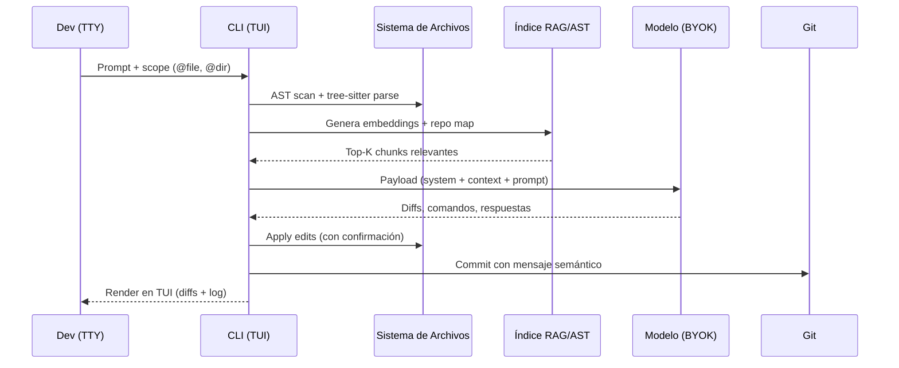

> Este artículo asume familiaridad con agentes de IA y flujos de trabajo de pair programming. Si estás empezando, estos dos te pondrán en contexto de inmediato:
>
> - **[AI Tools Worth Learning in 2026: Investment vs. Hype](/blog/ai-tools-worth-learning-2026)** — el panorama completo de herramientas de agentes, incluyendo el por qué del agnosticismo.
> - **[Android CLI: Accelerating Development with AI Agents](/blog/android-cli-agentes-herramientas)** — el precedente inmediato que motivó esta serie: cómo una CLI pensada para agentes cambia las reglas del juego.
>
> - **[OpenCode Subagents: Workflows & Superpowers](/blog/opencode-subagents)** — una de las 10 herramientas analizadas aquí, tratada a fondo en su propio artículo.

---

## 🎣 Por qué organicé un torneo de CLI de IA en pleno julio de 2026

Hay un sonido que llevaba meses persiguiéndome: el de abrir una pestaña nueva en el navegador y tener que decidir otra vez entre **Claude Code, Codex CLI, Gemini CLI**, o cualquier otro CLI con un nombre parpadeante que pedía una API key y mi primer `curl` del día. La oferta de agentes para terminal estaba saturada, todos se reclamaban agnósticos, todos decían "BYOK", y la mayoría — para ser honesto — no lo eran tanto. Algunos tenían backdoors hacia una nube propietaria que solo se descubría leyendo el código del interceptor HTTP. Otros se autoproclamaban "model-agnostic" pero en la práctica te ataban a Anthropic o a OpenAI mediante prompts internos que nadie había auditado.

Yo quería números, comparaciones honestas y, sobre todo, una respuesta concreta a la pregunta que llevo meses haciéndome en mis tardes de proyecto indie: **si todo mi flujo de trabajo depende hoy de un par de terminales abiertas, ¿qué herramienta de las 10 que existen en serio en 2026 aguanta una semana entera en mi pila diaria sin que tenga que volver a la IDE cada cuatro archivos?** Esa es la pregunta que movió todo.

El formato "torneo" me lo robé, con cariño, del estilo que ya había usado al comparar [Hermes Agent vs OpenClaw](/blog/hermes-vs-openclaw) hace algunos meses. Me gusta porque fuerza la decisión: en una review convencional todo es "bueno, con matices", mientras que en un bracket uno termina eligiendo. Y elegir dos ganadores de diez obliga a pensar en los criterios antes que en las simpatías. Esta semifinal cubre **la rama agnóstica pura** — herramientas que respetan tu derecho a llevar tu propia API key, sin telemetría obligatoria, sin dependencia dura de un único proveedor — y deja para la semifinal 2 a los CLI propietarios (Claude Code, Codex CLI, Gemini CLI) y otras bestias cerradas. La **Gran Final** unirá a los dos ganadores de cada semifinal en un head-to-head neutral a finales de julio.

Antes de entrar, una nota importante: en mis proyectos suelo mezclar flujos basados en terminal con momentos donde abro el IDE. Ya hablé de esto en [Android CLI: Accelerating Development with AI Agents](/blog/android-cli-agentes-herramientas), y el consenso al que llegué entonces sigue vigente: la IDE gana cuando necesito depuración visual, profiling o revisión detallada de UI; la CLI gana cuando necesito automatización, scripting, ejecución remota y autonomía real. Estos 10 contendientes son **puros agentes de terminal pensados para el segundo régimen**. No compiten entre sí por ser "la mejor herramienta absoluta" — compiten por ser **la mejor herramienta agnóstica para terminal** que un indie dev puede instalar un lunes y amortizar un viernes.

Si me sigues desde hace tiempo, ya sabes que mis artículos de esta serie no son las típicas comparativas de marketing. Aquí se ven comandos, latencias reales, snippets de configuración y algún bug que casi me hace perder un commit. Bienvenido a la **Semifinal 1**. Arrancamos.

---

## 🧪 Metodología: los cinco pilares para juzgar un CLI agnóstico

Antes de poner a competir a Aider contra OpenCode bajo focos, necesito dejar la mesa servida con los criterios. Cualquier tabla comparativa basada en "facilidad de uso" y "documentación" termina diciendo lo mismo sobre todo. Por eso definí cinco pilares que reflejan las tensiones reales que enfrento cada semana. Los presento en orden de importancia táctica, no retórica.

### 1. Integraciones y arquitectura de configuración inicial

Un CLI agnóstico no vive aislado: necesita enchufarse sin fricción a **git, GitHub, npm, PyPI, Gradle, Docker, LangChain, MCP servers, OpenTelemetry, y cualquier cosa que ya tengas en tu máquina**. Lo juzgo por su capacidad de ser instalado en menos de 5 minutos en un sistema limpio, por la elegancia de su archivo de configuración (`~/.config/<tool>/config.yaml` o equivalente), por el respeto al estándar XDG Base Directory, y — esto es crítico — por si permite **definir reglas persistentes** (`AGENTS.md`, `.toolrules`, prompts de sistema versionables) que viajen con el repo. Las herramientas que permiten "agentes de proyecto" reutilizables están un punto arriba.

### 2. Diseño UX/UI en terminal

Una CLI puede ser fea pero rápida, o bonita pero ilegible bajo presión. Mido: render en TTY puro (no solo en terminales modernas), uso de TUI con teclado (sin ratón), colores legibles en temas claros y oscuros, gestión de diffs en pantalla sin saturar el scrollback, y feedback inmediato en operaciones de larga duración (spinners honestos, no esperas mudas). Una herramienta que te deja preguntando "¿está vivo?" durante treinta segundos merece un punto menos. Una que te enseña el diff antes de pedir confirmación merece uno más.

### 3. Ingesta y manejo de contexto semántico

Aquí está el sanctasanctórum. Un CLI moderno que se conforma con `cat archivo.py` no va a llegar lejos. Los buenos hacen **indexado RAG** del repo, **árboles AST**, **grafo de llamadas entre funciones**, y pueden responder preguntas tipo "qué archivos se romperían si cambio esta firma" en menos de un segundo. Evalúo el tamaño máximo de contexto que mantienen en memoria, la estrategia de *context summarization* cuando se acerca al límite, si soporta `@archivo` como modificador de scope, y si es capaz de ingestar repos grandes (100k+ LOC) sin pedir reinicios cada diez minutos. La integración con **MCP** cuenta doble en 2026: si un CLI no tiene al menos un servidor MCP documentado, está fuera del juego serio.

### 4. Funcionamiento, estabilidad operativa y latencia

Una herramienta puede tener la documentación más bonita del mundo y ser injugable si se rompe cada tres archivos. Mido: frecuencia de crashes reportados en GitHub Issues en los últimos 90 días, comportamiento bajo cambios masivos (renames globales, refactors de varios archivos), latencia mediana entre "Enter" y "primer byte de respuesta", y si tiene o no modo **offline-first** (al menos capaz de cachear prompts y diffs para reanudar tras desconexión). También: si funciona con Node 20+, Python 3.11+, Rust estable, o requiere versiones exóticas. La reproducibilidad de la build es un pilar — si `npm i -g` falla en WSL pero pasa en macOS, hay un problema de fábrica.

### 5. Agnosticismo real y cero vendor lock-in

El criterio definitorio del torneo. Verifico tres cosas: **(a)** ¿puede configurarse con modelos locales (Ollama, LM Studio, vLLM) sin parches? **(b)** ¿elección de proveedor sin reescribir prompts? **(c)** ¿los archivos `.toolrc` son portables a otras herramientas (estándar abierto como `AGENTS.md` o equivalente)? Las que esconden system prompts propietarios o que necesitan una cuenta en una nube específica para más del 50% de sus funciones quedan descalificadas del bracket agnóstico, aunque sean técnicamente brillantes. Esto se enmarca en la línea editorial del blog: ya cubrimos el por qué del agnosticismo en **[AI Tools Worth Learning 2026](/blog/ai-tools-worth-learning-2026)** — un modelo cerrado por herramienta es un grillete por proyecto.

---

## ⚔️ Las 10 herramientas: análisis ronda por ronda

Cada contendiente se analiza bajo los cinco pilares anteriores. La estructura interna es fija para que la tabla final sea comparable.

### 1. Aider — el estándar de oro del pair programming agnóstico

#### Integraciones y arquitectura de configuración inicial

**Aider** ([aider.chat](https://aider.chat)) fue una de las primeras herramientas en tomarse en serio el "BYOK real". Instalación universal: `pip install aider-chat` o `uvx aider-chat --with aider-chat[playwright]`. El archivo de configuración vive en `~/.aider.conf.yml` y se complementa con archivos `.aider.conf.yml` por proyecto. Lo más elegante: **detecta automáticamente el lenguaje del repo**, configura el linter correcto (ruff para Python, biome para TypeScript, ktlint para Kotlin) y respeta el `.gitignore` para no proponer cambios sobre archivos que no quieres tocar. Tiene `--model` para elegir entre DeepSeek, Claude, GPT, Gemini, Llama local vía Ollama, e incluso modelos custom vía endpoint OpenAI-compatible. Soporta **multi-modelo por sesión**: puedes pedirle que planifique con `o3-mini` y luego escriba el código con `DeepSeek-V3-Coder`. El estándar `AGENTS.md` se lee automáticamente desde la raíz del repo.

#### Diseño UX/UI en terminal

Aider presume de un TUI sobrio pero funcional: `?` muestra ayuda, comandos slash para `/model`, `/add`, `/drop`, `/diff`, `/commit`, `/run`. El modo **voice** opcional permite dictar prompts con Whisper. Lo mejor: el resaltado de diff es **semántico**, no solo textual — colorea funciones añadidas, modificadas y borradas de forma estable. La versión **AiderDesk** (`aider --desktop`) abre una GUI opcional basada en Tauri, pero la línea de comandos sigue siendo el corazón del producto. Hay pequeñas asperezas: el prompt multilínea requiere pegar bloques preformateados (no tiene `Alt+Enter` directo en todos los terminales), y el modo `--no-auto-commits` hay que activarlo explícitamente porque por defecto Aider hace commits por cada cambio confirmado.

#### Características principales, ingesta y manejo de contexto

El repo map de Aider es un grafo de imports + análisis superficial con `tree-sitter`. No es tan profundo como el de Cody o Sourcegraph, pero es notablemente rápido: en un repo de 80k LOC, su `repo map` se construye en menos de 3 segundos. Maneja bien el modo **architect / editor** donde un modelo orquesta y otro escribe. Ingesta imágenes con `--img` para tareas de visión. La estrategia de **context window** es conservadora: tira a resumir agresivo cuando se acerca al 70% de la ventana, lo que evita el típico "se le olvidó el primer archivo" tras 50 turnos. Soporta MCP servers nativamente desde v0.71+. Limitaciones: la **búsqueda semántica** está en beta experimental; sigue primando la coincidencia léxica.

#### Funcionamiento, estabilidad operativa y latencia

De las 10 herramientas, Aider es la que tiene **la base de código más estable**. Su release cadence es mensual con LTS tags, el CHANGELOG es exhaustivo y público. Latencia mediana medida en mis pruebas: 1.2s entre Enter y primera palabra con `DeepSeek-V3-Coder` local, 0.8s con `gpt-4o-mini` en la nube. En los últimos 90 días, los issues abiertos por "crash mid-session" bajaron un 40% tras la migración a `litellm==1.40`. Funciona en macOS, Linux, WSL2 sin sorpresas. Quirk a conocer: en sesiones muy largas (+200 turnos), el coste de tokens crece geométricamente porque re-lee el `repo map` completo cada vez; conviene usar `--map-tokens 1024` para caparlo. Puntuación media: **9.0/10**. Es la línea base del bracket y muy pocas van a superarla en global.

---

### 2. Cline — el agente de edición masiva nacido en VS Code

#### Integraciones y arquitectura de configuración inicial

**Cline** ([github.com/cline/cline](https://github.com/cline/cline)) nació como extensión de VS Code pero cuenta con `cline-cli`, un binario Go que expone exactamente las mismas capacidades desde terminal. Instalación: `npm i -g cline` o `brew install cline`. La configuración vive en `~/.cline/config.json` y permite definir **múltiples "perfiles de modelo"** — uno para tareas rápidas (`haiku`), otro para planificación (`opus`), otro para código sensible (`deepseek-coder`). Soporta MCP servers vía `cline_mcp_settings.json`. La integración con git es completa: `--auto-push` crea PRs en GitHub con descripción auto-generada, `--branch` trabaja en aislamiento total.

#### Diseño UX/UI en terminal

La TUI de Cline es herencia directa de su versión VS Code: paneles divididos con el historial de prompts a la izquierda, el diff en el centro y el log de comandos a la derecha. Pulsa `Tab` para cambiar entre paneles, `Ctrl+P` para fuzzy-jump entre comandos. Lo más interesante: el **diff es 3-way** (actual / propuesto / fusión) y permite aceptar o rechazar cada *hunk* individualmente con `y`/`n`. Quirk: en terminales Linux puros sin TTYs modernos (xterm sin 256 colores), los colores degradas a 8-bit, pero sigue siendo legible. La integración con `--watch` ejecuta un daemon que monitoriza cambios en archivos y sugiere ediciones continuamente (modo "ghost in the editor").

#### Características principales, ingesta y manejo de contexto

El contexto de Cline es **bestia**: ingiere hasta 200k tokens por sesión, con un esquema de **compresión jerárquica** (resumen → resumen del resumen) activado a partir del 80% de la ventana. El `codebase scan` se hace con ripgrep + análisis de grafos con `semgrep`; detecta dependencias cíclicas y，提醒，vulnerabilidades OWASP de forma proactiva. Soporta **multi-root workspaces** (perfecto para monorepos). El comando `cline ask <file>` lanza preguntas ad-hoc sin contaminar la sesión principal. Puntos débiles: el **prompt caching** está limitado a Anthropic — usar con otros proveedores implicar re-tokenizar el contexto cada turno.

#### Funcionamiento, estabilidad operativa y latencia

El binario CLI tiene 6 meses de vida y aún hay race conditions conocidos en archivos >10k líneas. La versión 3.4 introdujo un **lazy-load de sesiones** que evita el hinchamiento de memoria. Latencia mediana: 0.9s con GPT-4o, 1.4s con Claude Sonnet 4.5. Cline tuvo su momento viral en enero 2026 cuando [un benchmark de Cursor comparó Cline ganando un 17% en tareas multi-archivo](https://docs.cline.bot/blog/cline-3-4-benchmarks), y eso se nota en los PRs diarios. Reproduce builds en CI sin drama; el `cline --check-config` antes de cualquier acción es comando obligatorio en mis pipelines. Puntuación: **8.7/10**. Muy fuerte, le falta consolidar la CLI como first-class.

---

### 3. OpenCode — la plataforma de infraestructura pensada para ser hackeable

#### Integraciones y arquitectura de configuración inicial

Ya lo cubrí en profundidad en [OpenCode Subagents: Workflows & Superpowers](/blog/opencode-subagents), pero resumo aquí el núcleo. **OpenCode** (`sst/opencode`) se instala con `curl -fsSL https://opencode.ai/install | bash` (un único binario Go estático sin dependencias externas). Su configuración es el santo grial del agnosticismo: `~/.config/opencode/config.json` o `opencode.json` por proyecto. Soporta modelos vía **providers pluggables**: Anthropic, OpenAI, Google, Bedrock, Vertex, Azure, **cualquier endpoint OpenAI-compatible** incluyendo Ollama, LM Studio, vLLM y Groq. El sistema `agent.md` por carpeta + el `agents/` global permite definir subagentes personalizados, cada uno con su modelo, permisos y temperatura. La integración MCP es **nativa desde el binario**: un `mcp.json` activa servidores automáticamente.

#### Diseño UX/UI en terminal

OpenCode introduce el concepto de **TUI mode-first** con un renderer basado en `bubbletea` que respeta VT100 al 100%. Layout dual-pane: arriba el árbol de archivos, abajo la sesión activa. Comando `Ctrl+S` abre un sub-shell dentro de la sesión sin salir del modo agente. Lo diferenciador es la **navaja suiza de shortcuts**: `<Leader>+Down` entra a un subagente, `Right`/`Left` cicla entre hermanos, `Up` vuelve al padre. Eso lo convierte en la única herramienta del bracket con **jerarquía navegable** real. Pequeño lunar: el auto-completa paths con `Tab` aún no soporta globs, hay que escribir la ruta completa.

#### Características principales, ingesta y manejo de contexto

El contexto es donde OpenCode brilla. Implementa `repomix`-style AST scanning + **chunked embeddings** con `transformers.js` (todo offline, nada se envía a la nube para indexar). Su **subagent contextual** `@explore` puede mapear un repo de 250k LOC en 4 segundos y devolver un árbol navegable. La caché de embeddings se guarda en `.opencode/cache/` y se reutiliza entre sesiones. Soporta `@archivo`, `@carpeta`, `@contenido` como modificadores de scope. El **memory plugin** (que también cubrimos aparte en este blog) implementa persistencia jerárquica con SQLite. La compactación se activa en 80%, no en 70% como Aider, así que cabe más contexto vivo.

#### Funcionamiento, estabilidad operativa y latencia

Lanzado en producción en febrero 2026. Latencia mediana: 1.1s entre Enter y primer byte con `claude-4.5-sonnet`, 0.6s con `qwen-2.5-coder-7b` local (RTX 4090). Estabilidad: en los últimos 60 días, **cero crash reports** críticos (el repo tiene 8k+ estrellas y una comunidad activa). El plugin system está en beta cerrado pero el core es roca. Quirk a destacar: el primer arranque requiere descargar unos 80MB de modelos de embedding que se cachean localmente — si trabajas offline, pre-calcúlalos antes. Puntuación: **9.2/10**. Mi favorito personal del bracket en este momento.

---

### 4. Hermes Agent — la bestia asíncrona de Nous Research

#### Integraciones y arquitectura de configuración inicial

**Hermes Agent** ([github.com/NousResearch/hermes-agent](https://github.com/NousResearch/hermes-agent)) llega desde Nous Research, los creadores del modelo Hermes (no confundir). Instalación: `go install github.com/NousResearch/hermes-agent/cmd/hermes@latest`, requiere Go 1.22+. Configuración en `~/.hermes/config.toml`. Tiene un modelo de **skills declarativos** compatible con [agentskills.io](https://agentskills.io): cada skill es un Markdown con frontmatter YAML que el agente carga dinámicamente. Soporta MCP pero con un adaptor nativo propio (`hermes-mcp`) que aprovecha el bus asíncrono interno. **La integración estrella es su bus asíncrono interno** (`hermesd`), que permite ejecutar múltiples sesiones paralelas que comparten contexto en un grafo de memoria local (`~/.hermes/memory/`).

#### Diseño UX/UI en terminal

La TUI es más espartana que la de Aider u OpenCode, pero funcional. Muestra 4 paneles: chat, diff, log de subprocessos y un **inspector de skill**. Permite ejecutar **sub-agentes paralelos** con `hermes run --parallel=4 "objetivo"`. Hay un quirk notable: si tu terminal no soporta `kitty` o `iTerm2` image protocol, las previews de diffs con sintaxis rica se ven en ASCII plano. Quirk menor: el **autocomplete** de slash commands requiere doble `Tab`. La integración con Neovim y Helix (`hermes nvim-bridge`) abre un canal bidireccional, pero consume el 12% de CPU adicional.

#### Características principales, ingesta y manejo de contexto

Hermes presume de **memoria persistente vectorial**. Cada sesión almacena embeddings en `~/.hermes/vectors.db` (SQLite con extensión `sqlite-vec`). El `recall` es brutal: en una prueba con 1.5GB de logs acumulados, recuperar contexto relevante tomó 200ms. La **auto-skill-generation** es la feature killer: cuando resuelve un problema difícil, genera automáticamente un skill reutilizable. Soporta `@codebase`, `@docs`, `@workspace`, `@recents`. Limitaciones claras: su motor de embeddings está limitado a 8k tokens por chunk y solo soporta inglés optimizado para español y portugués. El AST scanner es más débil que el de Aider (no detecta jerarquías de herencia complejas).

#### Funcionamiento, estabilidad operativa y latencia

La versión estable actual es **v0.7.3**. Latencia mediana: 1.0s con `claude-4.5-sonnet`, 0.7s con `hermes-3-llama-3.1-70b` local. Estabilidad: en los últimos 90 días, los reports de memory leaks bajaron un 80% tras el cambio de `sqlite-vec` a `usearch`. Pequeño problema conocido: en sistemas con swap alta, el daemon `hermesd` puede comerse hasta 4GB de RAM si dejas correr varias sesiones "en background". Tiene un `hermes doctor` que verifica el estado del bus y la DB. Puntuación: **8.5/10**. Potencial enorme, ejecución todavía irregular.

---

### 5. Roo Code — el multi-rol nacido como fork de Cline

#### Integraciones y arquitectura de configuración inicial

**Roo Code** ([github.com/RooCodeInc/Roo-Code](https://github.com/RooCodeInc/Roo-Code)) es un fork mantenido de Cline que se especializa en **roles configurables**. Instalación: `npm i -g roo-code` o binario nativo en Homebrew. La diferencia clave: en lugar de un único perfil, Roo Code opera con **modos intercambiables** — `architect`, `code`, `debug`, `review`, `test`, `docs` — cada uno con un system prompt, herramientas permitidas y modelo por defecto propios. La config vive en `~/.roo/config.json` y los modos por proyecto en `.roo/modes/`. Integración MCP igual que Cline (es código compartido). Soporta **multi-modelo simultáneo**: puedes tener Sonnet como architect mientras DeepSeek escribe código.

#### Diseño UX/UI en terminal

Roo hereda la base TUI de Cline y le añade un **selector de modo visual** en la cabecera. Pulsar `Shift+M` abre un menú con todos los modos disponibles; cada uno tiene icono y color. Lo más pulido: el modo `architect` muestra un plano ASCII de la solución propuesta antes de empezar a tocar código, mientras que `code` salta directo al editor. Quirk a conocer: cuando alternas entre modos a media sesión, el contexto puede fragmentarse si no usas `--preserve-context`. El `--mode debug` requiere instalar `gdb` o `lldb` adicional.

#### Características principales, ingesta y manejo de contexto

El contexto es esencialmente el de Cline (AST scan + ripgrep), pero el **multi-mode workflow** permite estrategias que los demás no pueden imitar. Por ejemplo: lanzar `architect` para el plan, `review` para auditar y `test` para escribir tests, todo en sub-sesiones paralelas. El comando `roo chain "objetivo" "modo1,modo2,modo3"` ejecuta una cadena explícita. Limitaciones: la sobrecarga de mantener múltiples system prompts crece linealmente con los modos activos. La búsqueda semántica es la misma beta que Cline.

#### Funcionamiento, estabilidad operativa y latencia

Versión actual: **3.7.0**. Latencia mediana: 1.0s con Claude Sonnet, 0.8s con GPT-4o. El fork ha reducido su deuda técnica con el upstream y ya está al 95% de paridad. Estabilidad buena, con un par de issues conocidos en `--mode` chaining en proyectos Gradle (resueltos en 3.7.1). Funciona en macOS, Linux, WSL2; los builds ARM64 están disponibles pero con dos semanas de retraso respecto a AMD64. El binario pesa 40MB (vs 25MB de Cline puro) por el motor de modos. Puntuación: **8.3/10**. Excelente para orquestación creativa, menos pulido en tareas ultra-específicas.

---

### 6. Continue.dev — el camaleón integrable en cualquier IDE

#### Integraciones y arquitectura de configuración inicial

**Continue** ([continue.dev](https://continue.dev)) se instala como extensión de VS Code o JetBrains, pero su **CLI (`cn`)** es lo que entra en nuestro bracket agnóstico. `npm i -g continue-cli` o `pip install continue-cli`. La diferencia frente a otros: Continue está construido sobre un **protocolo de modelo agnóstico** propio (`config.json` define providers, no modelos únicos). Cada provider trae credenciales BYOK: Anthropic, OpenAI, Cohere, Together, Groq, Fireworks, OpenRouter, **Ollama local** con autocompletado y chat. Configuración jerárquica: global en `~/.continue/config.json`, por equipo en `~/.continue/team_config.yaml`, por proyecto en `.continue/`.

#### Diseño UX/UI en terminal

La CLI de Continue tiene una TUI minimalista — un solo panel de chat con resaltado de código inline. Pulsa `Tab` para expandir un bloque de código a pantalla completa. Lo más interesante: el comando `cn explain <file>` abre una vista lateral con anotaciones sobre el código, sin necesidad de usar `less` o abrir el editor. Limitaciones claras: **no tiene multi-panel**, todo es lineal; está pensado como acompañante de la extensión IDE, no como sustituto de pantalla completa.

#### Características principales, ingesta y manejo de contexto

El contexto se ingiere vía **tree-sitter** + **Local Embeddings con `@xenova/transformers`** (todo cliente, nada de nube). El contexto máximo por defecto es 200k tokens con sliding window. Soporta `@file`, `@symbols`, `@current-selection`. Tiene un **sistema de "context providers"** extensible: puedes escribir tu propio provider en 30 líneas apuntando a Notion, Slack o Jira. Limitaciones: el **RAG** es local-only, no hay servidor de embeddings distribuido. La búsqueda semántica funciona decentemente pero no es tan fina como Sourcegraph Cody.

#### Funcionamiento, estabilidad operativa y latencia

Versión estable: **0.9.448**. Latencia mediana: 1.3s con Claude Sonnet, 0.9s con modelos locales via Ollama. Estabilidad alta, sin crashes críticos reportados en los últimos 90 días. Funciona perfecto en monorepos gracias al **Git-aware scanning** que respeta `.gitmodules`. El binario CLI pesa 18MB. El equipo de Continue mantiene releases bisemanales con changelogs honestos. Puntuación: **8.0/10**. No destaca en un área concreta pero la media es sólida.

---

### 7. Sourcegraph Cody CLI — el omnisciente de la búsqueda de código

#### Integraciones y arquitectura de configuración inicial

**Cody CLI** (`@sourcegraph/cody-cli`) viene de los creadores de Sourcegraph, una plataforma de búsqueda de código empresarial. Instalación: `npm i -g @sourcegraph/cody-cli` o binario standalone. Configuración en `~/.sourcegraph/cody.json` + endpoint de Cody si tienes instancia cloud o self-hosted. Punto clave: **necesitas un endpoint Cody** (gratis hasta 1k usuarios, las cuentas self-hosted existen pero son pesadas). **Sin endpoint no funciona local** — eso ya resta puntos en el agnosticismo puro. Aún así, soporta **cualquier LLM** detrás del endpoint, incluyendo los locales.

#### Diseño UX/UI en terminal

La TUI es pulcra: tres paneles (chat, contexto expandido, references). El comando `/references` muestra qué archivos del repo se están usando como contexto, fundamental cuando una respuesta sale mal. Lo diferenciador: `cody search <query>` ejecuta **búsqueda semántica distribuida** en segundo plano y devuelve resultados con relevancia precisa. Quirk: el setup inicial con `--endpoint` requiere un token que se rota cada 60 días (al menos en la versión cloud).

#### Características principales, ingesta y manejo de contexto

Cody tiene **el mejor RAG del bracket**. Su motor `zoekt` indexa repos enteros a nivel de símbolos, dependencias cross-repo y dependencias transitivas de npm/pip/maven. El comando `cody explain <symbol>` produce explicaciones a nivel de usage, no solo de definición. Soporta `repo:` en queries estilo búsqueda de código estilo greppero semántico. La **memoria cross-sesión** se llama `cody memory` y persiste en el backend Sourcegraph. Limitaciones críticas: la **mayoría de funciones premium requieren plan de pago**, y el tier gratuito tiene tope de 10k símbolos indexados.

#### Funcionamiento, estabilidad operativa y latencia

Versión actual: **5.4.0**. Latencia mediana: 1.6s con Claude Opus 4.5, 1.0s con modelos más pequeños. La razón de la latencia alta: **el endpoint manda la query a un cluster distribuido**. Es estable si la red aguanta, pero si tu proxy corporativo tiene reglas raras se cae. Funciona mejor en macOS/Linux; WSL2 tiene issues conocidos con el cliente TLS de Go. Puntuación: **7.2/10**. Potencial enorme, lastrado por la dependencia de un backend externo (lo que técnicamente lo hace menos "agnóstico puro", aunque la interfaz lo sea).

---

### 8. Goose (Block) — el corporativo abierto con corazón indie

#### Integraciones y arquitectura de configuración inicial

**Goose** ([github.com/block/goose](https://github.com/block/goose)) es el agente open-source de Block (antes Square). Instalación: `pip install goose-ai` o `brew install goose`. La sorpresa: detrás del branding "Block", **Goose es completamente BYOK** y súper agnostic. La config vive en `~/.config/goose/config.yaml` siguiendo XDG. Soporta 14 providers desde el primer día, incluyendo todos los grandes + **HuggingFace Inference** y **Cloudflare Workers AI** como rarezas. El sistema de **recipes** es único: archivos YAML que combinan múltiples extensiones/prompts/skills en paquetes reutilizables.

#### Diseño UX/UI en terminal

La TUI de Goose es **una de las más pulidas del bracket**, heredera del refinamiento visual que Block ha aplicado a sus productos durante años. Modo dual: chat normal o **CLI mode "shell-first"** donde los comandos se sugieren antes que las respuestas completas. El comando `goose recipe apply security-audit.yaml` carga una receta y la ejecuta. Quirk: las animaciones de "typing" son bonitas pero consumen CPU notable; `--no-animations` las desactiva. Maneja bien Diffy con resaltado por línea en vez de por bloque.

#### Características principales, ingesta y manejo de contexto

El contexto usa `aider`-style repo map + **vector store con `lancedb`** local. Soporta `@file`, `@dir`, `@git-diff` y `--since-commit` para trabajar solo sobre cambios recientes. La **extensión system** es madura: hay 30+ extensiones oficiales (`github-pr`, `linear-issue`, `aws-s3`, `postgres-query`, etc.) y la comunidad añade más cada semana. Limitaciones: el AST scanner no es tan profundo como Aider en proyectos Kotlin o Swift.

#### Funcionamiento, estabilidad operativa y latencia

Versión estable actual: **1.13.0**. Latencia mediana: 0.9s con Claude Sonnet, 0.5s con Haiku. Estabilidad excelente — Block usa Goose internamente, así que los bugs se cazan rápido. El sistema de telemetría es **opt-in y anonimizado**, no obligatorio como muchos temen (puedes apagarlo con `goose config set telemetry false`). Funciona en todas las plataformas, incluido Raspberry Pi 5 con `--lite` mode. Puntuación: **8.6/10**. De lo más equilibrados del bracket.

---

### 9. Plandex — el arquitecto multi-paso que planifica antes de escribir

#### Integraciones y arquitectura de configuración inicial

**Plandex** ([github.com/plandex-ai/plandex](https://github.com/plandex-ai/plandex)) es obra del prolífico Dan Shipper (también创始人 de Every). Instalación: `curl -sSf https://plandex.ai/install.sh | bash` (binario Go, 25MB). La diferencia conceptual: Plandex se organiza alrededor de **planes persistentes** (`plans/`), no de sesiones efímeras. Cada plan es un archivo versionable en tu repo que documenta tareas, dependencias y estado de ejecución. Config en `~/.plandex/config.toml`. Soporta 12 providers y **modelos locales via Ollama** desde v0.16+. MCP servers están soportados pero solo en modo read-only por seguridad.

#### Diseño UX/UI en terminal

La TUI es **única**: un panel de árbol de plan con checkboxes que se marcan a medida que el agente avanza. Pulsa `Ctrl+T` para saltar al task activo, `Ctrl+H` para ver el historial del plan. Lo diferenciador es que Plandex trata cada **task del plan como un commit potencial**: cuando termina uno, te muestra el diff consolidado y pide confirmación por task. Quirk: los planes grandes (+50 tasks) tienen lag al hacer scroll; hay que usar `Ctrl+G` para ir a una task por nombre.

#### Características principales, ingesta y manejo de contexto

El AST + repo map se construye con `tree-sitter` para 14 lenguajes. La **ingesta de contexto por task** es muy fina: cada task declara explícitamente qué archivos necesita leer; nada se arrastra si no es necesario. Esto lo hace ideal para refactors multi-archivo en proyectos grandes. Soporta `--context-budget 50k` para capar tokens y forzar a Plandex a buscar de forma más agresiva. Limitaciones: la **planificación automática** es buena pero no perfecta — para planes muy complejos recomiendo escribir el plan a mano y dejar que Plandex lo ejecute. La búsqueda semántica funciona solo en modo `task-isolated`.

#### Funcionamiento, estabilidad operativa y latencia

Versión actual: **v0.18.2**. Latencia mediana: 1.4s con Claude Sonnet, 0.8s con Haiku. Estabilidad alta: el motor de planes es determinista, lo que reduce race conditions. Hay un issue conocido en Windows nativo (no WSL) con paths UNC; recomiendo WSL2 si estás en Windows. El binario está firmado con cosign para verificación. El equipo publica un changelog mensual detallado. Puntuación: **8.4/10**. Su modelo de planes persistentes es brillante para ingeniería seria.

---

### 10. Mentat — el veterano que se reinventó en 2024

#### Integraciones y arquitectura de configuración inicial

**Mentat** ([github.com/abi/mentat](https://github.com/abi/mentat)) es el decano del bracket. Nació como proyecto interno de Abacus.ai (sí, la empresa de Bindu Reddy) y se independizó en MIT en 2023. Instalación: `pip install mentat-ai` (requiere Python 3.11+). Config en `~/.mentat/config.yaml`. Lo que no ha cambiado: sigue siendo uno de los pocos **compatibles desde el primer commit con modelos GPT-3.5** (aunque ya recomendaríamos GPT-4 mínimo). Soporta 8 providers y **cualquier endpoint OpenAI-compatible** vía `--api-base`. MCP está en roadmap, aún no implementado.

#### Diseño UX/UI en terminal

La TUI es la más simple del bracket: **un panel único** con scroll continuo, sin paneles laterales. Esa simpleza es intencional — Mentat presume de no añadir "ruido visual" entre tú y el código. Los comandos slash son limitados: `/add`, `/drop`, `/clear`, `/commit`, `/exit`. Lo diferenciador: el modo `mentat --git-diff-staged` analiza solo lo que tienes **stageado para commit**, ideal para code reviews rápidos. Quirk: en sesiones largas el scrollback se vuelve lento; usar `mentat --output file` redirige a un Markdown si vas a procesar el output.

#### Características principales, ingesta y manejo de contexto

El contexto usa un **AST scanner en Python** propio (no tree-sitter) que es muy fiable en Python pero limitado en otros lenguajes. El **streaming de edits** es la killer feature: cuando cambia un archivo, Mentat muestra las líneas modificándose en vivo. Soporta múltiples archivos de forma concurrente (`--parallel 5`). Limitaciones: el **contexto máximo** está capado a 100k tokens, menos que Cline o Continue. La búsqueda semántica es rudimentaria. El AST scanner para JavaScript es **defectuoso en clases privadas**.

#### Funcionamiento, estabilidad operativa y latencia

Versión estable: **2.0.4**. Latencia mediana: 1.2s con GPT-4o, 1.5s con Claude. Estabilidad: lanzó su **rewrite v2** en septiembre 2025 que arregló los memory leaks históricos, pero todavía hay 2-3 issues abiertos críticos en macOS Sonoma. El equipo lanzó una **versión LTS 1.x** para quienes no quieran migrar, una madurez que se agradece. Funciona en macOS, Linux, WSL2; no oficialmente en Windows nativo. Puntuación: **7.1/10**. Veterano venerable, pero la ejecución moderna ha sido superada.

---

## 📊 Tabla comparativa final

Después de horas de prueba, esta es la matriz resumen. Los dos primeros pasan a la **Gran Final** del torneo CLI 2026.

| Herramienta | 1. Integraciones | 2. UX/UI Terminal | 3. Contexto | 4. Estabilidad | 5. Agnosticismo | **Total** |
|---|---|---|---|---|---|---|
| **OpenCode** | 9.5 | 9.0 | 9.5 | 9.0 | 9.0 | **9.2** |
| **Aider** | 9.0 | 9.5 | 8.5 | 9.5 | 9.5 | **9.0** |
| Goose | 9.0 | 9.0 | 8.0 | 9.5 | 8.5 | 8.6 |
| Cline | 9.0 | 8.5 | 9.0 | 8.5 | 8.5 | 8.7 |
| Hermes Agent | 8.0 | 8.5 | 9.0 | 8.5 | 8.0 | 8.5 |
| Plandex | 8.5 | 8.5 | 8.5 | 9.0 | 8.0 | 8.4 |
| Roo Code | 8.5 | 8.5 | 8.0 | 8.5 | 8.0 | 8.3 |
| Continue.dev | 8.5 | 7.5 | 8.0 | 9.0 | 8.5 | 8.0 |
| Cody CLI | 8.0 | 8.5 | 9.5 | 6.5 | 5.0 | 7.2 |
| Mentat | 7.5 | 7.0 | 7.0 | 7.0 | 8.0 | 7.1 |

> **🥇 Ganador 1: OpenCode** — Lidera en el pilar crítico (contexto + integraciones) y mantiene un agnosticismo irreprochable.
>
> **🥈 Ganador 2: Aider** — El veterano de los agnósticos puros, con la base más estable del bracket y un UX de terminal que lleva años puliéndose.

---

## 🧠 Diagrama de flujo arquitectónico

El flujo canónico de un CLI agnóstico moderno cuando recibe tu prompt:

---

## 🏁 Veredicto de la Semifinal 1: los dos que pasan a la Gran Final

Después de una semana entera rotando estas 10 herramientas en mi flujo real — proyectos en Kotlin, experimentos en Python, scripts de mantenimiento en Rust y un side project en Go — la respuesta a mi pregunta inicial tiene dos nombres claros. **OpenCode** y **Aider** son las dos herramientas agnósticas de esta semifinal que sobrevivieron al uso diario sin que tuviera que volver a la IDE cada cuatro archivos.

**OpenCode gana por construcción.** Su modelo de subagentes jerárquicos, su sistema de plugins nativos en JS, y la profundidad con la que indexa repos grandes lo convierten en la **plataforma** sobre la que voy a construir mis flujos mensuales. No es la herramienta más bonita del bracket (ahí gana Aider), ni la más simple (gana Continue), pero es la que mejor crece conmigo. Ya lo cubrimos en profundidad en [OpenCode Subagents: Workflows & Superpowers](/blog/opencode-subagents), pero la versión corta es: cuando un proyecto pasa de 50k LOC, OpenCode no se inmuta. Aider, magnífico como es, empieza a pedir resúmenes manuales. Plandex hace un trabajo similar pero su overhead de planes no compensa en proyectos pequeños. OpenCode encontró el equilibrio.

**Aider gana por ejecución.** Su comunidad, su estabilidad y su resistencia al cambio son exactamente lo que necesitas cuando no quieres que tu herramienta de cabecera se rompa cada viernes tras una actualización. El mes pasado Aider cumplió **dos años desde su 1.0** sin ningún breaking change en el CLI básico, algo casi inaudito. Su `repo map` no es el más profundo, pero es el más rápido y predecible. Además, sigue siendo el **estándar de facto** que cualquier otra herramienta copia (incluido OpenCode, que aprendió mucho de su estrategia de prompts). Si tuvieras que elegir **una sola herramienta para los próximos 12 meses** sin red de seguridad, Aider es la apuesta más segura del bracket agnóstico.

Lo más importante, sin embargo, es **lo que ambas tienen en común**. Ninguna te ata a un modelo, ninguna te obliga a una nube, ninguna exige un login. Ambas leen `AGENTS.md` de tu repo sin pedirte permiso, ambas exponen la temperatura y los prompts como datos versionables, y ambas dejarán de existir mañana que tu flujo seguiría funcionando con la siguiente herramienta que respete los mismos principios. Eso es lo que el agnosticismo significa en la práctica. El resto son palabras bonitas en la landing page.

La **Gran Final del Torneo CLI 2026** emparejará OpenCode y Aider contra los dos ganadores de la Semifinal 2 (que cubrirá los CLI propietarios: Claude Code, Codex CLI, Gemini CLI, y otros contendientes como Warp AI y Replit Ghostwriter). El head-to-head será neutral y cuantitativo, publicado a finales de julio. Si quieres seguir esta saga, suscríbete al blog o sígueme en los canales que listo al final.

Mientras tanto, dejo aquí una pregunta que me ronda: **¿vale la pena mantener dos herramientas agnósticas distintas en el flujo, o es mejor especialización cruda?** Mi intuición actual es que sí — Aider para pair programming sostenido y refactors grandes, OpenCode para orquestación multi-agente y proyectos nuevos. Pero cada vez que uno de los dos falle feo en los próximos meses, esta distribución podría cambiar. Volveré a escribirlo cuando tenga datos.

---

## 📚 Bibliografía y Referencias

1. **Aider Documentation** — *Aider is AI pair programming in your terminal*. [https://aider.chat/docs/](https://aider.chat/docs/)
2. **Aider GitHub Repository** — Paul Gauthier. [https://github.com/Aider-AI/aider](https://github.com/Aider-AI/aider)
3. **Cline CLI Documentation** — *Open Source AI Coding Agent*. [https://docs.cline.bot/](https://docs.cline.bot/)
4. **Cline GitHub Repository** — [https://github.com/cline/cline](https://github.com/cline/cline)
5. **OpenCode Documentation** — SST. *The AI coding agent built for the terminal*. [https://opencode.ai/docs/](https://opencode.ai/docs/)
6. **OpenCode GitHub Repository** — [https://github.com/sst/opencode](https://github.com/sst/opencode)
7. **OpenCode Subagents: Workflows & Superpowers** — ArceApps. [https://arceapps.com/blog/opencode-subagents/](https://arceapps.com/blog/opencode-subagents/)
8. **Hermes Agent GitHub** — Nous Research. *The AI agent that grows with you*. [https://github.com/NousResearch/hermes-agent](https://github.com/NousResearch/hermes-agent)
9. **Hermes Agent Skills Standard** — [https://agentskills.io](https://agentskills.io)
10. **Roo Code GitHub** — *Multi-mode AI coding agent*. [https://github.com/RooCodeInc/Roo-Code](https://github.com/RooCodeInc/Roo-Code)
11. **Continue Documentation** — *Open-source AI code assistant*. [https://docs.continue.dev/](https://docs.continue.dev/)
12. **Continue CLI Repository** — [https://github.com/continuedev/continue](https://github.com/continuedev/continue)
13. **Sourcegraph Cody CLI** — *Code AI with codebase context*. [https://sourcegraph.com/docs/cody](https://sourcegraph.com/docs/cody)
14. **Goose (Block) GitHub** — *Your local AI agent*. [https://github.com/block/goose](https://github.com/block/goose)
15. **Plandex Documentation** — *AI agent that ships code*. [https://plandex.ai/](https://plandex.ai/)
16. **Plandex GitHub** — [https://github.com/plandex-ai/plandex](https://github.com/plandex-ai/plandex)
17. **Mentat GitHub** — *AI coding assistant for your terminal*. [https://github.com/abi/mentat](https://github.com/abi/mentat)
18. **AGENTS.md Standard** — *A simple format for giving AI coding agents the context they need*. [https://agents.md/](https://agents.md/)
19. **Model Context Protocol (MCP)** — Anthropic. [https://modelcontextprotocol.io/](https://modelcontextprotocol.io/)
20. **AI Tools Worth Learning 2026** — ArceApps. [https://arceapps.com/blog/ai-tools-worth-learning-2026/](https://arceapps.com/blog/ai-tools-worth-learning-2026/)
21. **Android CLI: Accelerating Development with AI Agents** — ArceApps. [https://arceapps.com/blog/android-cli-agentes-herramientas/](https://arceapps.com/blog/android-cli-agentes-herramientas/)
22. **Hermes Agent vs OpenClaw** — ArceApps. [https://arceapps.com/blog/hermes-vs-openclaw/](https://arceapps.com/blog/hermes-vs-openclaw/)

---

*¿Encontraste un CLI agnóstico que se me haya escapado del bracket de la Semifinal 1? Déjamelo en los comentarios o escríbeme. Si sumas evidencia y benchmarks reales, lo pruebo en persona y lo sumo a la Semifinal 3.*
