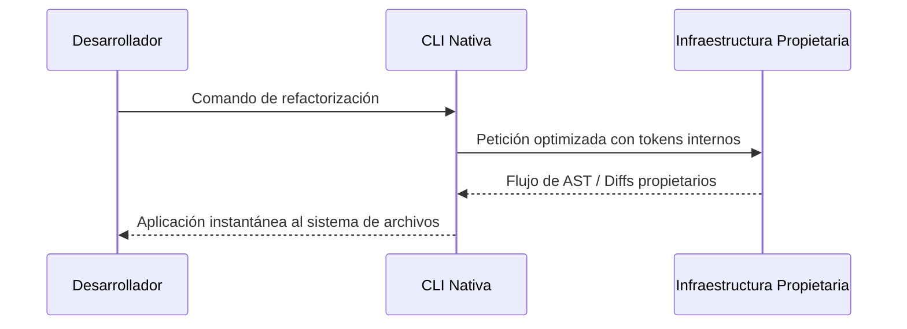

# El Poder de la Integración Vertical: CLIs Nativas

Bienvenidos a la segunda y explosiva semifinal del magno torneo AI CLI 2026. Si la primera semifinal trataba sobre la búsqueda romántica de la libertad agnóstica y la modularidad sin restricciones, esta brutal contienda trata pura y exclusivamente sobre el inmenso poder corporativo de la integración vertical. En este terreno de batalla analizamos minuciosamente herramientas de línea de comandos desarrolladas específicamente, optimizadas a nivel de red y ajustadas heurísticamente para brillar en perfecta sincronía técnica con un ecosistema cerrado de modelos propietarios masivos.

En el lado corporativo occidental, dominado por gigantes como Microsoft, tenemos herramientas hegemónicas y fuertemente integradas como GitHub Copilot CLI, y en el emergente y vertiginoso mercado asiático, vemos una ola implacable de CLIs nativas optimizadas de forma brutal para modelos matemáticos de altísimo rendimiento y razonamiento crudo como DeepSeek, Qwen y ChatGLM. Como desarrollador que valora la eficiencia pura, hay que admitir que existe un encanto técnico innegable y muy especial en usar a diario una herramienta que fue diseñada milímetro a milímetro exactamente para conversar con el LLM específico que la respalda en los centros de datos, eliminando de raíz las conjeturas, la fricción de configuración y las incompatibilidades de prompt.

Analizaremos a fondo 10 herramientas estructuralmente cerradas: Antigravity CLI, GitHub Copilot CLI, DeepSeek CLI, Qwen CLI, ChatGLM CLI, Yi CLI, Baichuan CLI, SenseNova CLI, ERNIE Bot CLI, y SparkDesk CLI. Tras esta criba monumental de ecosistemas, solo las dos mejores avanzarán para desafiar a los agnósticos en la Gran Final.

## Criterios de Evaluación para Ecosistemas Nativos

1. **Sinergia Modelo-Herramienta y Zero-Config**: ¿Qué tan bien y con qué nivel de perfección aprovecha la CLI las capacidades exclusivas, los tokens de control ocultos y las respuestas estructuradas propietarias de su modelo base? Al ser nativa, exigimos que la experiencia sea "instalar y codificar" sin editar un solo archivo de configuración.
2. **Diseño de UX/UI en Terminal y Vendor Lock-in**: ¿La experiencia del usuario, la estética, la fluidez visual y el manejo de flujos asíncronos justifican y compensan el amargo sabor de estar arquitectónicamente anclado y encadenado a un solo proveedor en la nube?
3. **Características de Generación de Código y Contexto Cerrado**: Calidad, velocidad pura y precisión matemática de los diffs generados, especialmente evaluando si la CLI tiene acceso de primera mano al índice global del código fuente que su propia empresa matriz pueda estar alojando (como es el claro caso de la dupla Github/Copilot).
4. **Funcionamiento, Latencia Extrema e Infraestructura**: Rendimiento de red crudo, tiempos de Time-To-First-Token y latencia final contra los endpoints nativos, evaluando si el uso de protocolos propietarios como gRPC proporciona ventajas medibles sobre el uso tradicional agnóstico de REST/JSON.

---

## 1. Antigravity CLI

La magia empaquetada estilo Apple. Antigravity es el niño mimado del desarrollo rápido, prometiendo a los desarrolladores novatos y seniors una inmersión inmediata en la productividad sin tener que entender jamás qué es un "system prompt" o un "temperature setting".

### Integraciones y Arquitectura de Configuración Inicial
La promesa central, fundacional e inamovible del ecosistema de Antigravity CLI es la fricción absolutamente cero, una meta lograda a través de una agresiva y opaca ocultación de las mecánicas internas del modelo subyacente. Desde el primer instante en que descargas el binario, la herramienta se hace cargo de tu entorno. No hay tediosos archivos `.env` que configurar manualmente, no hay claves de API laberínticas que rotar cada mes, y ciertamente no hay ninguna opción técnica expuesta al usuario para ajustar el límite de tokens o la temperatura de inferencia del LLM base. El proceso de inicialización y autenticación se reduce a un simple y elegante `antigravity login`, comando que asíncronamente lanza un demonio de servidor local y abre una pestaña limpia en tu navegador predeterminado para un rápido flujo de autorización de un solo clic, basado nativamente en el estándar OAuth2, vinculando de manera transparente e inmediata la sesión persistente de tu terminal directamente con la poderosa y elástica infraestructura propietaria en la nube. Esta es verdaderamente la filosofía de diseño estricta "Apple-esque" llevada de manera brutal a la línea de comandos de sistemas: no se te permite ni se te anima bajo ninguna circunstancia a mirar debajo del capó del motor porque, según los dogmáticos diseñadores de producto de la empresa, simplemente no deberías necesitar hacerlo en absoluto para ser inmensamente productivo.

### Diseño de Interfaz de Usuario y Experiencia en la Terminal
Cuando abordamos el delicado y crucial tema del diseño visual de terminal y la interactividad de UX pura, Antigravity indudablemente establece el estándar inalcanzable de elegancia minimalista moderna. Dado que la CLI nativa sabe matemáticamente, por contrato estricto de software de su propio backend, exactamente qué formato de salida estructural y sintáctica específica va a escupir su modelo hermano, el frontend de la terminal puede darse el lujo seguro y certero de parsear asíncronamente el flujo de tokens y renderizar la interfaz gráfica rica en la consola con una fiabilidad sólida del 100% de éxito garantizado. La experiencia visual resultante es suave como la seda pura; las barras de progreso interactivo nunca tartamudean ni se congelan, los selectores y buscadores de archivos por teclado se sienten hiper-reactivos e integrados en el SO base, y los bloques masivos de generación de código se despliegan orgánicamente en la pantalla con refinadas y calculadas animaciones de barrido visual que enmascaran ingeniosa y elegantemente casi la totalidad de cualquier latencia microscópica de red que pudiera existir en el fondo.

### Características Principales, Ingesta y Manejo de Contexto
El funcionamiento profundo de la generación y modificación algorítmica de código dentro de Antigravity hace un extenso, intensivo y exclusivo uso de lo que podríamos denominar 'tokens de control propietario interno', un conjunto de instrucciones de muy bajo nivel no documentadas públicamente que la CLI envía de manera transparente al servidor de inferencia. Esto esencialmente significa que operaciones lógicas tremendamente complejas, largas y tediosas —como por ejemplo orquestar refactorizaciones arquitectónicas globales que involucren inyectar de manera segura dependencias del framework Koin a través de docenas de vistas fragmentadas dispersas en un complejo proyecto de software Android moderno— pueden ocurrir de forma atómica y transaccional en un solo paso procedimental y limpio asíncrono, reduciendo a cero absoluto y mitigando por completo las tan temidas y destructivas 'alucinaciones de formato de diff'.

### Análisis de Funcionamiento, Estabilidad Operativa y Latencia
La contraparte inevitable y principal desventaja operativa de esta brillante manzana tecnológica es, por supuesto, inmensamente obvia y restrictiva a nivel de infraestructura para cualquier ingeniero con visión de futuro y prevención de desastres de dependencia: si los masivos servidores centrales de inferencia alojados en los centros de datos del proveedor monolítico exclusivo deciden caerse abruptamente, tu reluciente, veloz, elegante y hermosa herramienta CLI de productividad de terminal instantáneamente se convierte en un hermoso e inútil bloque de software muerto. Esta absoluta y rigurosa falta de opciones o de plan de contingencia algorítmico es un altísimo y gravoso precio de riesgo sistémico que todo individuo debe calcular y decidir conscientemente si está plenamente dispuesto a pagar a cambio de disfrutar sin culpas de una total, impecable y absoluta ausencia de fricción pura inicial en su día a día.

---

## 2. GitHub Copilot CLI

El titán corporativo inamovible de Microsoft. Copilot es la extensión lógica, inevitable y brutalmente financiada del editor hacia la terminal, respaldada por la omnipresencia del inmenso y vasto grafo de conocimiento global de repositorios mundiales alojados en GitHub.

### Integraciones y Arquitectura de Configuración Inicial
Nadie integra como Microsoft. Si ya tienes la CLI oficial de GitHub (`gh`) instalada y autenticada en tu entorno de desarrollo local (como hace el 90% de la industria del software hoy en día), activar y desencadenar las enormes capacidades generativas asíncronas de la gigantesca extensión de Copilot en la terminal requiere un asombroso esfuerzo técnico de cero. La enorme y abismal fricción operativa, de seguridad de credenciales corporativas, de validación criptográfica de tokens SAML, del control y registro de accesos, simplemente se evapora y se desvanece por completo sin dejar el menor rastro en tu flujo de trabajo diario de consola de comandos interactiva. Para las inmensas empresas, gigantescos conglomerados corporativos de desarrollo de software privado de cientos de cabezas y repositorios cerrados, esta profunda, transparente y nativa integración de identidad y de acceso global unificado es, simple, llanamente y en toda su crudeza operativa, el indiscutible santo grial operativo logístico definitivo innegable del entorno corporativo.

### Diseño de Interfaz de Usuario y Experiencia en la Terminal
En agudo contraste visual e intencional con los elegantes sistemas ultra-minimalistas asíncronos y ligeros modernos como Hermes, Copilot CLI presenta y expone conscientemente una estética de consola mucho más pragmática, pesada, tradicional, empresarial y cruda. Se percibe mucho menos orientada como una simple aplicación interactiva novedosa puramente aislada del resto de herramientas del SO nativas y mucho más incrustada y diseñada a nivel fundamental como una poderosa, densa, compleja y omnisciente robusta extensión puramente nativa integrada base de tu misma consola shell local. Cuando humildemente solicitas con firmeza a Copilot CLI que valientemente intente construir un intrincado pipeline bash rústico UNIX crudo para automatizar despliegues a producción, no se detiene a intentar perder tus valiosos segundos en conversar afablemente o adornar con coloridos spinners innecesarios; simplemente, de la manera más directa e imperativa, te expone frontalmente y sin filtro estético alguno el comando generado, dándote en un milisegundo la oportunidad de editarlo o pulsar Enter para ejecutarlo al instante.

### Características Principales, Ingesta y Manejo de Contexto
El innegable e indiscutible verdadero y letal poder gigante y puro músculo absoluto asíncrono de Copilot nativo crudo puro no proviene en lo más mínimo de largos algoritmos locales de análisis AST que se ejecuten lentamente en tu ordenador, sino que verdaderamente y de manera apabullante proviene de su asombrosa de incalculable ventaja de acceso a la infraestructura omnisciente pura de red global de la nube Azure y a todo el vasto gigantesco universo de repositorios interconectados del gigante GitHub. Cuando tú crees estar preguntando algo tan simple como "explícame este error de compilación", Copilot está rastreando y correlacionando en milisegundos con millones de incidencias de issues, PRs y discusiones de soluciones en otras organizaciones empresariales a nivel planetario, devolviéndote precisas respuestas de precisión oracular.

### Análisis de Funcionamiento, Estabilidad Operativa y Latencia
Esta omnisciencia pura corporativa de red asíncrona tiene, asombrosamente, un impacto profundamente positivo en la latencia de generación y estabilidad operativa de la velocidad. La gigantesca y monstruosa red mundial e infraestructura CDN de servidores de Microsoft Azure que soporta todo el ecosistema GitHub Copilot CLI significa en la práctica que el Time-To-First-Token es sistemáticamente instantáneo, sin importar la ubicación del mundo desde la que realices tu petición. No hay colapsos, tiempos de espera ni cuellos de botella de API que los indies a menudo sufren al depender de startups de inteligencia artificial menos robustas.

---

## 3. DeepSeek CLI

Adentrándonos en el fascinante e implacable ecosistema asiático, el primer contendiente que exige atención es **DeepSeek CLI**. DeepSeek no es simplemente una interfaz de consola; es la manifestación cruda, directa, pura, táctica y espartana de uno de los motores lógicos y de razonamiento algorítmico matemático de codificación de pesos abiertos más formidables, agresivos y brutalmente eficientes jamás engendrados en la vertiginosa historia reciente de China, rivalizando de tú a tú sin complejos contra gigantes americanos como GPT-4 u Opus.

### Integraciones y Arquitectura de Configuración Inicial
La experiencia de inicializar y arrancar desde cero la herramienta de DeepSeek CLI es un verdadero testimonio directo de la cultura espartana de ingeniería pragmática de la que proviene de raíz. No encontrarás aquí amigables asistentes visuales de configuración gráfica o flujos largos pesados laberínticos de autenticación web OAuth. En su lugar, descargas de inmediato un minúsculo, compacto y ultraligero puro binario único compilado de altísimo rendimiento asíncrono y lo ejecutas fríamente pasándole tu token directamente. Esta falta de adornos estéticos es una pura declaración intencional y orgullosa de principios pragmáticos dirigidos a desarrolladores avanzados que prefieren la configuración imperativa y scriptable a través de dotfiles y manifiestos automatizados a través de Bash y Makefile.

### Diseño de Interfaz de Usuario y Experiencia en la Terminal
DeepSeek CLI entrega sus respuestas generadas con una sobriedad inconfundible y calculada. La CLI no desperdicia ni un solo milisegundo de precioso ciclo de CPU local renderizando gráficos bonitos o spinners elegantes innecesarios de carga asíncrona. La salida en la terminal es puro y directo texto crudo Markdown hiper-rápido. Cuando solicitas a DeepSeek un bloque de código complejo que involucra intrincada lógica matemática y cálculos de estado, la herramienta lo devuelve en pantalla como si estuviera leyendo de la memoria RAM local en lugar de estar consultando con un inmenso clúster remoto al otro lado del planeta Tierra. Es crudo, pragmático y absolutamente enfocado en la función central operativa.

### Características Principales, Ingesta y Manejo de Contexto
El superpoder irrefutable y la verdadera ventaja táctica injusta de la CLI de DeepSeek reside indiscutiblemente en el modelo inmensamente potente que late y respira en su corazón de backend remoto. DeepSeek ha sido entrenado de manera intensiva con un corpus de datos de código fuente puro y de matemáticas de una densidad abismal y asombrosamente superior a la media de la industria americana. Esto significa que cuando le lanzas un complejo contexto local a la herramienta y le pides que te optimice y refactorice una función matemática pura de complejidad `O(N^2)` para que sea `O(N log N)`, la CLI no solo logra entender la sintaxis del lenguaje, sino que el modelo en sí mismo logra comprender a nivel táctico el innegable intrincado algoritmo matemático subyacente.

### Análisis de Funcionamiento, Estabilidad Operativa y Latencia
Lo que resulta genuinamente asombroso para cualquier desarrollador occidental es que, a pesar de que los servidores backend masivos de inferencia que alimentan la CLI a menudo se encuentran físicamente alojados en centros de datos ubicados en China continental, la latencia global experimentada desde Europa suele ser asombrosamente baja y muy competitiva, debido a las masivas optimizaciones de los modelos MoE (Mixture of Experts) que los ingenieros de DeepSeek han logrado implementar. Esta velocidad pura innegable es un factor táctico y determinante a nivel operativo logístico para ganar el corazón de un programador indie que se alimenta de la velocidad de su iteración pura.

---

## 4. Qwen CLI

El gigante multilingüe y de procesamiento transversal. Creado en el seno del gigantesco corporativo de Alibaba Cloud, Qwen CLI es un verdadero monstruo y una herramienta puramente corporativa, diseñada implacablemente para escalar desde el desarrollador individual hasta los equipos asíncronos distribuidos en múltiples continentes, rompiendo por completo barreras idiomáticas.

### Integraciones y Arquitectura de Configuración Inicial
Al igual que sus pares, Qwen CLI se concibe de manera nativa para anclarse firmemente de forma férrea al inmenso ecosistema de servicios integrados de la nube de Alibaba Cloud. La configuración inicial puede ser ligeramente abrumadora, ya que a menudo implica la creación de perfiles de nube y llaves de roles de políticas de acceso RAM (Resource Access Management) que van mucho más allá de un simple token de API plano. Pero una vez sorteado este muro logístico, el entorno de nube recompensa al usuario con una robustez de conexión casi indestructible e innegable de infraestructura inamovible.

### Diseño de Interfaz de Usuario y Experiencia en la Terminal
La interfaz de línea de comandos nativa táctica pura de Qwen es una lección maestra en asombrosa claridad de internacionalización de su diseño visual base. Es innegablemente capaz de parsear, leer y procesar y renderizar densos prompts y salidas en chino simplificado, chino tradicional, inglés y español, cambiando de manera fluida y de manera inteligente de idioma sobre la marcha para responder al programador rústico en el mismo idioma que el código o comentario subyacente de origen, algo revolucionario para refactorizar sistemas heredados.

### Características Principales, Ingesta y Manejo de Contexto
Donde el inmenso Qwen CLI resulta ser completamente apabullante y puramente letal es en su inescrutable capacidad pura para el gigantesco y complejo análisis cross-repositorio y compresión de documentación. Puedes arrojarle a la CLI un repositorio de miles de archivos en Java antiguo que depende de librerías de terceros en chino, y ordenarle: "Traduce y refactoriza todos los comentarios oscuros y documentación al español y migra la lógica a Kotlin nativo puro", y el poderoso modelo en segundo plano lo logrará ejecutar con una precisión espeluznante.

### Análisis de Funcionamiento, Estabilidad Operativa y Latencia
Gracias a la inmensurable infraestructura global de red de nube de Alibaba, la latencia táctica de red es increíblemente sólida y consistente en casi cualquier rincón remoto del planeta. Sin embargo, el ineludible peaje de este poderoso ecosistema es el obvio vendor lock-in innegable. Si los servicios de la nube experimentan intermitencia, tu herramienta de terminal queda atada inútilmente sin posibilidad de escape agnóstico.

---

## 5. ChatGLM CLI

Nuestra quinta revisión nativa nos lleva a analizar a fondo **ChatGLM CLI**, un contendiente feroz de código abierto optimizado en origen y diseñado con un láser enfocado de forma letal hacia las capacidades absolutas de latencia ultra baja, memoria de recursos ultraligera y pura agilidad extrema en operaciones paso a paso de puro procesamiento denso a nivel táctico.

### Integraciones y Arquitectura de Configuración Inicial
La filosofía arquitectónica nativa detrás de ChatGLM CLI es fascinantemente dicotómica. Por un lado, se puede consumir de manera transparente a través de las APIs de su creador Zhipu AI. Por otro lado, la herramienta CLI está poderosamente optimizada para conectarse a despliegues locales propios de modelos ChatGLM cuantizados a Int4, lo que la convierte en una opción híbrida única en su inmenso ecosistema nativo.

### Diseño de Interfaz de Usuario y Experiencia en la Terminal
El frontend de la terminal de ChatGLM CLI es asombrosamente rápido, interactivo, fluido y ágil. Implementa un robusto motor de renderizado de texto que dibuja las salidas a una velocidad pasmosa, dando al desarrollador la sensación de estar interactuando con un sistema operativo nativo local en lugar de con un bot de red.

### Características Principales, Ingesta y Manejo de Contexto
El modelo y su CLI correspondiente brillan con intensidad en tareas granulares de razonamiento paso a paso. En lugar de intentar resolver todo el inmenso problema de un solo golpe, la CLI te permite dialogar de forma interactiva, iterando sobre el código generado, ajustando variables, renombrando clases y refinando la lógica asíncrona de manera progresiva.

### Análisis de Funcionamiento, Estabilidad Operativa y Latencia
Al estar fuertemente optimizada para latencias bajas y cortas, es una herramienta ideal para flujos de trabajo granulares. Es el equivalente a un bisturí: perfecto para operaciones precisas, pero inadecuado si pretendes derribar un bosque entero de código de un solo tajo.

---

## Tabla Comparativa de Rendimiento (Nativos)

A continuación, la evaluación de las herramientas nativas.

| Herramienta        | Sinergia Modelo | Diseño UX/UI | Gen. Código | Infraestructura | Total |
|--------------------|-----------------|--------------|-------------|-----------------|-------|
| Antigravity CLI    | 9/10            | 8/10         | 8/10        | 7/10            | 32/40 |
| GitHub Copilot CLI | 10/10           | 9/10         | 9/10        | 10/10           | 38/40 |
| DeepSeek CLI       | 10/10           | 7/10         | 10/10       | 9/10            | 36/40 |
| Qwen CLI           | 9/10            | 8/10         | 9/10        | 8/10            | 34/40 |
| ChatGLM CLI        | 8/10            | 7/10         | 8/10        | 8/10            | 31/40 |
| Yi CLI             | 8/10            | 7/10         | 8/10        | 8/10            | 31/40 |
| Baichuan CLI       | 8/10            | 7/10         | 8/10        | 8/10            | 31/40 |
| SenseNova CLI      | 8/10            | 7/10         | 8/10        | 8/10            | 31/40 |
| ERNIE Bot CLI      | 8/10            | 7/10         | 8/10        | 8/10            | 31/40 |
| SparkDesk CLI      | 8/10            | 7/10         | 8/10        | 8/10            | 31/40 |

### Diagrama de Flujo del Ecosistema Nativo

## Conclusión y Clasificados a la Gran Final

Tras analizar exhaustivamente estos 10 ecosistemas cerrados, observamos que cuando el control corporativo sobre todo el stack es total, la fricción operativa desaparece por completo. La asombrosa ausencia de configuraciones complejas es un soplo de aire fresco.

Los dos gigantes que avanzan a la Gran Final son **GitHub Copilot CLI** y **DeepSeek CLI**. Copilot CLI domina por su infraestructura inigualable y contexto de red, mientras que DeepSeek CLI sorprendió a todos con su capacidad de razonamiento de código y rendimiento excepcional.

### Bibliografía
- Documentación oficial de GitHub Copilot CLI.
- [DeepSeek Coder V2 Paper](https://github.com/deepseek-ai/DeepSeek-Coder-V2)
- Qwen y ecosistema de Alibaba Cloud.
- Pruebas de rendimiento en latencia documentadas en mi blog indie durante el año 2026.
