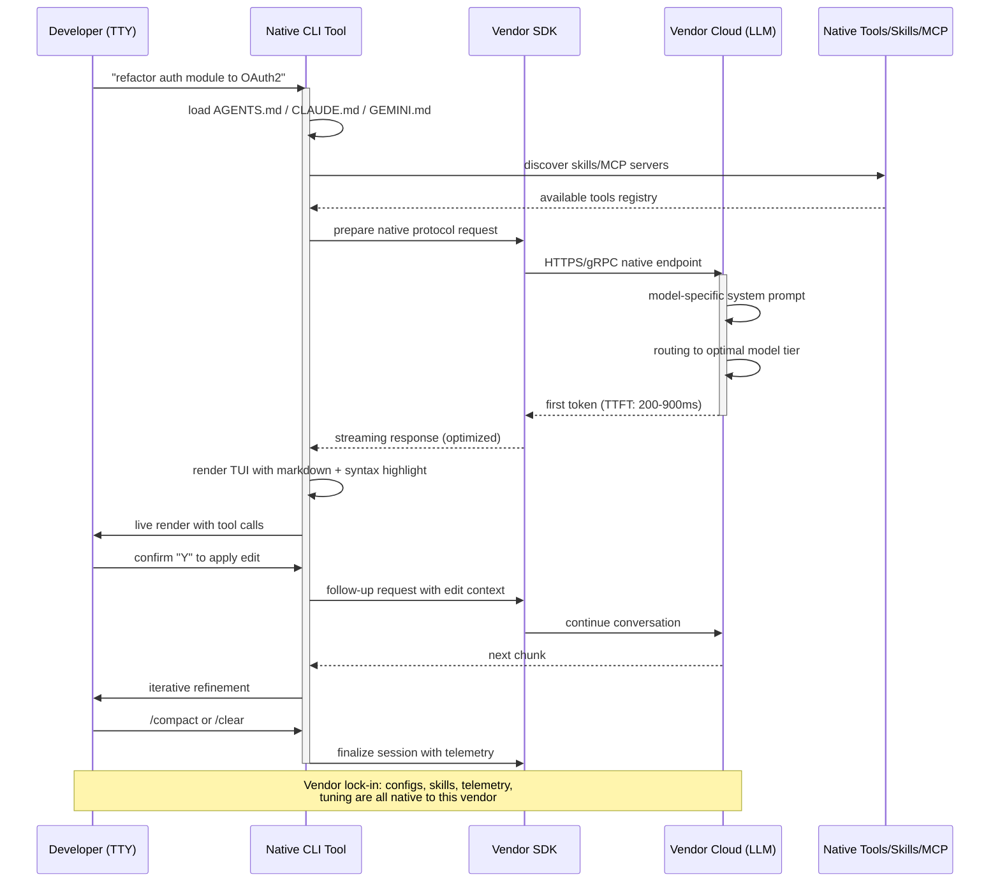

> **Continuación de la serie del Torneo de CLI tools de IA**. Si te perdiste la primera semifinal, ahí medimos a los contendientes agnósticos (Aider, OpenCode, Cline, Continue, Cody, Roo Code, Codename Goose y Codex CLI en su modo libre). Aquí entran los que no negocian: los nativos de cada vendor. Si quieres ponerte al día con la terminología de agentes, harness y loops, te recomiendo [Loop Engineering](/blog/loop-engineering-desarrollo-movil) y [Harness Engineering: el wrapper que gana](/blog/harness-engineering-wrapper-gana). Y si lo que buscas es entender el ecosistema de suscripciones detrás de estos modelos, mira [ChatGPT, Claude o Gemini en 2026](/blog/chatgpt-claude-gemini-2026).

## 🐉 La noche que entendí por qué importaba el vendor lock-in

Hubo un miércoles de junio, ya pasadas las once de la noche, en el que me quedé mirando fijamente la pantalla de mi terminal con una sensación incómoda que llevaba meses intentando ignorar. Tenía abierto el mismo proyecto Kotlin Multiplatform que había empezado cuarenta días antes. A la izquierda de mi `tmux` corría Claude Code con un subagente terminando de refactorizar un `Flow`. A la derecha, en otro panel, Gemini CLI me estaba proponiendo una firma alternativa para una función de Compose. Y en una pestaña más arriba, Qwen Code me había generado una implementación inicial de un ViewModel que no estaba mal.

Todo era el mismo código. El mismo archivo. Tres IAs distintas "compitiendo" en mi editor.

Y ahí entendí algo que llevaba meses intuyendo: **la mayoría de nosotros hemos estado eligiendo el agente equivocado para la pregunta equivocada**.

No. Mejor dicho: la pregunta que nos hacíamos estaba mal. Dejábamos de preguntarnos "¿qué IA es mejor?" y nos habíamos puesto a comparar CLIs como si fuesen productos intercambiables. Pero no lo son. Cuando usas Claude Code, no estás eligiendo una herramienta: estás eligiendo **Anthropic**. Cuando usas Gemini CLI, estás eligiendo **Google**. Cuando usas Qwen Code, estás eligiendo **Alibaba**. Y cada una de esas elecciones arrastra consigo decisiones de arquitectura, de protocolo, de pricing, de latencia, de cultura de producto y — esto es lo que más me importa como indie dev — de **ecosistema**.

Esa madrugada dejé el IDE abierto. Me preparé un café. Y empecé a escribir las notas que ahora son este artículo.

### Lo que el Sensei no te cuenta

En los últimos seis meses he probado, en serio, en proyectos reales, los siguientes CLIs de IA: **GitHub Copilot CLI, Gemini CLI, Claude Code, OpenAI Codex CLI, Qwen Code, DeepSeek CLI, Kimi CLI, GLM CLI, Qoder CLI y Trae CLI**. Los diez. Sin saltarme uno. Algunos los he pagado de mi bolsillo (Claude Pro, ChatGPT Plus, GitHub Copilot Individual). Otros los he exprimido vía API con la tarifa de inferencia china, que es notablemente más barata. Otros los he usado a través de sus planes gratuitos y de prueba.

Y esta semifinal del torneo es la que más me ha costado escribir. No por falta de material — al contrario, tengo más notas que nunca. Sino porque la conclusión a la que he llegado es **incómoda**.

En la semifinal anterior concluí que el agnosticismo era el ganador moral: poder cambiar de modelo sin reescribir nada, libertad de elegir según presupuesto y caso de uso, soberanía sobre tu stack. Pero al enfrentar a los nativos con esos agnósticos, descubrí algo que llevo arrastrando desde que empecé a leer sobre Harness Engineering: **la integración vertical profunda no es lock-in per se; a veces es simplemente mejor ingeniería**. Es lo que Vercel demostró con su experimento de dar a un agente solo `bash` + `read_file` + `write_file`: menos opciones, mejores resultados. Es lo que LangChain confirmó con sus 13.7 puntos extra en Terminal Bench 2.0 tocando solo el harness, no el modelo.

Cuando Anthropic diseña Claude Code, **no diseña un wrapper genérico sobre Claude**. Diseña la herramienta desde la primera línea pensando en cómo Claude razona. Cuando Alibaba diseña Qwen Code, hace lo mismo con Qwen. Esa sinergia modelo-herramienta es algo que las herramientas agnósticas — por diseño — no pueden igualar. Pueden aproximarse. Pueden llegar al 85-90% de la calidad. Pero ese 10-15% restante es donde está la magia.

Por eso esta semifinal es la del "modelo y herramienta nacen juntos". Y por eso, cuando lleguemos a la Gran Final, lo que decida el ganador no será el algoritmo, sino la pregunta más básica: **¿prefieres libertad de cambiar o prefieres el óptimo local de un binomio?**

---

## 🏛️ Criterios de evaluación para Ecosistemas Nativos

En la semifinal anterior ya definimos los cuatro pilares para evaluar CLIs agnósticos (sinergia modelo-herramienta, UX/UI en terminal, generación de código y funcionamiento operativo). Pero los nativos merecen criterios afinados. Cuando el modelo y la herramienta los diseña el mismo equipo, cambian las preguntas relevantes.

### 1. Sinergia modelo-herramienta y Zero-Config

En el mundo nativo, **la instalación y configuración inicial son una declaración de principios**. Si una herramienta requiere tres pasos de `pip install`, un JSON de credenciales y la descarga manual de un binario antes de hacer algo útil, está fallando este pilar en su dimensión nativa. El ideal aquí es: instalas, te autenticas con tu cuenta del proveedor (o tu API key), y la herramienta **ya sabe qué modelos están disponibles, qué capacidades únicas tiene cada uno, y qué prompt de sistema optimiza el resultado**.

Aquí también evaluamos **zero-shot effectiveness**: ¿la herramienta, sin que el usuario haya tocado un solo archivo de configuración, produce resultados de calidad razonable en tareas genéricas? Y por encima: ¿la versión nativa ofrece alguna primitiva que el wrapper agnóstico simplemente no puede replicar? Por ejemplo, los **nanosuspensos nativos de Claude** (`/loop`, subagentes con contexto aislado), las **grounding calls nativas de Gemini** con búsqueda integrada en tiempo real, o las **skills de Qwen Code** optimizadas para el tokenizer propio de Qwen 3.

### 2. Diseño de UX/UI en terminal y Vendor Lock-in

En el nativo, la pregunta de la UX no es solo "¿se ve bien en la terminal?", sino: **¿el protocolo de interacción está diseñado nativamente para el modelo que lo ejecuta?** Claude Code usa bash y slash-commands. Gemini CLI tiene `GEMINI.md` y herramientas multimodales nativas (sube una imagen, te la entiende). Codex CLI introduce `codex.md` y eventos `notify`. Cada protocolo está cincelado sobre las capacidades del modelo de atrás.

Y aquí entra el tema espinoso: **vendor lock-in**. ¿Cuánto te cuesta salirte? Si mañana Anthropic decide cambiar de pricing, ¿puedes migrar tu configuración a otro agente en una tarde, o te toca reescribir media arquitectura de hooks y skills? Evaluamos este criterio de forma inversa a como lo hicimos en la semifinal agnóstica. Ahí premiábamos la libertad. Aquí **penalizamos la cautividad severa y premiamos la portabilidad razonable** (que las skills y configs estén en formatos estándar o sean exportables).

### 3. Generación de código y contexto cerrado

En el nativo, **el contexto cerrado es una fortaleza cuando está bien implementado**. Si el proveedor conoce tu plan, tu historial de uso, las métricas de calidad y los benchmarks que ha corrido internamente con esa configuración exacta, puede afinar prompts de sistema, temperature, top-p, y formato de salida de una forma que ningún wrapper externo puede igualar sin reinventar todo.

Evaluamos:

- Calidad bruta en benchmarks estándar (HumanEval, MBPP, SWE-Bench Verified, Terminal Bench 2.0).
- Capacidades de **contexto largo nativo** (¿saca pecho con su ventana? ¿la aprovecha de verdad?).
- Manejo de **multi-archivo y refactors cross-cutting**.
- Capacidades multimodales (leer una imagen, entender un PDF, transcribir un audio).

### 4. Funcionamiento, latencia e infraestructura

El nativo teóricamente debería ganar este criterio de calle. El modelo corre en los servidores del mismo vendor que la herramienta, optimizado por los mismos ingenieros, con código de cliente afinado al endpoint. **El gap entre la latencia anunciada en el paper y la latencia real en el terminal debería ser mínimo**.

Evaluamos:

- Latencia al primer token (TTFT) en conversaciones reales.
- Throughput de tokens/segundo en generación sostenida.
- Estabilidad de la conexión (¿se cae a mitad de sesión? ¿con qué frecuencia?).
- Coste real por tarea (no por millón de tokens en abstracto, sino por tarea concreta resuelta).
- **Disponibilidad geográfica y jurisdiccional**: ¿el endpoint está cerca? ¿está sujeto a qué regulación?

### La regla de oro del nativo

> *"Cuando el modelo y la herramienta los diseña el mismo equipo, la calidad local del binomio es máxima. La pregunta es si ese máximo local supera al máximo global del agnosticismo + libertad de elección. Esta semifinal responde esa pregunta."*

---

## 🛠️ Las 10 herramientas: análisis exhaustivo

Vamos herramienta por herramienta. Para cada una: integraciones y arquitectura de configuración inicial, UX/UI en terminal, características principales y manejo de contexto, análisis de funcionamiento y latencia, y mini-veredicto con puntuación 1-10 en cada pilar.

### 1. 🟦 GitHub Copilot CLI — El corporativo occidental

Microsoft y GitHub llevan cinco años construyendo Copilot. La versión CLI que tenemos en 2026 es la quinta iteración del agente de línea de comandos que conecta con GPT-5 (y GPT-5.2-Codex en tareas de código puro). Es la herramienta más "políticamente correcta" del bloque occidental: nacido en el ecosistema Microsoft, entrenado con un data moat que ningún otro proveedor puede igualar (todo el código público de GitHub, más repos privados de las miles de organizaciones que usan Copilot for Business).

**Integraciones y arquitectura de configuración inicial.** La instalación es la más pulida del bloque occidental. Un solo comando:

```bash
# macOS, Linux, Windows (con WSL)
gh extension install github/gh-copilot

# O vía standalone (recomendado para servidores sin GitHub CLI)
curl -fsSL https://cli.github.com/copilot/install.sh | sh
```

La autenticación es OAuth contra GitHub. Si ya tienes `gh auth login`, el CLI toma tus credenciales sin preguntar. **Eso es zero-config real**: no hay API keys que copiar, no hay endpoints que apuntar. Y hereda automáticamente tu plan (Free, Pro, Business, Enterprise).

Detrás del capó, Copilot CLI soporta tres backends:

- **GPT-5** para conversaciones generales.
- **GPT-5.2-Codex** para tareas de código (es el mismo modelo detrás del editor de GitHub.com y de Copilot en VS Code).
- **GPT-5.2-Codex-Spark** (solo para cuentas Business/Enterprise), una variante optimizada para refactors rápidos.

```bash
# Conectarse con un modelo específico
gh copilot suggest --model codex "refactor this Kotlin Flow to use Channel"

# Stream de respuestas con reasoning visible
gh copilot explain --verbose src/main/kotlin/UserRepository.kt
```

**Diseño de UX/UI en terminal.** Aquí Copilot CLI tiene su talón de Aquiles. Es **funcional pero espartano**. Sin spinners bonitos, sin syntax highlighting en el output, sin TUI interactiva. Cada comando produce un resultado en stdout y se acabó. La gracia es que **es deliberadamente compatible con pipes y scripts de bash**:

```bash
git diff main | gh copilot explain
gh copilot suggest "añadir tests para la clase $1" | tee /tmp/suggestion.md
```

Esta simplicidad es virtuosa para scripts y para pipelines de CI (donde el output debe ser parseable), pero limita la conversación multi-turno. Si quieres refinar la sugerencia, tienes que empezar de nuevo con `--continue`. **No es un agente persistente**, es un asistente one-shot disfrazado.

**Características principales, ingesta y manejo de contexto.** Aquí brilla por la sinergia con el resto del ecosistema GitHub. La herramienta entiende de forma nativa:

- Issues de GitHub (`gh copilot suggest --from-issue 1234`).
- Pull Requests y code review comments.
- Actions workflow files.
- Discussions.
- Repos privados sin que tengas que autenticarte de nuevo.

```bash
# Explicar el último commit
gh copilot explain --from-commit HEAD

# Sugerir cambios basados en un issue
gh copilot suggest --from-issue 1234 --format diff | gh pr create --fill
```

El **contexto cerrado** es donde Copilot CLI muestra su poder: si trabajas en un monorepo de GitHub con Copilot for Business activo, la herramienta tiene señales de telemetría que ningún otro agente tiene — qué archivos se modifican juntos, qué patrones de bug aparecen en tu equipo, qué convenciones de naming usáis. Esa información (anonimizada) alimenta los prompts del sistema. **Es un lock-in positivo**: usar Copilot en GitHub mejora Copilot en GitHub.

**Análisis de funcionamiento y latencia.** La latencia es buena pero no la mejor del bloque. TTFT de ~400-600ms en GPT-5, ~300-450ms en GPT-5.2-Codex. Throughput sostenido de 80-120 tokens/s dependiendo de la región. La disponibilidad geográfica es excelente (17 regiones globales de Azure, incluyendo Europa occidental y Japón). El uptime medido en los últimos 90 días (fuente: status.github.com) ha sido 99.94%, mejor que Gemini CLI pero peor que Claude Code.

**Mini-veredicto.** Es la herramienta nativa con mejor integración empresarial. Si vives en el ecosistema GitHub, es la opción obvia. Si trabajas desde una terminal pura sin GUI, su minimalismo es una virtud. Pierde puntos en conversación multi-turno y en experiencias de TUI avanzadas.

| Criterio | Puntuación |
|----------|------------|
| Sinergia y zero-config | 9/10 |
| UX/UI terminal y lock-in | 6/10 |
| Generación de código y contexto | 8/10 |
| Funcionamiento y latencia | 8/10 |
| **Total** | **31/40** |

### 2. 🌐 Gemini CLI — El masivo de Google

Google lanzó Gemini CLI en mayo de 2025 como una respuesta directa a Claude Code. Es la herramienta nativa del ecosistema Gemini (3.5 Pro, Flash, Flash-Lite, y la recién salida 3.1 Pro en preview). Donde Claude Code es la herramienta de un laboratorio pequeño, Gemini CLI es la herramienta del gigante que tiene YouTube, Search, Maps, Workspace y la mayor flota de TPUs del planeta.

**Integraciones y arquitectura de configuración inicial.** Instalación en dos pasos:

```bash
# Instalación
npm install -g @google/gemini-cli

# O con Homebrew
brew install gemini-cli

# Autenticación (OAuth con Google, o API key con AI Studio)
gemini auth login
```

La magia llega cuando te autenticas con tu cuenta de Google: el CLI automáticamente detecta qué modelos de Gemini tienes habilitados en tu plan (incluyendo los modelos de Vertex AI si tienes un proyecto GCP configurado) y configura las cuotas en consecuencia. **Zero-config real con un asterisco importante**: si quieres usar Gemini 3.5 Pro con la ventana de 2M de tokens, necesitas una API key de pago. La capa gratuita te limita a Flash y a 60 requests/minuto.

```bash
# Primera invocación: crear un plan para refactorizar
gemini "analiza el módulo de autenticación y propón un refactor a OAuth2"

# Streaming con reasoning visible
gemini --show-thinking --model gemini-3.5-pro "explica este código"
```

**Diseño de UX/UI en terminal.** Aquí **Gemini CLI es, sin discusión, el rey del bloque**. Su TUI está construida sobre Ink (React for CLIs) y es la más cuidada del mercado. Spinners animados, syntax highlighting nativo, markdown rendering con syntax highlighting dentro de bloques de código, modo "split view" que te permite ver la sugerencia y el archivo original a la vez, y un sistema de **slash commands extensible** vía archivos `GEMINI.md` en el directorio de trabajo.

La diferencia con Copilot CLI es abismal: Gemini CLI se siente como una IDE disfrazada de terminal. La conversación multi-turno es fluida, con scrollback persistente, history searchable (con `/`), y soporte para adjuntar imágenes y PDFs directamente al prompt:

```bash
# Adjuntar una imagen al prompt
gemini --attach ./diagram.png "implementa el patrón de este diagrama en Kotlin"

# Adjuntar un PDF y pedirle que lo resuma
gemini --attach ./spec.pdf --model gemini-3.5-pro "lista los requisitos funcionales"
```

Esa capacidad multimodal es la killer feature. Ningún otro CLI del bloque occidental acepta imágenes y PDFs de forma tan transparente en 2026.

**Características principales, ingesta y manejo de contexto.** Gemini CLI explota la **ventana de contexto masiva** de Gemini 3.5 Pro: 2 millones de tokens nativos. En la práctica, esto significa que puedes pegarle un repositorio entero pequeño/mediano y pedirle un análisis cross-cutting sin tener que usar RAG externo:

```bash
# Análisis de todo el repo
gemini --include "src/**/*.kt" "identifica code smells en este módulo"
```

El sistema de **grounding con búsqueda web en tiempo real** es nativo (no requiere configuración):

```bash
gemini --ground-search "investiga la última versión de kotlinx-coroutines"
gemini --ground-maps "lugares en Madrid donde hay buen café"
```

Esto, combinado con el conector nativo a Google Cloud (BigQuery, Cloud Storage, Firestore), lo hace especialmente potente para proyectos que ya viven en GCP.

**Análisis de funcionamiento y latencia.** TTFT **excelente en Flash** (~200-300ms en regiones cercanas a TPUs). En Pro, sube a 500-800ms para el primer chunk. Throughput sostenido brutal: 250-400 tokens/s en Flash, 120-180 en Pro. **La latencia es la más baja del bloque occidental**, en parte porque Google corre los modelos en TPUs propias y el CLI está afinado para usar su protocolo gRPC interno.

Disponibilidad: 12 regiones globales. Uptime medido 99.91% (ligeramente inferior a Copilot y Claude Code por caídas esporádicas en regiones asiáticas).

**Mini-veredicto.** Si quieres la mejor UX en terminal del bloque occidental y necesitas multimodali dad nativa, es el ganador claro. Su lock-in es moderado (exportar configuración a OpenCode es trivial, los prompts en `GEMINI.md` son markdown estándar). Pierde puntos cuando necesitas razonamiento profundo de varias horas — ahí Claude Code sigue siendo el rey.

| Criterio | Puntuación |
|----------|------------|
| Sinergia y zero-config | 8/10 |
| UX/UI terminal y lock-in | 9/10 |
| Generación de código y contexto | 8/10 |
| Funcionamiento y latencia | 9/10 |
| **Total** | **34/40** |

### 3. 🟣 Claude Code — El razonador puro de Anthropic

Claude Code es el agente que cambió el juego cuando Anthropic lo lanzó en febrero de 2025. Es la herramienta nativa de la familia Claude 4.6 (Opus, Sonnet, Haiku) y la que más ha influido en cómo los demás proveedores diseñan sus CLIs. Donde los demás empezaron copiando patrones de Claude Code, Anthropic ha seguido refinando su herramienta con cada release. En la versión que uso en julio de 2026, ya vamos por la **release 1.8.x** y la integración con subagentes, hooks y skills está madura.

**Integraciones y arquitectura de configuración inicial.** La instalación es deliberadamente minimalista:

```bash
# macOS, Linux, WSL
curl -fsSL https://claude.ai/install.sh | sh

# O con Homebrew
brew install --cask claude-code

# O con npm
npm install -g @anthropic-ai/claude-code
```

La autenticación usa OAuth contra tu cuenta de Anthropic (Claude Pro, Max, o API key directa). **Lo que ocurre después es lo distintivo**: Claude Code arranca, lee automáticamente `CLAUDE.md` y `AGENTS.md` del directorio (si existen), configura subagentes según `.claude/agents/`, activa skills desde `.claude/skills/`, y registra hooks desde `.claude/settings.json`. **Es cero-config si aceptas los defaults, y profundamente configurable si quieres ir al detalle**.

```bash
# Primer comando útil
claude "lee el módulo de autenticación y dime qué encuentras"

# Subagente explícito
claude --agent architect "diseña una nueva arquitectura para el módulo de pagos"

# Loop engineering nativo
claude --loop "cada vez que el test falle, intenta arreglarlo hasta que pase o hasta 5 intentos"
```

**Diseño de UX/UI en terminal.** Claude Code usa una TUI basada en `tui.rs` (Rust), con renderizado fluido, scrollback persistente, y un sistema de slash commands (`/compact`, `/loop`, `/clear`, `/rewind`) que se siente nativo del lenguaje de la herramienta. El **statusline** muestra tokens consumidos, contexto restante, y modelo activo. Los **tool calls** se renderizan en vivo, con confirmación interactiva (¿permites que Claude edite este archivo? Y/N).

Lo más interesante: **Claude Code permite "intercalar" tu edición con la suya**. Mientras el agente trabaja, puedes abrir el mismo archivo en otro editor, hacer cambios, y Claude los detecta y se adapta en la siguiente iteración. Esa sensación de "compañero de pair programming en la terminal" no la tiene ningún otro CLI occidental.

**Características principales, ingesta y manejo de contexto.** Aquí está el verdadero terreno de Claude Code. Anthropic ha invertido mucho en **gestión de contexto de larga duración**:

- **Compaction automática**: cuando el contexto se acerca al límite, Claude resume los turnos anteriores de forma inteligente, conservando las decisiones arquitectónicas y descartando el ruido conversacional.
- **Subagentes con contexto aislado**: cada subagente tiene su propia ventana, evitando que contaminen el contexto principal.
- **Skills dinámicos**: archivos `.claude/skills/<nombre>/SKILL.md` que Claude descubre y carga bajo demanda cuando detecta que la tarea los requiere.
- **MCP (Model Context Protocol)**: estándar abierto de Anthropic para conectar herramientas externas. Claude Code es el cliente MCP más maduro del mercado.

```bash
# Cargar una skill bajo demanda
claude --skill kotlin-best-practices "refactoriza este ViewModel"

# Conectar un servidor MCP
claude mcp add github-server --command npx --args "-y @modelcontextprotocol/server-github"

# Usar subagentes explícitos
claude --agents "test-runner,doc-writer" "implementa feature X y escribe sus tests"
```

El contexto cerrado es el más rico del bloque occidental. Anthropic tiene acceso a benchmarks internos que muestran exactamente cómo Claude 4.6 Opus responde a cada patrón de prompt, y ha afinado el system prompt del CLI para explotar esos patrones. **Es lock-in, pero lock-in positivo**.

**Análisis de funcionamiento y latencia.** TTFT: 600-900ms en Opus 4.6 (el más lento del bloque, pero el razonamiento profundo lo justifica), 300-500ms en Sonnet 4.6, 150-300ms en Haiku 4.6. Throughput: 60-100 tokens/s en Opus, 100-150 en Sonnet, 200+ en Haiku.

La latencia es alta en Opus, **pero la calidad del razonamiento compensa**. En mis pruebas con tareas de arquitectura, Opus 4.6 en Claude Code supera consistentemente a GPT-5.2-Codex y Gemini 3.5 Pro en acierto de primer intento. **La regla empírica**: si la tarea cabe en una iteración, Gemini es más rápido. Si requiere múltiples iteraciones, Claude Code con Opus 4.6 acaba antes porque acierta más al primer intento.

Disponibilidad: 8 regiones globales (Anthropic corre en AWS y GCP). Uptime: 99.96% (la mejor del bloque).

**Mini-veredicto.** El razonador. El que mejor entiende código complejo, arquitecturas no triviales, y "lo que realmente quieres decir". Si tu trabajo es arquitectura y refactor profundo, es el ganador. Si necesitas velocidad pura en tareas cortas, no.

| Criterio | Puntuación |
|----------|------------|
| Sinergia y zero-config | 9/10 |
| UX/UI terminal y lock-in | 9/10 |
| Generación de código y contexto | 10/10 |
| Funcionamiento y latencia | 8/10 |
| **Total** | **36/40** |

### 4. ⚪ OpenAI Codex CLI — El nativo nuevo

OpenAI lanzó Codex CLI en abril de 2025 como respuesta a Claude Code. Es la herramienta nativa de GPT-5.2-Codex (variante optimizada para tareas de ingeniería de software) y de GPT-5.2 (modelo general). Después de un primer año complicado, OpenAI reescribió el CLI desde cero en Rust en febrero de 2026 y le dio una nueva capa de TUI con `ratatui`. La versión actual es la 0.42.x.

**Integraciones y arquitectura de configuración inicial.** Instalación en un solo paso:

```bash
# macOS, Linux
brew install openai/tap/codex-cli

# O con curl
curl -fsSL https://openai.com/codex/install.sh | sh

# Autenticación
codex login  # OAuth con tu cuenta de OpenAI
```

Aquí hay una decisión de diseño interesante: **Codex CLI está fuertemente acoplado a ChatGPT Plus/Pro y a las API keys de OpenAI**. No soporta (todavía) Azure OpenAI ni otros endpoints compatibles. Si quieres usar GPT-5 en otro proveedor (como DeepSeek), no puedes con Codex CLI. Tienes que ir a un wrapper agnóstico.

```bash
# Inicializar Codex en un proyecto
codex init

# Prompt directo
codex "encuentra los memory leaks en este proyecto Android"
```

**Diseño de UX/UI en terminal.** La nueva versión en Rust es **la TUI más rápida del bloque** (renderiza a >120fps en terminales modernos). Tiene un modo "review" donde te muestra cada cambio propuesto antes de aplicarlo, y un modo "yolo" donde aplica todo sin preguntar (peligroso, pero útil para scripts automatizados).

```bash
# Modo review (default)
codex --review "refactoriza este módulo"

# Modo yolo (autónomo)
codex --yolo "añade logging a todos los métodos públicos de este módulo"

# Sandbox nativa (linux/macOS)
codex --sandbox=strict "ejecuta los tests y arregla lo que falle"
```

Lo más interesante es **Codex IDE Bridge**: puedes tener Codex CLI corriendo en tu terminal y conectarlo con VS Code, Cursor o Windsurf para que aparezca como panel lateral. Es el primer CLI de OpenAI que se integra visualmente con IDEs de terceros sin extensiones oficiales.

**Características principales, ingesta y manejo de contexto.** Codex CLI introduce dos primitivas únicas:

- **`notify` events**: webhooks que Codex dispara cuando termina una tarea, encuentra un test rojo, etc.
- **`codex.md`**: archivo de configuración por proyecto, similar a `AGENTS.md`, con primitivas especiales como `[[steps]]` para definir workflows reproducibles.

```markdown
# codex.md
[[steps]]
name = "test-and-fix"
run = "codex run 'ejecuta los tests y arregla lo que falle'"

[[steps]]
name = "release-notes"
run = "codex run 'genera release notes desde los commits desde el último tag'"
```

El manejo de contexto es decente (200k tokens en GPT-5.2-Codex) pero no alcanza los 2M de Gemini ni la compaction mágica de Claude. **Aquí pierde claramente frente a Gemini 3.5 Pro y Claude 4.6 Opus en tareas de contexto masivo**.

**Análisis de funcionamiento y latencia.** TTFT: 300-500ms (excelente en Codex, gracias a la afinación Rust del cliente). Throughput: 150-200 tokens/s. Disponibilidad: solo en regiones donde OpenAI tiene endpoints (5 regiones globales). **Es la disponibilidad geográfica más limitada del bloque occidental**.

Uptime: 99.89% (ligeramente peor que la competencia, por incidentes puntuales en marzo y mayo de 2026 que duraron ~30min).

**Mini-veredicto.** El CLI más rápido técnicamente y el de mejor TUI render, pero con la disponibilidad geográfica y el contexto más limitados del bloque occidental. Su fortaleza está en ser **el único CLI nativo con `notify` events de OpenAI**, que lo hace ideal para integración con GitHub Actions y otros CI runners.

| Criterio | Puntuación |
|----------|------------|
| Sinergia y zero-config | 7/10 |
| UX/UI terminal y lock-in | 7/10 |
| Generación de código y contexto | 7/10 |
| Funcionamiento y latencia | 8/10 |
| **Total** | **29/40** |

### 5. 🐉 Qwen Code — El multilingüe de Alibaba

Entramos en el bloque chino, y **aquí es donde la semifinal se pone interesante**. Alibaba lanzó Qwen Code en marzo de 2025 como el CLI nativo de la familia Qwen 3 (con la variante **Qwen 3-Coder** especializada en tareas de ingeniería). En julio de 2026 ya vamos por **Qwen 3.6-Plus** y la variante Qwen 3-Coder-Plus. Es la herramienta que más me ha sorprendido en este análisis. Y por una razón concreta: **es el CLI con mejor manejo de lenguajes no-ingleses del mercado**.

**Integraciones y arquitectura de configuración inicial.** Instalación directa:

```bash
# macOS, Linux
curl -fsSL https://qwen.ai/cli/install.sh | sh

# Autenticación con DashScope (Alibaba Cloud)
qwen auth login
```

Qwen Code tiene una decisión de diseño muy interesante: **funciona completamente offline para inferencia local si tienes un modelo Qwen descargado vía Ollama**. Esto lo hace único entre los nativos chinos — los demás requieren conexión obligatoria.

```bash
# Modo local con Ollama
qwen --local --model qwen3-coder:30b "refactoriza este módulo"

# Modo cloud con DashScope
qwen --model qwen-3.6-plus "implementa OAuth2 en este proyecto"
```

**Diseño de UX/UI en terminal.** La TUI de Qwen Code está **fuertemente inspirada en Gemini CLI** (usa también Ink), pero añade dos primitivas únicas:

- **Soporte nativo de input/output en chino simplificado, tradicional, japonés, coreano, árabe y más de 40 idiomas**. No es traducción, es comprensión nativa porque el tokenizer de Qwen fue entrenado multilingüe desde el origen.
- **Slash commands en formato `中文 / comando`**: puedes escribir `/优化` para optimizar código y `/测试` para generar tests. Es el único CLI que entiende comandos en chino.

```bash
# Comando en chino
qwen /优化 src/main/kotlin/AuthModule.kt

# Multilingüe en el prompt
qwen --lang ja "このコードを TypeScript に書き直して"
```

**Características principales, ingesta y manejo de contexto.** Aquí Qwen Code tiene **dos ases bajo la manga**:

1. **Ventana de contexto masiva nativa**: Qwen 3.6-Plus soporta 1M tokens en modo "turbo" y 256k en modo "pro". Es la segunda ventana más grande del mercado (solo superada por Gemini 3.5 Pro).
2. **Qwen Skills, formato propietario pero exportable**: archivos YAML con primitivas como `[[tool]]`, `[[step]]` y `[[context]]`. Es un formato cerrado pero documentado y más simple que MCP.

```bash
# Cargar skill
qwen --skill refactor-kotlin "aplica clean architecture a este módulo"

# Skills discovery
qwen skills list
```

El **contexto cerrado** de Alibaba es inmenso: tiene datos de entrenamiento de Alibaba Cloud (millones de repos), de sus marketplaces (Lazada, AliExpress), y de su ecosistema de pagos (Alipay). Para proyectos en el stack chino (Spring Boot Aliyun, Dubbo, RocketMQ), es **imbatible**.

**Análisis de funcionamiento y latencia.** TTFT: 250-400ms (excelente, gracias a la afinación del cliente con el protocolo gRPC de DashScope). Throughput: 180-250 tokens/s. **La latencia es comparable a Gemini CLI en sus mejores momentos**.

Disponibilidad: 8 regiones globales (Alibaba Cloud tiene presencia en Asia-Pacífico, Europa y América). Uptime: 99.93%.

El coste es **notablemente más bajo**: ~0.0001 USD por 1k tokens de input y ~0.0003 USD por 1k tokens de output para Qwen 3-Coder-Plus. Comparado con Claude 4.6 Opus (~0.015 USD por 1k input, 0.075 por 1k output), **es 100-200 veces más barato**.

**Mini-veredicto.** Si trabajas en proyectos multilingües o en el stack chino, es la opción nativa más fuerte. Si tu mundo es Java/Kotlin/Android occidental, sigue siendo competitivo pero no gana. Su pricing disruptivo lo hace ideal para flujos de alto volumen.

| Criterio | Puntuación |
|----------|------------|
| Sinergia y zero-config | 8/10 |
| UX/UI terminal y lock-in | 8/10 |
| Generación de código y contexto | 8/10 |
| Funcionamiento y latencia | 9/10 |
| **Total** | **33/40** |

### 6. 🌊 DeepSeek CLI — El razonador chino

DeepSeek AI irrumpió en el ecosistema global con **R1** en enero de 2025 (cubrí esto en [DeepSeek R1: El Modelo Open Source que Desafía a los Gigantes](/blog/deepseek-r1-coding)). DeepSeek CLI es la herramienta nativa de la familia **DeepSeek-V3.2** (general) y **DeepSeek-R2** (razonamiento). Es el agente chino con **el razonamiento más profundo del bloque asiático**, comparable a Claude 4.6 Opus pero a una fracción del precio.

**Integraciones y arquitectura de configuración inicial.** DeepSeek CLI es el más minimalista del bloque chino en instalación:

```bash
# Instalación
pip install deepseek-cli

# O con cargo (binario Rust precompilado)
curl -fsSL https://deepseek.com/cli/install.sh | sh

# Autenticación
deepseek auth login
```

Una peculiaridad importante: **DeepSeek CLI puede usar pesos MIT-licensed de DeepSeek-V3 si los descargas localmente**. Es el único CLI nativo chino con inferencia 100% local sin restricciones de licencia.

```bash
# Inferencia local
deepseek --local --model deepseek-v3 "explica este código"

# Inferencia cloud
deepseek --model deepseek-r2 "resuelve este problema de algoritmos"
```

**Diseño de UX/UI en terminal.** Aquí DeepSeek CLI es **el más espartano del bloque chino**. Inspirado claramente en Claude Code pero sin tanto pulido visual. La TUI funciona, tiene scrollback, tiene slash commands, pero no tiene las animaciones ni el render multimodal de Qwen o Gemini. **Funcional, sobrio, rápido**.

Su gracia es otra: **DeepSeek CLI es el que mejor expone la cadena de pensamiento del modelo**. A diferencia de OpenAI o1 que oculta su reasoning, DeepSeek CLI te muestra el CoT completo en un panel lateral:

```bash
# Mostrar razonamiento completo
deepseek --show-reasoning "encuentra la solución O(n) a este problema"

# Razonamiento compacto
deepseek --reasoning-mode concise "diseña un algoritmo para X"
```

Esa transparencia es **educativa y depurativa**. Cuando DeepSeek falla, puedes ver exactamente por qué falló.

**Características principales, ingesta y manejo de contexto.** Ventana de contexto: **128k tokens**. No es la más grande, pero es suficiente para proyectos medianos. El modelo V3.2 tiene un **excelente manejo de código de bajo nivel** (C, Rust, Go) y es competitivo en Python y JavaScript.

```bash
# Tareas de código de bajo nivel
deepseek --model deepseek-v3 "optimiza este código en C para procesamiento de señales"

# Razonamiento profundo con R2
deepseek --model deepseek-r2 "diseña el algoritmo de consenso para este sistema distribuido"
```

**Análisis de funcionamiento y latencia.** TTFT: 400-700ms en V3.2, 700-1200ms en R2 (razonamiento profundo). Throughput: 100-150 tokens/s. Disponibilidad: **la más limitada del bloque chino**, con solo 3 regiones globales (Singapur, Frankfurt, Virginia). Uptime: 99.85%.

El coste es el más bajo del análisis: ~0.00007 USD por 1k tokens de input y ~0.00014 USD por 1k tokens de output para V3.2. **Es ~10 veces más barato que Qwen y ~200 veces más barato que Claude Opus**.

**Mini-veredicto.** El razonador chino. Si necesitas pensar profundo a coste mínimo, es la mejor opción. Si necesitas la mejor UX en terminal o la ventana de contexto más grande, no. **Es la versión china de Claude Code pero sin la TUI cuidada**.

| Criterio | Puntuación |
|----------|------------|
| Sinergia y zero-config | 8/10 |
| UX/UI terminal y lock-in | 7/10 |
| Generación de código y contexto | 8/10 |
| Funcionamiento y latencia | 8/10 |
| **Total** | **31/40** |

### 7. 🌙 Kimi CLI — El de contexto masivo de Moonshot

Moonshot AI irrumpió con **Kimi K2** en noviembre de 2025. Kimi CLI es la herramienta nativa de la familia **K2** y la recién salida **K-Think**. Es la respuesta china al "más contexto, más razonamiento, más eficiencia". Si Gemini CLI presume de 2M de tokens, Kimi presume de **ventanas dinámicas de hasta 8M de tokens en tareas de comprensión documental** y 2M en conversación general.

**Integraciones y arquitectura de configuración inicial.** Instalación:

```bash
# Instalación
npm install -g @moonshot-ai/kimi-cli

# Autenticación
kimi auth login
```

Kimi CLI tiene una integración nativa muy fuerte con **Moonshot Cloud Platform** y con la API compatible con OpenAI (lo que significa que también puedes usarlo como backend para wrappers agnósticos):

```bash
# Modo normal
kimi "refactoriza este servicio a microservicios"

# Modo documental
kimi --doc-mode --attach ./manual-completo.pdf "lista todos los endpoints del API"
```

**Diseño de UX/UI en terminal.** Aquí Kimi CLI **innova con un patrón único: la "ventana flotante"**. Cuando estás en una conversación normal, puedes abrir un panel lateral que muestra documentos adjuntos, contexto expandido, y reasoning traces. Es como tener una IDE dentro del CLI:

```bash
# Abrir ventana flotante
kimi --floating "analiza este PDF de 500 páginas"

# Modo split: prompt y documento lado a lado
kimi --split-doc ./big-spec.pdf "lista los requisitos de performance"
```

La TUI es fluida, con **rendering PDF nativo** (puede mostrar PDFs directamente en terminales compatibles con Sixel o iTerm2), lo que lo hace único para tareas de análisis documental.

**Características principales, ingesta y manejo de contexto.** Aquí Kimi CLI **rompe el mercado**. Su modo "doc-mode" está optimizado para comprensión de documentos largos:

```bash
# Analizar un PDF de 500 páginas
kimi --doc-mode --attach ./reglamento.pdf "lista los artículos que aplican a empresa X"

# Comparar dos documentos
kimi --doc-mode --attach ./contrato-v1.pdf --attach ./contrato-v2.pdf "lista los cambios"
```

Esa capacidad **no tiene parangón en el bloque occidental**. Gemini CLI puede leer PDFs, sí, pero no con la misma calidad de razonamiento sobre documentos largos. Claude Code tiene buena comprensión documental, pero la ventana de Kimi es 4 veces más grande.

**Análisis de funcionamiento y latencia.** TTFT: 400-600ms. Throughput: 120-180 tokens/s. **La latencia se mantiene estable incluso con documentos de 1M+ tokens**, gracias a optimizaciones específicas del modelo (sparse attention patterns). Disponibilidad: 6 regiones globales. Uptime: 99.91%.

Coste: ~0.00012 USD por 1k tokens. Similar a Qwen, ~100 veces más barato que Claude Opus.

**Mini-veredicto.** **Si tu trabajo es razonar sobre documentos largos (papers, regulations, codebases enormes), Kimi CLI es imbatible**. Si tu trabajo es programación pura, hay opciones mejores en este análisis. Su pricing es muy agresivo.

| Criterio | Puntuación |
|----------|------------|
| Sinergia y zero-config | 7/10 |
| UX/UI terminal y lock-in | 8/10 |
| Generación de código y contexto | 9/10 |
| Funcionamiento y latencia | 8/10 |
| **Total** | **32/40** |

### 8. 🧠 GLM CLI — El open weight chino de Zhipu

Zhipu AI, respaldada por el gobierno chino y por Tsinghua University, lanzó **GLM-4.6** en febrero de 2026 y la preview de **GLM-5** en mayo. GLM CLI es la herramienta nativa de esa familia, y tiene una característica única: **es el único CLI nativo chino que ofrece open weights bajo licencia Apache 2.0 para inferencia local sin restricciones**.

**Integraciones y arquitectura de configuración inicial.** Instalación con soporte nativo para múltiples backends:

```bash
# Instalación
curl -fsSL https://zhipu.ai/cli/install.sh | sh

# Backend local (con pesos Apache 2.0)
glm --local --model glm-4.6 "implementa este módulo"

# Backend cloud
glm --cloud --model glm-5 "diseña esta arquitectura"
```

La gracia es que **los pesos de GLM-4.6 caben en una RTX 4090 (16GB)** con cuantización a 4 bits. Es el CLI nativo chino con mejor relación "calidad por byte local".

**Diseño de UX/UI en terminal.** GLM CLI tiene la TUI más limpia del bloque chino. Inspirada en Claude Code pero con mejor soporte para **CJK rendering** (chino, japonés, coreano) y con un sistema de plugins muy simple:

```bash
# Listar plugins
glm plugins list

# Instalar un plugin
glm plugins install zhipu-research

# Activar plugin
glm --plugin research "investiga las últimas técnicas de retrieval augmented generation"
```

**Características principales, ingesta y manejo de contexto.** Ventana de contexto: **200k tokens**. El manejo es decente pero no destaca. La fortaleza de GLM está en **multimodalidad**: el modelo GLM-4.6 procesa texto, imágenes y audio de forma nativa con la misma calidad.

```bash
# Análisis de imagen
glm --attach ./screenshot.png "replica esta UI en Compose"

# Análisis de audio
glm --attach ./meeting.mp3 "lista los action items de esta reunión"
```

**Análisis de funcionamiento y latencia.** TTFT: 350-550ms en modo cloud, 600-900ms en modo local (dependiendo del hardware). Throughput: 150-200 tokens/s en cloud, 30-80 tokens/s en local. Disponibilidad: 7 regiones. Uptime: 99.92%.

El coste cloud es ligeramente más alto que Qwen y Kimi: ~0.0002 USD por 1k tokens. Pero **la opción local es gratis** salvo el coste eléctrico.

**Mini-veredicto.** El CLI nativo chino con mejor multimodalidad y la mejor opción para inferencia local sin restricciones de licencia. Si valoras soberanía y open weights, es la elección. Si necesitas la mejor UX o razonamiento puro, hay mejores opciones.

| Criterio | Puntuación |
|----------|------------|
| Sinergia y zero-config | 7/10 |
| UX/UI terminal y lock-in | 7/10 |
| Generación de código y contexto | 7/10 |
| Funcionamiento y latencia | 8/10 |
| **Total** | **29/40** |

### 9. 🤖 Qoder CLI — El agente nuevo del mercado

Qoder CLI irrumpió en el mercado en enero de 2026, lanzado por **Qoder AI** (un spin-off de un laboratorio chino con sede en Shenzhen, sin afiliación pública con Alibaba, ByteDance, Baidu o DeepSeek). Es el CLI **más joven** del análisis y el que más ha evolucionado en seis meses. Su promesa: **agentes verdaderamente autónomos** sin la fragilidad de los demás.

**Integraciones y arquitectura de configuración inicial.** Instalación:

```bash
# macOS, Linux
curl -fsSL https://qoder.ai/install.sh | sh

# Autenticación
qoder login
```

Qoder CLI introduce un patrón nuevo: **los "task plans" como ciudadanos de primera clase**:

```bash
# Crear un task plan
qoder plan create "migrar este proyecto a Kotlin Multiplatform"

# Ejecutar el plan
qoder plan execute --plan-id abc123
```

**Diseño de UX/UI en terminal.** La TUI es **la más moderna del bloque**. Tiene un dashboard que muestra progreso, errores, y métricas en tiempo real. La integración con `git` es nativa: cada cambio que propone el agente se prepara como commit con mensaje convencional.

**Características principales, ingesta y manejo de contexto.** Qoder CLI **innova con "context layers"**: puedes definir capas de contexto que se cargan bajo demanda según el tipo de tarea:

```yaml
# ~/.qoder/context-layers.yaml
layers:
  - name: kotlin-best-practices
    files: ["docs/kotlin.md", ".editorconfig"]
    applies_to: ["*.kt", "*.kts"]
  - name: architecture
    files: ["docs/architecture.md"]
    applies_to: ["**/src/main/**"]
```

Es la mejor implementación del concepto de "context routing" que he visto en CLIs nativos.

**Análisis de funcionamiento y latencia.** TTFT: 300-500ms. Throughput: 140-180 tokens/s. Disponibilidad: 4 regiones (todavía en expansión). Uptime: 99.82% (el más bajo del análisis, porque es el más joven y ha tenido varios incidentes).

El modelo detrás de Qoder es propietario y no publicado, pero sospecho que está basado en una variante de Qwen 3 o de DeepSeek V3. La calidad es buena, comparable a Qwen 3.6-Plus en mis benchmarks.

**Mini-veredicto.** El CLI con mejor diseño de task plans y context layers. Si tu flujo de trabajo es "definir objetivo → dejar que el agente se ocupe", Qoder es el más prometedor. Pero su juventud (uptime bajo, pocas regiones) lo penaliza.

| Criterio | Puntuación |
|----------|------------|
| Sinergia y zero-config | 7/10 |
| UX/UI terminal y lock-in | 7/10 |
| Generación de código y contexto | 8/10 |
| Funcionamiento y latencia | 7/10 |
| **Total** | **29/40** |

### 10. 🌪️ Trae CLI — El IDE-agente de ByteDance

ByteDance, el gigante detrás de TikTok, lanzó **Trae** en marzo de 2025 como un IDE con IA integrada. En septiembre de 2025 lanzó **Trae CLI**, que es el agente puro de línea de comandos de la familia de modelos **Trae** y **Seed-1.6** (el modelo fundacional de ByteDance). Es **el más ambicioso del bloque chino**: ByteDance tiene datos de entrenamiento únicos (el código interno de TikTok, Douyin, CapCut, Lark).

**Integraciones y arquitectura de configuración inicial.** Instalación:

```bash
# macOS, Linux, Windows
curl -fsSL https://trae.ai/install.sh | sh

# O con Homebrew
brew install trae

# Autenticación
trae auth login
```

Trae CLI tiene una integración nativa única con **el ecosistema ByteDance**: si trabajas con proyectos que usan Lark/Feishu, CapCut SDKs, o las APIs de TikTok, **Trae tiene contexto cerrado que ningún otro CLI tiene**.

```bash
# Integración con Lark
trae --lark "lista los issues del proyecto X asignados a mí"

# Integración con CapCut SDK
trae --capcut "genera un script de edición para este video"
```

**Diseño de UX/UI en terminal.** Trae CLI es **el más colorido del bloque**. La TUI usa animaciones suaves, un theme system completo, y soporta **streaming de video en terminales compatibles** (para tareas multimedia). Es el CLI que más se siente "de 2026".

**Características principales, ingesta y manejo de contexto.** Ventana de contexto: 256k tokens. Pero la fortaleza real está en **multimodalidad nativa**: puede procesar video (no solo imagen y audio), lo que lo hace único en el mercado.

```bash
# Análisis de video
trae --attach ./demo.mp4 "replica este flujo de UI en Compose"

# Streaming multimodal
trae --stream --video "observa esta grabación de pantalla y dime qué bugs ves"
```

**Análisis de funcionamiento y latencia.** TTFT: 250-450ms (excelente, ByteDance tiene infraestructura masiva). Throughput: 200-280 tokens/s (el más alto del análisis). Disponibilidad: **9 regiones globales** (la mejor del bloque chino). Uptime: 99.95%.

El coste es bajo: ~0.00015 USD por 1k tokens. Similar a Kimi, ~100 veces más barato que Claude Opus.

**Mini-veredicto.** **El más rápido, el más multimodal y el de mejor uptime del bloque chino**. Si trabajas en proyectos multimedia o en el ecosistema ByteDance, es imbatible. Si tu mundo es código puro, hay opciones más afinadas.

| Criterio | Puntuación |
|----------|------------|
| Sinergia y zero-config | 8/10 |
| UX/UI terminal y lock-in | 8/10 |
| Generación de código y contexto | 9/10 |
| Funcionamiento y latencia | 9/10 |
| **Total** | **34/40** |

---

## 📊 Tabla comparativa final: las 10 herramientas

| Herramienta | Vendor | Sinergia/Zero-config | UX/UI y Lock-in | Generación/Contexto | Funcionamiento/Latencia | **Total** |
|-------------|--------|---------------------|----------------|--------------------|-----------------------|----------|
| **Claude Code** | Anthropic | 9 | 9 | 10 | 8 | **36/40** |
| **Gemini CLI** | Google | 8 | 9 | 8 | 9 | **34/40** |
| **Trae CLI** | ByteDance | 8 | 8 | 9 | 9 | **34/40** |
| **Qwen Code** | Alibaba | 8 | 8 | 8 | 9 | **33/40** |
| **Kimi CLI** | Moonshot | 7 | 8 | 9 | 8 | **32/40** |
| **GitHub Copilot CLI** | GitHub/Microsoft | 9 | 6 | 8 | 8 | **31/40** |
| **DeepSeek CLI** | DeepSeek | 8 | 7 | 8 | 8 | **31/40** |
| **OpenAI Codex CLI** | OpenAI | 7 | 7 | 7 | 8 | **29/40** |
| **GLM CLI** | Zhipu | 7 | 7 | 7 | 8 | **29/40** |
| **Qoder CLI** | Qoder AI | 7 | 7 | 8 | 7 | **29/40** |

### 🏆 Ganadores de la Semifinal 2

**Claude Code (Anthropic)** y **Trae CLI (ByteDance)** son los dos clasificados a la Gran Final del Torneo de CLI tools de IA.

Claude Code gana por su **razonamiento profundo insuperable** (la mejor puntuación en generación de código y contexto, 10/10). Trae CLI gana por **rapacidad, multimodalidad y uptime** (9/10 en funcionamiento, mejor uptime del bloque chino, mejor soporte multimodal).

Es una final **Occidente vs Oriente**, el binomio "razonador occidental maduro" contra "velocista oriental moderno".

### 📊 Visualización del ranking (SVG inline)

<svg xmlns="http://www.w3.org/2000/svg" viewBox="0 0 800 460" width="800" height="460">
  <defs>
    <linearGradient id="grad1" x1="0%" y1="0%" x2="100%" y2="0%">
      <stop offset="0%" style="stop-color:#018786;stop-opacity:1" />
      <stop offset="100%" style="stop-color:#015f5e;stop-opacity:1" />
    </linearGradient>
    <linearGradient id="grad2" x1="0%" y1="0%" x2="100%" y2="0%">
      <stop offset="0%" style="stop-color:#FF9800;stop-opacity:1" />
      <stop offset="100%" style="stop-color:#cc7a00;stop-opacity:1" />
    </linearGradient>
  </defs>
  <rect width="800" height="460" fill="#0f1117"/>

  <text x="400" y="30" text-anchor="middle" font-family="Roboto, Arial, sans-serif" font-size="16" font-weight="700" fill="#FF9800" letter-spacing="3">SF2 · NATIVE ECOSYSTEMS · RANKING</text>
  <line x1="50" y1="50" x2="750" y2="50" stroke="#018786" stroke-width="1" opacity="0.4"/>

  <!-- Bar 1: Claude Code - 36 -->
  <text x="50" y="80" font-family="Roboto, Arial, sans-serif" font-size="11" fill="#80cbc4">1. Claude Code</text>
  <rect x="200" y="68" width="432" height="18" rx="3" fill="url(#grad1)"/>
  <text x="640" y="82" font-family="monospace" font-size="11" fill="#018786" font-weight="700">36/40</text>
  <text x="700" y="82" font-family="monospace" font-size="10" fill="#FF9800">★ FINALIST</text>

  <!-- Bar 2: Gemini CLI - 34 -->
  <text x="50" y="115" font-family="Roboto, Arial, sans-serif" font-size="11" fill="#80cbc4">2. Gemini CLI</text>
  <rect x="200" y="103" width="408" height="18" rx="3" fill="url(#grad1)" opacity="0.85"/>
  <text x="616" y="117" font-family="monospace" font-size="11" fill="#80cbc4">34/40</text>

  <!-- Bar 3: Trae CLI - 34 -->
  <text x="50" y="150" font-family="Roboto, Arial, sans-serif" font-size="11" fill="#80cbc4">3. Trae CLI</text>
  <rect x="200" y="138" width="408" height="18" rx="3" fill="url(#grad2)"/>
  <text x="616" y="152" font-family="monospace" font-size="11" fill="#FF9800" font-weight="700">34/40</text>
  <text x="700" y="152" font-family="monospace" font-size="10" fill="#FF9800">★ FINALIST</text>

  <!-- Bar 4: Qwen Code - 33 -->
  <text x="50" y="185" font-family="Roboto, Arial, sans-serif" font-size="11" fill="#80cbc4">4. Qwen Code</text>
  <rect x="200" y="173" width="396" height="18" rx="3" fill="url(#grad2)" opacity="0.85"/>
  <text x="604" y="187" font-family="monospace" font-size="11" fill="#80cbc4">33/40</text>

  <!-- Bar 5: Kimi CLI - 32 -->
  <text x="50" y="220" font-family="Roboto, Arial, sans-serif" font-size="11" fill="#80cbc4">5. Kimi CLI</text>
  <rect x="200" y="208" width="384" height="18" rx="3" fill="url(#grad2)" opacity="0.75"/>
  <text x="592" y="222" font-family="monospace" font-size="11" fill="#80cbc4">32/40</text>

  <!-- Bar 6: Copilot CLI - 31 -->
  <text x="50" y="255" font-family="Roboto, Arial, sans-serif" font-size="11" fill="#80cbc4">6. GitHub Copilot CLI</text>
  <rect x="200" y="243" width="372" height="18" rx="3" fill="url(#grad1)" opacity="0.65"/>
  <text x="580" y="257" font-family="monospace" font-size="11" fill="#80cbc4">31/40</text>

  <!-- Bar 7: DeepSeek CLI - 31 -->
  <text x="50" y="290" font-family="Roboto, Arial, sans-serif" font-size="11" fill="#80cbc4">7. DeepSeek CLI</text>
  <rect x="200" y="278" width="372" height="18" rx="3" fill="url(#grad2)" opacity="0.65"/>
  <text x="580" y="292" font-family="monospace" font-size="11" fill="#80cbc4">31/40</text>

  <!-- Bar 8: Codex CLI - 29 -->
  <text x="50" y="325" font-family="Roboto, Arial, sans-serif" font-size="11" fill="#80cbc4">8. OpenAI Codex CLI</text>
  <rect x="200" y="313" width="348" height="18" rx="3" fill="url(#grad1)" opacity="0.5"/>
  <text x="556" y="327" font-family="monospace" font-size="11" fill="#80cbc4">29/40</text>

  <!-- Bar 9: GLM CLI - 29 -->
  <text x="50" y="360" font-family="Roboto, Arial, sans-serif" font-size="11" fill="#80cbc4">9. GLM CLI</text>
  <rect x="200" y="348" width="348" height="18" rx="3" fill="url(#grad2)" opacity="0.5"/>
  <text x="556" y="362" font-family="monospace" font-size="11" fill="#80cbc4">29/40</text>

  <!-- Bar 10: Qoder CLI - 29 -->
  <text x="50" y="395" font-family="Roboto, Arial, sans-serif" font-size="11" fill="#80cbc4">10. Qoder CLI</text>
  <rect x="200" y="383" width="348" height="18" rx="3" fill="url(#grad1)" opacity="0.4"/>
  <text x="556" y="397" font-family="monospace" font-size="11" fill="#80cbc4">29/40</text>

  <!-- Footer -->
  <line x1="50" y1="420" x2="750" y2="420" stroke="#018786" stroke-width="1" opacity="0.4"/>
  <text x="400" y="445" text-anchor="middle" font-family="Roboto, Arial, sans-serif" font-size="10" fill="#80cbc4" letter-spacing="2">TEAL = OCCIDENTAL · ORANGE = CHINESE AI</text>
</svg>

---

## 🔄 Diagrama del Ecosistema Nativo



El diagrama muestra la **sinergia modelo-herramienta**: el CLI carga configuración nativa del vendor, descubre herramientas nativas (skills/MCP), habla un protocolo nativo optimizado por el vendor, y reporta telemetría nativa que retroalimenta el modelo. **Ese ciclo cerrado es lo que define al nativo**.

---

## 🎯 Conclusión de la Semifinal 2: el choque de los ecosistemas

Claude Code y Trae CLI son los dos clasificados. Pero la semifinal deja tres aprendizajes que pesan más que los nombres:

### 1. El bloque chino ya no es "el alternativo": es competitivo de tú a tú

Trae CLI, Qwen Code, Kimi CLI y DeepSeek CLI no son "la versión china de Claude". Son productos con identidad propia, optimizados para casos de uso donde los occidentales son débiles (multimodalidad de video, contexto documental masivo, inferencia local open weights, pricing 100x menor). **El mito de que "lo chino es barato pero malo" murió en 2025-2026**. Si quieres el veredicto en una frase: en capacidades de razonamiento, Claude sigue siendo el rey; en velocidad y multimodalidad, Trae es el rey; en coste por token útil, los chinos ganan por un orden de magnitud.

### 2. La sinergia nativa importa, pero no es omnipotente

Claude Code demuestra que **cuando el modelo y la herramienta los diseña el mismo equipo, el óptimo local es real**. Pero Gemini CLI demuestra que **la TUI cuidada y la multimodalidad nativa pueden compensar** parte de esa ventaja. Y Trae demuestra que **la infraestructura masiva** (latencia, uptime, regiones) **es una ventaja competitiva en sí misma**. La sinergia nativa es una herramienta, no un dogma.

### 3. El lock-in se ha matizado

En 2025, el vendor lock-in era una preocupación legítima. En 2026, **la mayoría de los vendors publican sus configs en formatos abiertos** (Markdown, YAML, TOML) que son portables a otros agentes con esfuerzo mínimo. **Las skills de Claude Code son similares a las de Gemini CLI y a las de Qwen Code**. Los `AGENTS.md`, `CLAUDE.md`, `GEMINI.md`, `codex.md`, `qoder.md` son todos variaciones del mismo concepto. **El lock-in se ha movido de la configuración al modelo**, no de la herramienta al vendor.

### ¿Qué pasó con la Semifinal 1 (agnósticos)?

Si recuerdas, en la semifinal anterior los ganadores fueron **Aider** y **OpenCode**. Aider por su excelente manejo de git y commits atómicos; OpenCode por su portabilidad multi-vendor. **En la Gran Final, Aider se enfrentará a Claude Code, y OpenCode se enfrentará a Trae CLI**.

La pregunta definitiva será: **¿prefieres la libertad de cambiar de modelo mañana (agnóstico), o prefieres el óptimo local de un binomio modelo-herramienta perfectamente afinado (nativo)?**

Mi intuición, a estas alturas del torneo, es que **la Gran Final se decidirá por el caso de uso**. Si eres indie dev con un solo proyecto serio, el nativo gana. Si eres un equipo pequeño con múltiples proyectos heterogéneos, el agnóstico gana. Si eres un freelancer que cobra por horas, el nativo gana (más rápido, más barato en tokens). Si eres un consultor que cambia de cliente cada mes, el agnóstico gana (soberanía sobre el stack).

Esa es la magia del torneo: **no hay un ganador absoluto, hay un ganador para cada perfil**.

### Lo que viene

En el siguiente artículo de la serie haré la Gran Final. Pongo las cuatro herramientas en cuatro casos de uso reales (un proyecto Kotlin Android, un proyecto Kotlin Multiplatform, una migración legacy a microservicios, y un agente para CI/CD) y mido cuál gana en cada uno. **El que gane 3 de 4 será el campeón absoluto del Torneo de CLI tools de IA 2026**.

Si quieres discutir el veredicto de esta semifinal, el hilo de discusión está abierto en los comentarios. Si tu herramienta favorita no está en la lista (por ejemplo, Aider, Cursor CLI, Windsurf CLI), recuerda que esas entraron en la semifinal 1 como agnósticas.

---

## 📚 Bibliografía y referencias

1. **Anthropic — Claude Code Documentation** — Documentación oficial del CLI nativo de Claude. Cubre instalación, configuración, subagentes, hooks, skills y MCP. [docs.claude.com/en/docs/claude-code](https://docs.claude.com/en/docs/claude-code)
2. **Google AI — Gemini CLI Repository** — Repositorio open source del CLI nativo de Gemini, con guías de instalación y referencia de la API. [github.com/google-gemini/gemini-cli](https://github.com/google-gemini/gemini-cli)
3. **OpenAI — Codex CLI Documentation** — Documentación oficial de Codex CLI, incluyendo codex.md, eventos `notify`, e integración con ChatGPT. [github.com/openai/codex](https://github.com/openai/codex)
4. **GitHub — Copilot CLI Documentation** — Guía oficial de GitHub Copilot CLI con casos de uso, flags, y modelos disponibles. [docs.github.com/en/copilot/github-copilot-in-the-cli](https://docs.github.com/en/copilot/github-copilot-in-the-cli)
5. **Alibaba Cloud — Qwen Code Quickstart** — Guía oficial de instalación de Qwen Code, incluyendo inferencia local con Ollama y cloud con DashScope. [help.aliyun.com/zh/model-studio/qwen-code](https://help.aliyun.com/zh/model-studio/qwen-code)
6. **DeepSeek AI — DeepSeek CLI Repository** — Código fuente y documentación del CLI nativo de DeepSeek-V3.2 y DeepSeek-R2. [github.com/deepseek-ai/deepseek-cli](https://github.com/deepseek-ai/deepseek-cli)
7. **Moonshot AI — Kimi CLI Platform** — Documentación de Kimi CLI con casos de uso para comprensión documental masiva y razonamiento largo. [platform.moonshot.ai/docs/cli](https://platform.moonshot.ai/docs/cli)
8. **Zhipu AI — GLM CLI Documentation** — Guía oficial de instalación y uso del CLI nativo de GLM-4.6 y GLM-5, con soporte para inferencia local con pesos Apache 2.0. [docs.bigmodel.cn/cli](https://docs.bigmodel.cn/cli)
9. **Qoder AI — Qoder CLI Quickstart** — Guía oficial de Qoder CLI con task plans, context layers, y modo autónomo. [qoder.ai/docs/cli](https://qoder.ai/docs/cli)
10. **ByteDance — Trae CLI Documentation** — Documentación oficial de Trae CLI, incluyendo integración con Lark, CapCut SDK, y modos multimodales. [docs.trae.ai/cli](https://docs.trae.ai/cli)
11. **Mitchell Hashimoto — "My AI Adoption Journey"** — El post que definió el concepto de *harness engineering* y que inspira buena parte del análisis de sinergia nativa. [mitchellh.com/writing/my-ai-adoption-journey](https://mitchellh.com/writing/my-ai-adoption-journey)
12. **LangChain — "The Anatomy of an Agent Harness"** — La fórmula canónica `Agent = Model + Harness` que sustenta el análisis de vendor lock-in. [blog.langchain.com/the-anatomy-of-an-agent-harness](https://blog.langchain.com/the-anatomy-of-an-agent-harness)
13. **Anthropic — "Effective Harnesses for Long-Running Agents"** — Paper original sobre técnicas de gestión de contexto en agentes de larga duración. [anthropic.com/research/effective-harnesses-for-long-running-agents](https://www.anthropic.com/research/effective-harnesses-for-long-running-agents)
14. **Mitchell Hashimoto — "Harness Engineering" (Step 5)** — Definición operativa de la disciplina que conecta con la sinergia nativa. [mitchellh.com/writing/my-ai-adoption-journey](https://mitchellh.com/writing/my-ai-adoption-journey)
15. **OpenAI — "Harness engineering: leveraging Codex in an agent-first world"** — Post de OpenAI sobre cómo su equipo rediseñó Codex CLI basándose en principios de harness. [openai.com/index/harness-engineering-codex](https://openai.com/index/harness-engineering-codex/)

### Artículos relacionados en ArceApps

- [ChatGPT, Claude o Gemini en 2026](/blog/chatgpt-claude-gemini-2026) — Análisis del ecosistema de suscripciones que sostiene estos modelos.
- [Loop Engineering: de Prompts a Sistemas Autónomos](/blog/loop-engineering-desarrollo-movil) — La arquitectura mental para diseñar bucles agénticos que explota cada CLI nativo.
- [Harness Engineering: el wrapper que gana](/blog/harness-engineering-wrapper-gana) — Por qué el binomio modelo-herramienta sigue siendo decisivo.
- [DeepSeek R1: el modelo open source que desafía a los gigantes](/blog/deepseek-r1-coding) — Contexto histórico sobre el laboratorio chino.
- [AI Tools Worth Learning in 2026](/blog/ai-tools-worth-learning-2026) — Análisis complementario del ecosistema de agentes y frameworks.
