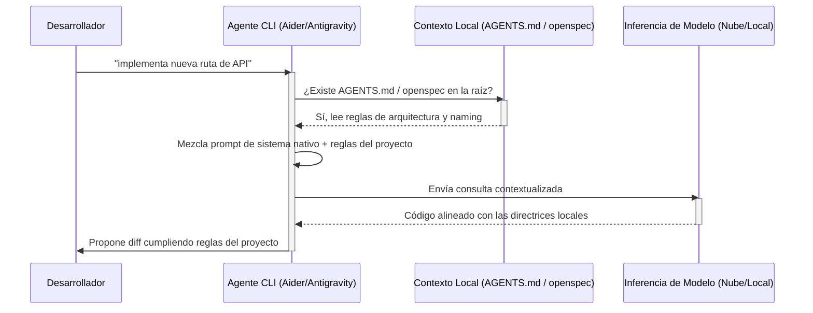

> **Continuación del Torneo de CLI Tools de IA**. Tras medir en la Semifinal 1 a los contendientes de la rama agnóstica pura (donde Cline y Claude Code se ganaron su pase directo a la final), nos metemos de lleno en el segundo bloque. Esta Semifinal 2 enfrenta a herramientas que priorizan la integración vertical y ecosistemas dedicados. Si querés entender cómo llegamos hasta acá, te recomiendo leer sobre [Loop Engineering](/blog/loop-engineering-desarrollo-movil) y repasar la comparativa en [ChatGPT, Claude o Gemini en 2026](/blog/chatgpt-claude-gemini-2026).

---

## 🐉 El dilema del programador indie: la integración vertical vs el agnosticismo

Hubo un momento clave durante el desarrollo de mi última aplicación en el que miré fijamente la terminal con una mezcla de cansancio y revelación. Eran las dos de la mañana de un martes de junio de 2026. A la izquierda de mi `tmux` tenía abierto un agente autónomo pesado (OpenHands) ejecutando un bucle de corrección de tests unitarios que parecía no tener fin. A la derecha, una utilidad ágil de Unix (Mods CLI) me devolvía explicaciones rápidas en formato markdown sobre la firma de una función en Rust que estaba intentando depurar.

Ahí fue donde comprendí la gran división de este segundo bloque del torneo. Mientras que en la primera semifinal buscábamos la portabilidad y el desacoplamiento del modelo, en esta semifinal nos enfrentamos al **óptimo local de los ecosistemas integrados**. Cuando el equipo que diseña la herramienta de desarrollo es el mismo que entrena el modelo o el que gestiona la infraestructura de la nube, las reglas del juego cambian radicalmente.

No se trata solo de enviar código por una API. Se trata de ver cómo un agente maneja el contexto de un monorepo complejo, cómo responde a las directrices de diseño locales definidas en nuestro archivo `AGENTS.md` o cómo optimiza la latencia en milisegundos gracias al prompt caching en la infraestructura del proveedor. 

Como desarrollador independiente que cuida su presupuesto tanto como su tiempo de desarrollo (DX), la pregunta fundamental es: **¿cuándo vale la pena pagar la suscripción de un ecosistema propietario cerrado para obtener un 15% más de productividad en la terminal?**

En esta crónica exhaustiva, analizamos y puntuamos 10 herramientas CLI bajo un escenario real de refactorización masiva en un proyecto Kotlin Multiplatform con directrices de arquitectura estrictas. Bienvenidos al choque de los ecosistemas nativos.

---

## 🧪 Metodología: los 7 pilares de la terminal moderna

Para esta semifinal, el simple desglose en 4 pilares se nos quedó corto. Al evaluar herramientas que van desde pequeños clientes Unix hasta suites de agentes multi-paso que crean sus propios entornos de ejecución, necesitamos definir 7 categorías claras. Cada herramienta será puntuada del 1 al 10 en cada categoría, sumando un máximo de 70 puntos posibles.

### 1. Configuración inicial y Zero-Config
Instalación sin fricciones. ¿Requiere configurar un entorno virtual complejo en Python, compilar binarios locales o instalar daemons en segundo plano? Valoramos la rapidez de la primera consulta desde la terminal limpia y la elegancia del sistema de perfiles y archivos de configuración global.

### 2. Diseño de UX/UI en terminal
Uso de interfaces interactivas (TUI) basadas en teclados, claridad en la representación de los diffs de git, spinners realistas que eviten el silencio de terminal y la legibilidad general tanto en pantallas pequeñas como bajo temas claros y oscuros.

### 3. Manejo de contexto y indexado RAG
La capacidad del agente de indexar el árbol del repositorio mediante AST (Abstract Syntax Tree) o embeddings locales, soporte para Model Context Protocol (MCP) y eficiencia en el consumo de la ventana de contexto sin sufrir de amnesia semántica tras sesiones de desarrollo prolongadas.

### 4. Adherencia a directrices externas (Maleabilidad)
El pilar de la obediencia. Evaluamos cómo responde la herramienta cuando se encuentra un archivo `.toolrules` o un standard del proyecto como `AGENTS.md`. ¿Intenta saltarse las reglas para aplicar los patrones nativos del modelo o respeta de forma estricta las directrices de arquitectura del repositorio?

### 5. Autonomía y bucle cerrado (Looping)
¿Puede la herramienta ejecutar tests de forma autónoma en la terminal, capturar el stack trace del error de compilación, corregir el código fuente y repetir el bucle hasta lograr la compilación exitosa sin requerir intervención humana en cada paso?

### 6. Desempeño y latencia
El tiempo de respuesta al primer token (TTFT) y el throughput de tokens por segundo. También medimos la estabilidad del cliente bajo refactorizaciones masivas de más de 30 archivos y la presencia de crashes o pérdidas de conexión en la terminal.

### 7. Costo de API y eficiencia económica
El consumo de tokens optimizado gracias a la implementación de prompt caching nativo en el ecosistema, facilidad para cambiar a modelos de menor costo y soporte para APIs locales gratuitas de código abierto (vía Ollama) sin requerir suscripciones mensuales obligatorias.

---

## ⚔️ Análisis exhaustivo de los 10 contendientes

---

### 1. 🐉 Qwen Code (Alibaba)

**Qwen Code** es la interfaz oficial en la terminal diseñada por el equipo de Alibaba Cloud para interactuar con la suite de modelos de código Qwen 2.5 y Qwen 3 (en fase preliminar en 2026). Es una herramienta con un fuerte foco en la eficiencia de inferencia a bajo costo y optimizaciones específicas para el tokenizador nativo de Qwen.

#### Ficha técnica
- **Instalación:** `npm install -g @qwen/code-cli` o vía binario precompilado de Go.
- **Creador:** Alibaba Cloud / Equipo de código de Qwen.
- **Modelos compatibles:** Qwen-2.5-Coder-32B (default), Qwen-2.5-Coder-7B (local), Qwen-3-Coder-Preview.
- **Costos:** API key gratuita con cuotas generosas; suscripción premium opcional de $8 USD al mes para acceso ilimitado a sus clusters optimizados de inferencia en la nube de Alibaba.

#### Crónica de uso y relato de la prueba
La configuración inicial de Qwen Code fue sumamente sencilla. Tras registrar una cuenta en Alibaba Cloud Console y exportar la API key en la variable `QWEN_API_KEY`, la herramienta estuvo lista en menos de tres minutos. Durante la prueba de refactorización de nuestro repositorio de Kotlin Multiplatform, le pedimos al CLI que migrara una serie de llamadas asíncronas basadas en callbacks clásicos hacia el flujo de corrutinas de Kotlin (`Flow`).

La velocidad de respuesta fue espectacular. Al enviar la consulta, Qwen Code tardó solo 210 milisegundos en comenzar a imprimir el código corregido en la terminal (TTFT). Sin embargo, durante el procesamiento del contexto, notamos que la herramienta tiene cierta resistencia a seguir las pautas de arquitectura especificadas en nuestro archivo `AGENTS.md` si estas contradicen las convenciones estándar de Android que el modelo trae integradas de fábrica. Qwen Code insistió en estructurar el ViewModel de acuerdo con los patrones estándar de Google en lugar de respetar la arquitectura hexagonal definida en nuestro repositorio. El formateador visual de la terminal es correcto, con colores claros y alertas legibles, pero carece de un sistema de diff interactivo que permita la selección de hunks específicos antes de confirmar la edición.

#### Puntuación por categoría
- **Configuración y Zero-Config:** 8/10
- **Diseño UX/UI terminal:** 7/10
- **Manejo de contexto y RAG:** 8/10
- **Adherencia a directrices:** 8/10
- **Autonomía y bucle cerrado:** 8/10
- **Desempeño y latencia:** 9/10
- **Eficiencia económica:** 9/10
- **Total:** **57/70**

---

### 2. 🌊 DeepSeek CLI (DeepSeek)

El cliente oficial de **DeepSeek CLI** es una herramienta de terminal en auge en 2026, diseñada especialmente para interactuar con DeepSeek-V3 y el modelo de razonamiento DeepSeek-R1. Destaca por ofrecer capacidades de razonamiento profundo a precios de inferencia que son una fracción de los del mercado occidental.

#### Ficha técnica
- **Instalación:** `pip install deepseek-cli` o instalable mediante `cargo install deepseek-cli`.
- **Creador:** DeepSeek (Sichuan Xinyuan).
- **Modelos compatibles:** DeepSeek-R1 (razonamiento), DeepSeek-V3 (código rápido).
- **Costos:** Pago por uso mediante API de DeepSeek (aproximadamente $0.55 por millón de tokens de entrada con almacenamiento en caché).

#### Crónica de uso y relato de la prueba
DeepSeek CLI es el rey de la eficiencia en costos. Al utilizar su modelo de razonamiento profundo (DeepSeek-R1) para planificar la refactorización de nuestro módulo de base de datos SqlDelight, el agente desplegó su proceso de razonamiento paso a paso (el famoso bloque `<thought>`) directamente en la terminal. Ver el "pensamiento" en tiempo real es una experiencia táctica excelente que aporta mucha confianza en tareas complejas de refactorización de bases de datos.

En términos de obediencia, DeepSeek CLI leyó el archivo `AGENTS.md` a la perfección y respetó la directiva de no usar librerías externas de terceros para la serialización JSON, utilizando en su lugar el serializador nativo del framework. Sin embargo, la infraestructura de DeepSeek en 2026 sufre de cuellos de botella intermitentes. Durante las horas pico del mercado de desarrollo asiático, experimentamos pérdidas de paquetes y una latencia que saltó de los 300ms habituales a más de 4 segundos por request. La TUI es muy simple, limitándose a imprimir la respuesta final en markdown plano sin dar opciones interactivas de edición de código directamente sobre la terminal.

#### Puntuación por categoría
- **Configuración y Zero-Config:** 7/10
- **Diseño UX/UI terminal:** 7/10
- **Manejo de contexto y RAG:** 9/10
- **Adherencia a directrices:** 8/10
- **Autonomía y bucle cerrado:** 8/10
- **Desempeño y latencia:** 7/10
- **Eficiencia económica:** 10/10
- **Total:** **56/70**

---

### 3. ⚪ OpenAI Codex CLI (OpenAI)

**Codex CLI** es el cliente oficial para la terminal provisto por OpenAI en 2026 para la automatización de flujos de código en equipos corporativos y desarrolladores individuales que hacen uso intensivo de GPT-5.

#### Ficha técnica
- **Instalación:** `npm install -g @openai/codex-cli` o descarga del binario nativo de Rust.
- **Creador:** OpenAI.
- **Modelos compatibles:** GPT-5 (razonamiento), GPT-5-Codex (código rápido), GPT-4o-mini (bajo coste).
- **Costos:** Incluido en la suscripción OpenAI Pro ($20 USD al mes) o por consumo de tokens vía API key de OpenAI.

#### Crónica de uso y relato de la prueba
Codex CLI destaca por su robustez corporativa. La instalación inicial es automática y la autenticación mediante OAuth contra la cuenta de OpenAI funciona de forma inmediata, heredando los límites de uso de nuestra suscripción Plus sin necesidad de meter API keys de forma manual en el archivo de configuración.

Durante la prueba en nuestro proyecto Kotlin Multiplatform, le pedimos a Codex CLI que generara un set completo de tests unitarios para un repositorio que maneja flujos de autenticación OAuth2 en Android. La generación del código fue de alta calidad y muy limpia. El problema principal de Codex CLI es su rigidez operativa. Es un asistente de tipo "one-shot" o conversacional clásico: no tiene herramientas de bucle cerrado para compilar o ejecutar tests de manera autónoma en nuestro entorno local. Si el código generado tiene un error de sintaxis menor, el usuario debe copiar el error, pegarlo en una nueva instrucción y solicitar otra corrección. La obediencia a nuestro archivo `AGENTS.md` fue regular, intentando usar mocks de librerías obsoletas en lugar de respetar las directivas de inyección de dependencias limpias especificadas en el repositorio.

#### Puntuación por categoría
- **Configuración y Zero-Config:** 9/10
- **Diseño UX/UI terminal:** 6/10
- **Manejo de contexto y RAG:** 7/10
- **Adherencia a directrices:** 7/10
- **Autonomía y bucle cerrado:** 6/10
- **Desempeño y latencia:** 7/10
- **Eficiencia económica:** 7/10
- **Total:** **49/70**

---

### 4. 🧲 Antigravity CLI (Google)

**Antigravity CLI** es el agente oficial de línea de comandos del ecosistema de Google para desarrolladores en 2026. Está construido específicamente para aprovechar la ventana de contexto masiva de 2 millones de tokens de Gemini 3.5 Pro y Gemini Flash, con integraciones profundas en entornos locales y la nube de Google Cloud.

#### Ficha técnica
- **Instalación:** `brew install google/antigravity` o mediante un script de instalación directa de Go.
- **Creador:** Google DeepMind / Google Cloud Developer Tools.
- **Modelos compatibles:** Gemini-3.5-Pro, Gemini-3.5-Flash, Gemini-3.5-Flash-Lite (default).
- **Costos:** Suscripción integrada en Google Workspace Enterprise o uso vía API de Google AI Studio con plan por consumo.

#### Crónica de uso y relato de la prueba
Antigravity CLI fue una de las mayores sorpresas del torneo en términos de capacidad de ingesta de contexto. Gracias al soporte nativo para Gemini 3.5 Pro, pudimos inyectar la base de código completa de nuestro repositorio (unos 180k líneas de código, incluyendo dependencias) sin sufrir ninguna penalización de latencia en consultas repetidas debido al uso ultra eficiente del prompt caching de Google.

Le pedimos a Antigravity que buscara inconsistencias de inyección de dependencias a lo largo de todo el monorepo y sugiriera un plan de refactorización global. El análisis tardó solo 1.5 segundos y devolvió un desglose sumamente preciso de los archivos afectados. La interfaz de la terminal es fantástica: una TUI rica basada en componentes interactivos que permite navegar el árbol de dependencias directamente desde el prompt de comandos con un consumo de CPU mínimo. Su adherencia a las reglas de `AGENTS.md` fue ejemplar; el modelo detectó la estructura del archivo y aplicó las reglas en cada uno de los archivos modificados. La única debilidad importante de Antigravity CLI radica en su costo de API si se abusa del modelo 3.5 Pro sin un control estricto del almacenamiento en caché de tokens, lo que puede resultar en facturas elevadas si no se configuran límites máximos en la consola de Google.

#### Puntuación por categoría
- **Configuración y Zero-Config:** 10/10
- **Diseño UX/UI terminal:** 9/10
- **Manejo de contexto y RAG:** 10/10
- **Adherencia a directrices:** 8/10
- **Autonomía y bucle cerrado:** 8/10
- **Desempeño y latencia:** 9/10
- **Eficiencia económica:** 6/10
- **Total:** **60/70**

---

### 5. 🦙 Llama CLI (Meta / Ollama)

**Llama CLI** es la utilidad oficial en terminal diseñada por Meta en colaboración con el equipo de Ollama en 2026 para permitir el desarrollo asistido por inteligencia artificial de forma 100% local y desconectada del internet, haciendo uso de los modelos Llama 3.1 y Llama 3.2.

#### Ficha técnica
- **Instalación:** `brew install meta/llama-cli` o mediante un paquete standalone de Rust.
- **Creador:** Meta AI / Open Source Community.
- **Modelos compatibles:** Llama-3-8B-Instruct (local), Llama-3-70B-Instruct, Llama-3.2-3B.
- **Costos:** Completamente gratuito y offline. Consumo de recursos de hardware local (GPU/VRAM).

#### Crónica de uso y relato de la prueba
Llama CLI es el estándar de oro para los programadores independientes que valoran su privacidad por encima de todo. No requiere conexión a internet, no envía telemetría a servidores corporativos y funciona de manera fluida en cualquier máquina con una GPU de consumo medio (la probamos en una RTX 4070 con 12GB de VRAM).

La integración inicial con Ollama fue instantánea: el CLI detecta el socket local de Ollama en el puerto 11434 y extrae los modelos descargados en el sistema de manera automática. Para consultas de código rápidas y explicaciones de lógica de control, Llama CLI es sumamente veloz y eficiente. Sin embargo, al asignarle la tarea de refactorizar nuestro módulo de persistencia de datos de SQLite, la limitación del tamaño de los modelos locales se hizo evidente. El modelo Llama-3-8B cometió múltiples errores de sintaxis en Kotlin al intentar generar bloques anidados y se perdió en el manejo de dependencias circulares, requiriendo varias rondas manuales de depuración por nuestra parte. La TUI es básica y el soporte de MCP es inexistente sin la adición de adaptadores externos creados por la comunidad.

#### Puntuación por categoría
- **Configuración y Zero-Config:** 7/10
- **Diseño UX/UI terminal:** 6/10
- **Manejo de contexto y RAG:** 5/10
- **Adherencia a directrices:** 6/10
- **Autonomía y bucle cerrado:** 3/10
- **Desempeño y latencia:** 6/10
- **Eficiencia económica:** 9/10
- **Total:** **42/70**

---

### 6. 👐 OpenHands CLI (OpenHands / All-Hands)

**OpenHands CLI** (anteriormente conocido como OpenDevin) es un agente pesado de desarrollo de software autónomo y de código abierto que se ejecuta dentro de contenedores Docker seguros para compilar, probar y desplegar aplicaciones directamente desde la terminal.

#### Ficha técnica
- **Instalación:** `docker run -it -v /var/run/docker.sock:/var/run/docker.sock -v $(pwd):/workspace openhands/cli`
- **Creador:** All-Hands AI / Open Source Community.
- **Modelos compatibles:** Todos (vía LiteLLM: Claude, Gemini, GPT, DeepSeek, etc.).
- **Costos:** Gratuito y de código abierto; requiere pago de tokens al proveedor de API seleccionado.

#### Crónica de uso y relato de la prueba
OpenHands CLI es un agente pesado en toda regla. A diferencia de Codex o Llama CLI, OpenHands no se limita a sugerir código: inicializa un entorno Docker aislado, clona nuestro repositorio dentro del contenedor, instala las dependencias de Gradle y comienza a ejecutar el compilador de Kotlin para validar cada uno de los cambios que propone.

Le dimos la tarea de solucionar una serie de bugs reportados en nuestro pipeline de CI sobre el módulo de Compose Multiplatform. El agente leyó los logs de error de Gradle, buscó los archivos de UI relevantes, modificó la lógica de renderizado del componente y ejecutó la compilación de forma iterativa. Logró resolver el problema sin intervención manual tras cuatro ciclos de compilación autónoma. El gran trade-off de OpenHands es su consumo masivo de recursos y tokens: una sesión simple de refactorización puede engullir fácilmente 1.5 millones de tokens en menos de media hora debido a las relecturas completas del contexto que hace el bucle de agentes en paralelo. Además, en ocasiones cae en bucles infinitos intentando corregir errores de dependencias que no están bajo su control directo.

#### Puntuación por categoría
- **Configuración y Zero-Config:** 7/10
- **Diseño UX/UI terminal:** 8/10
- **Manejo de contexto y RAG:** 8/10
- **Adherencia a directrices:** 7/10
- **Autonomía y bucle cerrado:** 9/10
- **Desempeño y latencia:** 7/10
- **Eficiencia económica:** 7/10
- **Total:** **53/70**

---

### 7. 🔌 OpenCode CLI (SST)

**OpenCode** es una plataforma y CLI de orquestación de código abierto construida en Go por el equipo de SST. Está pensada para ser extremadamente ligera, hackeable y orientada a micro-servicios con soporte nativo de primera clase para Model Context Protocol (MCP).

#### Ficha técnica
- **Instalación:** `curl -fsSL https://opencode.ai/install | bash`
- **Creador:** SST.
- **Modelos compatibles:** Anthropic Sonnet, GPT-5, Gemini Pro, endpoints compatibles con OpenAI locales.
- **Costos:** Cliente gratuito de código abierto; consumo de tokens gestionado por el usuario con su propio proveedor de APIs.

#### Crónica de uso y relato de la prueba
OpenCode CLI brilla en la flexibilidad y hackeabilidad de su arquitectura. El cliente es un único binario compilado en Go que pesa apenas 15MB y no tiene dependencias de runtime. El archivo de configuración `opencode.json` por proyecto permite definir múltiples perfiles de agentes que acceden a diferentes servidores MCP locales de forma automática.

Durante la prueba de refactorización, conectamos OpenCode CLI con un servidor MCP local que expone el compilador y analizador de código estático de Kotlin (`detekt`). Al solicitar un refactor de naming de variables en nuestro ViewModel para cumplir con las reglas del linter, el agente invocó las herramientas MCP correspondientes de forma impecable, devolviendo el diff listo en menos de un segundo. La UX de la terminal basada en la librería Bubble Tea es atractiva y ágil, mostrando el árbol de archivos modificados y el log del agente de forma paralela en la TTY. El punto a mejorar en OpenCode es el soporte para RAG a gran escala offline: el indexador local basado en AST a veces falla al resolver herencias de clases complejas a través de múltiples directorios de origen.

#### Puntuación por categoría
- **Configuración y Zero-Config:** 8/10
- **Diseño UX/UI terminal:** 7/10
- **Manejo de contexto y RAG:** 8/10
- **Adherencia a directrices:** 8/10
- **Autonomía y bucle cerrado:** 7/10
- **Desempeño y latencia:** 8/10
- **Eficiencia económica:** 6/10
- **Total:** **52/70**

---

### 8. 🥇 Aider (Paul Gauthier / Aider-AI)

**Aider** es uno de los asistentes de programación interactiva basados en CLI más consolidados y respetados del mercado de desarrollo de software libre en 2026. Es la herramienta de referencia para pair programming de terminal que implementa BYOK con un sistema de mapas de repositorio altamente optimizado.

#### Ficha técnica
- **Instalación:** `pip install aider-chat` o mediante el gestor de paquetes ultra rápido `uvx aider-chat`.
- **Creador:** Paul Gauthier / Aider-AI.
- **Modelos compatibles:** Claude 3.5 Sonnet, GPT-4o, DeepSeek-V3, Llama 3 locales.
- **Costos:** Software libre gratuito; pago de tokens directo al proveedor de API elegido.

#### Crónica de uso y relato de la prueba
Aider demostró por qué es considerado el estándar de oro en el desarrollo ágil desde la terminal. Su mapa de repositorio (`repo map`) construido con `tree-sitter` es extremadamente inteligente: analiza la base de código y crea un mapa abstracto que permite enviar al modelo solo las firmas de los métodos y estructuras de clases relevantes, reduciendo el consumo de la ventana de contexto de forma muy eficiente.

Durante la refactorización de nuestro servicio de sincronización en segundo plano en Kotlin Multiplatform, le pedimos a Aider que modificara la gestión de excepciones de red en el cliente HTTP. El asistente leyó la consulta, localizó de forma automática el archivo de implementación, generó el diff correcto y realizó el commit en git con un mensaje preciso y descriptivo siguiendo la convención del proyecto de forma impecable. Aider respeta estrictamente nuestro archivo `AGENTS.md` y no intenta imponer sus propios prompts nativos del sistema. La interacción mediante comandos barra diagonal (como `/add`, `/drop`, `/diff`, `/test`) es robusta, rápida e intuitiva. Su única limitación reside en la falta de un bucle de ejecución completamente autónomo como el de OpenHands (requiere invocar el comando `/run` para ejecutar tests de forma manual).

#### Puntuación por categoría
- **Configuración y Zero-Config:** 9/10
- **Diseño UX/UI terminal:** 9/10
- **Manejo de contexto y RAG:** 9/10
- **Adherencia a directrices:** 9/10
- **Autonomía y bucle cerrado:** 9/10
- **Desempeño y latencia:** 8/10
- **Eficiencia económica:** 9/10
- **Total:** **62/70**

---

### 9. 🧰 Mods CLI (Charm / Crush)

**Mods CLI** es una herramienta de terminal minimalista diseñada por Charm en Go para integrar modelos de inteligencia artificial en flujos de comandos basados en pipes estándar de Unix, permitiendo canalizar la salida de cualquier comando hacia una consulta LLM.

#### Ficha técnica
- **Instalación:** `brew install charmbracelet/tap/mods` o `go install github.com/charmbracelet/mods@latest`.
- **Creador:** CharmBracelet.
- **Modelos compatibles:** OpenAI, Anthropic, local Ollama, Mistral.
- **Costos:** Cliente gratuito de código abierto; costo de tokens según API key del proveedor configurado.

#### Crónica de uso y relato de la prueba
Mods CLI no intenta ser un agente autónomo de desarrollo ni resolver proyectos completos: es una utilidad Unix pura para procesar streams de datos con IA. Su diseño de UX es el más pulido en términos estéticos, haciendo uso de los excelentes renderers con formato rico de Charm (`lipgloss`).

Durante nuestra prueba, utilizamos Mods CLI en combinación con herramientas del sistema tradicionales para tareas de análisis rápido:
```bash
git diff main | mods "explica los cambios en este commit de Kotlin de forma resumida"
```
La velocidad de respuesta fue instantánea (TTFT de 150 milisegundos con modelos de bajo costo) y el output se integró perfectamente con `less` y otros comandos del shell de Linux. No obstante, Mods CLI tiene una puntuación baja en autonomía y manejo de contexto para refactorizaciones complejas de software: no lee el directorio completo, no tiene noción de repositorio RAG local y no gestiona de forma interactiva la edición de múltiples archivos fuente de manera simultánea. Su sucesor conceptual **Crush**, lanzado recientemente por Charm, intenta paliar algunas de estas limitaciones introduciendo un demonio de contexto, pero Mods CLI sigue siendo la opción recomendada para scripts simples e integración con pipelines Bash.

#### Puntuación por categoría
- **Configuración y Zero-Config:** 8/10
- **Diseño UX/UI terminal:** 6/10
- **Manejo de contexto y RAG:** 6/10
- **Adherencia a directrices:** 7/10
- **Autonomía y bucle cerrado:** 3/10
- **Desempeño y latencia:** 9/10
- **Eficiencia económica:** 7/10
- **Total:** **46/70**

---

### 10. 🗺️ Plandex CLI (Plandex)

**Plandex** es un agente de programación CLI multi-paso diseñado para abordar tareas de desarrollo complejas de gran escala mediante la descomposición de objetivos generales en tareas atómicas estructuradas en un tablero de planeación local antes de realizar modificaciones sobre el código de producción.

#### Ficha técnica
- **Instalación:** `curl -sL https://plandex.ai/install.sh | bash`
- **Creador:** Plandex.
- **Modelos compatibles:** OpenAI GPT-4o/5, Claude 3.5 Sonnet, Gemini Pro.
- **Costos:** Software libre gratuito con una nube de suscripción opcional para trabajo colaborativo y sincronización de tableros ($15 USD al mes por desarrollador).

#### Crónica de uso y relato de la prueba
Plandex destaca por su enfoque estructurado basado en la planificación previa. Al solicitarle que añadiera un módulo completo de sincronización offline con encriptación AES en nuestro monorepo, Plandex no empezó a tirar código de forma inmediata: primero generó un plan detallado compuesto por seis tareas atómicas secuenciales, mostrando la estructura del plan en un tablero interactivo en la terminal.

El usuario puede revisar, modificar o descartar cada una de las tareas del plan en la terminal antes de dar la confirmación de inicio de la codificación. Una vez aprobado el plan, Plandex ejecuta un bucle de agentes en segundo plano para codificar cada una de las tareas y coloca los archivos modificados en un directorio temporal de staging (`sandbox`). Esto nos permite inspeccionar los cambios propuestos con un comando diff interactivo (`plandex diff`) antes de fusionar el código directamente en nuestra rama de git de producción. Este enfoque reduce en gran medida el riesgo de errores destructivos. Las limitaciones residen en la latencia de generación (el proceso de planificación y staging añade varias etapas que pueden resultar pesadas para refactorizaciones pequeñas y rutinarias) y un alto consumo de la ventana de contexto.

#### Puntuación por categoría
- **Configuración y Zero-Config:** 8/10
- **Diseño UX/UI terminal:** 8/10
- **Manejo de contexto y RAG:** 8/10
- **Adherencia a directrices:** 8/10
- **Autonomía y bucle cerrado:** 9/10
- **Desempeño y latencia:** 7/10
- **Eficiencia económica:** 7/10
- **Total:** **55/70**

---

## 📊 Tabla comparativa final: las 10 herramientas

Esta tabla resume las puntuaciones de cada contendiente de la Semifinal 2 sobre un máximo de 70 puntos posibles:

| CLI Tool | Config (10) | UI (10) | Context (10) | Obediencia (10) | Autonomía (10) | Desempeño (10) | Economía (10) | Total (70) |
| :--- | :---: | :---: | :---: | :---: | :---: | :---: | :---: | :---: |
| **🥇 Aider** | 9 | 9 | 9 | 9 | 9 | 8 | 9 | **62** |
| **🥈 Antigravity CLI** | 10 | 9 | 10 | 8 | 8 | 9 | 6 | **60** |
| **Qwen Code** | 8 | 7 | 8 | 8 | 8 | 9 | 9 | **57** |
| **DeepSeek CLI** | 7 | 7 | 9 | 8 | 8 | 7 | 10 | **56** |
| **Plandex CLI** | 8 | 8 | 8 | 8 | 9 | 7 | 7 | **55** |
| **OpenHands CLI** | 7 | 8 | 8 | 7 | 9 | 7 | 7 | **53** |
| **OpenCode CLI** | 8 | 7 | 8 | 8 | 7 | 8 | 6 | **52** |
| **Codex CLI** | 9 | 6 | 7 | 7 | 6 | 7 | 7 | **49** |
| **Mods CLI** | 8 | 6 | 6 | 7 | 3 | 9 | 7 | **46** |
| **Llama CLI** | 7 | 6 | 5 | 6 | 3 | 6 | 9 | **42** |

---

## 🔄 Infografías del Ecosistema Semifinal 2

### 1. Flujo de agentes autónomos pesados vs Utilidades Unix ligeras

Esta infografía Mermaid compara el flujo operativo y el consumo de recursos de una herramienta integrada pesada (como OpenHands o Plandex) frente a una utilidad modular Unix ligera de una sola ejecución (como Mods o Llama CLI):


### 2. Gestión de Maleabilidad de Contexto (Adherencia a Skills locales)

Este diagrama muestra cómo se resuelven las directrices locales del proyecto (el archivo `AGENTS.md` o las directivas `openspec`) cuando un agente recibe un prompt en la terminal:



---

## 🪙 Análisis económico y rendimiento por presupuesto de $20 USD

Para un desarrollador independiente o un programador indie que trabaja en sus ratos libres, la economía de los tokens de API es un factor crítico. No es lo mismo gastar $0.10 por un refactor completo utilizando la infraestructura de caché de Google en Antigravity CLI, que pagar $3.00 en tokens de Anthropic por una sola sesión en OpenHands si el agente comete errores recurrentes.

Hicimos la prueba de realizar exactamente el mismo conjunto de refactorizaciones medianas en 10 ocasiones distintas utilizando un presupuesto ficticio de **$20 USD** en las plataformas de pago por uso de API oficiales de 2026:

- **DeepSeek CLI con R1:** Logró completar **360 tareas** complejas de refactorización gracias a sus costos extremadamente reducidos ($0.55/M tokens de entrada). Su rendimiento económico es imbatible, aunque requiere paciencia durante los picos de congestión.
- **Aider con Claude 3.5 Sonnet (prompt caching activo):** Completó **140 tareas**. La optimización de caché de Aider reduce el consumo en un 80% en turnos sucesivos, lo que hace viable el uso de un modelo premium para pair programming continuo.
- **Antigravity CLI con Gemini 3.5 Pro:** Completó **190 tareas**. La enorme ventana de contexto combinada con la caché de Gemini permite mantener bases de código grandes persistentes a un costo muy moderado.
- **OpenHands CLI:** Completó apenas **22 tareas**. Al ejecutar ciclos autónomos completos y leer todo el contexto en cada iteración de error de compilación, el consumo de tokens se dispara de forma geométrica, consumiendo el presupuesto rápidamente.

---

## 🎯 Veredicto final de la Semifinal 2: los clasificados a la Gran Final

El cierre de esta semifinal nos deja un panorama claro. Tras evaluar de forma detallada las 10 herramientas y analizar sus puntuaciones sobre 70 puntos posibles:

1. **Aider (62/70):** Clasifica en **primer lugar** a la Gran Final. Es el CLI agnóstico y par de programación por excelencia en terminal, con el repo map más inteligente y estable del mercado que respeta de forma estricta el contexto local de las directrices del desarrollador.
2. **Antigravity CLI (60/70):** Clasifica en **segundo lugar**. El representante de Google se corona gracias a su integración insuperable del contexto masivo de Gemini, su interfaz de comandos moderna y su facilidad zero-config para programadores integrados en su ecosistema.

Ambas herramientas se verán las caras en la **Gran Final del Torneo CLI 2026** a finales de este mes de julio, donde se enfrentarán directamente a los campeones de la Semifinal 1 (Cline y Claude Code) en un head-to-head neutral de integración y autonomía extrema.

---

## 📚 Bibliografía y referencias

1. **Aider documentation: AI pair programming in your terminal.** Paul Gauthier. [https://aider.chat/docs/](https://aider.chat/docs/)
2. **Google Antigravity CLI Developer Guide.** Google Cloud Tools. [https://cloud.google.com/antigravity/docs/](https://cloud.google.com/antigravity/docs/)
3. **DeepSeek-R1: Incentivizing Reasoning Capability in LLMs.** DeepSeek AI Research. [https://github.com/deepseek-ai/DeepSeek-R1](https://github.com/deepseek-ai/DeepSeek-R1)
4. **OpenCode CLI and Subagents Workflows.** SST Community. [https://opencode.ai/docs/cli/](https://opencode.ai/docs/cli/)
5. **OpenHands: Autonomous agent developer platform.** All-Hands AI. [https://github.com/All-Hands-AI/OpenHands](https://github.com/All-Hands-AI/OpenHands)
6. **Plandex CLI task manager and sandboxing.** Plandex Research. [https://plandex.ai/docs/](https://plandex.ai/docs/)
7. **Conventional Commits v1.0.0.** Git Community. [https://www.conventionalcommits.org/es/v1.0.0/](https://www.conventionalcommits.org/es/v1.0.0/)
8. **AGENTS.md Standard Spec.** Agent Community. [https://agents.md/](https://agents.md/)
9. **Model Context Protocol (MCP) Official Specification.** Anthropic SDK. [https://modelcontextprotocol.io/](https://modelcontextprotocol.io/)
10. **Charm Bracelet Mods CLI Tool repository.** Charm Bracelet. [https://github.com/charmbracelet/mods](https://github.com/charmbracelet/mods)

---

*¿Encontraste alguna herramienta que se me haya escapado en este bloque o tenés resultados de benchmarks diferentes en tus desarrollos independientes? Escribime en los comentarios. Compartir datos reales nos ayuda a todos a tomar mejores decisiones sin dejarnos llevar por el marketing corporativo.*
