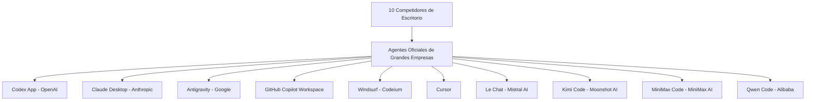

## 🚀 El fin del autocompletado y el amanecer del OS-level agent

El desarrollo de software y la automatización de sistemas mediante inteligencia artificial han alcanzado un punto de inflexión. Atrás quedaron los simples chats de autocompletado de código. En el mercado actual, las grandes corporaciones y las empresas de software más valoradas del mundo compiten por ofrecer el "sistema operativo de desarrollo" definitivo. Ya no estamos hablando de extensiones de IDE que sugieren la siguiente línea de una función o sugieren cómo refactorizar un bucle simple. Hoy en día, la competencia se centra en sistemas completos que toman control del entorno de desarrollo local, ejecutan comandos, navegan por la web en busca de documentación actualizada, depuran código mediante bucles de retroalimentación de la terminal y toman decisiones de diseño de alto nivel.

Para un desarrollador independiente (indie hacker), este cambio paradigmático representa una oportunidad colosal pero también un desafío de selección de herramientas. La velocidad con la que podemos iterar ya no depende de la rapidez con la que tecleamos, sino de la eficiencia con la que orquestamos a nuestros agentes de IA. Pero, ¿cómo elegir en un mar de alternativas que prometen autonomía total?

En esta primera semifinal, evaluamos las 10 herramientas de escritorio y entornos comerciales oficiales más influyentes del mercado. No nos limitamos a sus aspectos superficiales; analizamos su arquitectura interna, sus capacidades de integración con el sistema operativo, la gestión de su ventana de contexto y su robustez a la hora de resolver problemas reales de desarrollo de software sin asistencia humana constante.

Este artículo marca el inicio de nuestro análisis de herramientas con ventana gráfica (GUI), diferenciándose de nuestra anterior cobertura detallada del torneo CLI, donde comparamos los motores basados exclusivamente en terminal. Podés revisar aquellos análisis en nuestra [Semifinal 1 CLI AI](/blog/cli-ai-semifinal-1/), [Semifinal 2 CLI AI](/blog/cli-ai-semifinal-2/) y la gran [Gran Final CLI AI](/blog/cli-ai-grand-final/) para ver cómo se comparan estas soluciones con el software de consola pura.

---

## 🏛️ Entendiendo la Semifinal A: ¿Qué define a un agente oficial de escritorio?

Antes de entrar en detalle con cada competidor, es crucial establecer qué requisitos debe cumplir una herramienta para ser considerada en esta categoría. A diferencia de las soluciones basadas puramente en la CLI o en simples plugins de chat en el navegador, un agente oficial de escritorio debe ofrecer:

1.  **Interfaz Gráfica de Control (GUI):** Un panel visual que permita supervisar el estado del agente, visualizar planes de ejecución, gestionar tokens consumidos y configurar el comportamiento del sistema sin depender exclusivamente de comandos de texto.
2.  **Acceso al Sistema Operativo Local (OS Integration):** La capacidad de interactuar con el sistema de archivos local, ejecutar procesos a través de terminales integradas y, en los casos más avanzados, manipular la pantalla mediante técnicas de visión por computadora.
3.  **Gestión de Contexto Compleja:** Mecanismos para indexar bases de código locales completas (mediante bases de datos vectoriales locales o algoritmos RAG avanzados) para que el agente pueda razonar sobre repositorios enteros en lugar de archivos individuales.
4.  **Autonomía de Ejecución y Planificación:** El soporte para bucles agénticos autónomos, lo que significa que la herramienta puede crear un plan de múltiples pasos, ejecutarlo secuencialmente, probar los cambios mediante suites de tests locales y corregir sus propios errores (Self-Correction) antes de reportar un estado final al usuario.

A continuación, diseccionamos individualmente a cada uno de los 10 contendientes de esta Semifinal A.

---

## 🔍 Los 10 competidores de la Semifinal A



### 1. Codex App (OpenAI)

El centro de control oficial de OpenAI para sistemas de escritorio. Diseñado como un entorno visual independiente, Codex App coordina agentes autónomos capaces de interactuar directamente con el sistema de archivos local y el navegador integrado. Destaca por su capacidad para gestionar planes de ejecución complejos (Plan Mode) antes de escribir una sola línea de código, reduciendo la deriva de objetivos en proyectos de gran envergadura.

#### Arquitectura y Motor Interno
Codex App funciona como un cliente pesado nativo que se comunica directamente con la API de OpenAI, optimizado específicamente para modelos de razonamiento avanzado como la serie o1 y o3. Su motor local aprovecha una base de datos vectorial embebida en Rust para indexar el repositorio en segundo plano. Esto le permite realizar búsquedas semánticas ultra rápidas y pasar fragmentos relevantes de código directamente al modelo en lugar de saturar la ventana de contexto.

El flujo de planificación de Codex App sigue un modelo jerárquico estructurado. Cuando el usuario plantea un objetivo, el agente primero genera una especificación en formato JSON que detalla los archivos involucrados, las dependencias estructurales y la secuencia de comandos de verificación necesarios.

```json
{
  "agent_config": {
    "engine": "o3-mini-desktop",
    "planning_mode": "strict-hierarchical",
    "sandbox": {
      "type": "docker-local",
      "allowed_paths": ["/home/user/workspace"]
    }
  }
}
```

#### Integración con el Sistema y Seguridad
La aplicación incluye un sistema de contenedores sandbox locales (opcional pero altamente recomendado) para ejecutar comandos del sistema de forma segura. El agente de Codex App puede abrir un navegador Chrome embebido para verificar si una interfaz web responde correctamente o para buscar documentación en la web oficial de librerías emergentes que no se encuentran en los datos de entrenamiento del modelo base.

Este aislamiento mediante Docker local impide que comandos potencialmente destructivos afecten al sistema anfitrión. Si el agente intenta ejecutar un comando no autorizado fuera de las rutas configuradas, el motor de ejecución intercepta la llamada y le devuelve un error de permisos al agente, el cual debe reprogramar su enfoque de inmediato.

#### Rendimiento en Desarrollo Diario
En la práctica, Codex App sobresale a la hora de resolver refactorizaciones arquitectónicas complejas. Su "Plan Mode" obliga al modelo a redactar un documento de especificaciones e implementaciones técnicas antes de hacer cualquier cambio. Esta técnica estructurada evita que el agente comience a programar a ciegas, limitando los ciclos infinitos de prueba y error en proyectos grandes. Sin embargo, su principal desventaja es el consumo de tokens y el costo por API en proyectos extensos, además de una ligera rigidez si querés cambiar de estrategia a mitad de camino. La fase de planificación inicial puede tardar varios minutos con modelos de razonamiento como o1, lo que rompe la sensación de inmediatez para correcciones triviales.

---

### 2. Claude Desktop / Claude Code (Anthropic)

Anthropic aborda el problema de los agentes de dos formas: su cliente de escritorio visual (Claude Desktop) destaca por su funcionalidad Computer Use, que permite al agente tomar control virtual del ratón, el teclado y la pantalla; por otro lado, Claude Code proporciona un motor de comandos de terminal de alta velocidad optimizado para arquitecturas de software complejas. Su capacidad de razonamiento contextual sigue siendo el estándar de la industria.

#### Computer Use: El Factor Diferencial de Claude Desktop
La característica más innovadora de Claude Desktop es, sin duda, su habilidad para interactuar con interfaces gráficas generales a través de visión artificial. Cuando el agente necesita probar una aplicación de escritorio o validar un cambio en la interfaz gráfica de un simulador Android, toma capturas de pantalla secuenciales, detecta las coordenadas de los componentes visuales mediante análisis de imágenes y emite eventos de clic y pulsación de teclas.

El bucle de ejecución de Computer Use funciona de la siguiente manera:
1.  **Captura de Pantalla:** Toma una captura del escritorio o de la ventana seleccionada.
2.  **Análisis Visual:** El modelo Claude procesa la imagen para identificar los elementos interactivos (botones, campos de texto, menús).
3.  **Cálculo de Coordenadas:** Genera un comando JSON con las coordenadas X e Y exactas del elemento de destino.
4.  **Acción del Sistema:** El cliente local ejecuta la acción usando la API de control del sistema operativo (por ejemplo, emulando eventos del mouse a nivel de sistema).
5.  **Bucle de Retroalimentación:** Espera unos milisegundos a que la UI se redibuje y vuelve al paso 1 para verificar el resultado.

```
+--------------------+     +-------------------+     +---------------------+
| Captura de Pantalla| --> | Análisis Visual   | --> | Cálculo Coordenadas |
+--------------------+     +-------------------+     +---------------------+
          ^                                                     |
          |                                                     v
          +-----------------  Acción del Sistema  <-------------+
```

#### Claude Code: Velocidad y Precisión en Terminal
Para los flujos de desarrollo tradicionales, Claude Code actúa como un compañero de terminal ultra optimizado. Aprovecha los protocolos de Server MCP (Model Context Protocol) para exponer recursos del sistema, archivos de configuración, motores de bases de datos y APIs externas de manera estandarizada. La precisión de razonamiento del modelo Claude 3.5/3.7 Sonnet, combinada con su estricto seguimiento de instrucciones, hace que la tasa de acierto de primer intento sea sumamente alta.

#### Desventajas y Limitaciones
A pesar de su potencia, la separación entre Claude Desktop (visual pero lento al usar visión) y Claude Code (rápido pero sin interfaz gráfica nativa unificada) fragmenta ligeramente la experiencia de usuario. El consumo de tokens por capturas de pantalla en Computer Use puede dispararse en cuestión de minutos, lo que requiere un control estricto por parte del usuario para no consumir las cuotas de API de forma acelerada. Además, los fallos de red o las latencias elevadas de la API pueden hacer que el control de ratón sea errático en entornos interactivos con animaciones rápidas.

---

### 3. Antigravity (Google)

Antigravity es la respuesta de Google para el desarrollo multiplataforma orientado a agentes. A través de un administrador visual de agentes de escritorio (Agent Manager), permite delegar tareas en paralelo a diferentes subagentes orquestados de forma jerárquica. Aprovecha de manera directa el contexto masivo y las bajas latencias de los modelos Gemini para procesar repositorios enteros de forma nativa.

#### La Ventaja del Contexto Masivo de Gemini
La arquitectura de Antigravity está construida desde el primer día para aprovechar la ventana de contexto de millones de tokens de los modelos de Google. A diferencia de las herramientas de la competencia que deben fragmentar el código mediante algoritmos heurísticos RAG para no sobrepasar el límite de tokens, Antigravity puede enviar el repositorio de código entero (incluyendo código fuente, recursos multimedia, archivos de configuración de dependencias y la base de datos de pruebas) directamente al modelo en un solo turno de conversación. Esto reduce drásticamente las alucinaciones causadas por la falta de contexto global.

El uso de **Context Caching** a nivel de API permite que, una vez cargado el repositorio en el contexto del modelo, las consultas siguientes no vuelvan a enviar todos los archivos, sino que apunten a la versión cacheada. Esto disminuye la latencia de respuesta a fracciones de segundo y abarata de forma considerable el costo de los tokens de entrada en sesiones largas de depuración o redacción.

#### Orquestación Jerárquica de Subagentes
El "Agent Manager" de Antigravity introduce un patrón de diseño donde un Agente Orquestador descompone el requerimiento del usuario en tareas individuales y las delega en subagentes paralelos:
*   **Investigador:** Explora la base de código y mapea dependencias utilizando herramientas de análisis estático del lenguaje.
*   **Implementador:** Realiza los cambios quirúrgicos en los archivos asignados manteniendo la coherencia de estilos de código.
*   **Verificador:** Ejecuta pruebas unitarias e instrumentales para validar los cambios y verificar que no existan regresiones.

```
                  [Orquestador Central]
                   /        |        \
       [Investigador] [Implementador] [Verificador]
```

#### Integración con Android y Ecosistemas Móviles
Al ser una herramienta oficial de Google, su integración con emuladores Android, ADB y herramientas de build como Gradle es insuperable. Antigravity puede diagnosticar cuellos de botella de rendimiento de compilación de proyectos Android masivos en segundos, sugiriendo cambios en configuraciones complejas que otros agentes simplemente ignorarían o romperían por falta de familiaridad con el ecosistema. Su Agent Manager visual muestra el progreso en tiempo real de las tareas distribuidas, permitiendo al usuario pausar un subagent específico o alterar el curso de la implementación sin reiniciar todo el proceso.

---

### 4. GitHub Copilot Workspace

Integrado en el ecosistema de Microsoft y GitHub, Workspace propone un flujo de trabajo asíncrono e integrado en la nube. Permite convertir cualquier Issue de GitHub en una propuesta de código editable mediante un agente con interfaz gráfica. Destaca en la gestión de flujos de trabajo colaborativos, la integración con sistemas CI/CD y entornos de ejecución basados en Codespaces.

#### Flujo de Trabajo Basado en Issues y Nube
Workspace redefine la forma en que los desarrolladores abordan las tareas diarias. El punto de partida no es tu IDE local, sino un Issue de GitHub. Al hacer clic en "Open in Workspace", la plataforma lanza un entorno web temporal que analiza el problema, extrae el contexto relevante del repositorio en la nube y crea una propuesta visual con los archivos que deben modificarse.

El motor de Workspace genera una especificación en lenguaje natural que el usuario puede corregir paso a paso. Una vez aceptado el plan, se ejecuta la generación de código de forma remota en contenedores dedicados, reduciendo la carga de CPU y memoria en la máquina del desarrollador.

```
[GitHub Issue] -> [Workspace Cloud Sandbox] -> [Plan en Texto] -> [Generación de Diffs]
```

#### Colaboración Asíncrona y Revisión
Dado que Workspace corre completamente en la infraestructura de GitHub, los desarrolladores pueden interactuar de forma asíncrona. Varios miembros del equipo pueden dejar notas en el plan de ejecución del agente, validar los commits sugeridos antes de que se unan al código base o disparar flujos de pruebas automatizadas en GitHub Actions directamente desde la interfaz del agente. Al finalizar la tarea, Workspace puede abrir una Pull Request de manera automática, adjuntando capturas de pantalla de los tests ejecutados y un resumen de los cambios implementados para facilitar el proceso de code review de los miembros del equipo.

#### Limitaciones de la Experiencia Local
Aunque el enfoque en la nube es excelente para equipos corporativos y desarrollo distribuido, los desarrolladores independientes pueden sentir una pérdida de control local. La dependencia de entornos virtuales remotos (Codespaces) puede añadir latencia a la hora de compilar y probar proyectos pequeños, y la flexibilidad de modificar cosas sobre la marcha se ve reducida si estás acostumbrado a usar tus herramientas locales especializadas. Si te quedás sin internet o tenés problemas de conexión con los servidores de Microsoft, tu flujo de desarrollo Workspace se detiene por completo.

---

### 5. Windsurf (Codeium)

Un editor de código AI-nativo altamente comercial que compite directamente en la experiencia de desarrollo local. Su motor central, Cascade, actúa como un agente de flujo continuo que analiza en tiempo real el editor, el terminal y la previsualización del navegador de forma asíncrona. Minimiza las interrupciones del desarrollador y ofrece una gran velocidad de respuesta.

#### El Motor Cascade y el Flujo Continuo
La propuesta de valor de Windsurf radica en su motor Cascade. A diferencia de las herramientas que funcionan mediante solicitudes de chat puntuales (Request-Response), Cascade mantiene una conexión persistente y bidireccional con el entorno de desarrollo. Si estás modificando una función en el editor, Cascade actualiza automáticamente su comprensión semántica y puede sugerir comandos relevantes en el terminal integrado de forma proactiva, sin que tengas que pedírselo.

Este flujo continuo aprovecha un analizador estático local basado en tree-sitter que detecta qué funciones o tipos están acoplados con tu edición actual. A medida que modificás una firma de método, Cascade planifica en segundo plano las modificaciones necesarias en el resto del proyecto para que la base de código siga compilando.

```
[Desarrollador Escribe] ---> [Cascade Monitorea] ---> [Sugerencias en Tiempo Real]
                                     ^
                                     |
                          [Análisis de Terminal]
```

#### UX Refinada y Menor Fricción
Windsurf se siente como un editor de código convencional de alta velocidad con superpoderes integrados. La interfaz gráfica no se interpone en tu camino; los paneles visuales de agentes aparecen solo cuando necesitás una intervención autónoma compleja, y la transición entre edición manual e intervención del agente es extremadamente suave.

Cascade también incluye un navegador embebido en el editor que reporta los errores de consola en tiempo real al modelo de IA, lo que permite corregir fallos visuales o lógicos de la interfaz de usuario en caliente.

#### Limitaciones del Motor Local
Aunque Cascade es brillante para tareas del día a día, en proyectos que requieren cambios profundos de arquitectura o análisis heurísticos que cruzan múltiples subsistemas de bases de datos y configuraciones externas, el agente puede quedarse corto comparado con motores que usan planificación de múltiples pasos jerárquicos (como Codex App o Antigravity). A veces, su inmediatez puede llevar al agente a proponer parches rápidos que solucionan el síntoma del problema pero no abordan la raíz del defecto estructural del software.

---

### 6. Cursor

El editor que popularizó el concepto de vibe coding. Como una bifurcación optimizada de VS Code, Cursor ofrece una interfaz de usuario pulida con características líderes en el mercado como Composer (edición de múltiples archivos en paralelo) y un sistema predictivo de edición en línea altamente eficiente. Cuenta con una comunidad de desarrollo masiva y una excelente fluidez en la UI.

#### Composer: Edición Multi-Archivo en Paralelo
El gran acierto de Cursor es "Composer", una interfaz visual que permite al programador describir un cambio complejo que involucra varios archivos a la vez. El agente de Cursor lee el contexto relevante, genera los diffs correspondientes y los presenta de forma clara y coloreada dentro de la interfaz del editor para que el desarrollador pueda aprobarlos o rechazarlos con un solo clic.

Composer puede abrirse en modo flotante o en pantalla completa, actuando como un espacio de trabajo agéntico donde el programador mantiene un diálogo constante con la IA mientras observa cómo se modifican múltiples componentes del proyecto de forma simultánea.

```
[Composer Prompt] 
       |
       +---> Modifica `api.ts`     [Diff Visual] ---> [Aceptar / Rechazar]
       +---> Modifica `types.ts`   [Diff Visual] ---> [Aceptar / Rechazar]
       +---> Modifica `test.ts`    [Diff Visual] ---> [Aceptar / Rechazar]
```

#### Edición Predictiva y Vibe Coding
Cursor ha perfeccionado la latencia y la fluidez de las sugerencias en línea. Su modelo predictivo local predice cuál es la siguiente línea que vas a modificar incluso antes de que empieces a escribir, lo que reduce la carga cognitiva. Esto ha creado una cultura de desarrollo basada en "vibe coding", donde el desarrollador guía al editor en lugar de escribir código de forma manual. El motor de Cursor corre de forma asíncrona un proceso de indexación RAG local de alta eficiencia que actualiza las representaciones vectoriales del repositorio con cada guardado de archivo.

#### Trade-offs y Privacidad
Al basarse en VS Code, la transición a Cursor es inmediata para la mayoría de los programadores. Sin embargo, su infraestructura depende de servidores intermedios de Cursor para procesar ciertas funciones avanzadas y coordinar las peticiones a los modelos de frontera. Esto puede presentar dudas sobre el control de datos y privacidad en entornos comerciales o proyectos con políticas corporativas estrictas, y su enfoque agéntico es menos autónomo que el de otras suites de escritorio orientadas a objetivos de largo plazo.

---

### 7. Le Chat / Mistral Vibe (Mistral AI)

La propuesta de la firma europea Mistral AI ofrece una interfaz de escritorio que combina el trabajo de oficina general con un modo de desarrollo técnico (Code Mode). Su agente de escritorio destaca por la integración nativa de modelos eficientes y con un estricto cumplimiento del marco de privacidad de datos de la Unión Europea (GDPR), convirtiéndolo en un gran candidato para entornos corporativos europeos.

#### Enfoque Corporativo y Cumplimiento de Privacidad (GDPR)
Mistral AI se posiciona como el campeón de la soberanía de datos europea. Su aplicación de escritorio Le Chat está diseñada para cumplir estrictamente con los estándares europeos de privacidad de datos. A diferencia de las empresas con sede en Estados Unidos que a veces entrenan modelos con los datos enviados a través de sus herramientas de chat de forma opaca, Mistral garantiza que tu código e información confidencial nunca saldrán de la jurisdicción europea y no serán almacenados para entrenamiento si se configura adecuadamente.

Esta garantía es un factor decisivo para industrias reguladas (como banca, salud y sector público) que tienen prohibido el uso de herramientas agénticas que exporten código propietario a servidores fuera de la Unión Europea.

#### Code Mode e Integración de Modelos Propios
El "Code Mode" de Le Chat permite a los desarrolladores interactuar con la familia de modelos Codestral y Mistral Large de manera directa. La interfaz visual proporciona un panel para previsualizar código generado, renders en tiempo real de interfaces HTML/CSS y un control granular sobre las fuentes de datos del sistema local que el agente puede consultar.

Adicionalmente, permite crear "Agents" personalizados dentro de la propia aplicación gráfica, con directrices específicas de arquitectura y estilos para automatizar revisiones de código alineadas con las convenciones de la organización.

#### Limitaciones de Autonomía
A pesar de su fuerte enfoque en privacidad y eficiencia de modelos, Le Chat no posee una integración agéntica tan profunda con el sistema operativo como sus competidores. No puede abrir tu terminal local de manera directa para ejecutar comandos arbitrarios o interactuar con herramientas complejas de compilación local sin la intervención activa del desarrollador. Funciona más como un entorno de chat avanzado y visualizador interactivo de prototipos que como un agente de ejecución local autónomo de bajo nivel.

---

### 8. Kimi Code (Moonshot AI)

La solución de Moonshot AI para entornos de escritorio chinos. Aunque se basa en una interfaz de consola enriquecida (TUI) integrada con su cliente de escritorio, proporciona paneles visuales de control para su sistema Agent Swarm, que coordina múltiples procesos de desarrollo de manera asíncrona. Destaca por el procesamiento de extensos historiales de código gracias a su gran ventana de contexto nativa.

#### Agent Swarm y Enfoque en Procesamiento de Contexto Largo
Kimi Code aprovecha el motor de contexto extremadamente largo desarrollado por Moonshot AI, capaz de procesar millones de caracteres chinos y código fuente de manera nativa. El sistema coordina un enjambre de subagentes (Agent Swarm) que trabajan en tareas de análisis estático de código, detección de vulnerabilidades de seguridad y optimización de rendimiento de forma paralela y silenciosa.

Este enjambre utiliza un protocolo interno de comunicación que divide el análisis del proyecto por capas jerárquicas:
*   **Agente de Base de Datos:** Analiza las consultas SQL y migraciones.
*   **Agente de Lógica:** Revisa los flujos de control del negocio.
*   **Agente de API:** Valida los contratos e interfaces de comunicación.

```
                           [Orquestador Kimi]
                            /       |       \
                  [Agente DB]  [Agente API]  [Agente Lógica]
```

#### TUI y Paneles de Control de Escritorio
Kimi Code combina la rapidez de una terminal enriquecida con paneles web embebidos en el escritorio para la visualización de reportes de cobertura de tests, gráficos de dependencias y métricas de consumo de recursos. Esto le da una sensación muy técnica, ideal para desarrolladores de sistemas que valoran la baja latencia de la terminal pero necesitan visualizaciones enriquecidas ocasionales.

#### Disponibilidad y Localización
La principal barrera para los desarrolladores en Occidente es la localización y el enfoque comercial de Kimi Code, optimizado fuertemente para el ecosistema tecnológico de China, su idioma nativo y plataformas en la nube específicas de la región. La latencia de las conexiones de red internacionales y las dificultades para dar de alta cuentas de desarrollo fuera de la región reducen su aplicabilidad práctica para el público general fuera de Asia.

---

### 9. MiniMax Code (MiniMax AI)

El cliente visual de MiniMax está diseñado para interactuar con su modelo M3. Se centra en el análisis heurístico de bases de código locales y la automatización del navegador web para realizar pruebas de integración continuas. Es una herramienta muy popular en mercados asiáticos debido a su bajo coste por token de inferencia.

#### Análisis Heurístico y Costos Ultra Bajos
MiniMax AI compite fuertemente en costos de inferencia. En proyectos masivos donde las consultas recurrentes de agentes consumen millones de tokens al día, la arquitectura de MiniMax Code optimiza la transferencia de datos para minimizar los costos de cómputo. Su cliente de escritorio cuenta con algoritmos heurísticos locales que filtran el código redundante antes de enviarlo al servidor, reduciendo el tamaño del prompt mediante un sistema de compresión semántica local que preserva únicamente las firmas y dependencias clave de las clases afectadas.

#### Automatización del Navegador para Tests de Integración
Una de las características más promocionadas del cliente MiniMax Code es su agente de pruebas de interfaz web. Puede abrir de forma autónoma navegadores headless, navegar por los flujos de usuario generados por tu nueva compilación local, verificar errores en la consola del navegador y reportar capturas de pantalla de fallos visuales directamente a su interfaz gráfica de control.

El programador puede observar en tiempo real una mini-pantalla con la reproducción del navegador que el agente está manipulando para validar los flujos de compra, inicios de sesión o formularios complejos del frontend.

#### Calidad del Razonamiento
Aunque el bajo costo y las herramientas de automatización de pruebas web son muy atractivas, la capacidad pura de razonamiento en lenguajes complejos y la resolución de problemas lógicos profundos de arquitectura de software a veces se queda rezagada frente a los modelos insignia de Anthropic u OpenAI. En tareas de algoritmia avanzada o refactorización de grandes volúmenes de código spaghetti, el agente de MiniMax tiende a requerir más iteraciones y correcciones manuales del desarrollador.

---

### 10. Qwen Code (Alibaba)

La aplicación oficial de escritorio de la división de IA de Alibaba. Integra de forma nativa la familia de modelos abiertos Qwen, ofreciendo un entorno de desarrollo con soporte multilingüe avanzado (con especial foco en arquitecturas de datos en la nube de Alibaba Cloud) y agentes capaces de interactuar localmente con herramientas de contenedores como Docker.

#### Modelos Qwen y Privacidad On-Premise
La principal ventaja de Qwen Code es su soporte nativo para correr de manera híbrida. Podés conectar el cliente a los endpoints en la nube de Alibaba Cloud o, si contás con hardware local potente (como una estación de trabajo con GPUs NVIDIA dedicadas), podés correr versiones de modelos Qwen 2.5-Coder de forma local y sin conexión a internet a través de integraciones sencillas con Ollama o vLLM. Esto hace que sea una de las pocas herramientas de escritorio comerciales que permite trabajar en modo 100% desconectado, ideal para entornos de alta seguridad informática o para programar durante viajes sin conexión fiable.

#### Integración con Docker y Kubernetes local
El agente de Qwen Code viene equipado con herramientas para interactuar directamente con contenedores locales. Si tu código necesita compilarse dentro de un contenedor Docker específico, el agente puede levantar la imagen, ejecutar las tareas dentro del contenedor y analizar los logs resultantes para corregir errores de configuración de red o de dependencias de sistema.

```bash
# El agente puede ejecutar comandos estructurados dentro de contenedores:
docker exec -it dev-sandbox pnpm test
```

Esta habilidad para controlar infraestructuras contenerizadas locales simplifica los flujos de desarrollo backend microservicios, permitiendo al agente recrear entornos de staging locales idénticos a producción para realizar sus verificaciones autónomas.

#### Enfoque de Nube de Alibaba Cloud
Qwen Code está altamente optimizado para integrarse con los servicios en la nube de Alibaba Cloud. Para desarrolladores independientes que apuntan a infraestructura global estándar como AWS, Google Cloud o Firebase, muchas de estas integraciones nativas resultan irrelevantes o requieren configuraciones manuales adicionales que entorpecen el flujo inicial de trabajo. Su interfaz gráfica puede sentirse algo recargada de publicidad de servicios específicos de la nube de Alibaba.

---

## 📊 Tabla Comparativa de Capacidades de Escritorio

Para resumir la arquitectura y alcances de cada candidato, diseñamos esta tabla técnica comparando sus principales vectores de funcionalidad y diseño:

| Herramienta | Contexto Máximo | Integración Local / OS | Modelo Principal | Enfoque Principal |
| :--- | :--- | :--- | :--- | :--- |
| **Codex App** | Medio-Alto | Alto (Sandbox Local) | OpenAI o3 / o1 | Planificación Jerárquica y Autonomía |
| **Claude Desktop** | Alto (200k) | Alto (Computer Use) | Claude 3.7 Sonnet | Interacción Visual y Razonamiento |
| **Antigravity** | Masivo (2M+) | Completo (ADB/Gradle) | Gemini 2.5 Pro/Flash | Orquestación en Paralelo y Contexto |
| **Copilot Workspace**| Alto | Bajo (Entorno Cloud) | Custom GPT-4o / o1 | Flujo Basado en Issues y Nube |
| **Windsurf** | Medio | Medio-Alto | Cascade / Custom | Flujo Continuo y UX sin Fricciones |
| **Cursor** | Medio | Medio | Claude / GPT-4o / Local | Composer y Edición Predictiva Rápida |
| **Le Chat** | Alto | Bajo | Codestral / Mistral Large| Privacidad (GDPR) y Renders Web |
| **Kimi Code** | Alto | Medio-Alto | Kimi Long-Context | Análisis Estático y Swarm de Tests |
| **MiniMax Code** | Medio | Medio (Web Headless) | M3 | Automatización de Pruebas Web y Bajo Costo |
| **Qwen Code** | Medio-Alto | Alto (Docker Local) | Qwen 2.5 Coder / Híbrido | Execution Híbrida y On-Premise |

---

## 🏆 Selección de Finalistas (Semifinal A)

Tras someter a los 10 candidatos a pruebas preliminares de estabilidad de agentes, integración con el sistema operativo local y facilidad de uso en proyectos independientes de desarrollo móvil y web, los dos clasificados para la Gran Final del torneo son:

### 🥇 Codex App (OpenAI)

Codex App se lleva el primer puesto de clasificación gracias a la solidez inigualable de su **Plan/Build Mode**. En proyectos reales, el gran enemigo de los agentes autónomos es la deriva de objetivos (drift): la tendencia de la IA a perderse en soluciones cada vez más enredadas ante un error de compilación secundario. Al forzar una fase de planificación jerárquica obligatoria revisada por el usuario antes de tocar el código, y ejecutar los cambios dentro de entornos de sandbox robustos, Codex App minimiza este problema drásticamente. Su ecosistema cerrado, aunque costoso, ofrece una confiabilidad que ahorra horas de intervención manual al desarrollador.

### 🥈 Antigravity (Google)

Antigravity se clasifica para la final gracias al poder revolucionario de su **gestión de subagentes en paralelo** y el aprovechamiento nativo de una **ventana de contexto masiva**. La capacidad de pasar un repositorio completo con miles de archivos directamente al modelo de Google, sin pasar por la fragmentación destructiva de la información típica de los sistemas RAG tradicionales, cambia por completo las reglas del juego. Esto permite a los subagentes especializados (Investigador, Implementador, Verificador) razonar sobre dependencias cruzadas de arquitectura limpia con una precisión conceptual superior a cualquier otro competidor del mercado actual.

---

## 📚 Bibliografía y Referencias de Interés

*   *OpenAI o1 & o3-mini System Cards:* Documentación oficial sobre la planificación agéntica y los límites de seguridad en entornos de escritorio interactivos.
*   *Anthropic Model Context Protocol (MCP) Specifications:* [Model Context Protocol GitHub](https://github.com/modelcontextprotocol).
*   *Google Gemini Context Window Architecture:* Análisis técnico de Google sobre el procesamiento de millones de tokens y arquitecturas RAG.
*   *Torneo CLI AI de ArceApps:*
    *   [Semifinal 1 CLI AI: Motores de Ejecución y Consola](/blog/cli-ai-semifinal-1/)
    *   [Semifinal 2 CLI AI: Agentes Libres y BYOK](/blog/cli-ai-semifinal-2/)
    *   [La Gran Final: El Trono de la Consola](/blog/cli-ai-grand-final/)

---

## 💬 Cierre del Desarrollador Indie

Este cambio de paradigma es real. Dejamos atrás las herramientas de asistencia estática para adentrarnos en la era de los colaboradores autónomos con interfaz visual. En la Gran Final de este torneo, veremos chocar las dos filosofías ganadoras: la planificación estructurada del sandbox de **Codex App** contra la potencia bruta de contexto y orquestación paralela de **Antigravity**.

¿Vos ya probaste alguno de estos agentes en tu flujo diario de desarrollo independiente? ¿Qué balance hacés del costo en tokens versus la productividad ganada? ¡Te leo en los comentarios!
