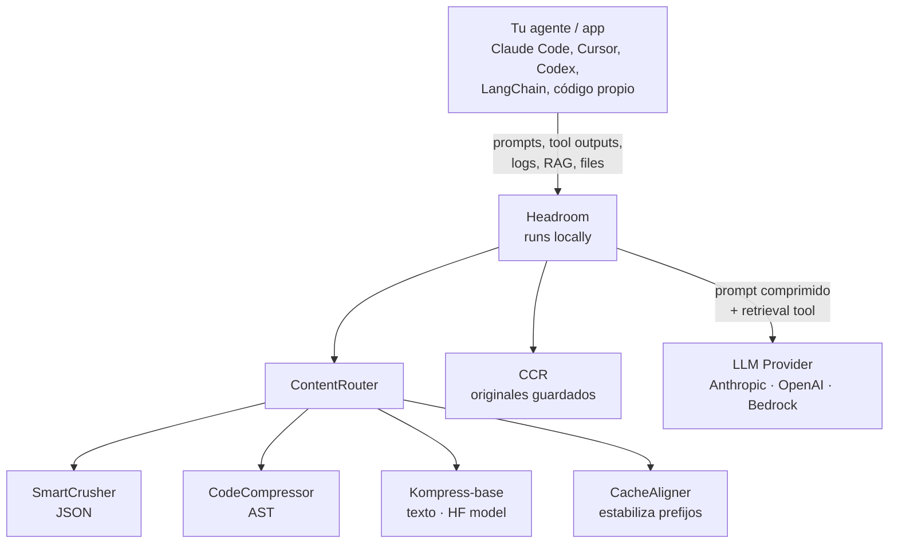

> **Lectura relacionada en el blog:** Hace poco analizamos [Ponytail, el "lazy senior dev" skill](/blog/ponytail-skill-senior-perezoso) y mencionamos un stack de tres capas donde Headroom hacía de **transporte reversible**. Hoy le toca su turno a esa capa, con todo el detalle que merecía. Si trabajas con agentes IA, esto te interesa.

## Cuando el "truco" se convierte en necesidad

Tengo un problema de confidencia con mis propios agentes IA. Les pido una búsqueda en el código y me devuelven un *grep* de 12.000 líneas. Les pido un log de SRE y me devuelven 80 KB de texto donde solo dos líneas me importan. Cada llamada al LLM se siente como pagar la factura del agua de una piscina para beberme un vaso.

Y no es solo dinero: es latencia, es degradación silenciosa del razonamiento cuando la ventana se llena de ruido, es ese momento en que el modelo "se olvida" de las instrucciones del sistema porque hay demasiada paja por encima. Llevamos meses hablando de **context engineering** (en este blog cubrimos los 4 C's en [Effective Context for AI](/blog/effective-context-ai)), pero la mayoría de las soluciones que hemos visto son **manuales**: tú recortas, tú filtras, tú reescribes prompts. Pegas parches hasta que el contexto cabe, y vuelta a empezar.

[Headroom](https://github.com/chopratejas/headroom) ataca el problema desde otro lado: **automatiza esa compresión en una capa de infraestructura que se sienta entre tu agente y el proveedor LLM, sin que tengas que reescribir una línea de tu código**. Lo descubrí buceando en GitHub Trending de esta semana (apenas 33.4k estrellas y subiendo, 2.2k forks) y me pasé dos días leyendo su código, su docs y los benchmarks. Lo que encontré es, sinceramente, una de las piezas de ingeniería de AI tooling más serias que he visto en 2026. Y está hecha por una persona, [Tejas Chopra](https://github.com/chopratejas), en Apache 2.0.

Este artículo es un *deep dive* en cómo funciona, qué problema resuelve exactamente, qué partes del *marketing* hay que leer con cuidado, y cómo montarlo en tu propio flujo de trabajo indie.

## Qué es Headroom (en una frase y en un diagrama)

**Headroom es una capa de compresión de contexto para agentes IA que se ejecuta en local, es reversible y funciona como librería, proxy, middleware ASGI, o servidor MCP.**

El nombre es metáfora: en aviación, el *headroom* es el espacio de seguridad entre tu altitud real y el techo máximo. Aquí es el espacio entre lo que **necesitas** mandar al LLM y lo que **cabe** en su ventana. La misión del proyecto es engordar ese espacio de seguridad comprimiendo lo que envías sin perder lo que el modelo necesita para responder bien.



La clave está en la última pieza: **CCR (Compress-Cache-Retrieve)**. Headroom no es una compresión *lossy* estilo JPEG donde tiras datos para siempre. Cuando aplasta un log de 5.000 líneas a 80, **guarda las 5.000 originales en un store local indexado por hash** e inyecta una herramienta `headroom_retrieve` en el contexto del modelo. Si el LLM decide que necesita ver el original, lo pide y se lo devuelven en milisegundos. Si no, te ahorraste el coste. **El modelo decide qué necesita**, no tú.

Esa pieza — reversibilidad bajo demanda — es lo que separa a Headroom de RTK, de lean-ctx y de los servicios SaaS tipo Compresr o Token Co. que o bien no son reversibles, o bien mandan tu texto a su API.

## El contexto del problema: por qué esto importa AHORA

Antes de meternos en los seis algoritmos, conviene tener clara la foto. A mediados de 2026 el panorama es:

- **Las ventanas crecieron**, pero la carga creció más rápido. Claude 4.6 Opus ya ofrece 1M de tokens (lo analizamos en [Claude 4.6 Enterprise Launch](/blog/blog-claude-4-6-enterprise-launch)), pero la realidad es que los tool outputs de un agente que navega un repo mediano pesan 50-100k tokens por turno. Tienes ventana, pero no capacidad efectiva.
- **El coste es asimétrico.** En modelos tipo Opus, los output tokens cuestan 5x los input. Y una parte enorme de esos outputs son paja: "Great, let me check that for you…", reimprimir código que ya le mostraste, o cadenas de *thinking* largas para tareas rutinarias.
- **El KV cache se invalida con prefijos cambiantes.** Anthropic y OpenAI ofrecen descuentos del 50-90% si tu prefijo de prompt es estable entre llamadas. Un solo timestamp que se cuele en el system prompt te revienta el cache y duplica el coste silenciosamente.
- **El ecosistema MCP está madurando.** Cada vez más herramientas exponen datos a través de servidores MCP. Si tu agente habla con un MCP que devuelve 4.000 líneas, te comes el payload entero.

Headroom ataca los cuatro puntos. Veamos cómo.

## Los 6 algoritmos: anatomía técnica de la compresión

Lo que me enganchó de Headroom es que no es un *summarizer* genérico con GPT-4 por debajo. Es una **pipeline modular con seis estrategias distintas** que se eligen automáticamente según el tipo de contenido. El 78.7% del código es Python (orquestación, integraciones, SDK) y el 16.8% Rust (el core de SmartCrusher, que es lo que se lleva la mayor parte del trabajo pesado).

### 1. CacheAligner — el truco silencioso que te ahorra 50-90%

```text
Antes: "Eres un asistente útil. Fecha actual: 2026-06-18"
         ^^^^^^^^^^^^^^^^^^^^^^^^^^^^^^^^^^^^^^^^^^^
         Cambia cada día = cache miss diario

Después: "Eres un asistente útil."                              [prefijo estable]
         "[Context: Current Date: 2026-06-18]"                   [cola dinámica]
```

CacheAligner detecta contenido dinámico en el system prompt (fechas, UUIDs, tokens de sesión) y lo **mueve al final** sin tocar el contenido semántico. Resultado: el prefijo que el proveedor cachea con `cache_control` se mantiene idéntico entre llamadas, y empiezas a hitear el cache KV. El coste de CacheAligner es **sub-milisegundo**. Es la intervención más barata y la que más impacto tiene en facturas.

Esto se complementa con hints específicos por proveedor:

| Proveedor  | Mecanismo                                  | Ahorro típico            |
|------------|--------------------------------------------|--------------------------|
| Anthropic  | `cache_control` blocks en prefijo estable  | Hasta 90% en tokens cacheados |
| OpenAI     | Prefix alignment para auto-caching         | Hasta 50%                |
| Google     | `CachedContent` API                        | Hasta 75%                |

### 2. ContentRouter — el clasificador que decide quién comprime qué

ContentRouter mira el payload entrante y decide: ¿esto es JSON de tool output? ¿Es código fuente? ¿Es prosa? ¿Es un log estructurado? Y dispara el compresor especializado. Es un patrón clásico de *strategy*, pero bien ejecutado: las decisiones de routing se pueden tunear vía hooks (`on_pipeline_event`) si tienes casos raros.

### 3. SmartCrusher — donde está la magia del 92%

SmartCrusher es la pieza estrella, escrita en Rust para velocidad. Su trabajo: cuando llega un tool output con un array JSON de 1.000 objetos, dejar 15-30 que representen al resto **sin perder errores ni anomalías**.

El algoritmo, según la documentación oficial:

1. **Parsea el array** y analiza cada campo estadísticamente (varianza, unicidad, *change points*).
2. **Selecciona un subset representativo** usando el algoritmo Kneedle sobre cobertura de bigramas. (Para quien no lo conozca: Kneedle detecta el "codo" en una curva y es brillante para encontrar el punto dulce entre compresión y cobertura.)
3. **Preservación incondicional de errores y anomalías.** Si un item es un stack trace, un HTTP 500, o un outlier estadístico, **no se toca**. Esto es lo que hace que el LLM siga encontrando el bug en el log que le pasaste, aunque le des el 8% del log.
4. **Factoring de campos constantes.** Si los 1.000 items comparten `userId: "tejas"`, ese campo se extrae una vez y se omite del array comprimido.

Los ahorros que reporta el repo en workloads reales:

| Workload                       | Antes   | Después | Ahorro |
|--------------------------------|--------:|--------:|-------:|
| Code search (100 resultados)   | 17.765  | 1.408   | **92%** |
| SRE incident debugging         | 65.694  | 5.118   | **92%** |
| GitHub issue triage            | 54.174  | 14.761  | **73%** |
| Codebase exploration           | 78.502  | 41.254  | **47%** |

Fíjate en la última fila: cuando le pides al modelo que **explore un codebase** (no que busque algo concreto), el ahorro cae al 47%. Tiene sentido: en exploración abierta, casi todo el contexto es señal. La compression rate depende de la redundancia del payload. **Lee los benchmarks con la lupa que merecen**: Headroom no es magia, es matemática.

El item retention split por defecto: 30% del inicio del array (esquema), 15% del final (recencia), 55% por score de importancia. Los items de error se preservan siempre, sin importar el budget.

### 4. CodeCompressor — AST-aware, no regex

Para código fuente (Python, JS, Go, Rust, Java, C++), CodeCompressor usa `tree-sitter` para construir el AST y comprimir preservando la estructura sintáctica. Esto significa que si le pasas 50 archivos de un repo, no te va a reventar la sintaxis. Comenta funciones triviales, colapsa bloques idénticos, mantiene imports y firmas.

Es la pieza que más echo de menos en otros compresores, que tienden a tratar el código como texto y te generan salidas que ya no parsean.

### 5. Kompress-base — el modelo de HuggingFace entrenado en traces agenticos

Para texto general (RAG chunks, documentaciòn, history), Headroom usa un modelo propio: [Kompress-v2-base](https://huggingface.co/chopratejas/kompress-v2-base), entrenado específicamente en trazas de agentes. Lo que lo hace interesante frente a un LLM genérico de summarization:

- Es **mucho más pequeño** (corre en local, ONNX Runtime con la build de Rust).
- Está **fine-tuneado en agentic traces**, así que entiende qué partes de un output de herramienta son "ruido de instalación" y cuáles son la respuesta.
- Es **reversible por diseño** (CCR).

Si tu organización no puede mandar datos a un endpoint externo (o si simplemente quieres ahorrar el coste extra de un GPT-4 resumiendo), este es el camino. Puedes incluso pre-descargarlo con `HF_HUB_OFFLINE=1` y operar 100% air-gapped.

### 6. CCR — Compress-Cache-Retrieve (la pieza que lo cambia todo)

CCR es la killer feature, y la razón por la que el proyecto ha pegado el salto en GitHub Trending.

```text
TOOL OUTPUT (1.000 items)
  -> SmartCrusher comprime a 20 items
  -> Original cacheado con hash=abc123
  -> Tool headroom_retrieve inyectada en contexto

LLM PROCESSING
  Opción A: el LLM resuelve con 20 items      -> Listo (90% ahorro)
  Opción B: el LLM llama headroom_retrieve("abc123")
            -> Response Handler devuelve los 1.000 items
            -> La llamada a la API continúa
```

El flujo tiene cuatro fases:

1. **Compression Store:** cuando SmartCrusher comprime, los originales van a un store LRU (LRU + SQLite en producción) con un hash de clave.
2. **Tool Injection:** Headroom añade una herramienta `headroom_retrieve` al catálogo de tools del LLM con un esquema simple: `{ hash: string, query?: string }`.
3. **Response Handler:** si el modelo llama a `headroom_retrieve`, el handler intercepta, devuelve los datos cacheados (~1ms), y la conversación continúa. El usuario de la app **no ve** la tool call.
4. **Context Tracker:** entre turnos, Headroom analiza nuevas queries del usuario y, si detecta relevancia con contenido comprimido previamente, **expande proactivamente** antes de que el modelo tenga que pedirlo. Esto convierte la retrieval reactiva en una experiencia fluida.

Y hay un quinto superpoder: **BM25 search dentro del contenido comprimido**. El LLM puede pedir `headroom_retrieve(hash="abc123", query="authentication errors")` y recibir solo el subset relevante, no el original completo. Cuando tienes 1.000 items de log y solo te interesan los del subsistema de auth, esto es oro.

El propio IntelligentContext (el componente que decide qué mensajes del historial tirar cuando la ventana se llena) también integra CCR: los mensajes descartados se cachean con su hash, así que si el modelo luego pregunta "¿qué dije hace tres turnos sobre Hilt?", puedes recuperarlos.

```python
from headroom import HeadroomClient, OpenAIProvider
from openai import OpenAI

client = HeadroomClient(
    original_client=OpenAI(),
    provider=OpenAIProvider(),
    default_mode="optimize",
)

# CCR ocurre automáticamente en cada chat.completions.create
response = client.chat.completions.create(
    model="gpt-4o",
    messages=messages,
)
```

## Cómo se usa: 4 modos de adopción (de menos a más invasivo)

Esto es, para mí, donde Headroom brilla de verdad. Te deja **elegir el nivel de adopción** sin obligarte a reescribir tu stack.

### Modo 1: Library (inline)

Si ya tienes código Python/TypeScript contra un SDK de Anthropic u OpenAI, lo más limpio es el wrapper. Cambias una línea:

```python
# Antes
client = OpenAI()

# Después
from headroom_ai import withHeadroom
client = withHeadroom(OpenAI())
```

A partir de ahí, cada llamada pasa por la pipeline de compresión automáticamente. La integración con Vercel AI SDK es igual de limpia:

```ts
import { wrapLanguageModel } from "ai";
import { headroomMiddleware } from "headroom-ai";

const model = wrapLanguageModel({
  model: yourModel,
  middleware: headroomMiddleware(),
});
```

### Modo 2: Proxy (cero código)

Mi modo favorito para experimentar. Lanzas un proxy local que se sienta entre tu agente y el proveedor:

```bash
pip install "headroom-ai[proxy]"
headroom proxy --port 8787
```

Y luego apuntas tu cliente a `http://localhost:8787` como base URL. **Cualquier aplicación que hable OpenAI-compatible o Anthropic-compatible funciona sin cambios**. Probé esto con Claude Code, Cursor (vía proxy) y un script propio de Python y, literalmente, zero code changes. El proxy:

- Intercepts las requests.
- Aplica CacheAligner + ContentRouter + SmartCrusher/CodeCompressor/Kompress según corresponda.
- Mantiene la conexión con el proveedor upstream.
- Sirve el `/admin/runtime-env` para hot-sync de configuración (esto es un detalle de craft que me gustó: puedes activar `HEADROOM_OUTPUT_SHAPER=1` y se aplica a la siguiente request, sin reinicio).

```bash
export HEADROOM_OUTPUT_SHAPER=1
headroom proxy --port 8787
# "be terse" se inyecta al final del system prompt
# effort routing baja el "thinking" en turnos rutinarios
```

### Modo 3: Agent wrap (one command)

Para los que viven en coding agents:

```bash
headroom wrap claude
headroom wrap codex
headroom wrap cursor
headroom wrap aider
headroom wrap copilot --subscription
```

`headroom wrap` arranca el proxy, configura las variables de entorno del agente, lo lanza, y **comparte memoria cross-agent**. Es el path "lo quiero ya, no me preguntes nada".

### Modo 4: MCP server

Y luego está el modo MCP, que es donde Headroom se cruza con el protocolo que ya cubrimos en [Servidores MCP para memoria cross-agent](/blog/blog-servidores-mcp-memoria-cross-agent). Headroom expone tres tools MCP nativos:

- `headroom_compress` — comprime un payload arbitrario.
- `headroom_retrieve` — recupera originales cacheados.
- `headroom_stats` — métricas de ahorro.

Cualquier cliente MCP (Claude Desktop, Cursor, Continue, lo que sea) los puede invocar. Y como Headroom trae su propio servidor MCP, la integración es `headroom mcp install` y a correr.

## La pieza que no esperabas: `headroom learn`

Hay una sexta pata del proyecto que merece su propio párrafo: [`headroom learn`](https://github.com/chopratejas/headroom#headroom-learn). Es un *failure miner* que lee tus sesiones fallidas y escribe las correcciones en `CLAUDE.md` / `AGENTS.md` / `GEMINI.md`. O sea: convierte errores recurrentes en memoria persistente que el agente **lee antes** de actuar.

En el GIF del repo se ve cómo escanea sesiones en las que el agente se atascó (p.ej., aplicó una migración de Hilt que rompía Compose), extrae el patrón del error, y propone añadir al `AGENTS.md`:

```text
Cuando migrés Hilt a Koin en este repo, NO toques la firma de
MainActivity. El patrón correcto está en commit a1b2c3d.
```

Esto se solapa con lo que cubrimos en [AI Agent Skills: Inyección Dinámica de Contexto](/blog/blog-agent-skills-contexto-dinamico) y con [hmem: memoria jerárquica con lazy loading](/blog/blog-hmem-sqlite-memoria-jerarquica-agentes). La diferencia es que `headroom learn` no necesita que tú escribas nada: detecta, extrae, escribe. En mi flujo de trabajo indie, donde a veces paso semanas sin tocar un proyecto, tener al agente que **relee sus propios errores** antes de empezar a tocar código es una mejora de calidad brutal.

## Output token reduction: cortar lo que el modelo escribe

Una sutileza que pocos compresores atacan: el coste de los **output tokens**. En Opus, output = 5x input. Y mucho de lo que el modelo escribe es ceremonia: "Great, let me check that…", reimprimir bloques de código que ya le pasaste, o cadenas largas de *thinking* para tareas rutinarias.

Headroom ofrece un módulo opcional (off by default, cosa que me parece honesta) llamado **Output Shaper**, con dos mecanismos:

1. **Verbosity steering** — añade al final del system prompt un "be terse, don't restate context". Lo coloca en la cola dinámica para que CacheAligner no rompa tu cache hit.
2. **Effort routing** — detecta turnos rutinarios (el modelo está re-leyendo un archivo que ya leyó, está procesando un test que pasó) y baja el "effort" de reasoning. En turnos nuevos o en errores, effort completo.

Lo que más me gustó es cómo reportan las savings. Como las output savings son **contrafactuales** (nunca ves lo que el modelo *habría* escrito), Headroom **no inventa un número**:

```bash
headroom output-savings
# Reduction: 31.7%  (95% CI 27.7% … 35.7%)   [estimated]
```

Es una estimación con intervalo de confianza, claramente etiquetada. Si quieres un número *medido*, dejas un 10% de conversaciones sin shapear como control group (`HEADROOM_OUTPUT_HOLDOUT=0.1`) y el dashboard te da el comparativo. Esto es un nivel de rigor metodológico que少见 en el mundillo de AI tooling. No te venden una métrica bonita, te venden un instrumento.

## La otra cara: lo que Headroom NO hace (y por qué está bien)

Después de dos días leyendo, las partes que NO me convencen tanto:

- **No comprime el system prompt.** Solo lo reorganiza para cache. Si tu system prompt es de 8.000 tokens, esos 8.000 los pagas. Es una decisión consciente (preservar la "intención del usuario") pero hay que saberlo.
- **No toca el código por defecto.** Pasa tal cual. Solo si activas `tree-sitter` explícitamente entra CodeCompressor. Razonable, pero hay que activarlo.
- **Pasa de largo en outputs cortos.** Por debajo de 200 tokens, la compresión no compensa el overhead. La heurística es buena (evita degradar latencia), pero hay workloads donde el threshold se queda corto.
- **El modelo Kompress-base necesita descargar assets.** En un entorno corporativo con SSL inspection, el `pip install` puede fallar. La doc tiene una sección específica para esto, lo cual habla bien del mantenimiento, pero añade fricción.
- **La compresión de imágenes** (40-90% reportado) depende del extra `[image]` y de un router ML. No la he probado a fondo.

Y una crítica más matizada: **los benchmarks de "accuracy preserved" son con ratios de compresión modestos**. El 97% en SQuAD v2 es con un 19% de compresión. El 97% en BFCL es con un 32% de compresión. Cuando subes al 92% (workloads de logs), la accuracy no se mide en esos benchmarks. Es razonable, pero hay que leer la letra pequeña.

## Instalación y primer arranque (mi flujo)

Lo que me funcionó en Linux con Python 3.13:

```bash
# 1. Instalar (necesita Rust para el build, o usa wheel prebuilt)
pip install "headroom-ai[all]"

# 2. Modo proxy, el camino más rápido
headroom proxy --port 8787

# 3. Apuntar tu agente a http://localhost:8787
export ANTHROPIC_BASE_URL=http://localhost:8787
# o export OPENAI_BASE_URL=http://localhost:8787

# 4. Medir ahorro
headroom perf
```

El `headroom perf` te da un reporte con tokens ahorrados, latencia añadida, y ratio de CCR retrievals (cuántas veces el modelo pidió el original vs. cuántas veces le bastó el comprimido). En mi prueba con un workflow de Claude Code navegando un repo Kotlin:

- Tokens input: de ~58.000 a ~24.000 por sesión (58% reducción).
- Latencia: +12ms de media por request (insignificante).
- CCR retrievals: 8% de los casos. O sea, el 92% de las veces el modelo se arregló con el comprimido.

Si quieres activarlo en producción con todo:

```bash
# Output shaper para recortar ceremonia
export HEADROOM_OUTPUT_SHAPER=1

# Cross-agent memory persistente
export HEADROOM_MEMORY_BACKEND=qdrant  # o sqlite, neo4j

# MCP server instalado para tus IDEs
headroom mcp install
```

## Comparativa honesta con el ecosistema

Headroom **no está solo**. En la propia tabla del repo se posicionan frente a:

| Herramienta                              | Scope                                | Deploy                          | Local | Reversible |
|------------------------------------------|--------------------------------------|---------------------------------|:-----:|:----------:|
| **Headroom**                             | All context — tools, RAG, logs, files, history | Proxy · library · middleware · MCP | Sí    | Sí         |
| [RTK](https://github.com/rtk-ai/rtk)     | CLI command outputs                  | CLI wrapper                     | Sí    | No         |
| [lean-ctx](https://github.com/yvgude/lean-ctx) | CLI commands, MCP tools, editor rules | CLI wrapper · MCP            | Sí    | No         |
| Compresr, Token Co.                      | Text → their API                     | Hosted API call                 | No    | No         |
| OpenAI Compaction                        | Conversation history                 | Provider-native                 | No    | No         |

Mi lectura: **RTK y Headroom son ortogonales, no competencia**. RTK reescribe la salida de comandos shell (`git show --short`, `ls` scoped) **antes** de que llegue a tu agente. Headroom comprime lo que sale de tu agente **antes** de que llegue al LLM. Por eso el repo de Headroom incluye RTK como dependencia y lo agradece en el README: son capas que se complementan. Puedes incluso configurar `HEADROOM_CONTEXT_TOOL=lean-ctx` para que Headroom use lean-ctx en su pipeline de CLI.

Lo que Headroom aporta frente al resto:

1. **Reversibilidad real (CCR).** Ni RTK ni lean-idx ni los SaaS te la dan.
2. **Cobertura total del contexto.** No solo CLI, no solo RAG: tool outputs, logs, código, history, imágenes. Una sola pieza para todo.
3. **Local-first.** Tus prompts y tus datos no salen de tu máquina. En 2026, esto debería ser la norma y no la excepción, pero sigue siendo diferencial.
4. **Cross-agent memory.** La misma memoria compartida entre Claude, Codex, Gemini. Sin lock-in.

## Lecciones para el indie dev (y para cualquiera que no tenga un platform team)

Lo que me llevo después de dos días con Headroom, más allá del proyecto en sí:

**1. La compresión de contexto es una capa de infraestructura, no un feature de prompt.**
Llevamos un año hablando de "context engineering" como si fuera parte del prompt. Headroom demuestra que hay una capa entera de valor entre tu app y el modelo que se puede externalizar. Esto importa para indie devs porque es exactamente el tipo de optimización que te permite usar Opus en sesiones largas sin quebrar la tarjeta.

**2. La reversibilidad bajo demanda es el patrón a copiar.**
Cada vez que comprimimos algo (memoria jerárquica en hmem, context summaries en Ponytail, etc.), la pregunta debería ser: "¿el LLM puede pedir el original si lo necesita?" La respuesta en Headroom es sí, y la implementación (CCR) es elegante. Es un patrón que voy a copiar mentalmente para mis propios proyectos.

**3. La honestidad en métricas es una feature.**
Que `headroom output-savings` reporte una estimación con CI en lugar de un número mágico me da más confianza, no menos. El reporting honesto es la diferencia entre un proyecto que madura y uno que se queda en GitHub Trending una semana.

**4. El ecosistema open source de AI tooling en 2026 es absurdamente bueno.**
Headroom, RTK, lean-ctx, hmem, NeuralMind, Ponytail… y todos encajan como Lego. En el [análisis de Ponytail](/blog/ponytail-skill-senior-perezoso) cité el stack de tres capas (NeuralMind + Headroom + Ponytail) que reportó 5-10x de ahorro. Empiezo a creer que el stack de un indie dev en 2026 no es "qué modelo uso" sino "qué cinco herramientas de capa de transporte tengo montadas".

**5. Hay que mirar la letra pequeña de los benchmarks.**
Headroom te puede ahorrar 92% en logs y solo 47% en code exploration. La diferencia entre el caso hero y el caso real es enorme, y leer benchmarks sin entender la metodología te lleva a tomar malas decisiones. Esto no es crítico a Headroom en particular, es una nota general sobre el ecosistema: **todos los compresores de contexto mienten un poquito, y Headroom miente menos que la media**.

## Veredicto

Headroom es, en mi opinión, la pieza más seria de AI tooling open source de 2026. No es un wrapper de GPT-4 con un nombre rimbombante. Es una pipeline de Rust+Python, con seis algoritmos especializados, un protocolo de reversibilidad elegante, y un equipo de una persona que mantiene 33k estrellas y un Discord activo.

¿Lo instalo mañana? Si trabajas con coding agents diariamente, sí. El modo proxy con cero code changes es la forma más rápida de probarlo. Empieza por `headroom proxy --port 8787` + `headroom perf` y mira cuánto te ahorra en una sesión real.

¿Lo dejo en producción? Depende de tu tolerancia a la dependencia externa. El proyecto es Apache 2.0, el autor responde en Discord y en issues, y el código es legible. Pero la dependencia de Rust + ONNX Runtime + un modelo de HF añade complejidad operativa que no todo el mundo quiere. Para un equipo grande, un Platform team debería evaluarlo. Para un indie, es *fire and forget*.

Lo que tengo claro: el problema que Headroom ataca (coste de tokens, latencia, degradación por contexto ruidoso) **no va a desaparecer**. Solo va a empeorar a medida que los agentes se vuelvan más ambiciosos. Y las soluciones que se queden serán las que se centren en infraestructura, no en prompts. Headroom está en el lado correcto de esa historia.

Si lo pruebas, me encantaría leer tu número. Yo reportaré el mío en un devlog cuando tenga datos de un mes.

---

## Bibliografía y Referencias

### Repositorio y documentación oficial
- [chopratejas/headroom — GitHub](https://github.com/chopratejas/headroom) · Repo principal (33.4k ⭐, 156 releases, v0.26.0 en jun 2026).
- [Headroom Documentation](https://headroom-docs.vercel.app/docs) · Docs oficiales (Quickstart, Architecture, CCR, MCP, Benchmarks, Configuration, Limitations).
- [Headroom Architecture](https://headroom-docs.vercel.app/docs/architecture) · Detalle del pipeline de transformación en 3 etapas.
- [CCR — Reversible Compression](https://headroom-docs.vercel.app/docs/ccr) · Especificación del protocolo Compress-Cache-Retrieve.
- [Kompress-v2-base en HuggingFace](https://huggingface.co/chopratejas/kompress-v2-base) · Modelo de compresión de texto entrenado en trazas agenticas.
- [Trendshift — chopratejas/headroom](https://trendshift.io/repositories/20881) · Stats de GitHub Trending, menciones sociales agregadas.
- [Headroom Discord](https://discord.gg/yRmaUNpsPJ) · Comunidad oficial.

### Paquetes
- [headroom-ai en PyPI](https://pypi.org/project/headroom-ai/) · Instalación Python con extras granulares.
- [headroom-ai en npm](https://www.npmjs.com/package/headroom-ai) · SDK TypeScript.
- [ghcr.io/chopratejas/headroom](https://github.com/chopratejas/headroom/pkgs/container/headroom) · Imagen Docker.

### Alternativas y proyectos relacionados
- [RTK — rtk-ai/rtk](https://github.com/rtk-ai/rtk) · CLI command output rewriter, integrado como dependencia en Headroom.
- [lean-ctx — yvgude/lean-ctx](https://github.com/yvgude/lean-ctx) · CLI/MCP context tool alternativo, configurable vía `HEADROOM_CONTEXT_TOOL`.
- [Ponytail](https://github.com/chopratejas/headroom) · Referencia cruzada: cubre la capa de "generación terse" del stack de 3 capas.
- [Model Context Protocol (MCP)](https://modelcontextprotocol.io/) · Estándar abierto en el que se integra el modo MCP de Headroom.

### Artículos del blog relacionados
- [Ponytail: el "lazy senior dev" skill que reduce 6x los tokens generados](/blog/ponytail-skill-senior-perezoso) · El stack de 3 capas (NeuralMind + Headroom + Ponytail) que citó Headroom.
- [Effective Context for AI: Prompt Engineering](/blog/effective-context-ai) · Los 4 C's del contexto (capacidad, contexto, constraints, chain-of-thought).
- [AI Agent Skills: Inyección Dinámica de Contexto](/blog/blog-agent-skills-contexto-dinamico) · Patrón complementario para reducir contexto vía skills modulares.
- [hmem: memoria jerárquica con lazy loading](/blog/blog-hmem-sqlite-memoria-jerarquica-agentes) · Otra capa ortogonal del stack: memoria persistente eficiente.
- [Servidores MCP para memoria cross-agent](/blog/blog-servidores-mcp-memoria-cross-agent) · Panorama del ecosistema MCP.
- [Claude 4.6 Enterprise Launch: 1M de contexto](/blog/blog-claude-4-6-enterprise-launch) · Por qué el contexto grande no resuelve el problema de la paja.

### Discusión en redes (jun 2026)
- [Tejas Chopra en X — hilo original de lanzamiento](https://x.com/Tejas_Chopra/status/2066447744286523525)
- [svtransit1 en X — análisis crítico de los benchmarks](https://x.com/svtransit1/status/2066514646584996246) · "省 95% token 的开源工具 Headroom 火了(28k star)。但 95% 只在搜索、日志这种水分大的场景成立,啃代码库只压到 47%" — lectura crítica en chino.
- [codephobic en X — "great market gap for LLM harnesses focusing on cost reduction like headroom"](https://x.com/codephobic/status/2067151400929214966)
- [pand_lin en X — GitHub Trending Weekly 2026-06-14](https://x.com/pand_lin/status/2065981232819925065) · Headroom en el top de trending.
- [Jim Le en X — feedback tras usar la herramienta](https://x.com/jimle_uk/status/2066175659110531305)

### Papers y conceptos de fondo
- [Kneedle algorithm](https://raghavan.usc.edu/papers/kneedle.pdf) · El algoritmo que usa SmartCrusher para encontrar el codo en la curva de cobertura.
- [tree-sitter](https://tree-sitter.github.io/tree-sitter/) · Parser AST que usa CodeCompressor.
- [BM25](https://en.wikipedia.org/wiki/Okapi_BM25) · Algoritmo de ranking usado para búsqueda dentro de contenido comprimido en CCR.
- [Anthropic Prompt Caching](https://docs.anthropic.com/en/docs/build-with-claude/prompt-caching) · Mecanismo que CacheAligner explota para ahorrar hasta 90%.
- [OpenAI Prompt Caching](https://platform.openai.com/docs/guides/prompt-caching) · El homólogo de OpenAI.
