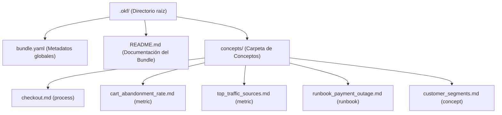
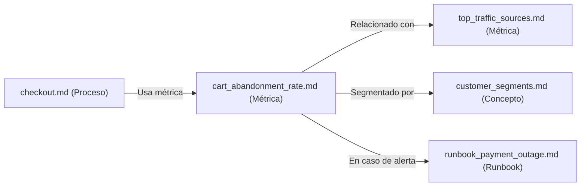

# OKF: lo que Google acaba de lanzar (y por qué debería importarte aunque no uses Google)

## 1. APERTURA — El gancho

Imagina esto. Son las 11 de la noche. Estás terminando de entrenar a un agente para que responda tickets de soporte de tu empresa. Llevas semanas. Le has pasado PDFs de manuales. Le has pegado links a Notion. Le has abierto una pestaña con la tabla de BigQuery donde viven los datos de clientes. Y aún así, cuando le preguntas algo medianamente específico — "¿cuál es el SLA del plan Pro?" — te contesta algo genérico que no tiene nada que ver.

Tienes la sensación de que sabe mucho pero no sabe nada de tu negocio. Como un becario brillante que lleva tres meses en la empresa y todavía no sabe dónde está el café.

Esa frustración tiene nombre técnico: falta de contexto portable. Y no es un problema nuevo. Lo tiene tu equipo. Lo tiene el equipo de al lado. Lo tiene la mitad de la industria. Cada uno lo resuelve por su lado, con soluciones caseras, propietarias, incompatibles entre sí.

El 12 de junio de 2026, Google Cloud publicó silenciosamente algo llamado OKF (Open Knowledge Format). No fue un keynote. No hubo fuegos artificiales. Fue un post técnico con un repo en GitHub. Y, sin embargo, podría ser una de esas piezas pequeñas y aburridas que terminan cambiando cómo construimos agentes. Te explico por qué.

---

## 2. POR QUÉ ESTE TEMA Y POR QUÉ AHORA

Muy pocos blogs en español han hablado de OKF todavía. La conversación está concentrada en inglés y sobre todo en círculos muy técnicos (data engineering, AI infra). Pero esto no es un tema solo para data engineers. Si montas agentes, si trabajas con IA, si tienes un wiki en tu empresa, si simplemente te interesa saber hacia dónde va el ecosistema: te toca.

Y lo de "ahora" no es marketing: la especificación tiene apenas un mes de vida. Hay una ventana corta en la que todavía puedes posicionarte como alguien que se lo tomó en serio antes que la mayoría.

Contexto histórico rápido: Google lleva años intentando entrar en el espacio del "knowledge management para IA". Knowledge Graph, Vertex AI Search, Agentspace... todos productos cerrados. OKF es el primer intento abierto y neutral de su parte. Eso, viniendo de Google, no es trivial.

En los próximos 15 minutos vamos a desmontar qué es OKF exactamente, por qué existe, cómo se usa, qué problema resuelve de verdad, qué problemas no resuelve, y mi opinión honesta sobre si esto se queda o se muere.

---

## 3. EL PROBLEMA DE FONDO

### 3.1 El conocimiento organizacional es un desastre

Describe la realidad de cualquier empresa: el conocimiento se acumula como sedimentos geológicos. Hay PDFs abandonados en carpetas compartidas de Drive, páginas de Notion desactualizadas hace tres años, tickets resueltos en Zendesk con soluciones de parche, comentarios perdidos en PRs de GitHub y hilos de Slack que se hunden en el olvido del scroll infinito. Todo esto se conoce como conocimiento tribal: cosas que la gente sabe, pero que no están documentadas en ningún lugar de forma coherente.

Estudios de consultoras como IDC y Gartner llevan años repitiendo la misma cifra: entre el 60% y el 80% del conocimiento corporativo está no estructurado. Pero seamos sinceros, "no estructurado" es un eufemismo técnico para "está disperso por todas partes y nadie sabe qué versión es la buena". 

Cuando la información la consumían humanos, este desorden era molesto pero manejable. Un humano sabe interpretar la ambigüedad, sabe a quién preguntarle en Slack o descarta un documento si ve que la fecha de actualización es de 2022. Sin embargo, en la era de los agentes de IA, esto es un cuello de botella insalvable. A un LLM no le puedes decir "búscate la vida en el drive". El agente necesita el conocimiento depurado, estructurado y listo para ser consumido.

### 3.2 Los agentes son listos pero ignorantes

Un LLM de última generación ha leído casi todo internet. Sabe explicarte la teoría de la relatividad general, estructurar un query SQL complejo o escribir un poema en alejandrinos. Pero no sabe absolutamente nada de tu empresa. No sabe qué significa tu columna interna `churn_risk`, cómo se calcula la tasa de conversión en tu pasarela de pago o por qué tu proceso de onboarding tiene 14 pasos obligatorios en vez de 5.

Para compensar esta ignorancia profunda del negocio, los equipos suelen cometer tres errores típicos:
1. **Pegar contexto a mano en cada prompt:** Funciona al principio, pero no escala. El tamaño del contexto se dispara, la latencia sube y terminas pagando fortunas en tokens por repetir la misma información una y otra vez.
2. **RAG clásico (Retrieval-Augmented Generation):** Consiste en trocear (chunkear) tus documentos, pasarlos por un modelo de embeddings y guardarlos en una base de datos vectorial para hacer búsquedas de similitud semántica. Es la solución de moda, pero es costosa, opaca y frágil. Si el algoritmo de chunking corta un párrafo a la mitad, el agente puede perder el contexto clave y alucinar la respuesta.
3. **Sistemas propietarios de metadatos:** Cada equipo de desarrollo inventa su propio esquema JSON o archivo de texto para darle contexto al agente, lo que nos lleva directamente al tercer problema.

### 3.3 El efecto "isla de conocimiento"

El resultado final de este caos es la fragmentación absoluta. El agente diseñado para soporte no sabe lo que sabe el agente de marketing. El CRM-Agent no entiende el modelo de datos que maneja el data warehouse. Cada equipo construye su propia "isla de conocimiento" con APIs y formatos incompatibles.

Lo peor viene cuando decides cambiar de proveedor de LLM (por ejemplo, migrar de OpenAI a Anthropic o usar un modelo local Llama/DeepSeek) o cuando decides pasar de un framework de agentes como LangChain a otro como AutoGen o Claude Code. Te das cuenta de que tienes que reconstruir toda la capa de contexto desde cero porque estaba acoplada a las herramientas propietarias. 

Aquí es donde entra la promesa de OKF.

---

## 4. QUÉ ES OKF, EXACTAMENTE

### 4.1 Definición corta

**OKF (Open Knowledge Format)** es un estándar abierto publicado por Google Cloud el 12 de junio de 2026. Actualmente se encuentra en su versión 0.1 (Draft) bajo la licencia Apache 2.0.

### 4.2 Definición larga

Es una especificación técnica diseñada para representar el conocimiento organizacional — tablas de datos, métricas de negocio, documentación de APIs, procesos internos, runbooks de infraestructura y decisiones de arquitectura — en un formato unificado que tanto humanos como agentes de IA puedan leer y escribir por igual. 

Lo revolucionario de OKF no es su complejidad, sino su simplicidad radical: no requiere un SDK específico, no tiene un runtime asociado y está diseñado para evitar cualquier tipo de lock-in con proveedores cloud. Google lo describe con una frase que ya se ha vuelto un mantra en la comunidad: 

> "OKF formalizes the LLM-wiki pattern into a portable, interoperable format." — Google Cloud

### 4.3 Lo que NO es

Para entender OKF también hay que saber qué no es:
* **No es una plataforma:** No tienes que darte de alta en ningún sitio para usarlo.
* **No es una API:** No haces llamadas HTTP a un servidor de Google para interpretar un bundle.
* **No es un producto SaaS:** No hay suscripciones mensuales ni costes ocultos.
* **No es un esquema JSON nuevo:** Aunque a los ingenieros nos encante estructurar todo en JSON o Protocol Buffers, OKF apuesta por algo mucho más legible y universal.

Es, literalmente, una forma acordada de escribir y enlazar archivos de texto plano. Si JSON Schema es el acuerdo sobre cómo describir la forma de los datos, OKF es el acuerdo sobre cómo describir el significado y el contexto que rodea a esos datos.

---

## 5. LA ANATOMÍA DE UN BUNDLE OKF

### 5.1 Las piezas

Un "Bundle" de OKF es un directorio físico que contiene una estructura de archivos muy simple y predecible:

* **Concept:** Cada unidad de conocimiento (por ejemplo, la definición de una métrica o un proceso de despliegue) se escribe en un archivo Markdown (`.md`) dentro de una carpeta llamada `concepts/`.
* **Bundle Metadata:** Un archivo de configuración llamado `bundle.yaml` en la raíz del directorio que describe los metadatos globales del bundle (nombre, versión, mantenedor, descripción).
* **Frontmatter:** El bloque YAML que inicia cada archivo Markdown de concepto. El único campo estrictamente obligatorio por la especificación es `type` (que define si el concepto es una `metric`, `process`, `table`, `runbook`, etc.). Todo lo demás (título, descripción, recursos vinculados, tags y fecha de actualización) es opcional.
* **Grafo de Conocimiento:** Las relaciones entre conceptos no se definen en una base de datos compleja, sino mediante enlaces Markdown estándar (`[texto](archivo.md)`). Al conectar un concepto con otro, se genera de manera orgánica un grafo navegable que los LLMs pueden seguir recursivamente para construir contexto.

### 5.2 Estructura de directorios de un Bundle OKF

El siguiente diagrama Mermaid representa la anatomía típica de la carpeta `.okf/` en la raíz de un proyecto:



Y aquí tenemos un diagrama que representa el grafo de interconexión entre conceptos de ejemplo:



### 5.3 Ejemplo real de un concepto: `cart_abandonment_rate.md`

Este es un ejemplo de cómo se escribe un concepto OKF real, en este caso para definir la tasa de abandono de carrito en un e-commerce:

```markdown
---
type: metric
title: Tasa de abandono del carrito
description: Porcentaje de usuarios que inician el checkout pero no completan el pago.
resource: bigquery://analytics.weekly_cart_abandonments
tags: [ecommerce, kpi, weekly]
updated: 2026-06-15
---

# Tasa de abandono del carrito

Esta métrica se calcula **semanalmente** desde la tabla `analytics.weekly_cart_abandonments` en BigQuery.

## Fórmula

abandono = sesiones_que_inician_checkout - sesiones_que_completan_pago
tasa_abandono = abandono / sesiones_que_inician_checkout

## Por qué importa

Es uno de los tres indicadores principales del funnel de conversión. Junto con el [tráfico semanal](top_traffic_sources.md) y los [segmentos de cliente](customer_segments.md), define la salud operativa de nuestra tienda online.

## Runbooks relacionados

Si la tasa de abandono supera el 15% en un intervalo inter-semanal, es imperativo consultar de inmediato el [runbook de caída de pagos](runbook_payment_outage.md) para descartar problemas en la pasarela de Stripe.
```

Y este es el aspecto del archivo `bundle.yaml` que acompaña al directorio:

```yaml
name: ecommerce-context
version: 0.1.0
description: Contexto base estructurado para los agentes de IA del equipo de e-commerce.
maintainer: data-platform@example.com
```

Fíjate en el ejemplo: no hay nada extraño. Es Markdown puro. Un YAML que ya dominas. Enlaces que cualquier editor de texto plano interpreta. 

### 5.4 La magia de la simplicidad

Que un bundle OKF se pueda abrir con un simple bloc de notas, renderizar perfectamente en GitHub o GitLab, indexar en la línea de comandos con un simple `grep`, y versionar línea a línea con `git` es una decisión de diseño completamente deliberada. Google ha querido que el formato sea tan sencillo que no requiera ninguna infraestructura para existir. No quieren que dependas de su nube (GCP) para poder leer o transferir tu propio conocimiento organizacional.

---

## 6. LOS TRES PRINCIPIOS DE DISEÑO

La especificación de OKF se sustenta sobre tres pilares conceptuales inamovibles:

1. **"Just Markdown":** El contenido de cada concepto es Markdown plano. Cualquier editor lo abre. GitHub lo renderiza por defecto. Las herramientas tradicionales de búsqueda lo indexan sin procesadores especiales. Si tu equipo ya sabe escribir Markdown (y lleva haciéndolo los últimos 20 años), ya sabe escribir conceptos en OKF.
2. **"Just files":** Un bundle de OKF no requiere bases de datos vectoriales, servidores dedicados ni endpoints HTTP complejos. Es solo un directorio de archivos en el disco. Lo puedes comprimir en un `.tar.gz`, versionarlo en Git, subirlo a un bucket S3, o servirlo como archivos estáticos a través de un servidor Nginx.
3. **"Just YAML frontmatter":** La estructura justa y necesaria para que el bundle sea consultable mediante código. El único campo obligatorio en el frontmatter es `type`, lo que permite clasificar los archivos. Todo lo demás es opcional y extensible. Si un parser no entiende un metadato personalizado, simplemente lo ignora.

> "No inventamos nada. Es Markdown. Es un archivo. Es un poquito de YAML. Es el formato que tu equipo ya estaba usando de manera informal, pero ahora con un nombre y unas reglas." — Google Cloud, parafraseando a su propio equipo de ingeniería durante el lanzamiento.

Y esta simplicidad tiene un porqué. Esto no ha salido de la nada; es la formalización de una corriente que se venía gestando en la comunidad desde hace años.

---

## 7. EL LINAJE: DE OBSIDIAN A KARPATHY A GOOGLE

### 7.1 Antes de OKF: el wiki personal y los grafos locales

Si usas herramientas como Obsidian, Notion, Roam Research, Logseq o Anki, esto te va a sonar muy familiar. El concepto de mantener notas interconectadas mediante enlaces internos (lo que Obsidian llama un *vault*) ha sido la base de la gestión del conocimiento personal (PKM) durante años.

Los desarrolladores y creadores ya estructurábamos nuestros wikis de esta manera: archivos Markdown planos que enlazan a otros para navegar relaciones. Teníamos grafos de conocimiento locales increíbles corriendo en nuestras computadoras, pero nos faltaba un paso: un estándar común para que los agentes de IA pudieran explotar ese mismo grafo sin necesidad de importar bases de datos propietarias.

### 7.2 La conversación cambió con Karpathy

A finales de 2024, Andrej Karpathy (ex-Tesla, ex-OpenAI) publicó un gist que encendió la chispa en la comunidad de desarrollo de IA. En él proponía lo que llamó el **"LLM Wiki pattern"**:

La idea consistía en mantener todo el conocimiento curado e instrucciones de un proyecto de software en un directorio de archivos Markdown dentro del propio repositorio de código. De este modo, los agentes de codificación y modelos de lenguaje podrían leer ese directorio de la misma manera que un desarrollador humano lee la documentación técnica (`README.md` o `CONTRIBUTING.md`) para entender cómo funciona la arquitectura de un sistema.

A raíz de esta propuesta, la industria empezó a adoptar de manera informal archivos como:
* [AGENTS.md](file:///home/arceappspc/Projects/ArceApps/arceapps.github.io/src/content/blog/es/agents-md-estandar.md) en la raíz de los repositorios para guiar el comportamiento de los asistentes.
* `CLAUDE.md` diseñado específicamente para que herramientas como Claude Code entiendan las reglas de testing, formateo y builds del proyecto.
* Wikis internos escritos a mano en Markdown dentro del subdirectorio `.github/` o `docs/`.

### 7.3 Lo que faltaba: el sobre-acuerdo estándar

El gran problema de esta ola informal es que cada equipo lo hacía a su manera. Unos ponían la descripción en un título H2, otros en un bloque de comentarios, y otros usaban etiquetas HTML a mano. No había una convención común para campos como recursos vinculados, tipos de documentos o mantenedores. No había forma de compartir contexto entre agentes de distintos proveedores de manera transparente.

Google vio esta fragmentación y propuso OKF no para inventar un formato nuevo, sino para actuar como un "sobre-acuerdo mínimo". Es un estándar que dice: "Oye, si vas a usar el patrón LLM-Wiki, usemos todos este conjunto mínimo de reglas para que las herramientas de toda la industria puedan leerlo".

Es un paralelismo exacto con lo que ocurrió con Markdown en 2004. La gente ya escribía correos electrónicos y textos planos con marcas visuales informales. Aaron Swartz y John Gruber no inventaron una sintaxis de la nada; simplemente dijeron "usemos todos estas reglas sencillas para convertir texto a HTML". Y funcionó. OKF aspira a lograr exactamente lo mismo para el conocimiento de IA.

---

## 8. EJEMPLO PRÁCTICO PASO A PASO

### 8.1 Monta tu primer Bundle en 5 minutos

Implementar un bundle OKF en tu proyecto local es extremadamente sencillo y no requiere ninguna herramienta costosa. Sigue estos pasos:

1. **Crea la carpeta de configuración:** En la raíz de tu proyecto, crea una carpeta llamada `.okf/`.
2. **Define los metadatos globales:** Crea el archivo `bundle.yaml` en la raíz de esa carpeta y especifica el nombre, la versión, una breve descripción y el correo del mantenedor.
3. **Crea la estructura de conceptos:** Dentro de `.okf/`, crea el subdirectorio `concepts/`. Aquí es donde vivirán tus definiciones de conocimiento en archivos Markdown.
4. **Escribe tu primer concepto:** Crea un archivo como `processes_deploy.md` e inicia el archivo con el bloque de frontmatter YAML definiendo el `type: process`, `title`, y otros metadatos relevantes. Escribe el resto en Markdown puro explicando el proceso.
5. **Vincula conceptos:** Crea otro concepto (por ejemplo, `runbook_database_backup.md` de `type: runbook`) y enlaza el primer archivo al segundo usando la sintaxis de enlace de Markdown: `[Proceso de Despliegue](processes_deploy.md)`.
6. **Sube los cambios a tu repositorio:** Haz `git add .okf/` y realiza un commit. A partir de este momento, cualquier agente que tenga acceso a tu repositorio podrá leer y navegar tu grafo de conocimiento.

### 8.2 Cómo consume el contexto un agente de IA

La gran diferencia de este patrón es la simplicidad del flujo de consumo. En lugar de requerir que cargues bases de datos vectoriales en memoria, ejecutes pipelines de embeddings y realices búsquedas vectoriales complejas, el agente simplemente:

1. Lee la carpeta `.okf/` al inicio de su ejecución.
2. Parsea el archivo `bundle.yaml` para entender el alcance del conocimiento disponible.
3. Lee el archivo del concepto que necesita en base al contexto actual del usuario.
4. Si el concepto hace referencia a otros archivos locales mediante enlaces Markdown, el agente puede recuperar recursivamente esos archivos enlazados para completar su "árbol de contexto".

Este enfoque hace que la depuración sea transparente. Si el agente comete un error o alucina, sabes exactamente qué archivos leyó de tu carpeta de conceptos. No hay sorpresas de "similitud vectorial" que traigan fragmentos de texto irrelevantes. Además, el consumo en tokens es predecible y mucho más económico.

### 8.3 Herramientas de referencia oficiales publicadas por Google

Para evitar que la especificación se quedara en simple papel mojado, el equipo de Google Cloud liberó un conjunto de herramientas utilitarias de código abierto en su repositorio para facilitar la adopción:

* **El Generador Automático de Conceptos:** Un script que se conecta a tu almacén de datos (como BigQuery) y genera de forma automática archivos de conceptos (`.md`) para cada una de tus tablas y vistas, extrayendo nombres de columnas, tipos de datos y esquemas de relaciones.
* **El Enriquecedor de Contexto:** Una herramienta que, utilizando Gemini 1.5 Pro o Gemini 2.0 Flash, analiza los conceptos generados automáticamente y los enriquece con documentación explicativa, esquemas de joins recomendados y descripciones de negocio para que sean más legibles.
* **El Visualizador del Grafo Estático:** Un script en Python/Node que lee tu directorio `.okf/concepts/` y compila un único archivo HTML estático interactivo. Este archivo renderiza de forma visual todo tu grafo de conocimiento en el navegador usando librerías ligeras como D3.js. Todo de forma local, sin dependencias en la nube ni telemetría.
* **Bundles de referencia:** Google incluyó tres bundles reales pre-construidos para que la comunidad entienda el estándar: el esquema de e-commerce de GA4, la estructura de datos públicos de Stack Overflow y el dataset histórico de transacciones de Bitcoin.

---

## 9. COMPARATIVA: OKF VS. LO QUE USÁBAMOS ANTES

Para entender el valor de OKF, es vital compararlo con las soluciones que hemos estado usando hasta el día de hoy. El siguiente diagrama ilustra el cambio de paradigma de los flujos de contexto clásicos frente a la arquitectura de OKF:

```mermaid
graph TD
    subgraph Flujo Clásico (RAG/Propietario)
        Docs[Documentos dispersos] --> Chunking[Pipeline de Chunking]
        Chunking --> Embeddings[Modelo de Embeddings]
        Embeddings --> VectorDB[Base de Datos Vectorial]
        VectorDB --> Search[Búsqueda Semántica de Similitud]
        Search --> Agent1[Agente de IA]
    end

    subgraph Flujo OKF
        FlatFiles[Archivos Markdown + YAML] --> Git[Repositorio Git/Versionado]
        Git --> DirectRead[Lectura Directa de Grafo]
        DirectRead --> Agent2[Agente de IA]
    end
    
    style VectorDB fill:#FF9800,stroke:#333,stroke-width:2px,color:#fff
    style FlatFiles fill:#018786,stroke:#333,stroke-width:2px,color:#fff
```

### 9.1 OKF vs. RAG clásico (Búsqueda vectorial)

* **RAG clásico:** Está diseñado para gestionar millones de documentos desestructurados (como contratos, PDFs históricos o transcripciones de llamadas). Utiliza embeddings y bases de datos vectoriales. Es excelente para búsqueda semántica a gran escala, pero es costoso de mantener, sufre de problemas de "ruido" en la recuperación y es difícil de auditar.
* **OKF:** Está diseñado para conocimiento curado, escaso y de altísimo valor estratégico (como reglas de negocio, fórmulas de métricas o APIs internas). Al ser texto plano interconectado por enlaces directos, la recuperación es determinista, explicable y de latencia ultra-baja.
* **Cuándo usar cada uno:** Utiliza RAG cuando el volumen de información sea gigantesco y no puedas estructurarlo a mano. Utiliza OKF para definir la semántica central de tu negocio, las reglas operativas y los runbooks que tus agentes de IA deben seguir al pie de la letra.

### 9.2 OKF vs. `AGENTS.md` / `CLAUDE.md`

* **`AGENTS.md` y `CLAUDE.md`:** Son archivos de instrucciones y system prompts diseñados para guiar el comportamiento de un único agente dentro de un repositorio de código específico. Se cargan al inicio de la sesión y definen el "cómo" debe actuar el agente.
* **OKF:** Es un grafo de conocimiento portable que define el "qué" sabe el agente. Un bundle OKF puede ser publicado de forma independiente en una URL, compartido entre múltiples repositorios o consumido por varios agentes diferentes al mismo tiempo.
* **Complementariedad:** No son excluyentes. En la práctica, tu archivo `AGENTS.md` o `CLAUDE.md` puede incluir una instrucción que le diga al modelo: *"Lee y respeta el grafo de conocimiento OKF ubicado en la carpeta .okf/ de este repositorio para responder dudas sobre las métricas de e-commerce"*.

### 9.3 OKF vs. Notion / Confluence / Wikis corporativos

* **Notion y Confluence:** Son bases de datos relacionales con interfaces visuales bonitas y editores WYSIWYG. Son excelentes para la colaboración humana diaria, pero sus datos están atrapados detrás de APIs propietarias complejas de integrar. Además, no tienen un estándar común para exportar relaciones semánticas entre páginas de forma limpia para LLMs.
* **OKF:** Al ser texto plano en carpetas del sistema, es inmune a la obsolescencia tecnológica de herramientas SaaS. Si Notion o Confluence cambian sus precios o deciden cerrar sus servicios, tu conocimiento sigue estando en tu repositorio Git como Markdown estándar.

### 9.4 OKF vs. Esquemas JSON / RDF / OWL / Ontologías Semánticas

* **RDF, OWL y la Web Semántica:** Son formatos increíblemente potentes para representar grafos de conocimiento a nivel de máquina. Tienen una expresividad matemática rigurosa, pero son tan complejos, verbosos y difíciles de escribir para un humano que la industria los ha ignorado fuera del ámbito académico o de la ingeniería de datos muy avanzada.
* **OKF:** Sacrifica la expresividad matemática formal y los tipos de relaciones complejos a cambio de una adopción masiva. Es Markdown que un humano puede modificar en 2 segundos en VS Code o Vim, y que un LLM puede interpretar sin cargadores especiales.

---

## 10. LO QUE OKF NO ES (ANTI-HYPE)

Como suele pasar con cualquier estándar que provenga de una Big Tech como Google, el hype en redes sociales tiende a desvirtuar la realidad. Pongamos los pies en la tierra y definamos lo que OKF **no** es:

* **No es una señal de ranking de Google Search:** Aunque el estándar provenga de Google Cloud, implementar un bundle OKF en tu web pública no va a mejorar tu posicionamiento SEO en Google. Google fue explícito al respecto: este es un formato de metadatos internos diseñado para arquitecturas de agentes de IA, no para que el bot de Google Search indexe páginas web tradicionales.
* **Ningún LLM público lo lee de forma automática en la web:** Publicar un archivo `.okf/` en tu servidor no significa que Gemini, ChatGPT o Claude vayan a indexarlo de forma mágica para citar tu empresa. La especificación apenas tiene un mes de vida; para que los motores de búsqueda de IA lo utilicen de forma automática en internet, primero tendría que convertirse en un estándar web global como `robots.txt` o `sitemap.xml`. Hoy en día, eres tú quien debe programar a su agente local para que consuma el bundle.
* **No es un producto oficial de Google:** El propio repositorio de GitHub incluye un disclaimer claro: *"This is not an official Google product"*. Es un borrador de especificación (Draft v0.1) impulsado por ingenieros de Google Cloud. Esto significa que la spec puede cambiar drásticamente o incluso ser abandonada si no consigue tracción. No bases la infraestructura crítica de tu negocio en OKF en esta etapa del draft sin estar preparado para adaptar cambios incompatibles.
* **No es una solución mágica para el mal conocimiento:** Si las descripciones de tus procesos son confusas, si tus fórmulas de métricas están mal planteadas o si tu documentación es obsoleta, OKF no va a solucionar nada. El formato es portable, pero el contenido sigue siendo responsabilidad tuya. Si metes basura (garbage-in), tu agente seguirá devolviendo respuestas basura (garbage-out).

---

## 11. ¿A QUIÉN LE SIRVE HOY REALMENTE?

A pesar de ser un borrador inicial, OKF ya tiene casos de uso muy claros y prácticos donde aporta valor inmediato:

### 11.1 Equipos de datos internos

Si trabajas con almacenes de datos complejos en BigQuery, Snowflake, Databricks o PostgreSQL y tienes cientos de tablas y métricas, sabrás el dolor que causa el onboarding de nuevos ingenieros o analistas. Documentar el significado de cada columna, qué joins son válidos y cómo se calcula cada KPI en archivos OKF permite que cualquier agente de análisis de datos (como un bot de Slack que responde queries de negocio) actúe como un analista de datos senior desde el primer día.

### 11.2 Desarrolladores de agentes con datos de negocio

Si estás construyendo un agente conversacional para que responda dudas sobre tu CRM, tu catálogo de productos o tu centro de soporte: en vez de re-explicar las reglas operativas y los esquemas en prompts gigantescos o en configs dispersas, estructúralos en un bundle de conceptos OKF. El agente podrá buscar y referenciar las definiciones de manera estructurada y determinista.

### 11.3 Proyectos Open Source y Librerías

Si mantienes una biblioteca de software popular o un framework de código abierto, puedes publicar un bundle OKF en tu repositorio para documentar la arquitectura técnica y los patrones de diseño recomendados. De esta forma, herramientas de desarrollo de IA como Cursor, GitHub Copilot o Claude Code entenderán mucho mejor tu base de código y sugerirán código de mayor calidad a los desarrolladores que usen tu librería.

### 11.4 Creadores y Makers (Proyectos Personales)

Si tienes un proyecto personal o un side project, mantener un directorio `.okf/` te obliga a estructurar tu conocimiento como un grafo interconectado de conceptos. El simple ejercicio de documentar tus runbooks, procesos de despliegue y APIs en este formato te ahorrará horas de dolores de cabeza cuando retomes el proyecto tras varios meses de inactividad.

---

## 12. CRÍTICAS Y RIESGOS HONESTOS

Para ser justos y analíticos, debemos evaluar los riesgos inherentes que enfrenta esta especificación:

* **Riesgo 1: El abismo de la adopción comunitaria.** Un estándar abierto solo vive si la comunidad lo adopta y construye herramientas a su alrededor. Si OKF queda relegado a ser una herramienta de nicho que solo entiende la suite de Google Cloud, morirá en el olvido. La especificación necesita que otros gigantes (como Anthropic, OpenAI o la Linux Foundation) se sumen a la mesa y le den soporte nativo en sus SDKs y agentes.
* **Riesgo 2: El peligro del acoplamiento oculto con GCP.** Aunque Google promueva OKF como una especificación neutral e independiente del proveedor, es evidente que sus herramientas de referencia iniciales están fuertemente integradas con sus productos cloud (especialmente BigQuery y Vertex AI). Debemos vigilar de cerca que la evolución del estándar no introduzca dependencias implícitas con los servicios de Google Cloud que saboteen su portabilidad.
* **Riesgo 3: El draft v0.1 es inestable.** Diseñar sistemas complejos sobre una especificación que está en su primer borrador es arriesgado. Es altamente probable que las futuras versiones introduzcan cambios incompatibles en los campos requeridos del frontmatter o en la estructura del archivo `bundle.yaml`. Se recomienda prudencia y esperar a que el estándar alcance al menos una versión v0.5 o v1.0 antes de integrarlo en pipelines de producción críticos.
* **Riesgo 4: La excesiva simplicidad.** Al apostar por Markdown plano y enlaces de texto, OKF carece de herramientas avanzadas que otros grafos de conocimiento estructurados sí poseen (como relaciones tipadas entre nodos, herencia de propiedades o control de versiones integrado para conceptos individuales). Añadir estas características en el futuro sin romper el principio de "simplicidad absoluta" será un desafío de diseño muy complejo para el comité de la especificación.

---

## 13. MI OPINIÓN (EXTENDIDA)

### Lo que está bien

Es de agradecer que Google Cloud haya optado por la vía de la apertura genuina. En lugar de encerrar esta tecnología en un producto de pago exclusivo dentro de su plataforma Vertex AI, han publicado la especificación bajo licencia Apache 2.0 y han colocado el repositorio de código abierto en GitHub. Es una actitud inusual para una gran tecnológica y demuestra que entienden que el problema del contexto para la IA no se resuelve con más silos cerrados, sino con estándares comunes.

Además, la especificación es de una simplicidad que roza la genialidad. Entender las reglas de OKF y cómo estructurar un bundle lleva apenas 5 minutos si ya tienes experiencia trabajando con Markdown y YAML. No hay tecnologías de bases de datos complejas ni APIs que aprender. Esta barrera de entrada casi inexistente es su mejor baza para conseguir una adopción masiva por parte de los desarrolladores individuales.

### Lo que hay que vigilar

El factor decisivo para el éxito de OKF será su gobernanza. Si Google mantiene el control exclusivo del roadmap de la especificación, es muy probable que termine favoreciendo sus propios intereses y herramientas cloud. Para que OKF sea verdaderamente neutral y genere confianza en la industria, debería ser donado a una fundación independiente (como la Linux Foundation o la CNCF) donde todos los actores del ecosistema de la IA tengan voz y voto.

Asimismo, debemos estar alerta frente al hype artificial de agencias y profesionales de marketing que ya están intentando vender OKF como "el nuevo SEO de la era de la IA". Este tipo de desinformación solo genera expectativas falsas y confunde a los desarrolladores sobre la verdadera utilidad práctica del formato, dañando la reputación de la especificación antes de que tenga oportunidad de madurar.

### Mi predicción suave a 12-18 meses

Tengo una apuesta personal: un **60% de probabilidades de que se consolide como estándar** y un **40% de que muera en el olvido**. 

Si en los próximos 12 meses vemos que frameworks populares de orquestación de agentes (como LangChain, LlamaIndex o AutoGen) y herramientas de desarrollo de IA de primer nivel (como Claude Code, Cursor o Copilot) integran parsers de OKF de forma nativa para consumir contexto, el estándar se quedará para siempre. Si por el contrario la especificación se queda únicamente dentro del ecosistema de herramientas de Google Cloud y ninguna otra empresa grande se suma a la iniciativa, OKF pasará a la larga lista de tecnologías interesantes de Google que murieron por falta de adopción comunitaria (como AMP, Dart en sus inicios en la web, o las PWA impulsadas a medias).

---

## 14. CIERRE Y CTA

### Resumen en una línea

> **OKF (Open Knowledge Format)** es el intento de Google por hacer que el conocimiento operativo de tu proyecto sea tan portable, accesible y explicable como un archivo PDF, utilizando Markdown y metadatos YAML de código abierto sin lock-in con proveedores.

### Llamada a la acción

Si te ha parecido interesante este análisis y quieres pasar de la teoría a la práctica, en el próximo artículo del blog vamos a **construir un bundle OKF real desde cero** utilizando un conjunto de datos de ejemplo de e-commerce, y veremos paso a paso cómo se lo consume un agente de desarrollo local como Claude Code para responder preguntas complejas sin recurrir a bases de datos vectoriales.

**Suscríbete a la newsletter de ArceApps** o sígueme en mis redes sociales para no perderte el tutorial práctico de implementación paso a paso.

### Preguntas abiertas para el debate

Me interesa mucho conocer tu opinión y abrir la conversación en la sección de comentarios:
1. ¿Cómo gestionan actualmente el contexto de negocio en sus equipos de desarrollo de agentes de IA? ¿Tienen un caos de Notion, archivos `AGENTS.md` improvisados o ya se han aventurado con RAG?
2. ¿Crees que un estándar propuesto por Google Cloud puede sobrevivir y ser adoptado de forma neutral por competidores como OpenAI, Microsoft o Anthropic?
3. ¿Para qué tipo de proyecto personal o side project te interesaría montar un bundle OKF en tu repositorio local?
4. Si tuvieses que elegir hoy mismo para tu próximo agente conversacional de empresa: ¿te irías por una arquitectura RAG clásica basada en vectores o apostarías por la simplicidad de un grafo de conceptos en OKF?

***

## Bibliografía y Referencias

*   **Google Cloud Platform:** [Repositorio Oficial de la Especificación OKF (knowledge-catalog) en GitHub](https://github.com/GoogleCloudPlatform/knowledge-catalog)
*   **Google Cloud Blog:** [Anuncio oficial del lanzamiento de Open Knowledge Format (12 de junio de 2026)](https://cloud.google.com/blog/)
*   **Andrej Karpathy:** [Gist original sobre el patrón 'LLM Wiki' (Diciembre de 2024)](https://gist.github.com/karpathy)
*   **ArceApps Blog:** [Guía de Implementación del Estándar AGENTS.md](file:///home/arceappspc/Projects/ArceApps/arceapps.github.io/src/content/blog/es/agents-md-estandar.md)
*   **ArceApps Blog:** [Ingeniería de Contexto Efectiva para Modelos de Lenguaje](file:///home/arceappspc/Projects/ArceApps/arceapps.github.io/src/content/blog/es/contexto-efectivo-ia.md)
*   **ArceApps Blog:** [La gestión del conocimiento en Markdown con Obsidian para Desarrolladores](file:///home/arceappspc/Projects/ArceApps/arceapps.github.io/src/content/blog/es/obsidian-desarrolladores.md)

