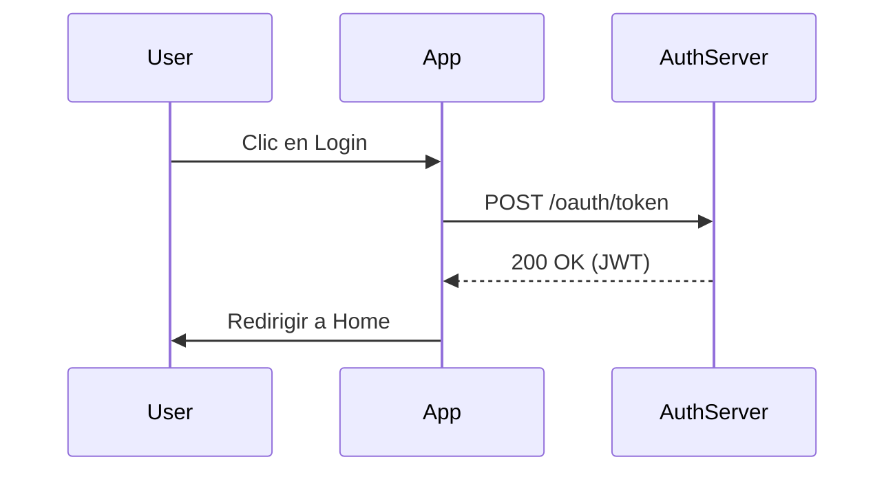

Si eres desarrollador, probablemente tu "sistema" de conocimiento actual se parece a esto: tres pestañas de Stack Overflow abiertas desde hace una semana, un archivo `TODO.txt` en el escritorio que no abres desde 2023, y un montón de comandos de terminal útiles guardados en tu historial de bash que rezas por no perder.

El problema no es que no consumas información valiosa; es que tu cerebro no está diseñado para el almacenamiento persistente de terabytes de datos técnicos. Aquí es donde entra **Obsidian**, pero no como una simple app de notas.

En esta guía, vamos a configurar Obsidian como si fuera un IDE: con control de versiones, automatización, diagramas como código y consultas tipo SQL. Bienvenido a tu **Segundo Cerebro**.

## 1. La Filosofía: "Markdown First"

Antes de instalar nada, entiende por qué Obsidian ha desplazado a Notion y Evernote en la comunidad de desarrollo:

1.  **Vendor Lock-in Cero:** Tus notas son archivos `.md` planos en tu disco duro. Si Obsidian desaparece mañana, abres tu carpeta con VS Code y sigues trabajando.
2.  **Git Friendly:** Al ser texto plano, puedes (y debes) versionar tu conocimiento.
3.  **Local-First:** Funciona sin internet. Ideal para consultar tus snippets cuando el wifi del avión falla.

## 2. Estructura del Vault: El Sistema "DevOps"

Olvídate del sistema de carpetas anidadas infinito. Como devs, sabemos que buscar es más eficiente que navegar. Sin embargo, una estructura de alto nivel es necesaria para mantener el orden.

Esta es la estructura que recomiendo, basada en principios de **PARA** (Projects, Areas, Resources, Archives) pero adaptada a ingeniería:

```
/ (Root)
├── 00_Inbox         # El "buffer" de entrada. Todo empieza aquí.
├── 10_Projects      # Proyectos activos (repositorios en los que trabajas).
│   ├── ArceApps
│   └── API Gateway
├── 20_Knowledge     # Tu wiki personal (Lenguajes, Frameworks, Conceptos).
│   ├── Kotlin
│   ├── AWS
│   └── System Design
├── 30_Journal       # Daily Standup logs y retrospectivas.
├── 40_Templates     # Plantillas (Bug reports, RFCs).
└── 99_Assets        # Imágenes y adjuntos.
```

## 3. Core Plugins: Potenciando el IDE

Obsidian "vanilla" es como VS Code sin extensiones: funcional, pero limitado. Instala estos plugins comunitarios para desbloquear su potencial.

### Dataview: SQL para tus Notas

Este es el *game changer*. Dataview te permite tratar tu bóveda como una base de datos. Imagina que cada nota de proyecto tiene este frontmatter:

```yaml
---
type: project
status: active
tech: [kotlin, astro]
deadline: 2025-06-01
---
```

Puedes crear un dashboard dinámico que liste todos tus proyectos activos:

```dataview
TABLE status, deadline, tech
FROM "10_Projects"
WHERE status = "active"
SORT deadline ASC
```

**Caso de Uso Real:** Yo uso Dataview para rastrear "Deuda Técnica". Cuando encuentro algo que arreglar pero no tengo tiempo, creo una nota rápida con el tag `#tech-debt` y un campo `priority:: high`. Mi dashboard me muestra automáticamente qué debo refactorizar el viernes.

### Obsidian Git: Versionado Automático

No necesitas pagar Obsidian Sync si sabes usar Git. Este plugin hace commit y push de tus cambios automáticamente cada X minutos.
*   **Ventaja:** Tienes un historial de diffs de tu pensamiento. "¿Qué pensaba yo sobre esta arquitectura hace 6 meses?" -> `git blame`.

### Advanced Tables

Si alguna vez has intentado formatear una tabla en Markdown a mano, conoces el dolor. Este plugin añade navegación con `Tab` y autoformateo, haciendo que gestionar tablas de comparación (ej. "REST vs GraphQL") sea trivial.

## 4. Diagramas como Código (Mermaid)

Como arquitectos de software, pensamos en diagramas. Obsidian tiene soporte nativo para **Mermaid.js**. No necesitas abrir Figma o Lucidchart para dibujar un flujo simple; hazlo directamente en tu nota.

Un diagrama de secuencia para un flujo de autenticación se vería así:



Esto se renderiza visualmente en Obsidian. Lo mejor: el diagrama es texto, por lo que es buscable y versionable.

## 5. El Flujo de Trabajo Diario: "The Engineering Log"

La herramienta más subestimada es el **Daily Note**. Configura Obsidian para crear una nota diaria automáticamente. Úsala como tu "memoria RAM externa" durante el día.

Mi plantilla para el Daily Note (`40_Templates/Daily.md`) incluye:

1.  **Focus del Día:** Una sola tarea prioritaria.
2.  **Log:** Una lista con timestamps.
    *   `09:30` - Daily Standup. Bloqueo con el equipo de backend por la API de usuarios.
    *   `10:15` - Investigando error en producción. El stacktrace apunta a `NullPointerException` en el servicio de pagos.
    *   `11:00` - Solución encontrada: faltaba validación en el input. [[Link al PR]]
3.  **Snippets:** Cualquier comando o bloque de código útil que descubrí hoy.

Al final del año, tienes una bitácora detallada de tu crecimiento y logros, invaluable para las revisiones de desempeño.

## 6. Canvas: Tu Pizarra Infinita

Obsidian Canvas es una superficie infinita donde puedes soltar notas, imágenes y enlaces web.
**Para Devs:** Úsalo para diagramas de arquitectura de alto nivel. Arrastra tu nota sobre "Microservicio A" y conéctala con "Base de Datos B". Es la mejor forma de visualizar sistemas complejos antes de escribir una sola línea de código.

## 7. Sincronización Móvil: Codificando (o Documentando) en el Bus

Un verdadero "Segundo Cerebro" debe estar disponible siempre. No sirve de nada tener una idea brillante en el metro si no puedes anotarla hasta llegar a casa.

### La opción gratuita: Git
Si usas Android, puedes usar **Termux** o aplicaciones como **GitJournal** para hacer pull/push a tu repositorio. Sin embargo, la opción más robusta recientemente es usar la app oficial de Obsidian con un plugin de terceros para Git, o simplemente usar una herramienta de sincronización de carpetas como **Syncthing**.

Mi setup favorito (Android + Linux):
1.  **Syncthing** corriendo en mi laptop y en mi teléfono.
2.  Una carpeta compartida `/ObsidianVault`.
3.  Cualquier cambio en el móvil se refleja instantáneamente en el PC vía red local (o internet si configuras relays).

### La opción "Sin Dolor": Obsidian Sync
Si valoras tu tiempo por encima de $8/mes y necesitas encriptación de extremo a extremo sin configurar servidores, Sync es la respuesta. Además, permite mantener configuraciones separadas (puedes no querer cargar todos los plugins pesados en el móvil).

## 8. Documentación de Equipo: Obsidian Publish

¿Qué pasa cuando tu "Jardín Digital" crece tanto que quieres compartirlo?
Obsidian Publish te permite publicar partes de tu bóveda como una web estática (muy similar a lo que estás leyendo ahora, pero generado al vuelo por Obsidian).

**Caso de uso para Tech Leads:**
Crea una carpeta `Team Docs` en tu bóveda. Documenta los procesos de Onboarding, Estándares de Código y RFCs. Publica esa carpeta. Ahora tienes una wiki interna que se actualiza sola cada vez que editas el archivo localmente. Sin CI/CD pipelines que se rompen, sin Hugos ni Jekylls que mantener. Solo texto.

## Conclusión: De Consumidor a Creador

Configurar Obsidian requiere una inversión de tiempo inicial, igual que configurar tu `.vimrc` o tus atajos de teclado. Pero el retorno de inversión es masivo.

Dejas de ser un desarrollador que "busca cosas en Google" para convertirte en uno que "consulta su base de conocimiento". La diferencia es sutil, pero define la maestría.

**Tu reto para hoy:** Instala Obsidian, crea la carpeta `00_Inbox` y escribe tu primera nota sobre lo que aprendiste en este artículo. Enlázalo todo.
